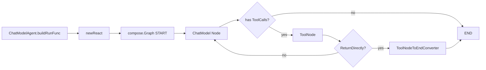

# ADK React Agent

`ADK React Agent` 模块是 `ChatModelAgent` 在“会调用工具”的场景下的执行内核：它把一次线性的 LLM 调用，升级成一个可循环的 **思考（模型）→行动（工具）→再思考** 的图执行过程。直观地说，如果没有这个模块，Agent 只能“说一句话就结束”；有了它，Agent 才能在同一轮任务中多次调用工具、把工具结果喂回模型、并在必要时提前退出或中断恢复。

它存在的核心原因是：真实任务不是单步函数，而是带反馈回路的过程。一个朴素实现（for 循环里手写 model + tools）很快会在流式输出、并发工具调用、事件上报、恢复点、return-directly 语义上失控。`adk/react.go` 通过 `compose.Graph` + 局部状态 `State` + middleware 注入，把这套复杂行为收敛成可组合、可恢复、可观测的一层。

## 架构定位与心智模型

把它想象成一个“带交通灯的环岛”：

- `ChatModel` 节点负责决定“下一步要不要调用工具”；
- `ToolNode` 节点负责执行工具并产出 tool messages；
- 分支（branch）就是交通灯：有 `ToolCalls` 就转去工具道，没有就驶出（END）；
- `State` 是环岛中央控制器，记录历史消息、剩余迭代次数、某个工具是否应直接返回。

这个模块在整体系统中的角色是 **orchestrator（编排器）+ policy layer（策略层）**，而不是业务工具本身。



`newReact` 构建的图不是“静态 DAG 一次通过”，而是允许 `ToolNode -> ChatModel` 的循环边。循环是否继续由流分支实时判断，这也是 ReAct 模式比“单次推理”更接近真实 agent 行为的关键。

## 组件深潜（按职责）

### 1) `reactConfig`：把策略参数集中到一个构造输入

`reactConfig` 不是运行态对象，而是建图参数容器。关键字段体现了该模块关心的策略面：

- `model model.ToolCallingChatModel`：必须是可工具调用模型；
- `toolsConfig *compose.ToolsNodeConfig`：工具节点配置（工具集合 + middleware）；
- `toolsReturnDirectly map[string]bool`：哪些工具命中后直接结束流程；
- `maxIterations int`：防止无限循环；
- `beforeChatModel / afterChatModel`：对模型输入输出做状态级 hook；
- `modelRetryConfig *ModelRetryConfig`：模型重试包装。

设计上它偏“窄接口”：只暴露 ReAct 编排真正需要的控制面，避免把 `ChatModelAgent` 全量配置耦进来。

### 2) `State`：ReAct 循环的局部真相来源

`State` 是 `compose.WithGenLocalState` 生成的图局部状态。它保存：

- `Messages []Message`：累积会话（模型输入和工具结果都并入）；
- `RemainingIterations int`：每次进入模型前递减，归零时报 `ErrExceedMaxIterations`；
- `HasReturnDirectly` / `ReturnDirectlyToolCallID`：命中“直接返回工具”后的短路信息；
- `ToolGenActions map[string]*AgentAction`：工具执行期间临时挂载的 action（按 `ToolCallID` 或工具名索引）；
- `AgentName string`：当前 agent 标识。

这里的设计取舍是：**用可变局部状态换取跨节点协作简单性**。代价是状态字段变更会影响多个 handler 的隐式契约，贡献者改字段时要看全链路。

### 3) `SendToolGenAction` + `popToolGenAction`：工具事件的“临时便签”机制

`SendToolGenAction(ctx, toolName, action)` 允许工具在执行时把一个 `AgentAction` 预先塞进状态，稍后由 middleware 在工具结果事件发出时“弹出并附带”。

关键机制：

- 优先使用 `compose.GetToolCallID(ctx)` 作为 key，保证同名工具并发调用时不串线；
- 无 `ToolCallID` 时退化为 `toolName` 作为 key；
- `popToolGenAction` 取到后立即 `delete`，确保一次性语义。

这个模式像“快递包裹上的临时附言”：先写上，出库时贴到对应包裹，贴完就销毁，避免后续污染。

需要注意，源码明确说明该 API 仅面向 `ChatModelAgent` 运行上下文；在其他 agent 类型中调用，`compose.ProcessState` 可能找不到预期 `*State`。

### 4) `toolResultSenders` / `toolResultSendersCtxKey`：从 context 注入工具结果转发器

`setToolResultSendersToCtx` 把 `toolResultSenders`（含普通/流式 sender）塞到 context，`getToolResultSendersFromCtx` 读取。

这是一种“无侵入侧通道”：工具执行链不需要知道上层事件系统细节，只要 middleware 读 context 并回调 sender 即可。好处是解耦工具执行与事件发射；代价是依赖 context 中的隐式值，调试时不如显式参数直观。

`toolResultSenders` 里有 `addr Address` 字段，且文件内有 `isAddressAtDepth` 辅助判断，说明该模块考虑了嵌套 agent 地址层级过滤；但在本文件可见代码中，这个判定函数未被使用，实际消费点应在同包其他文件。

### 5) `newAdkToolResultCollectorMiddleware`：把工具输出“拦截并复制”给事件层

这是 ReAct 链路中非常关键的一层 `compose.ToolMiddleware`：

- `Invokable` 路径：`next` 执行后获取 `output.Result`，弹出预置 action，然后调用 sender；
- `Streamable` 路径：对 `output.Result.Copy(2)` 分叉，一路给 sender，一路还给后续链路。

流式分叉是一个典型 tradeoff：

- 正面：既能实时上报工具流结果，又不吞掉下游消费；
- 成本：复制流会增加内存/调度开销，尤其在大结果流场景。

### 6) `genToolInfos`：工具描述收集器

调用每个工具的 `Info(ctx)` 生成 `[]*schema.ToolInfo`，然后用于 `model.WithTools(toolsInfo)`。这一步把“可执行工具”映射成“模型可见工具 schema”，是模型函数调用能力的前置合同。

### 7) `newReact`：模块核心——构建 ReAct 图

`newReact` 的流程可以分成六步：

1. 生成局部状态（默认 `maxIterations` 为 20）；
2. 收集 `ToolInfo`，并用 `WithTools` 绑定到 chat model；
3. 将 `newAdkToolResultCollectorMiddleware()` 插入到工具 middleware 链最前；
4. 创建 `ToolNode`；
5. 定义 `ChatModel` 节点前后处理（迭代限制 + before/after hooks + 消息回写）；
6. 建立分支与边：
   - `START -> ChatModel`；
   - 若模型流中出现 `ToolCalls`，走 `ChatModel -> ToolNode`，否则 `END`；
   - 默认 `ToolNode -> ChatModel` 形成循环；
   - 若启用 `toolsReturnDirectly`，则在 `ToolNode` 后再分支：命中则走 `ToolNodeToEndConverter -> END`，否则回到 `ChatModel`。

`ToolNodeToEndConverter` 用 `schema.StreamReaderWithConvert` 从 `[]Message` 流中筛选 `ToolCallID` 匹配项。也就是说，直接返回时不会盲目取第一个工具结果，而是按记录的调用 ID 精确抽取。

### 8) `getReturnDirectlyToolCallID`：读取短路信号

通过 `compose.ProcessState` 从 `State` 拿 `ReturnDirectlyToolCallID` 与标记位。该函数的容错策略是忽略 `ProcessState` 错误（`_ =`），偏向“运行不中断”。这在正常图上下文问题不大，但也意味着状态读取异常可能被静默吞掉。

## 依赖与数据流分析

从调用关系看，`ADK React Agent` 主要被 [`ADK ChatModel Agent`](ADK ChatModel Agent.md) 驱动：

- 在 `ChatModelAgent.buildRunFunc` 中，当 `toolsNodeConf.Tools` 非空时进入 ReAct 路径，构造 `reactConfig` 并调用 `newReact`；
- 同一处还会把 `transferToAgent`、`exit` 工具并入工具集合，并把它们加入 `returnDirectly` 映射。

`adk/react.go` 对外部模块的关键依赖包括：

- [`Compose Graph Engine`](Compose Graph Engine.md)：`compose.NewGraph`、`AddChatModelNode`、`AddToolsNode`、`AddBranch`、`NewStreamGraphBranch`、状态 handler、`ProcessState`；
- [`Compose Tool Node`](Compose Tool Node.md)：`compose.NewToolNode`、`compose.ToolMiddleware`、`ToolInput/ToolOutput`；
- [`Schema Core Types`](Schema Core Types.md) 与 [`Schema Stream`](Schema Stream.md)：`schema.ToolInfo`、`schema.StreamReaderWithConvert`、`StreamReader.Copy`；
- [`Component Interfaces`](Component Interfaces.md)：`model.ToolCallingChatModel`。

关键热路径是：

1. 模型节点流式输出；
2. 分支检查 `ToolCalls`；
3. 工具节点执行与 middleware 捕获；
4. 工具结果并回状态消息；
5. 回到模型继续推理，直到无工具调用或 direct-return。

这里的契约非常明确：

- 模型必须支持 `WithTools`；
- 工具必须可提供 `Info(ctx)`；
- 工具结果消息在 direct-return 场景必须带正确 `ToolCallID`，否则 converter 可能持续返回 `schema.ErrNoValue` 直到流结束。

## 设计决策与权衡

第一个明显决策是“图编排而非手写循环”。这提升了可恢复性、可插拔 middleware、分支可视化和统一运行时能力；代价是理解门槛更高，且行为分散在多个 handler/branch 中，不如单函数直观。

第二个决策是“状态集中 + context 侧通道”。`State` 集中保存跨节点信息，context 承载 sender。这样可以避免层层传参，但引入隐式依赖：调用者必须确保正确上下文和状态类型。

第三个决策是“默认安全阈值优先”。`maxIterations` 默认 20，防止提示词或工具反馈导致无限循环。它牺牲了极端复杂任务的上限，但对线上稳定性更友好。

第四个决策是“return-directly 使用 ToolCallID 精确短路”。比按工具名短路更正确，尤其在同名工具多次调用时；代价是实现更复杂，且依赖消息中 ID 的完整传播。

## 使用方式与扩展点

通常你不会直接调用 `newReact`，而是通过 `ChatModelAgent` 间接启用。最小触发条件是：给 `ChatModelAgentConfig.ToolsConfig` 配置至少一个工具。

```go
agent, err := NewChatModelAgent(ctx, &ChatModelAgentConfig{
    Name:        "assistant",
    Description: "tool-enabled assistant",
    Model:       myToolCallingModel,
    ToolsConfig: ToolsConfig{
        ToolsNodeConfig: compose.ToolsNodeConfig{
            Tools: []tool.BaseTool{myTool},
        },
        ReturnDirectly: map[string]bool{
            "Exit": true,
        },
    },
    MaxIterations: 20,
})
```

如果你在工具内部希望给本次工具结果附带动作，可在工具执行上下文调用：

```go
_ = SendToolGenAction(ctx, toolName, &AgentAction{CustomizedAction: myAction})
```

扩展点主要有三个：

- `beforeChatModel` / `afterChatModel`：在模型前后改写 `ChatModelAgentState.Messages`；
- `ToolsNodeConfig.ToolCallMiddlewares`：可在工具执行链插入审计、脱敏、限流逻辑；
- `ModelRetryConfig`：对模型调用失败做重试包装。

## 新贡献者最容易踩的坑

第一，`SendToolGenAction` 的作用域是“当前工具调用”。如果你在非工具上下文调用，或者上下文里没有匹配的 `ToolCallID`，动作可能以工具名键入并被后续同名调用覆盖。

第二，流式工具结果在 middleware 中会 `Copy(2)`。若后续自定义 middleware 再次复制或不及时消费，可能造成资源压力。

第三，`RemainingIterations` 在模型 pre-handler 扣减，而不是在工具后扣减。这意味着一次“模型+工具”循环按模型调用次数计数，不是按工具调用次数计数。

第四，direct-return 的状态位 `HasReturnDirectly` / `ReturnDirectlyToolCallID` 由工具前置 handler 写入；如果你修改 tool message 结构或 tool call ID 传播逻辑，短路分支会最先失效。

第五，`getToolResultSendersFromCtx` 直接做类型断言 `v.(*toolResultSenders)`。如果外部错误覆盖了同 key 值类型，会 panic。

## 参考阅读

- [`ADK ChatModel Agent`](ADK ChatModel Agent.md)：谁在创建并运行 ReAct 图
- [`Compose Graph Engine`](Compose Graph Engine.md)：图节点、分支、状态处理的运行模型
- [`Compose Tool Node`](Compose Tool Node.md)：工具节点与工具 middleware 机制
- [`ADK Agent Interface`](ADK Agent Interface.md)：`AgentAction`、`AgentEvent`、`AgentInput` 数据契约
- [`Schema Stream`](Schema Stream.md)：`StreamReader` 复制与转换语义
