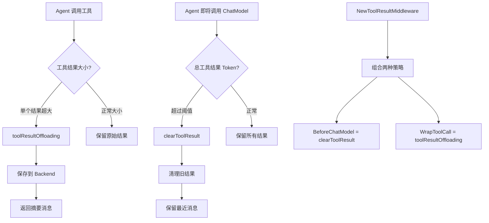
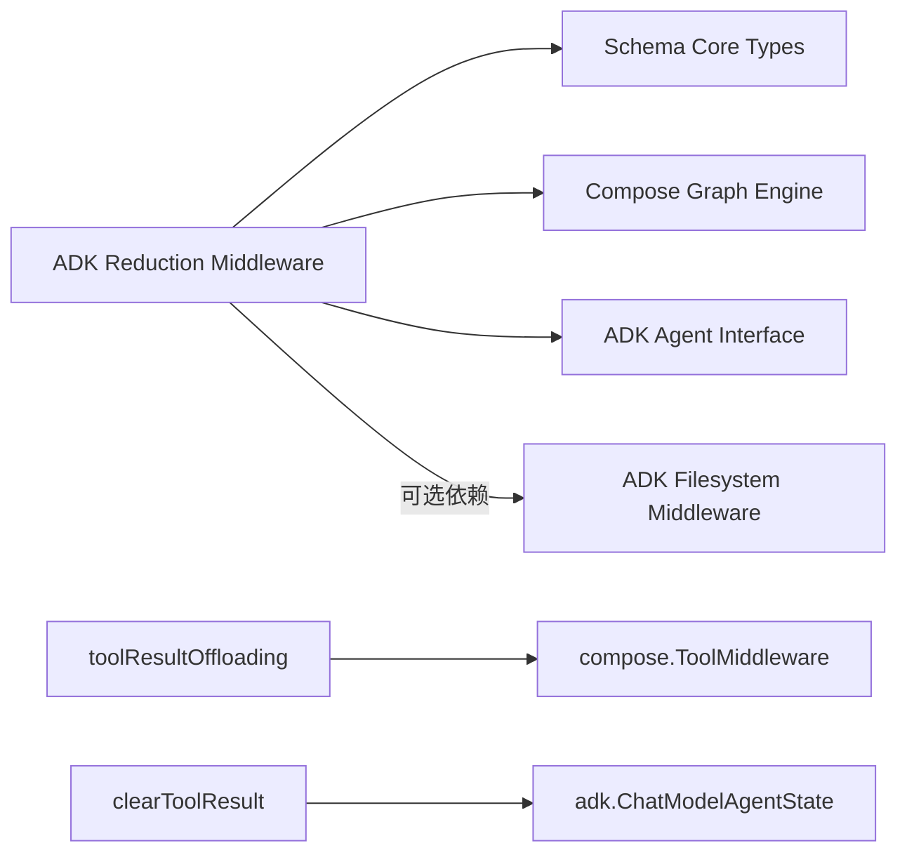
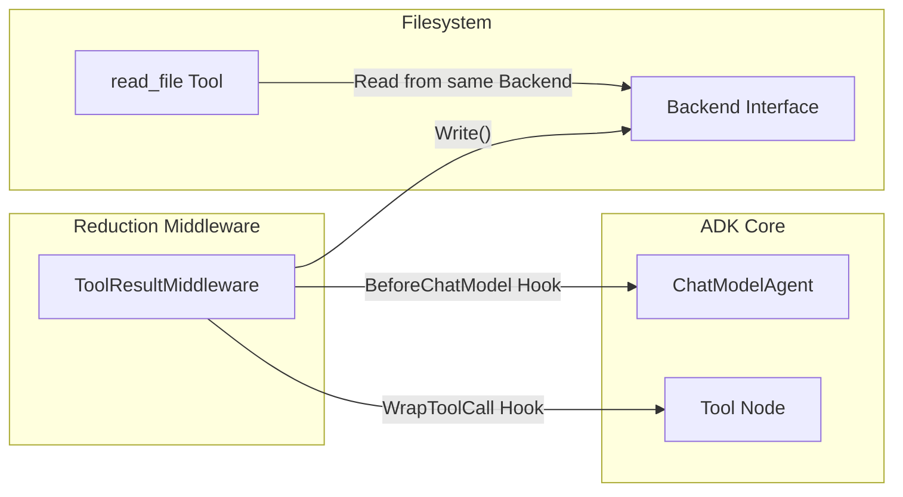

# ADK Reduction Middleware

## 1. 模块概览

**ADK Reduction Middleware** 是 ADK Agent 系统中的**上下文流量控制器**。它的核心职责是管理工具结果对 token 预算的消耗，通过两种互补的策略确保对话既能保持信息完整性，又不会超出上下文窗口限制。

### 核心问题与动机

想象一个场景：你的 Agent 正在帮助开发者分析一个大型代码库。它执行了以下操作：

1. 调用 `grep` 搜索某个函数的所有引用 → 返回 500 行匹配结果
2. 调用 `cat` 读取三个相关文件 → 每个文件 2000 行
3. 调用 `ast_parse` 分析代码结构 → 返回 3000 行的 JSON AST

三轮对话后，上下文已经积累了**超过 10,000 行**的工具输出。这会导致什么问题？

```
┌─────────────────────────────────────────────────────────┐
│  问题 1: Token 成本                                      │
│  每个输入 token 都要计费，10K 行代码 ≈ 50K+ tokens       │
│  一次对话的成本可能超过 $0.50                            │
├─────────────────────────────────────────────────────────┤
│  问题 2: 上下文窗口限制                                  │
│  大多数模型有 128K-200K token 限制                       │
│  继续对话会触发"context length exceeded"错误             │
├─────────────────────────────────────────────────────────┤
│  问题 3: 注意力稀释                                      │
│  过多的历史噪音会干扰模型的注意力机制                    │
│  关键信息被淹没，输出质量下降                            │
└─────────────────────────────────────────────────────────┘
```

**这个模块的设计哲学**：不是所有信息都同等重要。我们需要一个**分层的存储策略**：
- **热数据**（最近的对话）→ 保留在上下文中
- **温数据**（大但重要的结果）→ 卸载到外部存储，按需读取
- **冷数据**（历史工具结果）→ 用占位符标记，释放空间

这类似于操作系统的**虚拟内存管理**：RAM 是昂贵的上下文窗口，磁盘是廉价的文件系统，页面置换算法决定什么留在内存中。

### 双策略架构

```
                    ┌──────────────────────────────────────┐
                    │     ADK Reduction Middleware         │
                    └──────────────────────────────────────┘
                                   │
              ┌────────────────────┴────────────────────┐
              │                                         │
              ▼                                         ▼
    ┌─────────────────┐                     ┌─────────────────┐
    │   Offloading    │                     │    Clearing     │
    │   (转储策略)     │                     │    (清理策略)    │
    ├─────────────────┤                     ├─────────────────┤
    │ 触发：单结果过大 │                     │ 触发：累积过多   │
    │ 动作：写文件     │                     │ 动作：占位符替换 │
    │ 数据：可恢复     │                     │ 数据：永久丢失   │
    │ 阶段：工具调用后 │                     │ 阶段：模型调用前 │
    └─────────────────┘                     └─────────────────┘
```

两种策略解决的是**不同维度**的问题，组合使用才能实现最优的 token 管理。

## 2. 架构总览



这个架构的核心设计思想是**分层防御**：
1. 第一层是工具调用层的**单个结果拦截**——特别大的结果不会进入上下文
2. 第二层是模型调用前的**整体上下文修剪**——即使每个结果都不大，累积过多也要清理

### 核心组件角色

| 组件 | 职责 | 作用阶段 |
|------|------|----------|
| `toolResultOffloading` | 大结果转储与摘要生成 | 工具执行后 |
| `clearToolResult` | 旧工具结果清理 | ChatModel 调用前 |
| `ToolResultConfig` | 统一配置入口 | 中间件初始化 |
| `Backend` | 结果持久化接口 | 大结果存储 |

## 3. 核心设计决策

### 3.1 为什么选择"清理+转储"的双重策略？

**设计权衡分析：**

| 策略 | 优点 | 缺点 | 适用场景 |
|------|------|------|----------|
| 只清理 | 实现简单，无额外依赖 | 信息完全丢失，模型无法引用 | 短对话，结果不重要 |
| 只转储 | 信息完整保留 | 每个大结果都需要读回，增加调用次数 | 结果很大但必须引用 |
| **两者结合** | 兼顾效率与完整性，灵活可控 | 实现复杂度增加 | **生产级 Agent** |

最终选择双重策略是因为它提供了最佳的**成本-质量平衡**：对于真正巨大的结果，我们转储它们以便模型可以按需读取；对于累积的历史结果，我们清理掉旧的，因为模型通常更关注最近的交互。

### 3.2 Token 估算：为什么用字符数/4？

```go
func defaultTokenCounter(msg *schema.Message) int {
    count := len(msg.Content)
    for _, tc := range msg.ToolCalls {
        count += len(tc.Function.Arguments)
    }
    return (count + 3) / 4  // +3 是为了向上取整
}
```

**设计考虑：**
- **速度优先**：这是一个 O(1) 的操作，无需调用分词器
- **跨语言兼容**：不同语言的字符/Token 比率不同，但 4 是一个保守的近似值
- **启发式即可**：我们不需要精确到个位数——这只是触发清理/转储的阈值

**替代方案（未采用）：**
- 使用真实的 Tokenizer（如 tiktoken）：更准确，但增加依赖且速度慢
- 固定长度限制：简单但不灵活，无法适应不同语言

### 3.3 为什么需要 Backend 接口？

```go
type Backend interface {
    Write(context.Context, *filesystem.WriteRequest) error
}
```

**设计意图：解耦存储实现**

虽然模块默认与 [Filesystem Middleware](ADK Filesystem Middleware.md) 配合使用，但通过 `Backend` 接口，你可以：
- 将大结果保存到内存（测试用）
- 保存到分布式存储系统（生产用）
- 保存到对象存储（如 S3、OSS）

这体现了**依赖倒置原则**——模块依赖抽象接口，而不是具体实现。

## 4. 数据流向详解

### 4.1 大工具结果转储流程

当一个工具返回特别大的结果时：

1. **工具执行完毕** → `toolResultOffloading.stream()` 或 `.invoke()` 拦截结果
2. **Token 估算** → 调用 `counter()` 检查是否超过 `TokenLimit * 4` 字符
3. **路径生成** → 调用 `PathGenerator` 生成存储路径（默认 `/large_tool_result/{call_id}`）
4. **内容保存** → 调用 `backend.Write()` 保存完整结果
5. **摘要生成** → 提取前 10 行，每行最多 1000 字符
6. **返回替代消息** → 包含路径、摘要和读取工具的指引

```go
// handleResult 是核心决策点
func (t *toolResultOffloading) handleResult(ctx context.Context, result string, input *compose.ToolInput) (string, error) {
    if t.counter(...) > t.tokenLimit*4 {
        // 1. 生成路径
        path, _ := t.pathGenerator(ctx, input)
        
        // 2. 格式化摘要
        sample := formatToolMessage(result)
        
        // 3. 保存到后端
        t.backend.Write(ctx, &filesystem.WriteRequest{FilePath: path, Content: result})
        
        // 4. 返回替代消息
        return pyfmt.Fmt(tooLargeToolMessage, ...)
    }
    return result
}
```

### 4.2 旧工具结果清理流程

在 Agent 即将调用 ChatModel 之前：

1. **计算总 Token** → 遍历所有消息，累加工具结果的 Token
2. **阈值检查** → 如果超过 `ClearingTokenThreshold`，进入清理模式
3. **确定保护范围** → 从末尾向前累加，找到最近 `KeepRecentTokens` 的起始点
4. **执行清理** → 保护范围之前的旧工具结果被替换为占位符

```go
// reduceByTokens 实现了这个逻辑
func reduceByTokens(state *adk.ChatModelAgentState, ...) error {
    // 步骤1: 计算总工具结果 Token
    totalToolResultTokens := 0
    
    // 步骤2: 如果没超限，直接返回
    if totalToolResultTokens <= toolResultTokenThreshold {
        return nil
    }
    
    // 步骤3: 从后向前找保护范围的起始点
    recentStartIdx := len(state.Messages)
    cumulativeTokens := 0
    
    // 步骤4: 清理保护范围之前的旧结果
    for i := 0; i < recentStartIdx; i++ {
        msg := state.Messages[i]
        if msg.Role == schema.Tool && ... {
            msg.Content = placeholder
        }
    }
    return nil
}
```

## 5. 使用指南与最佳实践

### 5.1 基本配置示例

```go
// 创建文件系统后端（通常来自 Filesystem Middleware）
backend := &filesystem.InMemoryBackend{}

// 创建中间件
middleware, err := reduction.NewToolResultMiddleware(ctx, &reduction.ToolResultConfig{
    // 清理策略配置
    ClearingTokenThreshold:  30000,    // 总工具结果超过 30K tokens 时清理
    KeepRecentTokens:        50000,    // 保留最近 50K tokens 的消息
    ClearToolResultPlaceholder: "[已清理的旧工具结果]",
    
    // 转储策略配置
    Backend:          backend,
    OffloadingTokenLimit: 15000,       // 单个结果超过 15K tokens 时转储
    ReadFileToolName: "read_file",     // 告诉 LLM 用这个工具读取
    
    // 可选：排除某些工具不被清理
    ExcludeTools: []string{"final_answer"},
})

// 应用到 Agent
agent.WithMiddleware(middleware)
```

### 5.2 常见陷阱与注意事项

⚠️ **重要提醒：必须提供 read_file 工具**

这个模块**只负责写入**大结果，不负责读取。你需要：
- 要么使用 [Filesystem Middleware](ADK Filesystem Middleware.md)（它会自动提供 `read_file`）
- 要么自己实现一个读取工具，使用相同的 Backend

否则，LLM 会收到"请使用 read_file 工具读取"的消息，但实际上无法执行这个操作！

⚠️ **Token 估算只是近似值**

`defaultTokenCounter` 用字符数/4 估算，这不是精确值：
- 对于中文，可能需要字符数/2 或更低
- 对于代码，可能接近字符数/3
- 可以通过 `TokenCounter` 字段提供自定义实现

⚠️ **流式工具的处理**

对于流式工具（`StreamableTool`），`toolResultOffloading` 会先**完全读取整个流**，拼接成字符串，再进行处理。这意味着：
- 流式的"渐进式输出"优势在大结果时会丢失
- 内存使用会增加（需要缓冲完整结果）

## 6. 模块关系与依赖



**关键依赖说明：**
- **Schema Core Types**：提供 `Message`、`ToolMessage` 等核心数据结构
- **Compose Graph Engine**：提供 `ToolMiddleware` 接口和工具调用拦截机制
- **ADK Agent Interface**：提供 `AgentMiddleware` 和 `ChatModelAgentState`
- **ADK Filesystem Middleware**（可选）：提供 `Backend` 的默认实现和 `read_file` 工具

## 7. 子模块详解

本模块由两个核心子模块组成，每个子模块负责一部分特定功能：

### 7.1 tool_result_offloading - 大结果转储管线

**核心组件**：`toolResultOffloadingConfig`, `toolResultOffloading`

这个子模块负责检测和处理单个过大的工具结果。当工具返回的内容超过配置的 token 阈值时，它会：
1. 将完整结果写入配置的 Backend
2. 生成包含文件路径和前 10 行预览的摘要消息
3. 指导 LLM 使用 `read_file` 工具按需读取详细内容

**详细文档**：[tool_result_offloading.md](tool_result_offloading.md)

### 7.2 tool_result_clearing - 历史结果清理策略

**核心组件**：`ClearToolResultConfig`, `ToolResultConfig`, `Backend`

这个子模块实现了基于 token 阈值的清理算法。它会在 ChatModel 调用前检查所有工具结果的总 token 数，如果超过阈值则：
1. 从对话末尾向前计算保护范围（`KeepRecentTokens`）
2. 将保护范围外的旧工具结果替换为占位符
3. 支持排除特定工具不被清理

**详细文档**：[tool_result_clearing.md](tool_result_clearing.md)

---

## 8. 与其他模块的依赖关系

### 上游依赖

- **[ADK ChatModel Agent](ADK ChatModel Agent.md)** — Reduction Middleware 作为 `AgentMiddleware` 注入到 ChatModelAgent 中，通过 `BeforeChatModel` 和 `WrapToolCall` hooks 介入 Agent 生命周期
- **[ADK Filesystem Middleware](ADK Filesystem Middleware.md)** — 卸载策略依赖 `Backend` 接口写入文件。如果使用了 Filesystem Middleware，可以直接复用其 `read_file` 工具
- **[Compose Tool Node](Compose Tool Node.md)** — `WrapToolCall` hook 在 Tool Node 执行后被调用，拦截 `compose.ToolOutput`
- **[Schema Core Types](Schema Core Types.md)** — 使用 `schema.Message`、`schema.ToolMessage` 等类型表示消息和工具结果

### 下游被依赖

- **ADK Agent Interface** — 中间件通过 `adk.AgentMiddleware` 类型暴露给 Agent 使用
- **用户自定义工具** — 用户需要提供 `read_file` 工具（或使用 Filesystem Middleware 提供的）来读取卸载的内容

### 耦合分析



**关键耦合点**：
1. **Backend 接口** — Reduction Middleware 只依赖 `Write()` 方法，但 `read_file` 工具需要能读取相同存储。这是一个**隐式契约**：用户必须确保两者使用兼容的 Backend。
2. **Token 估算** — 默认使用字符数/4，但如果用户有精确的 tokenizer，应该注入自定义 `TokenCounter` 以保持一致性。

---

## 9. 总结

ADK Reduction Middleware 是一个**务实的解决方案**，它不追求完美的信息保留，而是在以下三个目标之间做出明智的权衡：
1. ✅ 控制 Token 成本
2. ✅ 避免上下文超限
3. ✅ 保留模型完成任务所需的关键信息

它的设计体现了一个重要的工程原则：**不是所有信息都同等重要**。通过区分"单个超大结果"和"累积的旧结果"，并采用不同策略处理，这个模块让 Agent 能够在保持效率的同时，处理更长、更复杂的对话。
