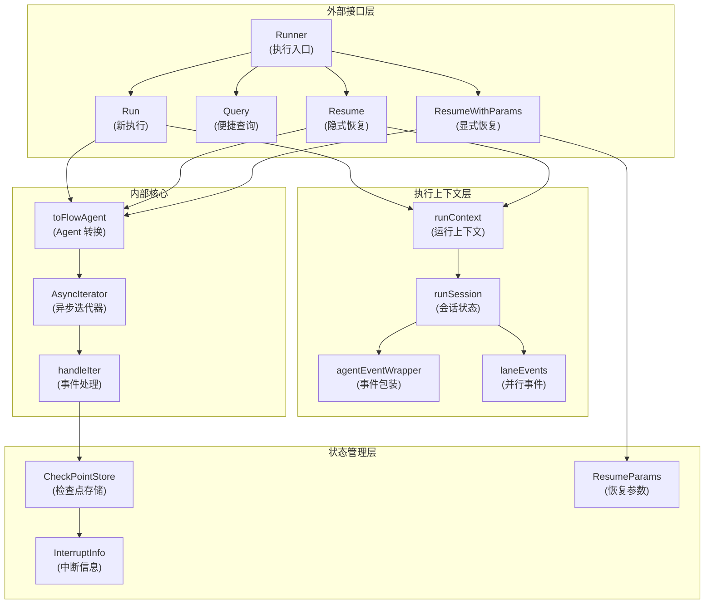
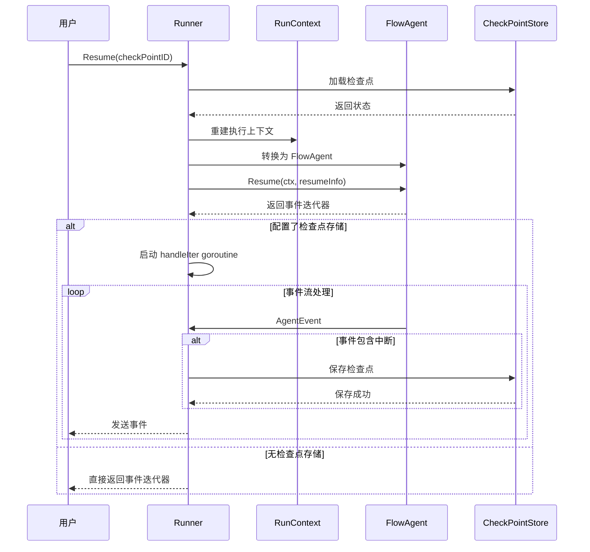

# ADK Runner 模块深度解析

## 模块概览

ADK Runner 是 Agent 执行系统的核心入口点，它负责管理 Agent 的完整生命周期，包括启动、中断、恢复和状态持久化。想象它是一个"Agent 的操作系统进程管理器"——它不仅负责启动 Agent，还能在 Agent 执行过程中保存其状态快照，并在需要时从任意断点处恢复执行。

这个模块解决的核心问题是：**如何让复杂的 Agent 工作流在执行过程中支持中断和恢复，同时保持事件流的一致性和状态的完整性**。在没有 Runner 之前，Agent 的执行是一次性的——一旦出错或需要人工干预，整个流程必须从头开始。Runner 通过引入检查点（Checkpoint）机制和统一的事件流转系统，彻底改变了这一模式。

## 核心架构



## 核心组件详解

ADK Runner 模块由三个主要子模块组成，每个子模块负责不同的功能：

- **[Runner 核心](runner_core.md)**：包含 `Runner`、`RunnerConfig` 和 `ResumeParams`，是整个模块的入口点
- **[执行上下文系统](execution_context.md)**：包含 `runContext`、`runSession`、`laneEvents` 和 `agentEventWrapper`，负责执行过程中的状态管理和事件处理
- **[调用选项系统](call_options.md)**：包含 `AgentRunOption` 和相关函数，提供灵活的调用配置机制

### 1. Runner 核心 - Agent 执行的指挥中心

Runner 核心子模块是整个模块的入口点，负责协调整个 Agent 执行流程。

```go
type Runner struct {
    a               Agent          // 要执行的 Agent
    enableStreaming bool           // 是否启用流式模式
    store           CheckPointStore // 检查点存储（可选）
}
```

**设计意图**：
- **职责单一性**：Runner 只负责生命周期管理，不参与实际的 Agent 逻辑执行
- **可插拔架构**：通过 `CheckPointStore` 接口，用户可以自定义状态持久化方式
- **流式与非流式统一**：同一套代码支持两种执行模式，通过配置切换

更多详细信息，请参阅 [Runner 核心](runner_core.md) 文档。

### 2. 执行上下文系统

执行上下文系统是 Runner 最精巧的设计之一，它由三层组成，负责管理执行过程中的所有状态和事件。

**核心组件**：
- `runContext` - 根级上下文，维护执行路径和会话
- `runSession` - 会话容器，管理会话值和事件
- `laneEvents` - 并行事件管理，解决并行执行的事件一致性
- `agentEventWrapper` - 事件包装，提供时间戳、流式消息聚合等功能

**设计亮点**：
- **时间戳排序**：在并行执行场景下，通过 `TS` 字段确保事件按实际发生顺序呈现
- **流式消息聚合**：`concatenatedMessage` 解决了流式消息在检查点恢复时的完整性问题
- **错误缓存**：`StreamErr` 防止在重试场景下重复处理已消费的错误流

更多详细信息，请参阅 [执行上下文系统](execution_context.md) 文档。

### 3. 调用选项系统

调用选项系统提供了灵活的调用配置机制，允许用户在运行时配置各种参数。

**核心功能**：
- 会话值管理：通过 `WithSessionValues` 设置会话级别的值
- 消息传输控制：通过 `WithSkipTransferMessages` 控制是否转发转移消息
- 实现特定选项：通过 `WrapImplSpecificOptFn` 和 `GetImplSpecificOptions` 支持自定义选项

更多详细信息，请参阅 [调用选项系统](call_options.md) 文档。

### 4. 中断与恢复机制

Runner 提供了两种恢复方式，适应不同的使用场景：

#### Resume - 隐式恢复
适用于简单场景，恢复时不需要提供额外数据。所有中断点收到 `isResumeFlow = false`。

**使用场景**：
- 用户确认"继续执行"
- 简单的重试逻辑
- 不需要区分具体中断点的场景

#### ResumeWithParams - 显式恢复
功能最强大的恢复方式，可以针对具体中断点提供恢复数据。

```go
type ResumeParams struct {
    Targets map[string]any  // key: 中断点地址, value: 恢复数据
}
```

**恢复策略规则**：
1. **在 Targets 中的组件**：收到 `isResumeFlow = true`，可以继续执行
2. **不在 Targets 中的叶子组件**：必须重新中断自己以保持状态
3. **不在 Targets 中的复合组件**：继续执行，作为恢复信号的管道

**设计意图**：
这种"选择性恢复"策略使得复杂的多 Agent 系统可以精确控制恢复流程——你可以只恢复某个特定的子 Agent，而让其他中断点保持等待状态。

## 数据流转分析

### 新执行流程 (Run)

```
用户调用 Runner.Run()
    ↓
创建 runContext 和 runSession
    ↓
调用 toFlowAgent() 适配 Agent
    ↓
构造 AgentInput 并初始化上下文
    ↓
调用 fa.Run() 启动执行
    ↓
获得 AsyncIterator<AgentEvent>
    ↓
如果有 CheckPointStore:
    - 创建新的异步迭代器对
    - 启动 handleIter 协程处理事件
    ↓
返回异步迭代器给用户
```

### 事件处理与检查点保存 (handleIter)

```
遍历 AgentEvent 迭代器
    ↓
每个事件:
    ├─ 普通事件 → 直接发送给用户
    └─ 中断事件 → 
        ├─ 提取 InterruptSignal
        ├─ 转换为公开的 InterruptInfo
        ├─ 如果配置了 CheckPointStore:
        │   ├─ 先保存检查点（关键！）
        │   └─ 然后发送中断事件
        └─ 继续处理后续事件
    ↓
迭代器结束 → 关闭生成器
```

**关键设计决策**：检查点保存发生在发送中断事件**之前**。这样确保当用户收到中断事件时，检查点已经可用，可以立即恢复。

### 恢复流程 (Resume/ResumeWithParams)

```
验证 CheckPointStore 不为空
    ↓
加载检查点并重建 runContext
    ↓
处理会话继承（如果是 sharedParentSession）
    ↓
如果有恢复数据:
    - 调用 core.BatchResumeWithData() 设置恢复上下文
    ↓
调用 fa.Resume() 恢复执行
    ↓
同 Run() 一样包装事件流并返回
```



## 关键设计决策

### 1. 异步迭代器模式 vs 回调模式

**选择**：使用 `AsyncIterator[*AgentEvent]` 作为主要交互方式

**权衡分析**：
- ✅ **优点**：
  - 用户可以控制消费速度（背压）
  - 更容易集成到各种异步处理框架
  - 支持中途取消（通过 context）
- ❌ **缺点**：
  - 相比简单的回调，理解门槛稍高
  - 需要正确处理迭代器的关闭

**为什么这样选择**：
在复杂的 Agent 系统中，执行时间可能很长，事件产生速度也不均匀。异步迭代器给了用户最大的控制权——他们可以暂停处理、缓冲事件，或者在任何点优雅地取消。

### 2. 会话值的共享 vs 复制

**设计**：`Values` 映射在父子会话间共享，而 `Events` 则采用复制 + 追加模式

**权衡分析**：
- **Values 共享**：
  - ✅ 可以在并行分支间传递数据
  - ⚠️ 需要用户自己处理并发安全（通过 `valuesMtx`）
- **Events 分离**：
  - ✅ 并行分支的事件处理无锁，高性能
  - ⚠️ 分支内的事件只在合并后才可见

**设计意图**：
会话值是用户显式设置的，他们应该知道自己在做什么并负责并发控制。而事件是系统内部产生的，我们必须保证高性能和最终一致性。

### 3. 检查点中的流式消息处理

**问题**：流式消息在传输过程中被中断，如何在恢复时保证消息完整性？

**解决方案**：`agentEventWrapper` 的 `concatenatedMessage` 字段和自定义 Gob 编码

```go
func (a *agentEventWrapper) GobEncode() ([]byte, error) {
    // 如果有聚合后的完整消息，替换流式消息
    if a.concatenatedMessage != nil && a.Output != nil && 
       a.Output.MessageOutput != nil && a.Output.MessageOutput.IsStreaming {
        a.Output.MessageOutput.MessageStream = 
            schema.StreamReaderFromArray([]Message{a.concatenatedMessage})
    }
    // ... 继续编码
}
```

**设计亮点**：
- 运行时：流式消息正常传输
- 保存检查点时：用已聚合的完整消息替换流式消息
- 恢复后：用户看到的是完整消息，就像流式传输从未中断过

### 4. 事件时间戳 vs 顺序保证

**设计决策**：每个事件都带有精确的纳秒级时间戳，在并行分支合并时按时间戳排序。

**权衡分析**：
- ✅ **优点**：实现简单，无需复杂的顺序协调机制
- ⚠️ **缺点**：依赖系统时钟，极端情况下可能出现顺序问题
- **替代方案**：使用逻辑时钟（如 Lamport 时钟），但会增加复杂性

**为什么这样设计**：在 Agent 执行场景中，事件的相对顺序通常比绝对顺序更重要，而时间戳在大多数情况下已经足够精确。

## 模块关系与依赖

### 内部模块依赖关系

ADK Runner 模块内部的三个子模块之间存在清晰的依赖关系：

```
[调用选项系统](call_options.md)
        ↓
[Runner 核心](runner_core.md)
        ↓
[执行上下文系统](execution_context.md)
```

- **调用选项系统**：不依赖其他内部子模块，提供基础的选项配置功能
- **Runner 核心**：依赖调用选项系统和执行上下文系统，是整个模块的协调中心
- **执行上下文系统**：被 Runner 核心使用，提供状态管理和事件处理功能

### 外部模块依赖

ADK Runner 是一个相对上层的模块，它依赖以下核心模块：

- **[ADK Agent Interface](ADK Agent Interface.md)**：定义了 `Agent` 接口，Runner 执行的核心对象
- **[Internal Core](Internal Core.md)**：提供底层的中断管理和地址系统
- **[Schema Core Types](Schema Core Types.md)**：定义消息和事件的数据结构
- **[ADK Interrupt](ADK Interrupt.md)**：中断信息的序列化和桥接

同时，Runner 被以下模块依赖：
- 各种预构建的 Agent 实现（如 ChatModelAgent、WorkflowAgent 等）
- 应用层代码（直接使用 Runner 来执行 Agent）

## 使用指南与注意事项

### 基本使用

```go
// 1. 创建 Runner
runner := adk.NewRunner(ctx, adk.RunnerConfig{
    Agent:           myAgent,
    EnableStreaming: true,
    CheckPointStore: myCheckPointStore,
})

// 2. 执行（方式一：Run）
iter := runner.Run(ctx, messages, adk.WithSessionValues(map[string]any{"key": "value"}))

// 3. 执行（方式二：Query，便捷方法）
iter := runner.Query(ctx, "你好，请帮我分析这个问题")

// 4. 消费事件
for {
    event, ok := iter.Next()
    if !ok {
        break
    }
    if event.Err != nil {
        // 处理错误
    }
    if event.Action != nil && event.Action.Interrupted != nil {
        // 处理中断，可以保存 checkPointID 供后续恢复
    }
    // 处理输出
}
```

### 中断恢复

```go
// 方式一：隐式恢复（简单场景）
iter, err := runner.Resume(ctx, checkPointID)

// 方式二：显式恢复（精确控制）
iter, err := runner.ResumeWithParams(ctx, checkPointID, &adk.ResumeParams{
    Targets: map[string]any{
        "agent1":  dataForAgent1,  // 为特定中断点提供数据
        "node2":   nil,             // 仅恢复，不提供数据
    },
})
```

### 常见陷阱与注意事项

1. **会话值的并发安全**
   ```go
   // ✅ 正确：使用提供的方法
   adk.AddSessionValue(ctx, "key", value)
   
   // ❌ 错误：直接修改 map
   values := adk.GetSessionValues(ctx)
   values["key"] = value  // 并发不安全！
   ```

2. **检查点保存的时机**
   - 只有在中断发生时才会自动保存检查点
   - 如果需要定期保存，需要自己实现逻辑

3. **流式消息与检查点**
   - 恢复后，流式消息会变成完整消息
   - 如果你的业务逻辑依赖流式传输的增量特性，需要特别注意

4. **并行分支中的事件可见性**
   - 分支内的事件只在分支合并时才对主流程可见
   - 如果需要跨分支通信，使用会话值而不是依赖事件

5. **恢复参数的地址匹配**
   - 地址必须与中断信息中的地址完全匹配
   - 建议在第一次中断时打印出所有中断地址，供后续恢复使用

## 总结

**ADK Runner** 是一个精心设计的模块，它解决了 Agent 执行系统中最复杂的问题之一：**如何让长时间运行的、可能包含并行分支的 Agent 工作流支持中断和恢复**。

它的核心设计哲学是：
1. **上下文即状态**：将所有执行状态封装在 `runContext` 中，使其可以被保存和恢复
2. **事件即事实**：通过时间戳和事件包装，保证即使在并行场景下事件历史也是一致的
3. **选择即自由**：提供多种恢复方式，让用户根据场景选择最合适的方案

理解了 Runner，你就理解了整个 ADK 框架的"骨架"——其他模块都是在这个骨架上生长出来的"肌肉和器官"。
