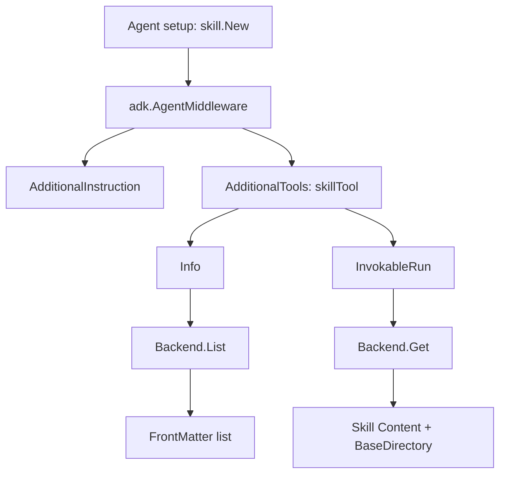

# ADK Skill Middleware

`ADK Skill Middleware` 的作用，可以一句话概括：**把“静态技能文档”变成 Agent 运行时可按需调用的能力**。它不把所有技能全文一股脑塞进系统提示词，而是先给模型一份“技能目录”，等模型判断任务相关时，再通过工具加载具体技能内容。这种“先看目录、再借全文”的机制，既省 token，又让技能更新不必改核心代码。

## 1) 它解决了什么问题（Problem Space）

在真实 Agent 系统里，技能（skills）通常是高质量 SOP：步骤、注意事项、脚本路径、示例等都很完整。问题是：

- **全量注入 prompt**：简单但昂贵，且会稀释模型注意力。
- **完全不暴露技能**：模型不知道有什么可用能力，只能“盲猜”。

Skill Middleware 的设计选择是折中但很实用的：

- 用工具 `Info` 暴露技能 `name/description`（轻量索引）
- 用工具 `InvokableRun` 按需返回 `SKILL.md` 正文（重内容）

你可以把它理解成“RAG 思维在技能说明上的落地”：**检索元数据先行，正文惰性加载**。

## 2) 心智模型（Mental Model）

把整个模块想象成“餐厅点单系统”：

- 菜单页（`FrontMatter`）只写菜名和简介。
- 厨房后厨（`Backend`）保存完整菜谱（`Skill.Content`）。
- 服务员（`skillTool`）先给你菜单（`Info`），你点菜后再上菜（`InvokableRun`）。
- 店规（`AdditionalInstruction`）告诉模型：相关时先点菜再回答，不要空谈。

对应代码抽象：

- `Backend`：技能来源抽象（List/Get）
- `skillTool`：把技能来源包装成 LLM Tool 协议
- `New(config)`：把“行为规则 + 工具能力”注入 `adk.AgentMiddleware`
- `LocalBackend`：默认文件系统实现（目录扫描 + frontmatter 解析）

## 3) 架构总览与端到端数据流



### 运行时两条关键链路

**链路 A：工具发现阶段（目录暴露）**

1. Agent 初始化时调用 `skill.New(ctx, config)`。
2. middleware 注入 `AdditionalTools`，其中包含 `skillTool`。
3. 当模型读取工具信息时，`skillTool.Info` 调用 `Backend.List`。
4. `[]FrontMatter` 经 `renderToolDescription` 渲染为 `<available_skills>`。
5. 返回 `schema.ToolInfo`（包含参数 schema：必填 `skill` 字符串）。

**链路 B：工具执行阶段（正文加载）**

1. 模型发起工具调用，传入 JSON 参数。
2. `skillTool.InvokableRun` 把参数反序列化到 `inputArguments{Skill string}`。
3. 调用 `Backend.Get(ctx, args.Skill)`。
4. 返回字符串结果：启动提示 + `BaseDirectory` + 技能正文 `Content`。
5. 模型拿到技能完整说明后，继续执行任务。

---

## 4) 核心设计决策与权衡

### 决策 A：Backend 只保留 `List/Get` 最小接口

**选型**：
```go
type Backend interface {
    List(ctx context.Context) ([]FrontMatter, error)
    Get(ctx context.Context, name string) (Skill, error)
}
```

**为什么这样做**：降低实现门槛，任何存储都能接（本地文件、远端服务、数据库）。

**代价**：没有内建分页、过滤、版本、权限语义。复杂需求需要后续扩展或自定义 backend 内部吸收。

### 决策 B：行为约束写入 Prompt，而不是纯代码强控

`buildSystemPrompt` 和 `toolDescriptionBase` 明确告诉模型：相关时要先调用技能工具。

**好处**：对模型行为“软约束”更直接，可通过 prompt 演进调优。

**代价**：对提示词质量敏感，属于“策略耦合在文案里”。

### 决策 C：`Info` 动态拉取技能列表，不做中间件层缓存

**好处**：技能目录变化能即时反映。

**代价**：后端会被频繁调用。当前 `LocalBackend` 每次都扫目录、读文件，技能多时有 IO 开销。

### 决策 D：工具执行返回纯文本，而非结构化 JSON

**好处**：对各类 LLM 兼容性高，低接入成本。

**代价**：下游程序难做稳定字段提取，更多依赖自然语言约定。

---

## 5) 子模块说明（Sub-modules）

### 5.1 `skill_middleware_core`

对应核心文件 `skill.go`（以及提示模板常量所在 `prompt.go`）。它定义了领域对象（`Skill`/`FrontMatter`）、扩展边界（`Backend`）、中间件入口（`New`）、以及真正对接 Tool 协议的 `skillTool`。这个子模块是“协议面 + 策略面”的核心。

详见：[`skill_middleware_core.md`](skill_middleware_core.md)

### 5.2 `local_backend_filesystem`

对应 `local.go`，提供 `Backend` 的本地实现：扫描 `BaseDir` 子目录，读取 `SKILL.md`，解析 YAML frontmatter 与正文，并计算 `BaseDirectory` 绝对路径。它是“数据面”的默认实现，强调约定优于配置。

详见：[`local_backend_filesystem.md`](local_backend_filesystem.md)

---

## 子模块导航

本模块的详细实现细节分布在两个子模块文档中：

| 子模块 | 文件 | 核心职责 |
|--------|------|----------|
| **技能核心** | [`skill_middleware_core.md`](skill_middleware_core.md) | `Backend` 接口定义、`skillTool` 工具实现、中间件装配逻辑 |
| **本地后端** | [`local_backend_filesystem.md`](local_backend_filesystem.md) | 基于文件系统的 `Backend` 实现、SKILL.md 解析逻辑 |

建议阅读顺序：先理解主文档的架构概览，再根据需求深入对应子模块。如果你要扩展自定义 Backend，重点阅读 `skill_middleware_core`；如果你要修改技能存储格式或优化文件扫描性能，重点阅读 `local_backend_filesystem`。

## 6) 跨模块依赖关系（How it connects）

基于代码可确认的依赖如下：

- 向 **[ADK ChatModel Agent](ADK%20ChatModel%20Agent.md)** 提供 `adk.AgentMiddleware`（`AdditionalInstruction` + `AdditionalTools`）
- 通过 **[Component Interfaces](Component%20Interfaces.md)** / tool 契约暴露工具能力（`tool.BaseTool`、`InvokableRun` 语义）
- 使用 **[Schema Core Types](Schema%20Core%20Types.md)** 中的 `schema.ToolInfo`、`schema.ParameterInfo`、`schema.NewParamsOneOfByParams`
- 本地后端与文件系统/`yaml.v3`耦合（实现细节在子模块文档）

可把它的架构角色定义为：

- 对上：Agent 能力注入器（middleware）
- 对中：Tool 协议适配器（skillTool）
- 对下：Skill 内容检索抽象（Backend）

---

## 7) 新贡献者最容易踩的坑（Gotchas）

1. **`SkillToolName` 只判 nil，不判空字符串**  
   传 `&""` 可能得到不可用工具名。

2. **`InvokableRun` 不校验空 skill 名**  
   依赖 `Backend.Get` 报错语义，建议后端实现给出可诊断错误。

3. **`LocalBackend.Get` 是“全量扫描后线性匹配”**  
   简单一致，但规模上去后会慢。

4. **同名 skill 的冲突处理未显式定义**  
   `Get` 返回遍历命中的第一个，建议组织层面保证 `name` 全局唯一。

5. **frontmatter 解析是轻量字符串策略**  
   文件必须以 `---` 开头并存在结束分隔符；格式轻微异常就会失败。

6. **`BaseDirectory` 暴露绝对路径**  
   便于执行，但在安全敏感环境要评估路径信息泄露。

---

## 8) 什么时候应该扩展它，而不是改它

如果你要支持缓存、远端仓库、权限、租户隔离，优先策略通常是：

- 保持 `skillTool` 协议不变
- 新增一个 `Backend` 实现（而不是把 `LocalBackend` 变成“巨型后端”）

这符合当前模块的设计哲学：**核心中间件保持薄，复杂性下沉到 backend 实现层**。
