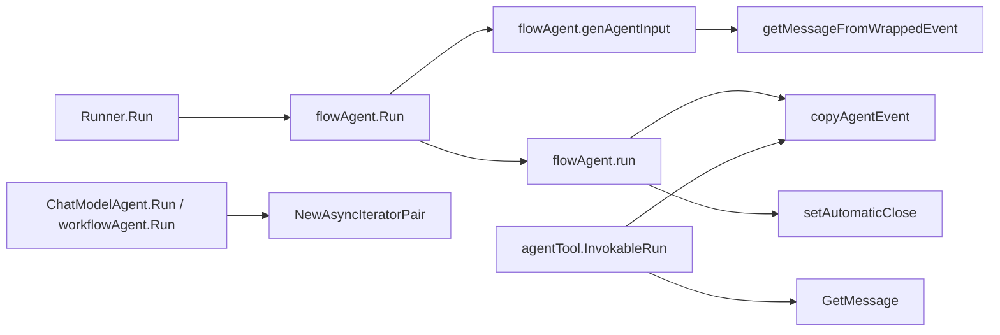

# ADK Utils 深度解析

`ADK Utils` 这个模块看起来很小，但它解决的是 ADK 运行时里一个非常“硬”的问题：**如何在多层 Agent 编排、流式输出、可中断恢复的场景下，安全地传递事件与消息，而不把流读坏、状态共享坏、上下文污染坏**。如果说 ADK 的主流程是高速公路，这个模块就是高速公路上的“匝道与护栏”——代码不多，却决定了并发事件流能不能稳定地进出系统。

---

## 架构角色与心智模型

从架构上看，`adk/utils.go` 不是业务编排器，而是一个**运行时语义适配层**：它把“流式事件”“消息拼接”“事件拷贝”“错误注入”等横切关注点封装成几个小工具函数，供 Runner/Flow/AgentTool 等热点路径复用。

可以把它想象成物流系统中的“分拣缓冲带”：

- `AsyncIterator` / `AsyncGenerator` 是双向配对的传送带接口（生产端/消费端）。
- `GetMessage` / `getMessageFromWrappedEvent` 是把“分批到货（stream chunks）”打包成“完整包裹（Message）”的工位。
- `copyAgentEvent` 是“复印运单”，保证后续流程修改路径信息时不串单。
- `setAutomaticClose` 则像“自动回收开关”，避免流对象泄露。

### Mermaid（关键数据流）



这张图体现了一个关键事实：**同一个工具函数会被不同执行层复用**。例如 `NewAsyncIteratorPair` 是所有异步事件出口的统一基础件，而 `copyAgentEvent` 既服务于 `flowAgent.run`，也服务于 `agentTool.InvokableRun`。

---

## 核心组件深潜

## `AsyncIterator[T]` 与 `AsyncGenerator[T]`

这两个 struct 是配对设计，底层共享 `*internal.UnboundedChan[T]`。`AsyncGenerator.Send` 负责生产，`AsyncIterator.Next` 负责消费，`Close` 结束流。

设计意图不是替代 Go 原生 channel，而是提供一个**框架内统一抽象**：在 ADK 内部，很多 API 都以 `*AsyncIterator[*AgentEvent]` 作为返回值，这样调用方不用关心底层实现细节。

`NewAsyncIteratorPair[T]` 是唯一配对入口，确保两端绑定同一通道。这个模式在 `Runner.Run`、`ChatModelAgent.Run`、`workflowAgent.Run`、`genErrorIter` 等路径里反复出现。

这里的关键 tradeoff 是：底层使用 `UnboundedChan`（无界缓冲），优点是生产端不容易被慢消费者阻塞；代价是如果消费者长期不读，内存会持续增长。因此它偏向“吞吐与解耦优先”，把背压管理责任留给上层调用约束。

## `copyMap[K,V]`

一个泛型 map 浅拷贝工具，逐项复制键值。它解决的是 Go map 引用语义带来的共享修改风险，但它只做浅拷贝：如果 `V` 是指针/引用对象，内部状态仍共享。

这个函数体现了 utils 模块的一贯风格：**只负责最小安全边界，不做昂贵深拷贝**。

## `concatInstructions(instructions ...string)`

把多段 instruction 用双换行拼接。实现基于 `strings.Builder`，避免多次字符串拼接开销。

隐含契约：`instructions` 至少一项。当前实现直接访问 `instructions[0]`，空切片会 panic。也就是说调用方必须保证输入非空，这是一条未在类型层表达的前置条件。

## `GenTransferMessages(ctx, destAgentName)`

这个函数生成一对消息：

1. 一条 `AssistantMessage`，包含 `ToolCall`（函数名为 `TransferToAgentToolName`，参数是目标 agent 名）。
2. 一条对应的 `ToolMessage`，带相同 `toolCallID`，内容由 `transferToAgentToolOutput(destAgentName)` 产生。

它解决的问题不是“生成文本”，而是**维护可追溯的工具调用语义链**。在多 Agent 转移场景中，仅有 action 不够，历史里还需要保留“assistant 发起调用 + tool 回执”这一对结构化痕迹，后续历史重写器/模型上下文才能正确理解控制流。

## `setAutomaticClose(e *AgentEvent)`

只在 `e.Output.MessageOutput.IsStreaming == true` 时触发 `MessageStream.SetAutomaticClose()`。

这是一种生命周期防护：事件被层层转发时，调用者不一定会手动 close stream。这个函数把“可能遗忘的资源管理”前移成默认行为，减少泄露风险。

## `getMessageFromWrappedEvent(e *agentEventWrapper)`

这是模块里最关键的函数之一，核心职责是：**从事件中拿到可复用的完整 Message，同时正确处理流式错误与重复消费**。

内部机制分三层：

第一层是快速路径：

- 没有输出消息 => 返回 `nil, nil`。
- 非流式 => 直接返回 `Message`。
- 已缓存 `concatenatedMessage` => 直接返回缓存。
- 已有 `StreamErr` => 直接返回该错误。

第二层是并发保护：

- 用 `e.mu` 锁住拼接过程，并在锁后再次检查缓存（double-check），避免并发重复拼接。

第三层是流消费与错误语义：

- 逐条 `Recv()` 直到 `io.EOF`。
- 如果中途出现非 EOF 错误：
  - 记录到 `e.StreamErr`，防止后续重复消费。
  - 把流替换为 `schema.StreamReaderFromArray(msgs)`，只保留已成功 chunk。
  - 返回 `(nil, err)`，明确这次消息不可用于后续上下文。
- 正常结束后：
  - 0 条消息 => 返回错误。
  - 1 条直接用。
  - 多条通过 `schema.ConcatMessages` 拼接并缓存。

这里最不直观但非常重要的设计点是：**出错时返回 nil message，而不是“部分消息 + err”**。注释已说明原因：避免失败流响应被加入后续 agent 的 context window，污染推理历史。

## `copyAgentEvent(ae *AgentEvent)`

`AgentEvent` 拷贝不是简单 clone，而是“按可变风险分层复制”：

- `RunPath` 深拷贝（切片复制），因为上层会 append。
- `AgentEvent` 外层 struct 新建。
- `Output` / `MessageOutput` 新建壳对象。
- 若是流式 `MessageStream`，调用 `Copy(2)` 复制为两路：
  - 原 event 替换为分支 0。
  - 新 event 拿分支 1。
- 非流式消息直接复用 `Message` 指针。

这保证了“事件级字段修改安全”和“流消费互不抢占”，但并不保证消息内容深拷贝（注释也明确不建议改 `Message` 或 chunk 本体）。

另一个容易忽略的点：函数会**就地修改传入事件的 `mv.MessageStream`**。这意味着它不是纯函数，调用方必须理解其副作用。

## `GetMessage(e *AgentEvent)`

这是对外暴露的“从 `AgentEvent` 提取 `Message`”工具：

- 非流式直接返回 `Message`。
- 流式时 `Copy(2)`，一份留回原 event，另一份传给 `schema.ConcatMessageStream` 拼接。

返回值是 `(Message, *AgentEvent, error)`。其中 `*AgentEvent` 通常还是同一个对象，但其 `MessageStream` 可能被替换为复制分支。也就是说，调用该函数后，event 已被“安全化处理”。

它与 `MessageVariant.GetMessage()` 的关键差异是：后者直接消费原流，而 `adk.GetMessage` 先复制再消费，避免把调用方手里的流耗尽。

## `genErrorIter(err error)`

创建一个只包含单个错误事件的 iterator，然后立刻 close。常用于“启动前失败”这类场景，让外部仍可按统一迭代协议处理错误，而不需要额外 error 返回通道。

在调用关系上，`flowAgent.Run` 在 `genAgentInput` 失败时会返回该 iterator。

---

## 依赖与调用关系分析

从当前可见依赖关系看，`ADK Utils` 主要位于 ADK 执行链中间层，既被上层编排调用，也依赖底层 schema/internal 能力。

向下依赖方面：

- 依赖 `internal.NewUnboundedChan`（来自内部无界通道实现）支撑异步迭代器。
- 依赖 `schema.ConcatMessageStream` / `schema.ConcatMessages` 做流式消息归并。
- 依赖 `schema.AssistantMessage` / `schema.ToolMessage` / `schema.ToolCall` 构建 transfer 消息。
- 依赖 `schema.StreamReaderFromArray` 在流错误时重建可序列化流。

向上被调用方面（基于已读取组件）：

- `Runner.Run`、`ChatModelAgent.Run`、`workflowAgent.Run` 通过 `NewAsyncIteratorPair` 建立异步事件通道。
- `flowAgent.run` 调用 `copyAgentEvent` 和 `setAutomaticClose`，确保 session 记录与外部消费互不干扰。
- `flowAgent.genAgentInput` 调用 `getMessageFromWrappedEvent` 把历史事件转成消息上下文。
- `agentTool.InvokableRun` 调用 `copyAgentEvent` 与 `GetMessage`，处理流式子代理输出与返回值提取。
- `flowAgent.Run` 在前置失败时使用 `genErrorIter`。

这说明该模块是一个典型的**横向基础层**：不拥有业务状态，但在最热路径上决定正确性。

---

## 关键设计取舍

第一个取舍是“无界队列 vs 背压”。`AsyncIterator/Generator` 选择了无界缓冲，换取调用方解耦和简单接口；代价是潜在内存膨胀风险。对 ADK 来说，这个选择符合“运行时链路连续性优先”的目标，尤其在多 goroutine 事件转发里可以减少阻塞传播。

第二个取舍是“复制 stream 分支 vs 共享单流”。`copyAgentEvent` 与 `GetMessage` 都选择先 `Copy(2)` 再消费，这是典型的正确性优先：牺牲一些复制开销，避免多个消费者互相抢读导致语义错乱。

第三个取舍是“错误隔离 vs 部分可用内容”。`getMessageFromWrappedEvent` 在流错误时返回 `nil` message，并通过 `StreamErr` 标记失败，明确阻止坏消息进入后续上下文。这让系统在重试/恢复场景下更稳，但也意味着你拿不到“半成品消息”参与后续推理。

第四个取舍是“浅拷贝性能 vs 深拷贝自治”。`copyAgentEvent` 与 `copyMap` 都是浅层安全边界，不做对象图级别深拷贝。这样性能友好，但要求调用方遵守不修改共享 payload 的约定。

---

## 使用方式与示例

最常见用法是创建异步迭代器对：

```go
iter, gen := NewAsyncIteratorPair[*AgentEvent]()

go func() {
    defer gen.Close()
    gen.Send(&AgentEvent{AgentName: "planner"})
}()

for {
    ev, ok := iter.Next()
    if !ok {
        break
    }
    _ = ev
}
```

从事件中安全提取消息（兼容流式输出）：

```go
msg, updatedEvent, err := GetMessage(event)
if err != nil {
    return err
}
_ = updatedEvent // 注意其 MessageStream 可能已被替换为 copy 分支
_ = msg
```

构造 agent transfer 的标准消息对：

```go
assistantMsg, toolMsg := GenTransferMessages(ctx, "research_agent")
// 将 assistantMsg + toolMsg 作为一对历史消息注入上下文
_ = assistantMsg
_ = toolMsg
```

---

## 新贡献者最容易踩的坑

`concatInstructions` 不能传空参数；如果你做动态拼接，先判空。

`GetMessage` 和 `copyAgentEvent` 都会修改传入 event 的 `MessageStream`（替换为复制分支）。如果你假设输入对象完全不变，会出现“为什么流对象变了”的困惑。

`copyAgentEvent` 并不深拷贝 `Message` 内容与自定义对象。复制后修改底层 payload，仍可能影响其它消费者。

`getMessageFromWrappedEvent` 会消费并关闭流；如果流中途报错，函数会返回 `nil, err` 并记入 `StreamErr`。这不是“可恢复读取失败”，而是“语义上本事件消息不可进入后续上下文”。

使用 `AsyncGenerator` 时必须成对 `Close()`。如果生产者不关闭，消费者 `Next()` 会阻塞等待。

无界通道在慢消费场景会积压内存。高频事件链路必须确保有持续消费者，或在上层做节流/截断。

---

## 参考文档

- [ADK Agent Interface](ADK Agent Interface.md)：`AgentEvent` / `AgentOutput` / `MessageVariant` 数据结构定义。
- [Schema Core Types](Schema Core Types.md)：`schema.Message`、`ToolCall` 等消息模型。
- [message_schema_and_stream_concat](message_schema_and_stream_concat.md)：`ConcatMessages` / `ConcatMessageStream` 的详细拼接语义。
- [Schema Stream](Schema Stream.md)：`StreamReader` 的复制、消费、关闭语义。
- [runner_lifecycle_and_checkpointing](runner_lifecycle_and_checkpointing.md)：`Runner` 如何驱动 iterator 生命周期。
- [runtime_execution_engine](runtime_execution_engine.md)：更大范围的执行时并发模型（用于理解为什么此处需要流复制与错误隔离）。
