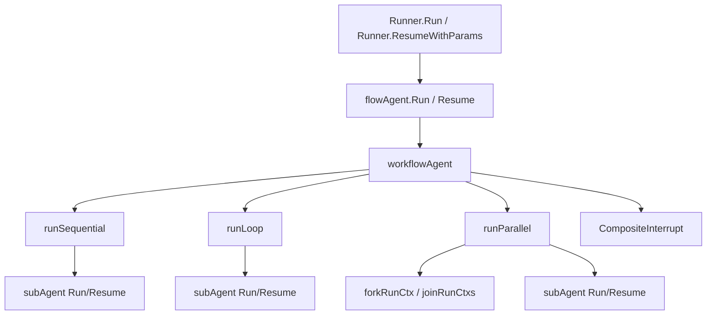

# ADK Workflow Agents

`ADK Workflow Agents` 模块的本质是：把一组 `Agent` 组织成可恢复（resumable）的执行编排单元，让你可以用“顺序（Sequential）/循环（Loop）/并行（Parallel）”三种控制流来驱动多智能体协作，同时不丢失中断现场。一个朴素实现通常只会“调用下一个 agent”，但在真实场景里你还要处理中断恢复、并发分支事件隔离、运行路径（`RunPath`）追踪、panic 兜底、以及历史兼容数据结构。这个模块就是为这些“工程级复杂性”而存在的。

## 架构定位与心智模型

可以把 `workflowAgent` 想象成一个“流程调度器”，`subAgents` 是工位上的工人。调度器不关心工人内部怎么思考（那是各自 `Agent.Run/Resume` 的职责），它只负责决定谁先上、谁并行、何时停、何时继续，以及当某个工位发出“暂停信号（Interrupt）”时，如何把整个产线的状态封装好，以便未来恢复。



从架构角色看，它是一个“控制流编排层（orchestrator）”，位于 [`ADK Flow Agent`](ADK Flow Agent.md) 与具体 Agent 实现（如 [`ADK ChatModel Agent`](ADK ChatModel Agent.md)）之间：上接 `Runner` 生命周期与 checkpoint，下接每个子 Agent 的事件流。

## 数据流：一次运行与一次恢复是怎么走的

正常执行入口一般是 `Runner.Run` / `Runner.Query`，它在 `flowAgent.Run` 中初始化 `runContext`、追加地址段，然后如果底层是 `*workflowAgent`，就直接进入 `workflowAgent.Run`。`workflowAgent.Run` 启动 goroutine，根据 `mode` 分发到 `runSequential`、`runLoop` 或 `runParallel`。

顺序模式下，`runSequential` 按下标遍历 `subAgents`，逐个消费子 Agent 的 `AsyncIterator[*AgentEvent]`。它有一个关键策略：对 `Action` 事件做“延迟一拍转发”（`lastActionEvent`），以便在看到后续事件时决定是否要先修改该 action（比如中断包装），再发给上游。

循环模式 `runLoop` 在顺序模式基础上增加双层索引（迭代次数 + 子 Agent 下标），并支持 `BreakLoopAction`。当收到 `BreakLoop` 且 `Done == false` 时，框架会把它标记为已处理并写入 `CurrentIterations`，然后停止外层循环。

并行模式 `runParallel` 是最复杂路径。它先为每个子 Agent `forkRunCtx`，每个分支在 goroutine 中运行。若全部完成且无中断，就 `joinRunCtxs` 合并 lane 事件；若任一分支中断，就收集所有分支的 `internalInterrupted`，连同每个 lane 的事件快照，构造 `parallelWorkflowState` 并通过 `CompositeInterrupt` 向上抛出一个“组合中断”。

恢复流程入口是 `Runner.Resume` / `Runner.ResumeWithParams`，加载 checkpoint 后调用 `flowAgent.Resume`。若目标是 workflow，本模块的 `workflowAgent.Resume` 会根据 `info.InterruptState` 的实际类型进行分派：

- `*sequentialWorkflowState` -> `runSequential`
- `*loopWorkflowState` -> `runLoop`
- `*parallelWorkflowState` -> `runParallel`

这就是它的核心恢复模型：**不是靠 mode 恢复，而是靠中断时持久化的 state 类型恢复**。

## 关键组件深潜

### `workflowAgent`

`workflowAgent` 是统一实现体，字段包含 `name`、`description`、`subAgents []*flowAgent`、`mode`、`maxIterations`。它不直接暴露给业务，构造由 `newWorkflowAgent` 完成。`Run`/`Resume` 都是异步事件泵：内部 goroutine + panic recover + `AgentEvent{Err: ...}` 兜底。

这里的设计取舍是统一性优先：三种模式共用一个 type，减少 API 面数量；代价是内部 switch 分支较多，逻辑复杂度集中到一个文件。

### `SequentialAgentConfig` / `ParallelAgentConfig` / `LoopAgentConfig`

这三个配置结构很薄，只承载 `Name`、`Description`、`SubAgents`，其中 `LoopAgentConfig` 额外有 `MaxIterations`。这体现了“编排层尽量少策略参数”的思路：复杂行为主要靠子 Agent 自己的 Action，而不是 Workflow 自身塞大量开关。

### `newWorkflowAgent`、`NewSequentialAgent`、`NewParallelAgent`、`NewLoopAgent`

`New*Agent` 都委托给 `newWorkflowAgent`。关键步骤是把每个子 Agent 先 `toFlowAgent(..., WithDisallowTransferToParent())`，再 `setSubAgents`。这意味着 workflow 默认禁止子 Agent 向父级 transfer，防止控制流越级跳转把编排语义打穿。

这是一个明显的“安全边界优先”选择：牺牲一些灵活性，换取工作流结构的可预测性。

### `sequentialWorkflowState` / `loopWorkflowState` / `parallelWorkflowState`

三种 state 分别记录恢复所需最小信息：

- 顺序：`InterruptIndex`
- 循环：`LoopIterations` + `SubAgentIndex`
- 并行：`SubAgentEvents map[int][]*agentEventWrapper`

并且在 `init()` 中通过 `schema.RegisterName[...]` 注册 gob 名称，用于 checkpoint 反序列化稳定性。这是典型“可演进序列化契约”设计。

### `WorkflowInterruptInfo`（兼容层）

`WorkflowInterruptInfo` 的注释明确是“persisted via InterruptInfo.Data (gob)”。在三种 `run*` 里，都会在 `CompositeInterrupt` 之后额外填充 `event.Action.Interrupted.Data = &WorkflowInterruptInfo{...}`。这是为了兼容旧路径（`Data` 已是 Deprecated 语义）。

换言之：新机制依赖 `InterruptContexts + InterruptState`，但模块仍维护旧字段，避免历史调用方立即失效。

### `runSequential`

它的难点不是“for 循环”，而是恢复点与上下文路径的正确性。恢复时会用 `InterruptIndex` 计算 `startIdx`，并通过 `updateRunPathOnly` 重建到该点的 `RunPath`，保证后续事件路径一致。

当子 Agent 中断时，它不会直接透传子中断，而是调用 `CompositeInterrupt(ctx, "Sequential workflow interrupted", state, subSignal)`，把“当前在第几个子 Agent”这个父层状态包进去。这样恢复时才能从正确子节点继续。

### `BreakLoopAction` 与 `NewBreakLoopAction`

`BreakLoopAction` 明确是 programmatic-only，不给 LLM 使用。其 `Done` 字段是防重入标记：下层 loop 处理后会置 `Done=true`，上层 loop 若收到已处理动作应忽略，从而避免嵌套 loop 误触发连环中断。

### `runLoop`

`runLoop` 支持无限循环（`MaxIterations == 0`）。它保留与顺序模式同样的 action 延迟转发策略，同时新增 break 处理。一个容易忽略的细节是：即便收到 `BreakLoop`，它仍会把该 action 事件发出去，再停止循环；这保证上游可观测“为什么停”。

恢复路径中，`loopWorkflowState` 会先重建前序迭代的 `RunPath`，再从中断点子 Agent 恢复。

### `runParallel`

并行模式的设计重点是“局部隔离 + 全局合并”。每个子 Agent 在 `forkRunCtx` 出来的 lane 上运行，互不污染实时事件；成功收敛时用 `joinRunCtxs` 按时间戳合并。中断时不合并，而是把每个 lane 的事件切片保存进 `parallelWorkflowState.SubAgentEvents`，供 resume 复原分支视角。

恢复时它先用 `getNextResumeAgents` 计算哪些分支是下一跳，再仅恢复这些分支；已完成分支直接跳过。这是性能与正确性的折中：避免重跑已完成分支，但要承担更复杂的分支状态管理。

## 依赖关系与契约分析

本模块直接依赖的关键能力有三类。

第一类是 ADK 运行时基础：`NewAsyncIteratorPair` 提供事件通道；`toFlowAgent`/`setSubAgents` 把普通 Agent 纳入 flow 体系；`updateRunPathOnly`、`forkRunCtx`、`joinRunCtxs`、`getRunCtx` 负责上下文与事件历史一致性。

第二类是中断恢复桥接：`CompositeInterrupt` 把子中断组合为父中断；`getNextResumeAgents` 在并行恢复时决定下一跳分支；`ResumeInfo` / `InterruptInfo` 提供恢复输入契约。

第三类是安全与并发：`safe.NewPanicErr` + `debug.Stack()` 统一 panic 转错误事件；`sync.WaitGroup` + `sync.Mutex` 管理并行分支汇聚。

上游调用者主要是 `flowAgent.Run/Resume`（直接分派到 workflow）与 `Runner`（checkpoint 的保存、加载、恢复策略由它驱动）。下游被调用者是每个 `subAgent.Run/Resume`。因此这个模块对上下游有隐含契约：

- 子 Agent 的中断必须通过 `event.Action.internalInterrupted` 暴露，workflow 才能组合中断。
- `ResumeInfo.InterruptState` 必须是三种 state 之一，否则 `Resume` 只能报 `unsupported workflow agent state type`。
- 并行恢复依赖分支名称匹配（`agent.Name(ctx)`），名称变更会破坏恢复路由。

## 设计取舍与非显然决策

这个模块最明显的取舍是“恢复正确性优先于实现简洁”。例如并行模式要保存 `SubAgentEvents`、fork/join lane、计算 resume targets，这些都增加了复杂度，但换来的是分支恢复时仍能看到正确历史。

另一个取舍是“兼容性优先于纯净接口”。虽然推荐路径已转向 `InterruptContexts/InterruptState`，代码仍持续填充 `InterruptInfo.Data` 的 `WorkflowInterruptInfo`，这是对历史调用方的让步。

还有一个取舍是“结构稳定优先于可随意跳转”。通过 `WithDisallowTransferToParent()` 限制子 Agent 向父级 transfer，避免 workflow 被子 Agent 动态改写控制流。这让高级玩法受限，但保证工作流编排可推理、可恢复。

## 使用方式与示例

最常见用法是通过构造器创建可恢复 Agent，然后交给 `Runner` 执行。

```go
ctx := context.Background()

seq, err := NewSequentialAgent(ctx, &SequentialAgentConfig{
    Name: "triage",
    Description: "run specialists in order",
    SubAgents: []Agent{a1, a2, a3},
})
if err != nil { panic(err) }

runner := NewRunner(ctx, RunnerConfig{
    Agent: seq,
    CheckPointStore: store,
})

iter := runner.Query(ctx, "user request", WithCheckPointID("cp-001"))
for ev, ok := iter.Next(); ok; ev, ok = iter.Next() {
    // handle output / interrupt / error
}
```

Loop 中提前退出要由代码发 `NewBreakLoopAction`，而不是让模型自由生成。

```go
func maybeStop(agentName string, shouldStop bool) *AgentEvent {
    if shouldStop {
        return &AgentEvent{Action: NewBreakLoopAction(agentName)}
    }
    return &AgentEvent{Output: &AgentOutput{/* ... */}}
}
```

并行中断恢复时，推荐用 `Runner.ResumeWithParams`，按中断 ID 定向恢复目标分支（见 [`ADK Runner`](runner_lifecycle_and_checkpointing.md)）。

## 边界条件与新贡献者注意事项

`workflowAgent.Run` 的 `input` 参数在签名里是 `_ *AgentInput`，即 workflow 本体不直接使用传入 input；真正输入构造在上层 `flowAgent.genAgentInput`。如果你在 workflow 内直接改输入逻辑，很可能会破坏统一历史拼装策略。

`LoopAgentConfig.MaxIterations == 0` 表示无限循环。若子 Agent 从不 `Exit`、不 `BreakLoop`、不报错，就会一直运行。

`BreakLoopAction` 会被原地改写（`Done`、`CurrentIterations`），因此如果你在外部复用同一 action 对象，可能出现共享状态污染。

并行模式中一旦某分支产生 interrupt，当前实现会停止读取该分支后续事件（`break`）。这符合“中断即暂停”语义，但意味着中断后自然到来的事件不会被透传。

恢复时 state 类型必须可反序列化且已注册（`schema.RegisterName`）。新增 workflow state 结构时，务必补注册并保持 gob 兼容。

## 参考阅读

要完整理解这个模块，建议按依赖方向继续阅读：[`ADK Flow Agent`](adk_flow_agent.md)（包装与路由）、[`ADK Interrupt`](adk_interrupt.md)（中断/恢复模型）、[`ADK Runner`](adk_runner.md)（checkpoint 生命周期）、[`ADK Agent Interface`](adk_agent_interface.md)（事件与动作契约）。