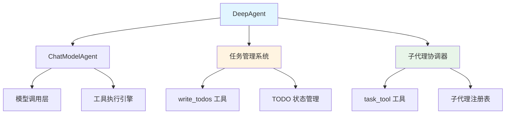

# ADK Prebuilt Deep Research 模块技术深度解析

## 1. 模块概述

想象一下，您需要一个能够深度探索复杂问题、组织子任务、管理待办事项的智能助手。`ADK Prebuilt Deep Research` 模块正是为此而生——它是一个预构建的深度任务编排代理，能够将复杂研究任务分解为可管理的子任务，通过子代理协同工作，并跟踪整个研究过程的进展。

这个模块解决的核心问题是：**如何让 AI 代理系统具备深度研究能力，能够自主规划任务、调用专业子代理、并跟踪任务完成状态**。

### 为什么需要这个模块？

在构建复杂 AI 应用时，我们经常遇到以下挑战：
- 单个代理难以处理复杂的多步骤研究任务
- 缺乏标准化的任务分解和状态跟踪机制
- 子代理之间的协同需要繁琐的编排逻辑
- 研究过程的可观测性和可恢复性难以保障

`Deep Research` 模块通过提供预构建的任务编排框架，解决了这些问题，让开发者能够快速构建具备深度研究能力的 AI 应用。

## 1.1 快速开始

### 基本使用

```go
// 创建一个 DeepAgent
agent, err := deep.New(ctx, &deep.Config{
    Name:        "researcher",
    Description: "A deep research agent",
    ChatModel:   myChatModel,
    SubAgents:   []adk.Agent{specialistAgent1, specialistAgent2},
    MaxIteration: 20,
})

// 使用代理
output, err := agent.Run(ctx, &adk.AgentInput{
    Messages: []*schema.Message{
        schema.UserMessage("研究一下最新的 AI 大模型技术趋势"),
    },
})
```

### 常用配置模式

1. **最小配置**（仅使用内置功能）：
   ```go
   deep.New(ctx, &deep.Config{
       ChatModel: myChatModel,
   })
   ```

2. **禁用特定功能**：
   ```go
   deep.New(ctx, &deep.Config{
       ChatModel:          myChatModel,
       WithoutWriteTodos:  true,  // 禁用 TODO 管理
       WithoutGeneralSubAgent: true,  // 禁用通用子代理
   })
   ```

3. **自定义任务工具描述**：
   ```go
   deep.New(ctx, &deep.Config{
       ChatModel: myChatModel,
       TaskToolDescriptionGenerator: func(ctx context.Context, agents []adk.Agent) (string, error) {
           // 自定义描述生成逻辑
           return "我的自定义任务工具描述", nil
       },
   })
   ```

## 2. 核心架构与设计思想

### 2.1 架构概览



### 2.2 核心设计思想

这个模块的设计遵循了"**分层职责 + 组合优于继承**"的原则：

1. **代理分层**：将深度研究代理构建在 `ChatModelAgent` 之上，通过中间件扩展其能力
2. **工具化能力**：将任务管理和子代理调用封装为工具，让模型可以自然地使用这些能力
3. **可配置性**：通过配置项控制是否启用内置功能，保持灵活性
4. **状态持久化**：将会话状态存储在上下文中，支持中断和恢复

### 2.3 核心抽象

#### TODO 列表
- **概念**：研究任务的待办事项列表，每个 TODO 有内容、活跃形式和状态
- **作用**：让代理能够规划、跟踪和更新研究进度
- **类比**：就像研究员的笔记本，记录着需要完成的任务及其状态

#### 任务工具（task_tool）
- **概念**：一个特殊的工具，允许主代理调用子代理来完成特定子任务
- **作用**：实现代理之间的协作和任务分解
- **类比**：就像项目经理将任务分配给团队中的专业成员

#### 中间件组合
- **概念**：通过中间件机制将内置功能（如 TODO 管理、任务工具）动态添加到代理中
- **作用**：保持核心代理的简洁，同时支持灵活的功能扩展
- **类比**：就像给电脑安装不同的软件，每款软件提供特定的功能

## 3. 核心组件详解

这个模块由三个主要子模块组成，每个子模块负责不同的功能：

- **[核心配置与构建模块](核心配置与构建模块.md)**：负责 DeepAgent 的配置和构建流程
- **[任务管理模块](任务管理模块.md)**：提供 TODO 列表管理功能，支持研究任务规划和跟踪
- **[子代理协调模块](子代理协调模块.md)**：实现子代理的注册和调用，支持多代理协作

### 3.1 核心配置与构建

[核心配置与构建模块](核心配置与构建模块.md) 是整个模块的入口点，它定义了 DeepAgent 的配置结构和构建流程。

主要组件：
- **Config**：DeepAgent 的配置结构，包含所有必要的设置
- **New**：创建 DeepAgent 的工厂函数

这个模块的设计体现了"配置驱动"和"渐进式构建"的理念，让用户可以灵活地定制 DeepAgent 的功能。

### 3.2 任务管理

[任务管理模块](任务管理模块.md) 提供了研究任务的规划和跟踪功能。

主要组件：
- **TODO**：待办事项的数据结构
- **writeTodosArguments**：write_todos 工具的输入参数

这个模块让代理能够以自然的方式管理研究任务，通过 TODO 列表可视化研究计划，跟踪任务进度，并支持研究过程的中断和恢复。

### 3.3 子代理协调

[子代理协调模块](子代理协调模块.md) 是 Deep Research 模块的核心协调组件，它实现了多代理协作。

主要组件：
- **taskTool**：任务工具，允许主代理调用子代理
- **taskToolArgument**：任务工具的输入参数

这个模块将所有子代理封装为统一的工具接口，让主代理可以用相同的方式调用它们，同时根据可用的子代理动态生成工具描述，让模型知道有哪些子代理可用。

## 4. 数据流与典型使用场景

### 4.1 完整的研究流程数据流

让我们通过一个典型的深度研究场景，来看看数据是如何在系统中流动的：

**场景**：用户要求代理"研究一下最新的 AI 大模型技术趋势，包括技术对比和应用前景"

```
1. 用户输入
   ↓
2. DeepAgent 接收请求
   ↓
3. 模型分析请求 → 决定先创建研究计划
   ↓
4. 调用 write_todos 工具 → 创建 TODO 列表
   ↓
5. TODO 列表存储到会话中
   ↓
6. 模型选择第一个任务 → 调用 task_tool
   ↓
7. task_tool 查找子代理 → 调用"技术调研"子代理
   ↓
8. 子代理执行任务 → 返回结果
   ↓
9. 模型更新 TODO 状态 → 标记第一个任务为完成
   ↓
10. 继续处理下一个任务...
    ↓
11. 所有任务完成 → 生成最终报告
```

### 4.2 关键数据契约

#### TODO 列表会话存储
- **键**：`SessionKeyTodos`（在代码中定义，但当前片段未显示）
- **值**：`[]TODO` 类型的待办事项列表
- **访问方式**：通过 `adk.AddSessionValue` 和相应的获取函数

#### 任务工具输入/输出
- **输入**：
  ```json
  {
    "subagent_type": "子代理名称",
    "description": "任务描述"
  }
  ```
- **输出**：子代理执行结果的字符串表示

#### 子代理工具输入/输出
- **输入**：
  ```json
  {
    "request": "任务描述"
  }
  ```
- **输出**：子代理执行结果的字符串表示

## 5. 设计决策与权衡分析

### 5.1 工具化 vs API 化

**决策**：将任务管理和子代理调用作为工具暴露给模型，而不是提供直接的 API

**权衡**：
- ✅ **优点**：
  - 模型可以用自然的方式使用这些能力，不需要复杂的提示词工程
  - 工具调用的过程可以被观察和记录，提高了可解释性
  - 模型可以自主决定何时使用这些能力，增加了灵活性
- ❌ **缺点**：
  - 模型可能不会总是正确使用工具，需要额外的约束和验证
  - 工具调用会增加 token 消耗和延迟
  - 调试工具使用问题可能比较困难

**为什么这样选择**：
对于深度研究场景，灵活性和自主性比严格的控制更重要。工具化的方式让代理可以自然地规划和执行研究任务，这正是深度研究所需要的。

### 5.2 通用子代理默认启用

**决策**：默认启用通用子代理，除非明确禁用

**权衡**：
- ✅ **优点**：
  - 开箱即用，即使没有配置专门的子代理，系统也能工作
  - 提供了一个安全网，当没有合适的专用子代理时可以使用
- ❌ **缺点**：
  - 增加了系统的复杂性和资源消耗
  - 可能会让模型困惑，不知道何时使用通用子代理 vs 专用子代理

**为什么这样选择**：
这是一个"可用性优先"的设计决策。对于大多数用户来说，能够立即使用系统比极致的性能优化更重要。而且，用户可以通过 `WithoutGeneralSubAgent` 选项禁用它，如果他们不需要的话。

### 5.3 基于中间件的扩展机制

**决策**：使用中间件机制来扩展功能，而不是创建新的代理类型

**权衡**：
- ✅ **优点**：
  - 保持了核心代理的简洁和稳定
  - 功能可以按需组合，增加了灵活性
  - 中间件可以独立开发和测试
- ❌ **缺点**：
  - 中间件之间可能存在交互和依赖，增加了调试难度
  - 过多的中间件可能会影响性能
  - 中间件的执行顺序可能会影响行为

**为什么这样选择**：
深度研究代理需要的功能（TODO 管理、子代理协调）是相对独立的，非常适合用中间件来实现。而且，这种设计与 ADK 框架的整体架构保持一致。

### 5.4 会话状态存储

**决策**：使用会话上下文来存储 TODO 列表，而不是外部数据库

**权衡**：
- ✅ **优点**：
  - 简单，不需要额外的基础设施
  - 与会话生命周期绑定，自然地支持中断和恢复
  - 数据本地化，减少了网络开销
- ❌ **缺点**：
  - 数据持久性受限于会话的持久性
  - 不适合需要长期存储或跨会话共享的场景
  - 内存消耗可能会随着会话增长而增加

**为什么这样选择**：
对于深度研究场景，TODO 列表是会话特定的，不需要长期存储或跨会话共享。使用会话上下文是最简单、最自然的选择。

## 6. 扩展点与自定义指南

### 6.1 自定义任务工具描述

如果您想自定义任务工具的描述，可以通过 `TaskToolDescriptionGenerator` 配置项来实现：

```go
cfg := &deep.Config{
    // ... 其他配置
    TaskToolDescriptionGenerator: func(ctx context.Context, availableAgents []adk.Agent) (string, error) {
        // 自定义描述生成逻辑
        return "自定义的任务工具描述...", nil
    },
}
```

**使用场景**：
- 当您想为特定领域优化任务工具的描述时
- 当您想添加额外的使用说明或约束时
- 当您想改变子代理的展示方式时

### 6.2 禁用内置功能

如果您不想使用某个内置功能，可以通过配置项禁用它：

```go
cfg := &deep.Config{
    // ... 其他配置
    WithoutWriteTodos:      true,  // 禁用 write_todos 工具
    WithoutGeneralSubAgent: true,  // 禁用通用子代理
}
```

**使用场景**：
- 当您想使用自己的任务管理机制时
- 当您想减少系统复杂性时
- 当您有专门的子代理，不需要通用子代理时

### 6.3 添加额外的中间件

您可以通过 `Middlewares` 配置项添加额外的中间件来扩展功能：

```go
cfg := &deep.Config{
    // ... 其他配置
    Middlewares: []adk.AgentMiddleware{
        myCustomMiddleware,
        anotherMiddleware,
    },
}
```

**使用场景**：
- 添加自定义的日志和监控
- 实现特殊的输入/输出处理
- 集成额外的工具或功能

## 7. 常见陷阱与注意事项

### 7.1 子代理命名冲突

**问题**：如果多个子代理有相同的名称，task_tool 只会注册最后一个。

**解决方案**：
- 确保所有子代理都有唯一的名称
- 在创建子代理时，明确设置它们的名称

### 7.2 TODO 列表状态管理

**问题**：模型可能不会正确更新 TODO 状态，或者可能会意外删除 TODO 项。

**解决方案**：
- 在系统提示词中明确说明 TODO 管理的最佳实践
- 考虑添加验证逻辑，确保 TODO 列表的完整性
- 定期备份 TODO 列表，以防意外丢失

### 7.3 子代理调用失败

**问题**：子代理调用可能会失败，但主代理可能不会正确处理这种情况。

**解决方案**：
- 为子代理调用添加错误处理和重试逻辑
- 在系统提示词中说明如何处理子代理失败的情况
- 考虑添加监控，以便及时发现和解决问题

### 7.4 性能考虑

**问题**：多个子代理和工具调用可能会导致较高的延迟和成本。

**解决方案**：
- 合理设置 `MaxIteration`，防止无限循环
- 考虑使用更快、更便宜的模型进行子任务
- 缓存常用子代理的结果，如果适用的话

## 8. 与其他模块的关系

`ADK Prebuilt Deep Research` 模块构建在多个其他模块之上：

1. **[ADK ChatModel Agent](ADK_ChatModel_Agent.md)**：DeepAgent 本质上是一个配置好的 ChatModelAgent，通过中间件扩展了功能。
2. **[ADK Agent Interface](ADK_Agent_Interface.md)**：实现了标准的 Agent 接口，可以与其他 ADK 组件互操作。
3. **[Compose Graph Engine](Compose_Graph_Engine.md)**：虽然没有直接使用，但 DeepAgent 可以作为 Graph 的一个节点使用。
4. **[Schema Core Types](Schema_Core_Types.md)**：使用了标准的消息和工具类型。

## 9. 总结

`ADK Prebuilt Deep Research` 模块是一个强大的工具，用于构建具备深度研究能力的 AI 代理。它的核心价值在于：

1. **任务编排**：提供了 TODO 列表机制，让代理能够规划和跟踪研究进度
2. **子代理协调**：通过 task_tool 实现了代理之间的协作
3. **灵活配置**：通过配置项和中间件支持各种自定义需求
4. **开箱即用**：提供了合理的默认值，可以立即使用

这个模块的设计体现了"组合优于继承"和"灵活性优先"的原则，通过中间件机制将功能模块化，让用户可以根据需要选择和组合功能。虽然它有一些学习曲线和注意事项，但对于需要深度研究能力的应用来说，它是一个非常有价值的工具。
