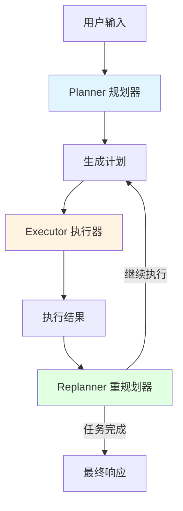

# ADK Prebuilt Plan-Execute 模块技术解析

## 1. 模块概述

### 1.1 什么是 Plan-Execute 模式？

想象一下，你被要求解决一个复杂的问题，比如"如何在一个陌生城市里，从 A 点到达 B 点"。你不会直接开始随机走动，而是会：
1. 先规划一条路线（规划阶段）
2. 按照路线走一段（执行阶段）
3. 检查是否到达目的地，如果没有，根据当前情况调整路线（重新规划阶段）

这就是 Plan-Execute 模式的核心思想。在 LLM 应用开发中，对于复杂任务，直接让模型"一步到位"地完成往往效率低下且容易出错。而通过将任务分解为规划、执行、重新规划的迭代过程，可以显著提高解决问题的成功率和可控制性。

### 1.2 本模块解决的核心问题

在构建 LLM 驱动的智能体时，开发者经常面临以下挑战：
- **规划不可控**：直接让模型生成计划，输出格式和质量不稳定
- **执行无追踪**：难以清晰记录每一步执行的结果和过程
- **状态管理复杂**：在多轮迭代中维护计划、执行结果等状态信息
- **灵活性与规范性的平衡**：既需要支持自定义规划逻辑，又希望有开箱即用的标准实现

**ADK Prebuilt Plan-Execute** 模块提供了一个标准化的 Plan-Execute-Replan 框架，通过清晰的职责划分和可扩展的接口，解决了上述问题。

## 2. 核心架构设计

### 2.1 架构概览



### 2.2 核心组件职责

本模块由三个核心 Agent 组成，它们各自承担明确的职责：

#### 2.2.1 Planner（规划器）
- **职责**：接收用户输入，生成结构化的执行计划
- **输入**：用户的原始请求
- **输出**：一个包含多个步骤的 `Plan` 对象
- **实现方式**：
  - 可以使用配置了结构化输出的模型
  - 也可以使用支持工具调用的模型，通过定义 Plan 工具来生成计划

#### 2.2.2 Executor（执行器）
- **职责**：执行计划中的第一步，并记录执行结果
- **输入**：当前计划、已执行步骤、当前要执行的步骤
- **输出**：当前步骤的执行结果
- **实现方式**：
  - 基于 `ChatModelAgent` 构建
  - 支持调用工具来完成具体任务

#### 2.2.3 Replanner（重规划器）
- **职责**：根据执行结果，判断任务是否完成，或者是否需要调整计划
- **输入**：原始计划、已执行步骤及其结果
- **输出**：要么是最终响应（任务完成），要么是更新后的计划（继续执行）
- **实现方式**：
  - 使用工具调用模型，提供两个工具：
    - `respond`：生成最终响应
    - `plan`：生成更新后的计划

### 2.3 数据流分析

数据在模块中的流动遵循以下路径：

1. **规划阶段**：用户输入 → Planner → 生成计划 → 存入会话
2. **执行阶段**：计划 → Executor → 执行第一步 → 结果存入会话
3. **再规划阶段**：执行结果 → Replanner → 评估 → 决定继续或结束

会话存储在整个过程中扮演着关键角色，它确保了各个组件之间能够共享状态信息。

让我们通过具体的代码路径来追踪数据的流动：

1. **Planner 的数据流**：
   ```
   用户输入 → GenPlannerModelInputFn → 提示词模板 → 模型 → Plan
   ```
   - 首先，用户输入通过 `GenPlannerModelInputFn` 被处理成模型输入
   - 然后，这些输入被传递给模型
   - 最后，模型的输出被解析成 `Plan` 对象

2. **Executor 的数据流**：
   ```
   Plan + 已执行步骤 → GenModelInputFn → 提示词模板 → 模型 → 工具调用 → 执行结果
   ```
   - Executor 从会话中获取当前计划和已执行步骤
   - 通过 `GenModelInputFn` 生成模型输入
   - 模型可能会调用工具来完成任务
   - 最终结果被存储在会话中

3. **Replanner 的数据流**：
   ```
   Plan + 已执行步骤 + 最新结果 → GenModelInputFn → 提示词模板 → 模型 → 工具选择
   ```
   - Replanner 会评估所有上下文信息
   - 模型会选择调用 `respond` 工具（结束）或 `plan` 工具（继续）

## 3. 核心数据结构与接口

### 3.1 Plan 接口

```go
type Plan interface {
    FirstStep() string
    json.Marshaler
    json.Unmarshaler
}
```

这个接口是整个模块的核心抽象之一。它的设计体现了几个重要的考虑：

1. **FirstStep() 方法**：为执行器提供一个明确的入口点，决定下一步要做什么。这使得执行器不需要了解整个计划的结构，只需要知道第一步。
2. **JSON 序列化能力**：使计划可以方便地在提示词模板中使用，也可以从模型的输出中解析出来。
3. **接口而非结构体**：允许用户自定义计划的结构和逻辑，同时保持与框架的兼容性。

默认提供的 `defaultPlan` 实现是一个简单的步骤列表，适合大多数场景：

```go
type defaultPlan struct {
    Steps []string `json:"steps"`
}
```

### 3.2 ExecutionContext 结构体

```go
type ExecutionContext struct {
    UserInput     []adk.Message
    Plan          Plan
    ExecutedSteps []ExecutedStep
}
```

这个结构体在执行器和重规划器之间传递信息，包含了：
- 用户的原始输入
- 当前的计划
- 已执行的步骤及其结果

这种设计使得每个组件都可以访问到它需要的所有上下文信息，同时保持了数据的一致性。

### 3.3 会话键（Session Keys）

模块定义了几个重要的会话键，用于在不同组件之间传递状态：

- `UserInputSessionKey`：存储用户输入
- `PlanSessionKey`：存储当前计划
- `ExecutedStepSessionKey`：存储当前步骤的执行结果
- `ExecutedStepsSessionKey`：存储所有已执行步骤的结果

这种基于会话的状态管理方式，使得组件之间的耦合度降低，每个组件只需要关注自己需要的状态。

## 4. 核心组件详解

本模块由多个子组件组成，每个子组件都有详细的技术文档：

- **[计划结构子模块](plan_structure.md)**：定义了计划的数据结构和接口
- **[规划器组件](planner_component.md)**：负责生成初始执行计划
- **[执行器组件](executor_component.md)**：负责执行计划的第一步
- **[再规划器组件](replanner_component.md)**：负责评估执行结果并决定下一步
- **[代理组合模块](agent_composition.md)**：负责将各组件组装成完整代理

下面是对核心组件的简要概述，详细内容请参考对应的子模块文档。

### Planner 组件

Planner 负责将用户的输入转化为结构化的执行计划。它有两种工作模式：

1. **结构化输出模式**：使用预配置为直接输出计划格式的模型
2. **工具调用模式**：使用支持工具调用的模型，通过定义工具 schema 来获取结构化输出

**内部工作流程**：
- 首先通过 `genInputFn` 生成适合规划任务的输入消息
- 然后调用聊天模型生成计划
- 最后解析模型输出，转换为 `Plan` 接口的实现并存储到会话中

**关键设计决策**：Planner 组件内部使用了 `compose.Chain` 来组织处理流程，这使得各个处理步骤（输入生成 → 模型调用 → 结果解析）清晰分离，同时也便于测试和维护。

更多详细信息请参考 [规划器组件文档](planner_component.md)。

### Executor 组件

Executor 负责执行计划的第一步。它实际上是对 `ChatModelAgent` 的封装，通过自定义的 `GenModelInput` 函数来构建执行上下文。

**设计亮点**：
- 从会话中获取计划、用户输入和已执行步骤信息
- 使用这些信息构建详细的执行上下文，包括目标、完整计划、已完成步骤和当前任务
- 将执行结果存储到会话中，供后续步骤使用

Executor 的设计体现了"单一职责"原则，它专注于执行任务，而不负责决策下一步该做什么。

更多详细信息请参考 [执行器组件文档](executor_component.md)。

### Replanner 组件

Replanner 是整个流程中最具智慧的部分，它需要评估已完成的工作并决定下一步行动。它有两个核心工具：
- `plan` 工具：用于生成新的或修改后的计划
- `respond` 工具：用于生成最终响应

**决策逻辑**：
1. 收集所有已执行的步骤和结果
2. 构建包含完整上下文的提示词
3. 让模型选择是继续执行还是结束任务
4. 根据模型选择更新计划或输出最终结果

Replanner 的设计使得系统能够根据实际执行情况动态调整策略，这在处理复杂或不确定性较高的任务时特别有价值。

更多详细信息请参考 [再规划器组件文档](replanner_component.md)。

### 组合逻辑

模块的顶层组合逻辑在 `New` 函数中实现，它使用 `adk.NewLoopAgent` 创建一个"执行-再规划"循环，然后使用 `adk.NewSequentialAgent` 将规划者和这个循环组合起来。

**设计考量**：
- 使用循环代理来处理"执行-再规划"的迭代过程
- 设置最大迭代次数作为安全措施，防止无限循环
- 通过顺序代理确保流程按照"规划 → 执行再规划循环"的顺序进行

更多详细信息请参考 [代理组合模块文档](agent_composition.md)。

## 5. 关键设计决策

### 5.1 为什么将 Planner、Executor、Replanner 分离为独立组件？

这是本模块最重要的设计决策之一。让我们分析一下这种设计的优势：

1. **单一职责原则**：每个组件只关注自己的任务，使得代码更易于理解和维护
2. **可替换性**：你可以替换其中任何一个组件而不影响其他组件。比如，你可以使用一个更复杂的 Planner，而保持 Executor 和 Replanner 不变
3. **可测试性**：每个组件都可以独立测试
4. **灵活性**：你可以根据需要组合不同的组件，甚至可以在不同的任务中重用同一个组件

当然，这种设计也有一些缺点：
- 增加了系统的复杂度
- 组件之间需要通过会话来传递状态，增加了一些开销

但总体来说，这种设计的优势远大于劣势，特别是在构建复杂的智能体系统时。

### 5.2 为什么使用接口而不是具体结构体？

模块中的 `Plan` 被定义为接口而不是具体的结构体，这是另一个重要的设计决策：

1. **扩展性**：用户可以根据自己的需求定义更复杂的计划结构，比如包含依赖关系、条件分支、优先级等
2. **兼容性**：只要实现了 `Plan` 接口，就可以与框架的其他部分无缝协作
3. **渐进式增强**：你可以从简单的 `defaultPlan` 开始，随着需求的增长再逐步引入更复杂的实现

### 5.3 为什么使用基于会话的状态管理？

模块使用会话键来在不同组件之间传递状态，而不是使用函数参数或返回值：

1. **解耦**：组件不需要知道其他组件需要什么状态，只需要关注自己需要的
2. **灵活性**：可以在不修改组件签名的情况下添加新的状态信息
3. **可追踪性**：所有状态都集中在会话中，便于调试和日志记录

当然，这种设计也需要注意一些问题：
- 会话键的命名需要谨慎，避免冲突
- 状态的生命周期需要清晰管理，避免内存泄漏
- 需要注意并发安全问题

### 5.4 为什么提供两种获取结构化输出的方式？

模块提供了两种获取结构化输出的方式（直接结构化输出和工具调用）：

1. **兼容性**：不同模型支持的能力不同，提供多种方式增加了兼容性
2. **可靠性**：工具调用方式在许多模型上更可靠
3. **效率**：直接结构化输出方式在某些情况下更高效

**权衡**：
- 优点：适用性广，可根据模型能力选择最佳方式
- 缺点：增加了配置复杂度，用户需要理解两种方式的区别

## 6. 使用指南与最佳实践

### 6.1 基本使用流程

使用本模块的基本步骤如下：

1. 创建 Planner
2. 创建 Executor
3. 创建 Replanner
4. 组合成完整的 Plan-Execute-Replan Agent

```go
// 1. 创建 Planner
planner, err := planexecute.NewPlanner(ctx, &planexecute.PlannerConfig{
    ToolCallingChatModel: myToolCallingModel,
})

// 2. 创建 Executor
executor, err := planexecute.NewExecutor(ctx, &planexecute.ExecutorConfig{
    Model:       myToolCallingModel,
    ToolsConfig: myToolsConfig,
})

// 3. 创建 Replanner
replanner, err := planexecute.NewReplanner(ctx, &planexecute.ReplannerConfig{
    ChatModel: myToolCallingModel,
})

// 4. 组合成完整 Agent
agent, err := planexecute.New(ctx, &planexecute.Config{
    Planner:   planner,
    Executor:  executor,
    Replanner: replanner,
})
```

### 6.2 自定义提示词

模块提供了默认的提示词模板，但你可以根据自己的需求自定义：

```go
// 自定义 Planner 提示词
customPlannerPrompt := prompt.FromMessages(schema.FString,
    schema.SystemMessage(`你的自定义系统提示词...`),
    schema.MessagesPlaceholder("input", false),
)

// 自定义 Planner 输入生成函数
customGenPlannerInput := func(ctx context.Context, userInput []adk.Message) ([]adk.Message, error) {
    msgs, err := customPlannerPrompt.Format(ctx, map[string]any{
        "input": userInput,
    })
    return msgs, err
}

// 使用自定义配置创建 Planner
planner, err := planexecute.NewPlanner(ctx, &planexecute.PlannerConfig{
    ToolCallingChatModel: myToolCallingModel,
    GenInputFn:           customGenPlannerInput,
})
```

### 6.3 自定义 Plan 结构

如果默认的 `defaultPlan` 不能满足你的需求，你可以定义自己的 Plan 结构：

```go
// 自定义 Plan 结构
type MyCustomPlan struct {
    Goal        string   `json:"goal"`
    Steps       []string `json:"steps"`
    Priority    int      `json:"priority"`
    EstimatedTime int    `json:"estimated_time"`
}

// 实现 Plan 接口
func (p *MyCustomPlan) FirstStep() string {
    if len(p.Steps) == 0 {
        return ""
    }
    return p.Steps[0]
}

func (p *MyCustomPlan) MarshalJSON() ([]byte, error) {
    // 实现序列化逻辑
}

func (p *MyCustomPlan) UnmarshalJSON(bytes []byte) error {
    // 实现反序列化逻辑
}

// 自定义 NewPlan 函数
customNewPlan := func(ctx context.Context) planexecute.Plan {
    return &MyCustomPlan{}
}

// 使用自定义 Plan 创建 Planner
planner, err := planexecute.NewPlanner(ctx, &planexecute.PlannerConfig{
    ToolCallingChatModel: myToolCallingModel,
    NewPlan:              customNewPlan,
})
```

## 7. 常见问题与注意事项

### 7.1 状态管理的注意事项

- **会话键的使用**：确保你使用的会话键不会与模块内部使用的键冲突
- **状态的生命周期**：注意状态是在一次运行过程中有效的，不会跨运行持久化
- **并发安全**：如果在并发环境中使用，需要注意会话的并发安全问题

### 7.2 提示词设计的最佳实践

- **清晰的指令**：提示词应该明确告诉模型它的任务是什么
- **示例**：如果可能，在提示词中包含一些示例，帮助模型理解你期望的输出格式
- **约束条件**：在提示词中明确说明约束条件，比如步骤的数量、格式要求等
- **迭代优化**：提示词设计往往需要多次迭代才能达到理想的效果

### 7.3 错误处理

模块中的组件在遇到错误时会通过 `adk.AgentEvent` 的 `Err` 字段传递错误。你应该在使用 Agent 时注意检查这些错误：

```go
iterator := agent.Run(ctx, input)
for {
    event, ok := iterator.Next()
    if !ok {
        break
    }
    
    if event.Err != nil {
        // 处理错误
        log.Printf("Error: %v", event.Err)
        break
    }
    
    // 处理正常事件
}
```

### 7.4 最大迭代次数

配置适当的 `MaxIterations` 值很重要，它可以防止在某些情况下出现无限循环。一般来说，10-20 次迭代对于大多数任务是足够的。

## 8. 与其他模块的关系

本模块构建在 ADK 的基础之上，依赖于以下核心模块：

- **[ADK Agent Interface](ADK_Agent_Interface.md)**：定义了 Agent 的基本接口
- **[ADK ChatModel Agent](ADK_ChatModel_Agent.md)**：Executor 是基于 ChatModelAgent 构建的
- **[ADK Workflow Agents](ADK_Workflow_Agents.md)**：使用 LoopAgent 和 SequentialAgent 来组合组件
- **[Schema Core Types](Schema_Core_Types.md)**：使用消息、工具等核心数据结构
- **[Compose Graph Engine](Compose_Graph_Engine.md)**：内部使用 Compose 来构建处理链

了解这些模块的功能和使用方法，将帮助你更好地理解和使用 Plan-Execute 模块。

## 9. 总结

ADK Prebuilt Plan-Execute 模块提供了一个强大而灵活的框架，用于构建基于 Plan-Execute-Replan 模式的智能体。通过将任务分解为规划、执行、重新规划的迭代过程，它可以显著提高解决复杂问题的成功率和可控制性。

模块的核心优势在于：
- **清晰的职责划分**：Planner、Executor、Replanner 各自承担明确的职责
- **高度的可扩展性**：通过接口和配置点，支持各种自定义需求
- **良好的可组合性**：可以与 ADK 的其他模块无缝协作

希望这篇文档能帮助你理解本模块的设计思想和使用方法，祝你在构建智能体的过程中取得成功！

## 完整使用示例

下面是一个完整的示例，展示了如何创建和使用 plan-execute 代理：

```go
package main

import (
    "context"
    "fmt"
    
    "github.com/cloudwego/eino/adk"
    "github.com/cloudwego/eino/adk/prebuilt/planexecute"
    "github.com/cloudwego/eino/components/model"
    // 导入具体的模型实现，例如 OpenAI
)

func main() {
    ctx := context.Background()
    
    // 1. 初始化模型
    chatModel := initYourChatModel() // 初始化你的聊天模型
    toolCallingModel := initYourToolCallingModel() // 初始化支持工具调用的模型
    
    // 2. 创建工具
    tools := createYourTools() // 创建可供执行者使用的工具
    
    // 3. 创建规划器
    planner, err := planexecute.NewPlanner(ctx, &planexecute.PlannerConfig{
        ToolCallingChatModel: toolCallingModel,
        // 也可以使用 ChatModelWithFormattedOutput
    })
    if err != nil {
        panic(err)
    }
    
    // 4. 创建执行者
    executor, err := planexecute.NewExecutor(ctx, &planexecute.ExecutorConfig{
        Model:         toolCallingModel,
        ToolsConfig:   adk.ToolsConfig{Tools: tools},
        MaxIterations: 10,
    })
    if err != nil {
        panic(err)
    }
    
    // 5. 创建再规划器
    replanner, err := planexecute.NewReplanner(ctx, &planexecute.ReplannerConfig{
        ChatModel: toolCallingModel,
    })
    if err != nil {
        panic(err)
    }
    
    // 6. 创建完整的 plan-execute 代理
    agent, err := planexecute.New(ctx, &planexecute.Config{
        Planner:        planner,
        Executor:       executor,
        Replanner:      replanner,
        MaxIterations:  15,
    })
    if err != nil {
        panic(err)
    }
    
    // 7. 使用代理
    input := &adk.AgentInput{
        Messages: []adk.Message{
            schema.UserMessage("帮我研究一下气候变化对农业的影响", nil),
        },
    }
    
    iterator := agent.Run(ctx, input)
    for {
        event, ok := iterator.Next()
        if !ok {
            break
        }
        
        if event.Err != nil {
            fmt.Printf("Error: %v\n", event.Err)
            continue
        }
        
        if event.Output != nil {
            fmt.Printf("Final Output: %v\n", event.Output)
        }
        
        // 处理其他事件类型...
    }
}
```

## 常见问题解答

### Q: 什么时候应该使用 Plan-Execute 模式而不是直接使用 ChatModelAgent？

A: Plan-Execute 模式特别适合以下场景：
- 任务比较复杂，需要多个步骤才能完成
- 你希望能够观察和调试代理的思考过程
- 任务可能需要根据中间结果调整策略
- 你希望有明确的计划和执行分离

### Q: 如何提高计划的质量？

A: 有几种方法可以提高计划质量：
- 自定义 Planner 的提示词，提供更具体的指导
- 使用更强大的模型作为 Planner
- 提供示例计划作为少样本学习材料
- 自定义 Plan 结构，添加更多约束和指导

### Q: 如何处理执行失败的情况？

A: 执行失败通常由 Replanner 处理。你可以：
- 自定义 Replanner 的提示词，强调如何从失败中恢复
- 在 Executor 中添加错误处理和重试逻辑
- 考虑添加专门的错误处理工具

### Q: 这个模块支持流式输出吗？

A: 是的，这个模块完全支持流式输出。你可以通过设置 `AgentInput.EnableStreaming = true` 来启用流式输出，然后处理 `AgentEvent` 中的流式消息。

## 总结

ADK Prebuilt Plan-Execute 模块提供了一个经过精心设计的计划-执行-再规划模式实现。它的核心优势在于：

1. **清晰的角色分离**：规划、执行、再规划三个角色各司其职
2. **灵活的扩展点**：多个配置项允许自定义行为
3. **实用的默认实现**：默认实现已经可以满足大多数场景需求
4. **良好的组合性**：构建在 ADK 基础组件之上，可以与其他模块很好地协作

这种模式特别适合处理需要多步骤、可以根据中间结果调整策略的复杂任务。通过合理配置和扩展，你可以构建出强大而可靠的智能代理系统。
