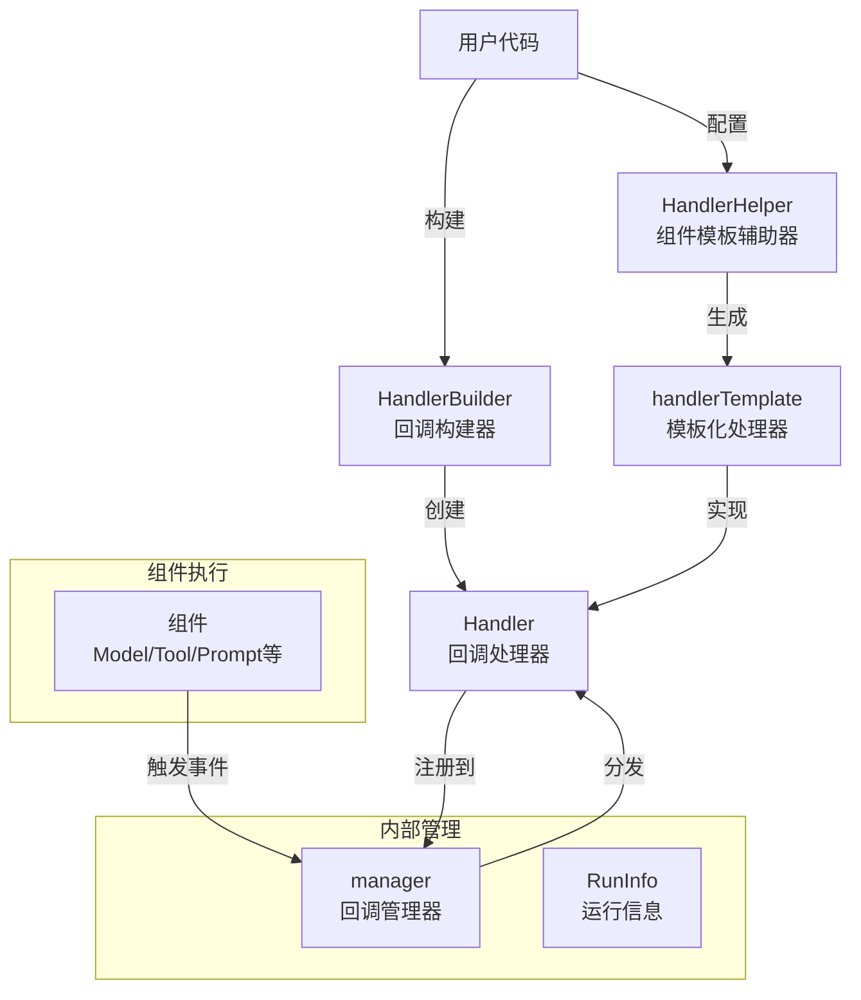

# Callbacks System 模块

## 模块概述

Callbacks System 是一个灵活的事件回调系统，它允许开发者在组件执行的各个关键节点（开始、结束、错误、流式输入/输出）插入自定义逻辑，而无需修改组件本身的代码。想象一下它就像一个组件执行过程中的"监控系统"，可以在组件工作的每个阶段自动触发预先注册的回调函数，而无需修改组件本身的代码。

这个模块解决了一个常见的架构问题：如何在不侵入核心业务逻辑的情况下，实现横切关注点（cross-cutting concerns）如日志记录、性能监控、错误追踪、数据审计等功能。

### 问题背景

在构建复杂的 AI 应用时，我们经常会遇到以下需求：
- 记录每个模型调用的输入输出和耗时
- 追踪工具调用的参数和结果
- 在某个组件出错时发送告警
- 监控整个系统的执行流程
- 实现请求级别的追踪和日志关联

如果没有一个统一的回调系统，这些需求会导致代码中充满了重复的日志和监控代码，使得核心业务逻辑变得混乱难以维护。Callbacks System 正是为了解决这个问题而设计的。

## 架构设计

### 核心组件交互图



### 架构说明

Callbacks System 采用了分层设计，主要包含以下几个核心部分：

1. **回调构建层**（HandlerBuilder）：提供流式 API 来构建自定义的回调处理器，允许用户选择性地实现所需的回调方法。

2. **组件模板层**（HandlerHelper）：为不同类型的组件（Model、Tool、Prompt、Retriever 等）提供预定义的回调模板，自动处理类型转换，简化使用。

3. **内部管理层**（manager）：负责回调的注册、存储和分发，通过 context 传递回调管理器实例。

4. **事件触发层**：与 [Compose Graph Engine](compose_graph_engine.md) 紧密集成，在组件执行的各个阶段自动触发相应的回调。

## 核心设计理念

### 1. 观察者模式的优雅实现

Callbacks System 本质上是观察者模式的一种实现，但与传统的观察者模式不同，它具有以下特点：

- **时序明确**：定义了清晰的事件时机（OnStart、OnEnd、OnError、OnStartWithStreamInput、OnEndWithStreamOutput）
- **上下文传递**：通过 context.Context 传递回调上下文和运行信息
- **组件感知**：回调能够感知当前执行的组件类型和信息

### 2. 构建器模式简化使用

HandlerBuilder 采用了构建器模式，让用户可以灵活地只实现他们需要的回调方法，而不必实现整个接口：

```go
handler := callbacks.NewHandlerBuilder().
    OnStartFn(func(ctx context.Context, info *callbacks.RunInfo, input callbacks.CallbackInput) context.Context {
        // 处理开始事件
        return ctx
    }).
    OnErrorFn(func(ctx context.Context, info *callbacks.RunInfo, err error) context.Context {
        // 处理错误事件
        return ctx
    }).
    Build()
```

### 3. 类型安全的模板化处理

HandlerHelper 提供了类型安全的回调模板，为每种组件类型定义了专门的回调处理器，自动处理类型转换：

```go
helper := callbacks.NewHandlerHelper().
    ChatModel(&callbacks.ModelCallbackHandler{
        OnStart: func(ctx context.Context, runInfo *callbacks.RunInfo, input *model.CallbackInput) context.Context {
            // 类型安全的模型回调
            return ctx
        },
    }).
    Tool(&callbacks.ToolCallbackHandler{
        OnEnd: func(ctx context.Context, info *callbacks.RunInfo, output *tool.CallbackOutput) context.Context {
            // 类型安全的工具回调
            return ctx
        },
    })
```

## 核心概念与设计意图

### 1. Handler 接口：统一的回调契约

`Handler` 接口是整个回调系统的核心，它定义了五个关键回调点：

```go
type Handler interface {
    OnStart(ctx context.Context, info *RunInfo, input CallbackInput) context.Context
    OnEnd(ctx context.Context, info *RunInfo, output CallbackOutput) context.Context
    OnError(ctx context.Context, info *RunInfo, err error) context.Context
    OnStartWithStreamInput(ctx context.Context, info *RunInfo, input *schema.StreamReader[CallbackInput]) context.Context
    OnEndWithStreamOutput(ctx context.Context, info *RunInfo, output *schema.StreamReader[CallbackOutput]) context.Context
}
```

**设计意图**：
- 提供了统一的回调契约，确保所有组件都遵循相同的回调模式
- 支持同步和流式两种处理模式，满足不同场景的需求
- 通过 `context.Context` 传递上下文，允许在回调链中传递数据和控制

### 2. HandlerBuilder：灵活的回调构造器

`HandlerBuilder` 采用了建造者模式，允许用户通过链式调用构建自定义的回调处理器：

```go
handler := callbacks.NewHandlerBuilder().
    OnStartFn(func(ctx context.Context, info *callbacks.RunInfo, input callbacks.CallbackInput) context.Context {
        // 自定义开始逻辑
        return ctx
    }).
    OnEndFn(func(ctx context.Context, info *callbacks.RunInfo, output callbacks.CallbackOutput) context.Context {
        // 自定义结束逻辑
        return ctx
    }).
    Build()
```

**设计意图**：
- 提供了灵活的回调构建方式，用户可以根据需要选择实现哪些回调方法
- 避免了创建大量结构体和方法的 boilerplate code
- 支持函数式编程风格，使代码更加简洁和可读

### 3. HandlerHelper：组件化的回调模板

`HandlerHelper` 提供了预定义的组件回调模板，为不同类型的组件提供了类型安全的回调处理：

```go
helper := callbacks.NewHandlerHelper().
    ChatModel(&callbacks.ModelCallbackHandler{
        OnStart: func(ctx context.Context, runInfo *callbacks.RunInfo, input *model.CallbackInput) context.Context {
            // 处理模型开始事件
            return ctx
        },
        OnEnd: func(ctx context.Context, runInfo *callbacks.RunInfo, output *model.CallbackOutput) context.Context {
            // 处理模型结束事件
            return ctx
        },
    }).
    Tool(&callbacks.ToolCallbackHandler{
        OnStart: func(ctx context.Context, info *callbacks.RunInfo, input *tool.CallbackInput) context.Context {
            // 处理工具开始事件
            return ctx
        },
    }).
    Handler()
```

**设计意图**：
- 提供了类型安全的回调处理，避免了手动类型断言
- 为常见组件提供了预定义的回调结构，简化了使用
- 支持组合多个组件的回调处理器，形成一个统一的回调处理链

### 4. manager：回调的上下文管理

`manager` 负责管理回调处理器的注册和调用，它通过 `context.Context` 传递：

```go
type manager struct {
    globalHandlers []Handler
    handlers       []Handler
    runInfo        *RunInfo
}
```

**设计意图**：
- 支持全局和局部两种回调处理器，满足不同范围的需求
- 通过 `context.Context` 传递，确保回调处理器与执行上下文紧密关联
- 避免了使用全局变量，提高了代码的可测试性和并发安全性

## 关键设计决策

### 1. 通过 Context 传递回调而非直接依赖

**决策**：使用 context.Context 来传递回调管理器，而不是让组件直接依赖回调系统。

**原因**：
- 保持组件接口的简洁性
- 避免组件与回调系统的强耦合
- 允许回调在不同的执行上下文中有不同的行为

**权衡**：
- ✅ 组件更纯净，不关心回调的存在
- ✅ 更灵活的回调配置方式
- ❌ 需要在调用链中正确传递 context
- ❌ 类型安全性略有降低（通过类型断言恢复）

### 2. 分离通用 Handler 和组件特定 Template

**决策**：提供两层抽象 - 底层的通用 Handler 接口和上层的组件特定模板。

**原因**：
- 满足不同层次的使用需求：高级用户可以使用通用接口，普通用户可以使用简化模板
- 保持系统的扩展性：新组件类型可以添加新模板而不改变核心接口
- 类型安全与灵活性的平衡

**权衡**：
- ✅ 灵活性高，适用于各种场景
- ✅ 类型安全，减少运行时错误
- ❌ 增加了系统的复杂度
- ❌ 有一定的学习曲线

### 3. 支持流式输入输出的专门回调

**决策**：为流式输入输出提供专门的回调方法（OnStartWithStreamInput、OnEndWithStreamOutput）。

**原因**：
- 流式处理在 AI 应用中非常常见（如模型生成流式响应）
- 流式数据与非流式数据有本质区别，需要不同的处理方式
- 允许回调在流式处理开始和结束时进行特殊处理

**权衡**：
- ✅ 完整支持流式场景
- ✅ 可以实现流式数据的监控和转换
- ❌ 增加了接口的复杂性
- ❌ 需要用户理解流式和非流式的区别

## 数据流程

让我们追踪一个典型的回调触发流程：

1. **初始化阶段**：
   - 用户创建 Handler 或使用 HandlerHelper 构建回调处理器
   - 通过 Compose Graph Engine 的配置选项（如 `compose.WithCallbacks`）注册回调
   - 回调被包装成 manager 并存储到 context 中

2. **组件执行阶段**（以 ChatModel 为例）：
   ```
   组件开始执行 
   → 检查 context 中是否有回调管理器
   → 提取 RunInfo（组件名称、类型等）
   → 调用 OnStart 回调（传入输入数据）
   → 组件执行业务逻辑
   → 成功时调用 OnEnd 回调（传入输出数据）
   → 失败时调用 OnError 回调（传入错误信息）
   → 如果是流式输出，调用 OnEndWithStreamOutput
   ```

3. **回调分发阶段**：
   - manager 接收到事件
   - 检查哪些 handler 注册了该类型的事件
   - 依次调用相应的回调方法
   - 回调可以修改 context 并传递给后续处理

## 子模块

Callbacks System 模块包含以下主要子模块：

- **[handler_builder](handler_builder.md)**：提供了 `HandlerBuilder` 和 `handlerImpl`，用于构建自定义回调处理器
- **[interface](interface.md)**：定义了核心接口和类型，如 `Handler`、`RunInfo`、`CallbackInput`、`CallbackOutput` 等
- **[manager](manager.md)**：实现了回调管理器，负责管理回调处理器的注册和调用
- **[template](template.md)**：提供了预定义的组件回调模板，如 `ModelCallbackHandler`、`ToolCallbackHandler` 等

每个子模块都有详细的技术深度文档，包含设计意图、内部机制、使用示例和常见陷阱等内容。建议按顺序阅读这些文档，以全面了解 Callbacks System 的工作原理。

## 与其他模块的关系

1. **与 Component Interfaces 的关系**：
   - 回调系统定义了组件执行过程中的扩展点
   - 每个组件类型都有对应的 CallbackInput 和 CallbackOutput 结构
   - 例如 [Model](component_interfaces.md) 组件有 `model.CallbackInput` 和 `model.CallbackOutput`

2. **与 Compose Graph Engine 的关系**：
   - 回调系统主要通过 [Compose Graph Engine](compose_graph_engine.md) 来触发
   - Graph 在执行节点时会自动检查和触发回调
   - 支持在 Graph、Chain、Lambda 等不同级别配置回调

3. **与 ADK Agent Interface 的关系**：
   - [ADK Agent](adk_agent_interface.md) 可以使用回调系统来监控 Agent 的执行
   - 例如记录 Agent 的输入输出、追踪错误等

## 使用指南

### 基本使用

使用 `HandlerHelper` 创建针对特定组件的回调处理器：

```go
import (
    "context"
    "fmt"
    
    "github.com/cloudwego/eino/callbacks"
    "github.com/cloudwego/eino/components/model"
)

func main() {
    // 创建回调处理器
    handler := callbacks.NewHandlerHelper().
        ChatModel(&callbacks.ModelCallbackHandler{
            OnStart: func(ctx context.Context, runInfo *callbacks.RunInfo, input *model.CallbackInput) context.Context {
                fmt.Printf("Model %s started with input: %v\n", runInfo.Name, input)
                return ctx
            },
            OnEnd: func(ctx context.Context, runInfo *callbacks.RunInfo, output *model.CallbackOutput) context.Context {
                fmt.Printf("Model %s ended with output: %v\n", runInfo.Name, output)
                return ctx
            },
            OnError: func(ctx context.Context, runInfo *callbacks.RunInfo, err error) context.Context {
                fmt.Printf("Model %s error: %v\n", runInfo.Name, err)
                return ctx
            },
        }).
        Handler()
    
    // 使用回调处理器
    // ...
}
```

### 高级自定义

使用 `HandlerBuilder` 创建完全自定义的回调处理器：

```go
import (
    "context"
    "fmt"
    "time"
    
    "github.com/cloudwego/eino/callbacks"
)

func main() {
    // 创建自定义回调处理器
    handler := callbacks.NewHandlerBuilder().
        OnStartFn(func(ctx context.Context, info *callbacks.RunInfo, input callbacks.CallbackInput) context.Context {
            // 记录开始时间
            start := time.Now()
            ctx = context.WithValue(ctx, "start_time", start)
            fmt.Printf("Component %s (%s) started at %v\n", info.Name, info.Type, start)
            return ctx
        }).
        OnEndFn(func(ctx context.Context, info *callbacks.RunInfo, output callbacks.CallbackOutput) context.Context {
            // 计算执行时间
            start := ctx.Value("start_time").(time.Time)
            duration := time.Since(start)
            fmt.Printf("Component %s (%s) ended, duration: %v\n", info.Name, info.Type, duration)
            return ctx
        }).
        OnErrorFn(func(ctx context.Context, info *callbacks.RunInfo, err error) context.Context {
            fmt.Printf("Component %s (%s) error: %v\n", info.Name, info.Type, err)
            return ctx
        }).
        Build()
    
    // 使用回调处理器
    // ...
}
```

### 完整实战示例：请求追踪和性能监控

下面是一个更完整的实战示例，展示如何使用 Callbacks System 实现请求追踪和性能监控：

```go
package main

import (
    "context"
    "fmt"
    "log"
    "sync"
    "time"

    "github.com/cloudwego/eino/callbacks"
    "github.com/cloudwego/eino/compose"
    "github.com/cloudwego/eino/components/model"
    "github.com/cloudwego/eino/components/tool"
    template "github.com/cloudwego/eino/utils/callbacks"
)

// TraceInfo 存储追踪信息
type TraceInfo struct {
    RequestID   string
    Component   string
    StartTime   time.Time
    EndTime     time.Time
    Duration    time.Duration
    HasError    bool
    Error       error
}

// TraceManager 管理追踪信息
type TraceManager struct {
    mu     sync.Mutex
    traces map[string][]*TraceInfo
}

func NewTraceManager() *TraceManager {
    return &TraceManager{
        traces: make(map[string][]*TraceInfo),
    }
}

func (tm *TraceManager) AddTrace(requestID string, trace *TraceInfo) {
    tm.mu.Lock()
    defer tm.mu.Unlock()
    tm.traces[requestID] = append(tm.traces[requestID], trace)
}

func (tm *TraceManager) GetTraces(requestID string) []*TraceInfo {
    tm.mu.Lock()
    defer tm.mu.Unlock()
    return tm.traces[requestID]
}

func main() {
    // 创建追踪管理器
    traceManager := NewTraceManager()
    
    // 创建请求 ID（实际应用中通常从请求上下文获取）
    requestID := "req-123456"
    
    // 使用 HandlerHelper 创建回调处理器
    handler := template.NewHandlerHelper().
        ChatModel(&template.ModelCallbackHandler{
            OnStart: func(ctx context.Context, runInfo *callbacks.RunInfo, input *model.CallbackInput) context.Context {
                // 记录模型调用开始
                trace := &TraceInfo{
                    RequestID: requestID,
                    Component: runInfo.Name,
                    StartTime: time.Now(),
                }
                ctx = context.WithValue(ctx, "current_trace", trace)
                log.Printf("[%s] Model %s started", requestID, runInfo.Name)
                return ctx
            },
            OnEnd: func(ctx context.Context, runInfo *callbacks.RunInfo, output *model.CallbackOutput) context.Context {
                // 记录模型调用结束
                if trace, ok := ctx.Value("current_trace").(*TraceInfo); ok {
                    trace.EndTime = time.Now()
                    trace.Duration = trace.EndTime.Sub(trace.StartTime)
                    traceManager.AddTrace(requestID, trace)
                    log.Printf("[%s] Model %s ended, duration: %v", requestID, runInfo.Name, trace.Duration)
                }
                return ctx
            },
            OnError: func(ctx context.Context, runInfo *callbacks.RunInfo, err error) context.Context {
                // 记录模型调用错误
                if trace, ok := ctx.Value("current_trace").(*TraceInfo); ok {
                    trace.EndTime = time.Now()
                    trace.Duration = trace.EndTime.Sub(trace.StartTime)
                    trace.HasError = true
                    trace.Error = err
                    traceManager.AddTrace(requestID, trace)
                    log.Printf("[%s] Model %s error: %v, duration: %v", requestID, runInfo.Name, err, trace.Duration)
                }
                return ctx
            },
        }).
        Tool(&template.ToolCallbackHandler{
            OnStart: func(ctx context.Context, info *callbacks.RunInfo, input *tool.CallbackInput) context.Context {
                // 类似的工具调用追踪逻辑
                log.Printf("[%s] Tool %s started", requestID, info.Name)
                return ctx
            },
            OnEnd: func(ctx context.Context, info *callbacks.RunInfo, output *tool.CallbackOutput) context.Context {
                log.Printf("[%s] Tool %s ended", requestID, info.Name)
                return ctx
            },
            OnError: func(ctx context.Context, info *callbacks.RunInfo, err error) context.Context {
                log.Printf("[%s] Tool %s error: %v", requestID, info.Name, err)
                return ctx
            },
        }).
        Handler()
    
    // 假设这里有一个 graph
    // graph := compose.NewGraph(...)
    // 然后使用回调处理器
    // result, err := graph.Invoke(ctx, input, compose.WithCallbacks(handler))
    
    // 请求结束后，打印追踪信息
    fmt.Printf("\n=== Trace Info for Request %s ===\n", requestID)
    for _, trace := range traceManager.GetTraces(requestID) {
        status := "SUCCESS"
        if trace.HasError {
            status = fmt.Sprintf("ERROR: %v", trace.Error)
        }
        fmt.Printf("Component: %-20s Duration: %-10v Status: %s\n", 
            trace.Component, trace.Duration, status)
    }
}
```

这个示例展示了如何使用 Callbacks System 实现一个完整的请求追踪和性能监控系统，包括：
- 为每个组件调用记录开始和结束时间
- 追踪错误信息
- 收集和展示性能数据
- 使用 context 在回调之间传递数据

## 注意事项与常见陷阱

1. **Context 传递**：
   - 始终确保在回调函数中返回修改后的 context，否则后续回调将无法获取到修改
   - 避免在 context 中存储过大的数据结构，以免影响性能

2. **错误处理**：
   - 回调函数中的错误不会阻止组件的执行，除非你在回调中显式地处理
   - 如果需要在回调中处理错误，确保不会影响组件的正常执行流程

3. **流式处理**：
   - 在处理流式输出时，注意不要消费 StreamReader，否则组件将无法获取到数据
   - 如果需要观察流式数据，可以使用 `schema.StreamReaderWithConvert` 创建一个新的 StreamReader

4. **性能考虑**：
   - 回调函数会在组件执行的关键路径上调用，确保回调函数的执行时间不会太长
   - 避免在回调函数中执行耗时操作，如 IO 操作、复杂计算等

5. **类型安全**：
   - 使用 `HandlerHelper` 时，确保类型断言是安全的，避免运行时 panic
   - 在自定义回调中，对 `CallbackInput` 和 `CallbackOutput` 进行类型断言时，要做好错误处理

## 高级话题

### 全局回调 vs 局部回调

Callbacks System 支持两种级别的回调：全局回调和局部回调。

**全局回调**：
- 通过 `callbacks.GlobalHandlers` 注册
- 会在所有组件的执行过程中被调用
- 适用于跨整个系统的监控和日志记录

**局部回调**：
- 通过 `compose.WithCallbacks` 等选项注册
- 只在特定的图或组件执行过程中被调用
- 适用于特定场景的监控和逻辑

**选择建议**：
- 如果回调逻辑适用于整个系统，使用全局回调
- 如果回调逻辑只适用于特定场景，使用局部回调
- 可以同时使用全局和局部回调，它们会被依次调用

### 回调链的执行顺序

当有多个回调处理器注册时，它们的执行顺序是：
1. 全局回调处理器（按照注册顺序）
2. 局部回调处理器（按照注册顺序）

在每个回调处理器内部，回调方法的执行顺序是：
- `OnStart` → 组件执行 → `OnEnd`/`OnError`
- 如果是流式处理，还会有 `OnStartWithStreamInput` 和 `OnEndWithStreamOutput`

### 性能优化建议

1. **使用 `Needed` 方法**：
   - 如果你的回调处理器只关心某些特定的事件时机，实现 `TimingChecker` 接口的 `Needed` 方法
   - 这可以避免不必要的回调调用，提高性能

2. **保持回调函数简洁**：
   - 回调函数会在组件执行的关键路径上调用，确保它们的执行时间很短
   - 避免在回调函数中执行耗时的 IO 操作或复杂计算

3. **合理使用 context**：
   - 避免在 context 中存储过大的数据结构
   - 如果需要在回调之间传递大量数据，考虑使用其他方式

### 测试回调

测试回调处理器时，可以考虑以下策略：

1. **单元测试**：
   - 直接调用回调处理器的方法，传入测试数据
   - 验证回调函数的行为是否符合预期

2. **集成测试**：
   - 在实际的组件执行过程中测试回调
   - 验证回调是否在正确的时机被调用，并且传递了正确的数据

3. **使用 Mock 组件**：
   - 使用 mock 组件来模拟各种场景，如成功、错误、流式输出等
   - 验证回调在各种场景下的行为

## 常见问题解答

### Q: 回调函数中的错误会影响组件的执行吗？

A: 一般来说，回调函数中的错误不会影响组件的执行。回调系统的设计理念是回调逻辑不应该干扰核心业务逻辑。但是，如果你在回调函数中 panic，那么它会传播并影响组件的执行。

### Q: 如何在回调之间传递数据？

A: 可以通过 `context.Context` 来传递数据。在一个回调函数中使用 `context.WithValue` 存储数据，然后在后续的回调函数中从 context 中获取数据。

### Q: 可以修改回调中的输入输出数据吗？

A: 回调函数接收的输入输出数据是可以修改的，但是要小心这样做可能会影响组件的执行。一般来说，建议只观察数据，而不是修改数据。

### Q: 如何处理流式输出？

A: 对于流式输出，你可以使用 `OnEndWithStreamOutput` 回调。这个回调会在流式输出开始时被调用，你可以通过传入的 `StreamReader` 来观察流式数据。注意不要消费这个 `StreamReader`，否则组件将无法获取到数据。

## 总结

Callbacks System 是一个强大而灵活的事件回调系统，它通过清晰的抽象和分层设计，让开发者能够在不修改组件代码的情况下，实现各种横切关注点。它的构建器模式和模板化设计平衡了灵活性和易用性，而与 context 的集成则保持了组件的纯净性。

这个模块解决了在构建复杂 AI 应用时的一个常见问题：如何在不侵入核心业务逻辑的情况下，实现日志记录、性能监控、错误追踪等功能。通过使用 Callbacks System，你可以保持代码的整洁和可维护性，同时实现强大的监控和观察能力。

虽然使用回调系统需要注意一些细节（如 context 传递、性能影响等），但它为构建可观察、可扩展的 AI 应用提供了坚实的基础。希望这个文档能帮助你更好地理解和使用 Callbacks System！
