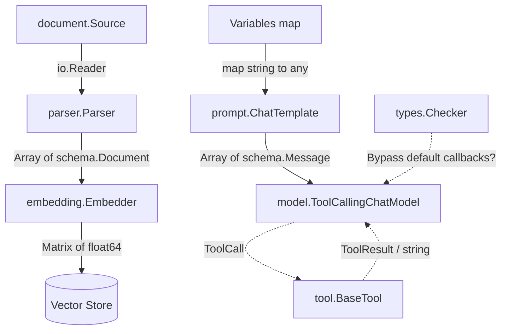

# Component Interfaces (组件接口层)

欢迎加入团队。作为 Eino 框架的核心，`Component Interfaces` 模块是你理解整个系统架构的“钥匙”。在阅读具体的实现代码之前，请先将视线从底层的业务逻辑中抽离出来——这个模块不仅是一组代码规约，更是 Eino 框架应对复杂 AI 应用场景的**架构哲学**。

## 1. 为什么需要这个模块？ (The "Why")

在 AI 应用开发中，我们面临的最大痛点之一是**生态的碎片化与高度可变性**。
今天我们在用 OpenAI 的 GPT-4 和 Pinecone 向量库，明天可能就需要切换到开源的 LLaMA 3 和自建的 Milvus 实例。如果将具体的提供商 SDK 直接硬编码进业务逻辑（或 Graph 编排逻辑）中，系统将迅速沦为一座“屎山”。

`Component Interfaces` 存在的根本目的，是**在框架（编排引擎）与具体能力提供商之间划定一条不可逾越的边界**。
它定义了一套标准化的“插槽”（如 `BaseChatModel`、`Embedder`、`InvokableTool`）。框架的 `Compose Graph Engine` 只与这些抽象接口对话，而完全不关心底层是哪个厂商的实现。这就好比计算机主板上的 PCIe 插槽或 USB 接口标准——操作系统（Eino）只负责通过标准协议发送指令，而不关心你插上的是 NVIDIA 的显卡还是 AMD 的显卡。

## 2. 核心心智模型 (Mental Model)

要理解这个模块，你可以将其想象成一个**“加工流水线网络”**。在这条流水线上，数据流是标准化的托盘（如 `schema.Message` 或 `schema.Document`），而各种 Interface 则是标准化的加工站：

*   **提词站 (`ChatTemplate`)**：负责将用户零散的变量数据组装成标准化托盘（`[]*schema.Message`）。
*   **大脑中枢 (`ChatModel`)**：接收托盘，消耗算力，产出新的托盘（生成回复或工具调用指令）。
*   **外设工具 (`Tool`)**：就像大脑连接的机械臂，接收标准 JSON 指令，执行物理世界/外部系统的操作，将结果返回给大脑。
*   **数据吞吐 (`Embedder` / `Parser`)**：负责将非结构化的物理世界数据（PDF、网页）咀嚼并转化为机器能理解的向量（Vector）。

## 3. 架构与数据流向 (Architecture & Data Flow)

这个模块本身不生产数据，它定义了数据如何在不同组件之间流转的契约。以下是核心接口如何协同工作的宏观视角：

**一次典型对话操作的端到端数据流**：
1. `ChatTemplate.Format()` 将业务上下文字典渲染为标准的 `[]*schema.Message`。
2. 消息流转入 `ToolCallingChatModel`。此时，模型已经通过 `.WithTools()` 绑定了外围能力。
3. 模型内部调用大厂 API，如果决定触发工具，则返回带有 `ToolCall` 的 Message。
4. 框架路由到实现了 `EnhancedInvokableTool` 的工具，通过 `.InvokableRun()` 执行外部 API（如搜索、查库），返回 `*schema.ToolResult`。
5. 工具结果被追加到 Message 列表中，再次流转回 `ChatModel` 获取最终的自然语言回复。

## 4. 核心设计权衡 (Design Tradeoffs)

在这个模块中，你会看到许多并非“最简”的设计选择。每一个选择背后都是基于血泪经验的权衡：

### 4.1 状态隔离：`WithTools` vs 被废弃的 `BindTools`
细心的你会发现 `ChatModel` 接口的 `BindTools` 方法被标记为了 `Deprecated`，转而推荐使用 `ToolCallingChatModel` 的 `WithTools`。
*   **原因**：通常，我们会创建一个全局单例的模型客户端实例（如一个全局复用的 OpenAI Client）。如果在并发请求中，Request A 调用了 `BindTools(A的工具)`，而 Request B 同时调用了 `BindTools(B的工具)`，它们会产生严重的竞态条件（Race Condition），导致模型使用了错误的工具集。
*   **抉择**：我们选择了**不可变性（Immutability）**。`WithTools` 必须返回一个**新的**实例（内部可能是原始 client 的轻量级包装），从而做到 Request 级别的隔离。这牺牲了一点点内存分配的性能，但换来了并发场景下的绝对正确性。

### 4.2 表达力升级：基础 Tool 与 `Enhanced` Tool 接口的分野
你会看到工具接口既有 `InvokableTool`（返回 `string`），又有 `EnhancedInvokableTool`（返回 `*schema.ToolResult`）。
*   **原因**：最初的 Tool 设计假设工具的返回值只是供 LLM 阅读的文本摘要（返回 JSON string 即可）。但随着多模态的演进，工具可能需要返回图表图像、甚至二进制文件，直接呈现给终端用户。
*   **抉择**：为了向后兼容旧的单模态工具，我们保留了基础接口，通过 `Enhanced` 前缀引入了对多模态结构体（`ToolResult`）的支持，允许工具返回更丰富、更高维的数据。

### 4.3 职责反转：`Checker` 接口对回调机制的妥协
系统通常需要拦截每个组件的调用来做监控打点和日志记录（Callbacks System）。但某些高度封装的第三方组件（如某些黑盒 SDK）内部已经有更精确的统计逻辑。
*   **抉择**：`types.Checker` 的 `IsCallbacksEnabled()` 提供了“逃生舱”。如果组件返回 true，意味着它在对框架说：“退后，我自己来控制回调”。这种**控制反转**增加了一点系统复杂性，但给予了组件极大的灵活性，避免了重复打点或生命周期不准的问题。

## 5. 避坑指南 (Watch Outs for New Contributors)

作为新加入的开发者，在使用或实现这些接口时，请注意以下几点：

1. **永远不要修改传入的输入参数**：这是一种隐式契约。比如你在实现 `Transformer` 或 `Embedder` 时，**不要**原地修改传入的 `[]*schema.Document` 内部状态。在 `Compose Graph Engine` 中，一个节点的输出往往被多个分支共享（Fan-out），原地修改会导致不可预测的数据污染。
2. **警惕并发生态**：模型和工具的实现都应该保证并发安全（Thread-safe）。框架层面会利用 goroutines 并发执行分支，确保你的实现不要依赖请求级别的共享状态。
3. **正确处理 Context**：所有核心接口的第一个参数都是 `context.Context`。请务必透传并尊重 context 的取消/超时信号，这对于中断执行、减少无效 API 计费至关重要。

---

## 6. 子模块详述 (Sub-modules)

为了不让这份文档变得像字典一样枯燥，我们将具体的接口按功能拆分到了各个子模块页面中，请根据需要深入阅读：

*   **[Chat Model 接口规范](./model_interfaces.md)**
    深入解析 `BaseChatModel` 与 `ToolCallingChatModel`。了解文本生成、流式输出以及如何安全地为模型赋予工具调用能力。
*   **[Tools 工具链接口规范](./tool_interfaces.md)**
    涵盖从基础 `BaseTool` 到多模态 `EnhancedInvokableTool` 的完整演进路径。了解如何为大模型打造功能强大的“外设”。
*   **[文档处理接口规范](./document_interfaces.md)**
    聚焦物理世界数据到 AI 世界的桥梁：从 `Source` 的定位，到 `Parser` 的解析，了解文档处理的核心接口。
*   **[嵌入接口规范](./embedding_interfaces.md)**
    了解 `Embedder` 接口如何将文本转换为向量表示，是 RAG 系统和语义搜索的基础。
*   **[提示模板接口规范](./prompt_interfaces.md)**
    揭秘 `ChatTemplate` 如何管理 Prompt 上下文，将变量格式化为标准化的消息列表。
*   **[组件类型规范](./component_types.md)**
    了解 `Typer` 和 `Checker` 等底层切面辅助接口的作用，以及组件类型系统如何支持回调和组件管理。

## 7. 跨模块依赖关系 (Cross-module Dependencies)

`Component Interfaces` 模块在整个框架中处于**承上启下**的关键位置，它的依赖关系如下：

### 上游依赖（被本模块依赖）
*   **[Schema Core Types](Schema Core Types.md)**: `Component Interfaces` 高度依赖 Schema 模块定义的数据结构，如 `schema.Message`、`schema.Document`、`schema.ToolResult` 等，它们是流转于各个组件间的标准化载体。
*   **[Schema Stream](Schema Stream.md)**: 流式返回结构 `schema.StreamReader` 强依赖此模块。

### 下游依赖（依赖本模块）
*   **[Component Options and Extras](Component Options and Extras.md)**: 所有的 `opts ...Option` 和回调（Callbacks）的扩展能力均在这个模块进行补充，它们为接口实现提供了配置和扩展机制。
*   **[Callbacks System](Callbacks System.md)**: 回调系统使用 `Checker` 接口来决定是否启用默认回调行为。
*   **[Compose Graph Engine](Compose Graph Engine.md)**: 接口层之上就是执行这些接口定义的图编排引擎。框架层不依赖组件的实现，仅通过依赖此模块定义的接口来协调数据流转。
*   **[ADK Agent Interface](ADK Agent Interface.md)**: 高级 Agent 抽象基于这些接口构建，提供了更高级别的应用开发框架。

