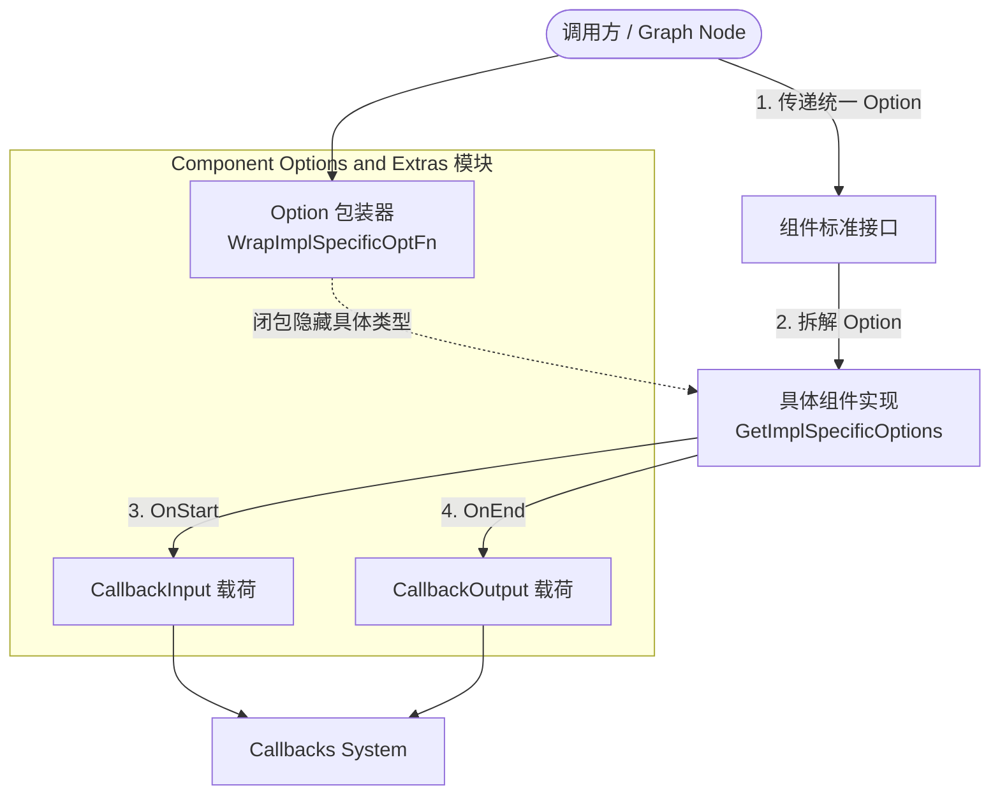

在构建复杂的 AI 编排系统时，我们面临一个核心的架构矛盾：**接口的标准化与实现的多样性之间的冲突**。

想象一下：`ChatModel` 组件的接口非常纯粹——接收消息，返回消息。但实际使用 OpenAI、Anthropic 或自研模型时，你需要传递各自独有的参数（如 `temperature`、`top_p`、特有的 `response_format` 或特定的工具调用策略）。如果我们把这些参数都塞进标准接口里，接口将变得无穷无尽且充满冗余；如果不放进去，系统在运行时（尤其是在基于图执行的 [Compose Graph Engine](Compose%20Graph%20Engine.md) 中）又该如何动态地向具体实现传递配置？

**Component Options and Extras** 模块就是为了解决这个矛盾而存在的。它充当了系统中的“控制面板”与“遥测系统”：
1. **Options (控制面板)**：使用闭包和类型擦除的技巧，允许标准组件接口在不破坏约定的前提下，接收任何具体实现所需要的配置。
2. **Callbacks Extras (遥测系统)**：定义了各组件类型在执行过程中，向上游 Callbacks 系统汇报的标准数据载荷（如输入、输出、Token 用量等）。
3. **Utilities (适配扩展)**：提供了一系列将普通的 Go 函数、结构体转换为标准组件（如 `Tool`、`Parser`）的反射桥接工具。

## 架构概览与运行模型

在 Eino 框架中，组件执行的生命周期可以简化为：参数打包 -> 触发回调 -> 实际执行 -> 处理结果 -> 触发回调。本模块深深地嵌入到这个生命周期的每一环。

### 数据流视角下的设计
以 `ChatModel` 为例，理解数据流向：
1. **构建阶段**：开发者调用类似 `openai.WithTemperature(0.7)`。这个函数内部会调用本模块的 `WrapImplSpecificOptFn`，将一个修改 OpenAI 特定结构体的闭包函数包装成泛型的 `model.Option`。
2. **执行阶段**：调用方执行 `chatModel.Generate(ctx, messages, option)`。
3. **拆解阶段**：OpenAI 组件内部调用 `model.GetImplSpecificOptions`，传入默认配置结构体。内部的闭包被执行，将 `0.7` 赋值给默认配置。
4. **遥测阶段**：在组件实际调用远端 API 前后，会将请求参数、响应结果、Token 消耗等信息打包成本模块定义的 `CallbackInput` 和 `CallbackOutput`，发送给 [Callbacks System](Callbacks%20System.md)。

## 核心设计决策与权衡 (Tradeoffs)

### 1. Functional Options + 类型擦除
**决策**：为什么 `Option` 结构体内部包含一个 `implSpecificOptFn any`，而不是使用接口或泛型？
**分析**：在 Go 语言中，如果将 `Option` 设计为泛型 `Option[T]`，那么组件接口也会被泛型污染，例如 `Generate[T any](... opts ...Option[T])`。这在编排图结构（Graph）中是灾难性的，因为图在编译时需要统一管理异构的组件。
**权衡**：我们牺牲了一点点运行时的类型安全（使用了 `any` 和类型断言），换来了极大的架构灵活性。标准接口只认识黑盒的 `Option`，只有具体的实现才知道如何打开这个黑盒。这实现了完美的解耦。

### 2. 标准 Callback 载荷
**决策**：所有组件类型的 Callback 载荷都被硬编码为特定的结构体（如 `model.CallbackOutput`）。
**分析**：如果在 Callback 中传递原生接口数据，外部的拦截器（如日志、计费系统）就需要理解各个组件的具体输出。通过定义标准的 `TokenUsage`、`CompletionTokensDetails`，框架强制所有模型厂商的实现都向这个标准对齐。这使得上游的 Token 计费统计代码只需写一次，就能兼容所有模型。

### 3. 反射推断 Tool (Utilities)
**决策**：提供 `InferTool` 等方法，通过反射 Go 结构体标签（JSON tag）自动生成 JSON Schema 和 `ToolInfo`。
**分析**：在 LLM 的 Tool Calling 中，向模型描述工具的 Schema 往往需要手写冗长的 JSON。这极易与实际的 Go 函数签名脱节。通过反射，以 Go 代码为 SSOT（Single Source of Truth），虽然在初始化时增加了反射开销（一次性），但极大提升了开发体验并避免了正确性问题。

## 子模块导航

为了详细解析各类配置与载荷结构，本模块按功能边界划分为以下几个子模块：

- **[Model Options & Callbacks](model_options_and_callbacks.md)**
   负责 ChatModel 组件的通用配置（如 Temperature、MaxTokens）、实现特有配置的处理，以及核心的 Token 消耗统计载荷。

- **[Tool Options & Utilities](tool_options_and_utilities.md)**
   涵盖工具调用的回调载荷，以及极为关键的 `InferTool` 等基于反射的工具生成脚手架，极大简化了将 Go 函数暴露给 LLM 的过程。

- **[Embedding Options & Callbacks](embedding_options_and_callbacks.md)**
   专为文本向量化组件设计的配置与回调数据结构定义。

- **[Retriever & Indexer Options & Callbacks](retriever_indexer_options_and_callbacks.md)**
   涵盖检索器与索引器的选项（如 TopK、ScoreThreshold）和查询/文档操作的回调载荷。

- **[Prompt Options & Callbacks](prompt_options_and_callbacks.md)**
   提供提示词模板的配置及运行时替换前后的输入输出截获，并包含核心实现 `DefaultChatTemplate`。

- **[Document Options & Callbacks](document_options_and_callbacks.md)**
   包含文档加载器、转换器、解析器的配置选项。其中详细介绍了 `TextParser` 与基于文件后缀智能路由的 `ExtParser` 的设计与使用。

## 给新成员的防坑指南 (Gotchas)

1. **Option 覆盖顺序**：在传递 `Option` 切片时，数组后面的 Option 会覆盖前面的。在编排图中，节点配置的 Option 优先级通常低于单次 Call 传递的 Option，这点在调试参数未生效时需要特别注意。
2. **`any` 断言失败**：编写自定义组件时，务必使用对应的 `GetImplSpecificOptions` 方法并传入正确类型的指针。如果传入的指针类型与 `Wrap` 时的类型不一致，内部的类型断言会静默失败（跳过该 Option），不会 panic，但这会导致配置不生效。
3. **反射 Tool 的 Schema 限制**：使用 `InferTool` 推断 JSON Schema 时，依赖于 `eino-contrib/jsonschema`。某些过于复杂的嵌套 Go 接口可能无法完美映射到 JSON Schema，此时建议使用 `WithSchemaModifier` 手动调整，或直接手写 `ToolInfo`。
