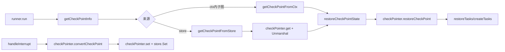

# Compose Checkpoint

`Compose Checkpoint` 模块本质上是 Compose 运行时的“断点快照层”：当图执行因为 `interrupt`、外部取消、或子图中断而暂停时，它负责把**可恢复的最小运行现场**（channels、待执行输入、图状态、子图快照、interrupt 状态映射）持久化下来，并在下一次运行时精确恢复。没有它，恢复只能靠“重跑整图”或“节点自己存状态”这两种粗糙方案：前者代价高且可能重复副作用，后者分散且容易漏状态。这个模块的设计价值就在于把恢复语义收敛到引擎层，统一处理流式与非流式场景。

## 这个模块解决的核心问题

图执行不是单线程脚本，而是一个带 channel、分支、子图、stream 的运行系统。中断后要恢复，真正困难的不是“存一份 state”，而是要回答：

- 哪些节点已经完成，哪些节点下一步要继续？
- channel 内部已经累积了什么数据和依赖关系？
- 当前是否处于 stream 运行，stream 值如何序列化？
- 子图是否也在某个内部节点中断，恢复时如何只把对应子图 checkpoint 往下传一次？
- interrupt 的 ID、地址、局部 state 如何在恢复上下文中重建？

`checkpoint`/`checkPointer` 的存在就是为了解决这些问题，并把它们封装成稳定契约，供 [Compose Graph Engine](compose_graph_engine.md) 的 `runner` 使用。

## 心智模型：它像“航班黑匣子 + 转码网关”

可以把模块拆成两个心智角色：

第一层是**黑匣子**（`checkpoint` 结构体）：记录“此刻图引擎的可恢复现场”，包括 `Channels`、`Inputs`、`State`、`RerunNodes`、`SubGraphs` 以及 `InterruptID2Addr`/`InterruptID2State`。

第二层是**转码网关**（`checkPointer` + `streamConverter`）：

- 写入前：把运行态里不可直接持久化的 stream 值转成可序列化值（`convertCheckPoint`）
- 读取后：把持久化值恢复成运行态 stream reader（`restoreCheckPoint`）
- 最终交给 `CheckPointStore` 的 `Get/Set`

所以它不是简单 KV 存储封装，而是“语义快照 + 数据形态转换 + 持久化协议”的组合。

## 架构与数据流



在运行入口 `runner.run` 中，先通过 `getCheckPointInfo(opts...)` 解析 `WithCheckPointID`、`WithWriteToCheckPointID`、`WithStateModifier`、`WithForceNewRun`。如果是子图恢复，优先从上下文中的 `checkPointKey` 读取（`getCheckPointFromCtx`）；否则从 `CheckPointStore` 读取（`getCheckPointFromStore` -> `checkPointer.get`）。

恢复路径上，`restoreCheckPointState` 会先调用 `checkPointer.restoreCheckPoint` 把 checkpoint 内的输入/输出值从“可持久化形态”还原为运行态形态，再把 `cp.Channels` 注入 `channelManager`，并将 `cp.State`、interrupt persistence map 重新挂回 context（`setCheckPointToCtx` 会通过 `core.PopulateInterruptState` 注入 `InterruptID2Addr` 与 `InterruptID2State`）。之后 `restoreTasks` 根据 `cp.Inputs`、`cp.RerunNodes`、`cp.SkipPreHandler` 重新构造任务。

中断路径上，`runner.handleInterrupt`/`handleInterruptWithSubGraphAndRerunNodes` 组装 `checkpoint`，然后 `checkPointer.convertCheckPoint` 把 stream 值拍平，再 `checkPointer.set` 落盘。若当前是子图，不直接写 store，而是封装进 `subGraphInterruptError` 往上层冒泡，由父图统一保存。

## 组件深潜

### `checkpoint`（struct）

`checkpoint` 是恢复单元，不是业务状态对象。它刻意包含运行时结构：

- `Channels map[string]channel`：通道内部状态快照，决定依赖是否满足、值是否可读。
- `Inputs map[string]any`：下一批要执行节点的输入。
- `State any`：图级状态（来自 `stateKey` 中的 `internalState.state`）。
- `SkipPreHandler map[string]bool`：某些节点恢复时跳过 pre-handler（子图中断场景）。
- `RerunNodes []string`：需要重跑的节点。
- `SubGraphs map[string]*checkpoint`：子图嵌套 checkpoint。
- `InterruptID2Addr` / `InterruptID2State`：interrupt 可恢复映射。

设计要点是“运行拓扑状态 + 节点调度状态 + interrupt 状态”一起保存，避免恢复只靠单一 state 造成调度错位。

### `checkPointer`（struct）

`checkPointer` 聚合三个能力：

- `store CheckPointStore`：持久化后端（`Get/Set`）
- `serializer Serializer`：序列化协议（默认 `serialization.InternalSerializer`）
- `sc *streamConverter`：流式值转码器

`newCheckPointer` 在 `serializer == nil` 时自动回退到内置 serializer，这个选择偏“默认可用性优先”，减少使用门槛。

#### `(*checkPointer).get`

先 `store.Get`，不存在就返回 `(nil, existed=false, nil)`，存在则 `Unmarshal` 到 `checkpoint`。这里把“不存在”与“读取失败”分离，供上层决定是初始化新运行还是报错。

#### `(*checkPointer).set`

先 `Marshal(cp)` 再 `store.Set`，职责非常单一，不做重试和幂等管理，意味着这些由具体 `CheckPointStore` 实现负责。

#### `convertCheckPoint` / `restoreCheckPoint`

这对方法是模块最关键的技术点：遍历 `cp.Channels` 调用 `channel.convertValues(...)`，再处理 `cp.Inputs`。也就是说，checkpoint 中可能存在两类“需要转码”的位置：通道内部缓存值与待执行输入值。

### `streamConverter`（struct）与 `convert`/`restore`

`streamConverter` 只是壳，核心逻辑在两个通用函数：

- `convert(values, convPairs, isStream)`：仅在 `isStream=true` 时执行；要求每个 key 都有 `streamConvertPair` 注册，且值必须是 `streamReader`，然后调用 `concatStream`。
- `restore(values, convPairs, isStream)`：同样要求 key 可映射，调用 `restoreStream` 还原。

这是一种“显式注册、强约束失败”的策略：若节点 key 未注册或类型不匹配，立即报错（如 `node[%s] have not been registered` / `value ... isn't stream`），牺牲了一些容错性，换来恢复正确性。

### `Serializer`（interface）

```go
type Serializer interface {
    Marshal(v any) ([]byte, error)
    Unmarshal(data []byte, v any) error
}
```

这是 checkpoint 的主要扩展点之一。默认实现是 `serialization.InternalSerializer`，但可用 `WithSerializer` 替换。

### 上下文键：`checkPointKey` / `stateModifierKey`

两个私有 key 用于避免 context key 冲突：

- `checkPointKey`：在父子图间传递当前子图 checkpoint
- `stateModifierKey`：传递 `StateModifier`

`forwardCheckPoint` 的行为值得注意：它会把 `cp.SubGraphs[nodeKey]` 取出并 `delete`，保证子图 checkpoint 只转发一次，防止重复恢复。

### 选项函数（公开 API）

- 编译期：`WithCheckPointStore`、`WithSerializer`
- 运行期：`WithCheckPointID`、`WithWriteToCheckPointID`、`WithForceNewRun`、`WithStateModifier`
- 兼容接口：`RegisterSerializableType`（已 Deprecated，推荐 `schema.RegisterName[T](name)`）

`WithWriteToCheckPointID` 的语义很实用：允许“从旧 checkpoint 读取，但写入新 checkpoint”，适合分叉恢复实验和审计保留。

## 依赖关系与契约分析

从调用方向看，这个模块在架构上是 [Compose Graph Engine](compose_graph_engine.md) 运行时的下层能力：

- **谁调用它**：`runner.run`、`runner.restoreCheckPointState`、`runner.handleInterrupt`、`runner.handleInterruptWithSubGraphAndRerunNodes`、`runner.createTasks`、`runner.restoreTasks`。
- **它调用谁**：
  - `CheckPointStore.Get/Set`（来自 [Internal Core](internal_core.md) 的 `core.CheckPointStore` 别名）
  - `Serializer.Marshal/Unmarshal`
  - `core.PopulateInterruptState`、`core.SignalToPersistenceMaps`
  - `channel.convertValues`
  - `streamConvertPair.concatStream/restoreStream`

关键数据契约有三条：

第一，`CheckPointStore` 只负责字节存取，不理解语义。语义完整性由 `checkpoint` 结构和 serializer 保证。

第二，stream 相关值必须通过 `streamConvertPair` 显式注册（`graph.compile` 时从每个 `chanCall.action` 收集 `inputStreamConvertPair`/`outputStreamConvertPair`）。如果图节点类型扩展后没提供这对转换器，checkpoint 在流式模式会失败。

第三，自定义类型若出现在 checkpoint（包括 `State`、`Inputs`、channel 值）中，必须可被 serializer 识别。`init()` 里已注册了内置运行时类型（如 `_eino_checkpoint`、`_eino_dag_channel` 等），用户自定义类型需要自行注册（优先 `schema.RegisterName[T]`）。

## 关键设计决策与权衡

这个模块最明显的选择是“正确恢复优先于宽松容错”。比如 `convert/restore` 对未注册 key 直接失败，而不是忽略；这会让误配置尽早暴露，但也意味着线上运行对类型注册完整性高度敏感。

另一个权衡是把 `State` 设计为 `any`。优点是通用性强，图状态无需统一基类；代价是编译期无法校验序列化可行性，错误被推迟到运行时 `Marshal/Unmarshal`。

在扩展性上，它采用组合式注入：`WithCheckPointStore` + `WithSerializer`。这比固定后端更灵活，但也把一致性（事务性、并发覆盖、TTL、版本迁移）责任转交给调用方基础设施。

对子图处理上，`SubGraphs map[string]*checkpoint` + `forwardCheckPoint` 的“一次性转发”策略，简化了父子图恢复边界；但它对 node key 与子图结构稳定性有隐式依赖，图结构变更后复用旧 checkpoint 可能不兼容。

## 使用方式与示例

最小接入通常是编译时挂 store，运行时提供 checkpoint ID：

```go
store := newInMemoryStore()
r, err := g.Compile(ctx,
    compose.WithCheckPointStore(store),
    compose.WithInterruptAfterNodes([]string{"nodeA"}),
)

_, err = r.Invoke(ctx, input,
    compose.WithCheckPointID("cp-001"),
)
```

恢复时如果希望覆盖状态，可配合 `ResumeWithData` 与 `WithStateModifier`：

```go
rCtx := compose.ResumeWithData(ctx, interruptID, myState)
result, err := r.Invoke(rCtx, input,
    compose.WithCheckPointID("cp-001"),
    compose.WithStateModifier(func(ctx context.Context, path compose.NodePath, state any) error {
        // 按 path 定向修正 state
        return nil
    }),
)
```

如果你要“读取旧快照，写入新快照”，使用：

```go
_, err = r.Invoke(ctx, input,
    compose.WithCheckPointID("cp-old"),
    compose.WithWriteToCheckPointID("cp-new"),
)
```

若明确要忽略历史 checkpoint，强制从头跑：

```go
_, err = r.Invoke(ctx, input,
    compose.WithCheckPointID("cp-001"),
    compose.WithForceNewRun(),
)
```

## 新贡献者最该注意的坑

第一，**流式运行与 checkpoint 强耦合**。`isStream=true` 时，`convert/restore` 会严格检查 key 注册与值类型。如果新增节点/组件但没正确提供 `streamConvertPair`，中断恢复会在运行时失败。

第二，**checkpoint 结构依赖图拓扑稳定**。`restoreTasks` 按 `cp.Inputs` 和 `r.chanSubscribeTo` 匹配节点，若 checkpoint 中出现当前图不存在的 key，会报 `channel[...] from checkpoint is not registered`。不要指望跨大版本图结构直接复用旧 checkpoint。

第三，**store 冲突策略由你自己负责**。同一个 `checkPointID` 并发写入时，这个模块没有锁或 CAS 机制，最后写入者覆盖是常见后果。

第四，**自定义类型注册不可省略**。尤其是 `State any` 或 `map[string]any` 中塞了自定义 struct 时，未注册会在序列化阶段出错。

第五，`WithForceNewRun` 只影响“是否从 checkpoint 初始化”，不等于禁用中断保存；如果运行中再次触发 interrupt，仍会按当前写入策略保存新 checkpoint。

## 与其他模块的关系（参考）

- 运行时主流程与任务调度细节： [Compose Graph Engine](compose_graph_engine.md)
- interrupt 语义与错误模型： [Compose Interrupt](compose_interrupt.md)
- 中断状态底层接口： [Internal Core](internal_core.md)
- 序列化基础设施： [Internal Utilities](internal_utilities.md)

---

如果你要修改这个模块，建议优先维护三条不变量：

1. checkpoint 必须能完整重建“下一步任务 + channel + interrupt state”；
2. stream 与非 stream 两种运行形态必须对称可逆；
3. 子图 checkpoint 的转发必须是单次且路径准确。

这三条不变量基本就是 Compose 恢复能力的正确性底座。