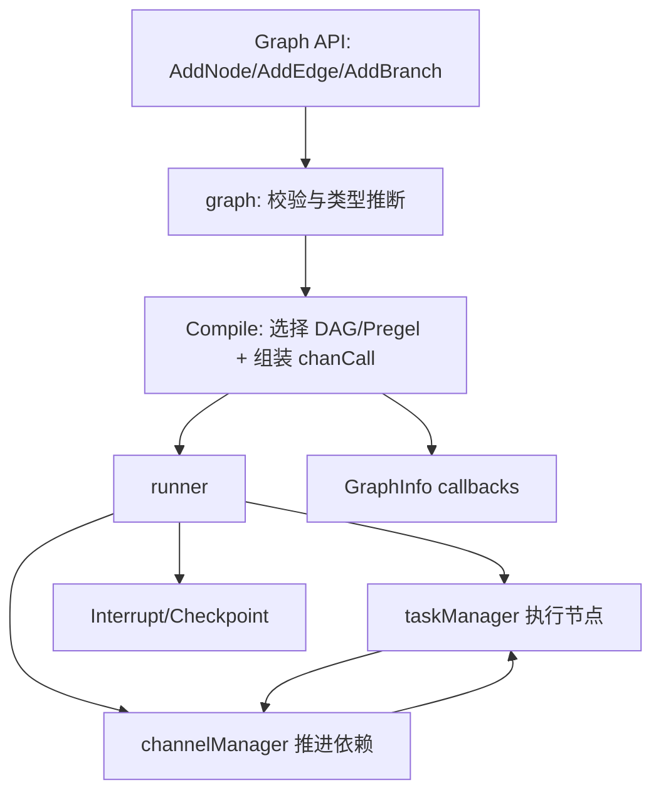

# Compose Graph Engine

`Compose Graph Engine` 是 Eino 里把“组件能力”变成“可调度工作流”的核心编排引擎。你可以把它想成一个**可类型检查、可中断恢复、可流式执行的任务路由器**：上层只声明节点和连线，它负责决定谁先跑、数据怎么传、分支怎么选、失败/中断后怎么继续跑。

很多团队第一次写 agent/workflow 时会直接手工 `if/else + goroutine + channel`。短期能跑，长期会遇到四类系统性问题：类型不安全、分支传播错误、循环失控、恢复困难。这个模块存在的意义，就是把这些“隐性复杂度”集中收敛在一套统一的图编译与运行时模型中。

---

## 1. 它解决的核心问题（先讲问题，再讲方案）

### 问题 A：节点能连起来，不代表能安全运行
- 上游输出类型和下游输入类型可能只“看起来像”，实际运行才 panic。
- 分支节点可能把数据发给多个候选下游，fan-in 合并规则不一致会导致语义漂移。
- passthrough 节点在复杂链路里容易让类型推断失效。

**本模块的选择：** 在 `graph.addEdgeWithMappings` / `updateToValidateMap` 阶段做增量校验与补偿，能编译期失败就不拖到运行期。

### 问题 B：图执行语义不是单一模式
有的任务是 DAG（必须等所有前驱完成），有的更像 Pregel（任一前驱到达即可推进，允许环）。一个执行模型很难覆盖所有编排场景。

**本模块的选择：**
- `runTypeDAG` + `dagChannel`：偏“严格依赖正确性”；
- `runTypePregel` + `pregelChannel`：偏“迭代/循环表达力”。

### 问题 C：中断恢复在真实业务是刚需
长链路 agent 执行中断（人工审批、外部取消、超时）后，如果只能“整图重跑”，代价极高。

**本模块的选择：** 运行时内建 checkpoint + interrupt 协议（`runner.handleInterrupt*`），把“暂停后可恢复”做成一等能力。

---

## 2. 心智模型：把它当成“交通控制塔 + 数据换乘站”

想象一个机场：
- **graph** 是航班计划系统（航线、起降规则、备降分流）；
- **runner** 是塔台调度（每一轮谁起飞、谁等待、谁改道）；
- **channel** 是登机口缓存区（等依赖齐了再放行）；
- **handler manager** 是安检/转换站（边上做类型转换、节点前后做加工）；
- **checkpoint/interrupt** 是临时封场后的恢复机制。

这个类比非常贴近代码结构：构图阶段定义拓扑与约束，编译阶段冻结执行计划，运行阶段由 `taskManager + channelManager` 推动“完成任务 -> 产生新任务”的闭环。

---

## 3. 架构总览

### 架构叙事（数据/控制流）
1. **声明图**：通过 `Add*Node` 注入组件、lambda、子图或 passthrough；通过 `AddEdge`/`AddBranch` 建立数据与控制关系。
2. **编译图**（`graph.compile`）：
   - 选择运行模式（Pregel 或 DAG）；
   - 构建每个节点的 `chanCall`；
   - 计算 `controlPredecessors` / `dataPredecessors`；
   - 挂载边/节点/分支 handler；
   - DAG 下执行环检测 `validateDAG`。
3. **执行图**（`runner.run`）：
   - 初始化 channel/task 管理器；
   - 从 START 或 checkpoint 恢复任务；
   - 主循环：提交任务 -> 等待完成 -> 分支计算 -> 依赖推进 -> 生成下一批任务。
4. **终止或中断**：命中 END 返回结果；命中 interrupt 条件则持久化 checkpoint 并抛中断信息。

---

## 4. 关键设计决策与权衡

### 决策 1：图在 compile 后冻结（`ErrGraphCompiled`）
- **收益**：避免运行期结构被改写导致竞态；执行语义稳定。
- **代价**：牺牲“边跑边改图”的灵活性。
- **为什么合理**：该模块定位是执行引擎，不是在线拓扑编辑器。

### 决策 2：同时维护 control edge 与 data edge
- **收益**：把“执行顺序约束”和“数据传递约束”解耦，能表达 noData/noControl 场景。
- **代价**：维护复杂度上升（前驱集合、skip 传播都要两套考虑）。
- **为什么合理**：agent/workflow 常见“只等信号不拿数据”与“拿数据但不阻塞”两类需求，单一 edge 语义不足。

### 决策 3：类型不确定时插入 runtime check，而不是一刀切拒绝
- `checkAssignable` 结果为 `assignableTypeMay` 时，注册 `handlerOnEdges` 做运行时校验/转换。
- **收益**：兼容 interface 等动态类型场景，提升可组合性。
- **代价**：部分错误推迟到运行期。
- **为什么合理**：Go 的 interface + 泛型边界下，完全静态决定并不现实。

### 决策 4：DAG 与 Pregel 双通道实现
- DAG：强依赖、强顺序，`validateDAG` 防环。
- Pregel：更适合循环与增量推进，配合 `maxRunSteps` 防失控。
- **取舍本质**：正确性/可预测性 vs 表达力/迭代能力。

### 决策 5：中断恢复优先保证一致性
- 中断时会固化 channels、inputs、state、subgraph checkpoint。
- **收益**：恢复后语义可追溯，避免“恢复后输入错位”。
- **代价**：实现与存储复杂度上升，流输入还要 copy/persist。

---

## 5. 子模块导读（建议阅读顺序）

1. [图的构建与编译](graph_construction_and_compilation.md)  
   讲清 `graph` 如何建模、校验、编译，以及 `GraphInfo` introspection 回调如何暴露编译结果。

2. [节点抽象与配置](node_abstraction_and_options.md)  
   解释 `graphNode/executorMeta/nodeInfo` 与 `GraphAddNodeOpt`，尤其 `WithInputKey/WithOutputKey`、state pre/post handler 的契约。

3. [运行时执行引擎](runtime_execution_engine.md)  
   重点是 `runner` 主循环、中断恢复、checkpoint 协作。

4. [通道与任务管理](channel_and_task_management.md)  
   讲 `taskManager` 与 `channelManager` 如何协同，以及 `dagChannel/pregelChannel` 的行为差异。

5. [分支与字段映射](branching_and_field_mapping.md)  
   讲 `GraphBranch` 的单/多路分支语义，和 `FieldMapping` 的编译期+运行期双阶段校验。

6. [可执行对象与类型系统](runnable_and_type_system.md)  
   讲 `Runnable` 四种数据流（Invoke/Stream/Collect/Transform）的兼容封装与类型转换机制。

7. [状态与调用控制](state_and_call_control.md)  
   讲局部状态链（父子图可见性）与外部中断控制（`WithGraphInterrupt`）。

---

## 6. 跨模块依赖与耦合关系

Compose Graph Engine 不是孤立模块，它像一个“编排底盘”，向下依赖基础类型与中断基础设施，向上被 workflow/agent 复用。

- 与 [Schema Stream](Schema Stream.md)：
  - `streamReader` 封装基于 `schema.StreamReader`；
  - 流 merge、copy、convert 都借助 schema 层能力。

- 与 [Component Interfaces](Component Interfaces.md)：
  - `AddEmbeddingNode/AddChatModelNode/...` 直接接入组件接口类型；
  - `executorMeta` 通过组件类型信息做元数据标注。

- 与 [Compose Checkpoint](Compose Checkpoint.md)：
  - `graph.compile` 注入 `checkPointer`；
  - `runner` 在 interrupt/restore 路径读写 checkpoint。

- 与 [Compose Interrupt](Compose Interrupt.md) + Internal Core：
  - 中断信号使用 `core.InterruptSignal` 协议；
  - 子图中断通过 `subGraphInterruptError` 冒泡到父图。

- 与 [Compose Tool Node](Compose Tool Node.md)：
  - `AddToolsNode` 把工具调用节点纳入统一调度框架，享受同一套分支、中断、状态、回调治理。

- 与 [Callbacks System](Callbacks System.md)：
  - compile/run 都会注入 callback 生命周期钩子；
  - `executorMeta.isComponentCallbackEnabled` 影响 callback 触发策略。

> 隐含契约：上游组件若改变输入/输出类型或 option 类型，Graph Engine 的类型推断与 option 分发会直接受影响；这属于“强类型耦合”，但正是它保证了编排时的可验证性。

---

## 7. 新贡献者要重点警惕的坑

1. **START/END 是保留节点**：手动 `addNode("start")` 或 `addNode("end")` 会失败。  
2. **编译后不可修改**：`compiled=true` 后再加节点/边会直接 `ErrGraphCompiled`。  
3. **toValidateMap 未清空不能编译**：通常是 passthrough 链类型仍无法推断。  
4. **DAG 模式禁止 maxRunSteps**：该限制在 compile 与 run 都有防线。  
5. **field mapping 目标字段不能重复**：同一节点输入不能被多个映射写同一 `to`。  
6. **WithInputKey/WithOutputKey 会把节点 IO 类型改成 `map[string]any` 语义**：别再按原始 I/O 直觉写边。  
7. **中断语义有两套**：`WithGraphInterrupt`（外部）会自动持久化输入；内部 `Interrupt` 不自动做这一层。  
8. **流式分支要注意消费行为**：`GraphBranch.collect` 可能消费流内容，分支条件写法需避免破坏下游预期。

---

## 8. 一句话总结

`Compose Graph Engine` 的核心价值，不是“把节点连起来”，而是把**可组合性、可验证性、可恢复性**同时塞进一个统一执行模型：你写的是业务拓扑，它兜底的是工程级运行语义。