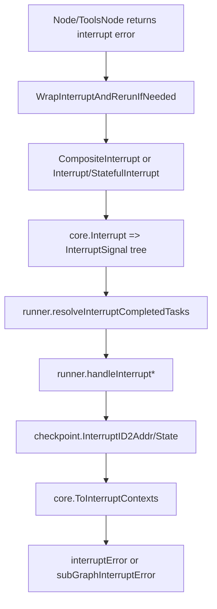

# Compose Interrupt

`Compose Interrupt` 模块是 Compose 运行时里的“可恢复暂停协议层”。你可以把它理解成一个交通指挥员：节点在执行中一旦需要“先停下来，稍后继续”，它不会把这件事当普通错误抛给上层，而是构造一种带地址、可定位、可恢复的中断信号，让图引擎知道该在哪里打断、保存什么、之后如何精确续跑。这个模块存在的意义，不是“抛错”，而是把“暂停/恢复”从零散业务逻辑提升为统一执行语义。

## 这个模块解决的核心问题

在图执行里，`error` 语义太粗。普通错误只表达“失败”，却无法表达三个对恢复至关重要的问题：第一，**是谁**中断（精确地址）；第二，**是否可恢复**（可否 rerun）；第三，**恢复所需上下文**（用户可见 info + 内部 state + 子中断树）。

如果采用朴素方案（比如某个节点直接返回 `errors.New("interrupt")`），引擎无法知道中断点的层级位置，也没法把多子任务中断合并成一个可恢复面，更无法兼容历史中断错误格式。这会导致恢复策略分散在每个组件里，最终形成“谁都能中断，但没人能稳定恢复”的系统。

`Compose Interrupt` 的设计洞察在于：**中断不是异常，而是控制流**。因此它提供了一组专门 API（`Interrupt`、`StatefulInterrupt`、`CompositeInterrupt`、`WrapInterruptAndRerunIfNeeded`），把中断标准化成 `core.InterruptSignal` 树，再由运行时落盘和恢复。

## 心智模型：把它当作“分层地址化的暂停令”

可以把整个机制想象成“多层建筑里的火警系统”。

每个房间（node/tool/runnable）都有自己的门牌号（`Address` + `AddressSegment`）。当某个房间触发中断，它发出的不是“我坏了”，而是“我在这个门牌号需要暂停，并附带原因与状态”。如果是一层管理多个房间的复合单元（典型是 `ToolsNode`），它会把多个子房间的暂停令打包成一个总告警（`CompositeInterrupt`），并保留每个子房间的门牌号。最终控制中心（Graph Runner）据此生成可恢复 checkpoint。

这个模型里最关键的抽象是：

- `InterruptSignal`（内部核心）是实际可恢复信号载体，包含 `ID`、`Address`、`InterruptInfo`、`InterruptState`、`Subs`。
- `AddressSegmentType` 规定了地址层次：`AddressSegmentNode`、`AddressSegmentTool`、`AddressSegmentRunnable`。
- `InterruptInfo`（compose 层）是对外聚合视图，包含 `BeforeNodes`、`AfterNodes`、`RerunNodes`、`SubGraphs`、`InterruptContexts` 等。

## 架构与数据流



从调用链看，数据流分两条主路径。

第一条是**节点侧构造中断**。普通组件直接调用 `Interrupt(ctx, info)` 或 `StatefulInterrupt(ctx, info, state)`；复合组件（如 `ToolsNode`）会先收集子任务错误，并对 legacy 错误调用 `WrapInterruptAndRerunIfNeeded` 补齐地址，再用 `CompositeInterrupt(ctx, info, state, errs...)` 聚合。

第二条是**运行时消费中断**。`compose.graph_run.runner` 在 `resolveInterruptCompletedTasks` 里识别 `*core.InterruptSignal` 与子图中断，填充 `interruptTempInfo`，随后进入 `handleInterrupt` 或 `handleInterruptWithSubGraphAndRerunNodes`。这一步会调用 `core.Interrupt` 生成总信号，写入 checkpoint 的 `InterruptID2Addr` / `InterruptID2State`，再通过 `core.ToInterruptContexts` 产出面向调用方的 `InterruptContexts`，最后返回 `interruptError` / `subGraphInterruptError`。

换句话说，`compose/interrupt.go` 负责“**定义中断协议与兼容桥接**”，`graph_run.go` 负责“**执行时落地协议**”。

## 组件深潜

### `WithInterruptBeforeNodes(nodes []string) GraphCompileOption`

这个函数不是在节点内触发中断，而是在编译期告诉运行时：当即将调度到这些 node key 时先暂停。它把 `nodes` 写入 `graphCompileOptions.interruptBeforeNodes`，后续在 `runner.run` 里通过 `getHitKey(nextTasks, r.interruptBeforeNodes)` 命中。

设计动机是给编排层一个“外部断点”能力：你无需修改节点代码即可在特定执行点安全停机。

### `WithInterruptAfterNodes(nodes []string) GraphCompileOption`

语义与 before 对偶：节点执行完成后触发暂停。运行时在 `resolveInterruptCompletedTasks` 中扫描 `r.interruptAfterNodes`。

两者的权衡是：编排级中断简单、集中，但粒度仅到 node key；业务级中断（`Interrupt`）粒度更细、可携带状态，但需要节点代码配合。

### `Interrupt(ctx context.Context, info any) error`

标准单点中断 API。内部调用 `core.Interrupt(ctx, info, nil, nil)`，返回 `*core.InterruptSignal`（以 `error` 形式上抛）。

它的关键价值是自动绑定当前地址（`core.GetCurrentAddress` 在 core 中读取）。这意味着调用者不需要手动维护“我在图的哪里”，减少地址错配风险。

### `StatefulInterrupt(ctx context.Context, info any, state any) error`

和 `Interrupt` 的差别是可持久化 `state`。恢复时可通过 `GetInterruptState[T](ctx)` 读取（定义在 `compose/resume.go`）。

这是一种“局部恢复状态”机制，适合节点内部中断后继续执行剩余逻辑（例如 tool 批处理只重跑失败项）。代价是 `state` 为 `any`，类型安全依赖调用方约束。

### `CompositeInterrupt(ctx, info, state, errs...) error`

这是模块最核心的“复合聚合器”。它面向管理多子流程的节点，把多个子错误归一化为一个可恢复中断。

它能接收四类输入：

1. `wrappedInterruptAndRerun`（经 `WrapInterruptAndRerunIfNeeded` 包装的 legacy/无地址错误）
2. 原生 `*core.InterruptSignal`
3. 包含 `InterruptInfo` 的 `*interruptError`（通过 `core.FromInterruptContexts` 回建信号）
4. 空 `errs`（退化为 `StatefulInterrupt`）

若出现非中断类错误，直接返回 `fmt.Errorf("composite interrupt but one of the sub error is not interrupt and rerun error: %w", err)`，拒绝“半中断半失败”的模糊语义。

这个选择偏正确性：宁可失败，也不默默吞掉不可恢复错误。

### `WrapInterruptAndRerunIfNeeded(ctx, step, err) error`

这是兼容层的关键。它解决的问题是：历史错误 `deprecatedInterruptAndRerun` 本身没有完整地址；而复合节点（尤其并发工具调用）必须给每个子中断一个唯一定位。

函数做了三件事：

- 若 `errors.Is(err, deprecatedInterruptAndRerun)`，包装成 `wrappedInterruptAndRerun{ps: currentAddr+step}`。
- 若 `errors.As(err, *core.InterruptSignal)` 且 `Address == nil`，同样补地址包装。
- 若已是带地址 `InterruptSignal`，直接返回。

非中断错误会返回 `failed to wrap error as addressed InterruptAndRerun`。这防止调用方误把普通错误塞进复合中断流程。

### `IsInterruptRerunError(err) (any, bool)` / `isInterruptRerunError`

这是轻量识别器，判断一个错误是否是“可 rerun 的中断错误”。对于 legacy 错误返回 `(nil, true)`；对于 `*core.InterruptSignal` 返回其 `Info`/`State`。

`ToolsNode.Invoke/Stream` 使用它来区分：是要进入 `CompositeInterrupt` 聚合，还是立即当普通错误失败。

### `InterruptInfo`（compose 层）

该结构并不是底层中断信号本体，而是面向上层应用/调试聚合的描述对象，字段包括：

- `State`
- `BeforeNodes` / `AfterNodes`
- `RerunNodes` / `RerunNodesExtra`
- `SubGraphs`
- `InterruptContexts`

并在 `init()` 中通过 `schema.RegisterName[*InterruptInfo]("_eino_compose_interrupt_info")` 注册序列化名，保证可跨层传递。

### `ExtractInterruptInfo(err) (*InterruptInfo, bool)`

从 `*interruptError` 或 `*subGraphInterruptError` 提取聚合信息。用于调用方在不依赖具体 error 类型实现细节的情况下读取中断元数据。

### `wrappedInterruptAndRerun`（内部适配类型）

这个结构只在兼容路径出现，保存 `ps Address` 与 `inner error`，并提供 `Unwrap()`。它不是公开协议的一部分，而是桥接 legacy 错误到地址化新协议的过渡层。

## 依赖与耦合分析

`Compose Interrupt` 对下依赖明显且精简：

- `internal/core`：`core.Interrupt`、`core.InterruptSignal`、`core.FromInterruptContexts`、地址与中断上下文相关类型。
- `schema`：仅用于 `InterruptInfo` 类型注册。

对上被多个热路径调用：

- `compose.tool_node.ToolsNode.Invoke` 与 `ToolsNode.Stream`：在并发工具调用场景中，是 `WrapInterruptAndRerunIfNeeded` 与 `CompositeInterrupt` 的高频调用点。
- `compose.graph_run.runner`：通过类型断言识别中断错误，最终生成 checkpoint 与 `InterruptContexts`。
- 业务节点代码：直接调用 `Interrupt`/`StatefulInterrupt`。

隐式契约有两个非常关键：

第一，**地址契约**。所有可恢复中断都应带可定位地址；如果地址缺失，复合节点必须在聚合前补齐（`WrapInterruptAndRerunIfNeeded`）。

第二，**错误分类契约**。传入 `CompositeInterrupt` 的 `errs` 必须是中断语义错误；普通错误不能混入，否则组合中断语义被破坏。

## 设计决策与权衡

最突出的决策是“**错误通道承载控制流**”。优点是与 Go 风格一致、无需额外返回类型；代价是调用方必须严格遵循 `errors.As/Is` 语义，否则容易把中断当普通错误处理。

第二个决策是“**兼容优先但向新协议收敛**”。模块仍保留 `InterruptAndRerun` / `NewInterruptAndRerunErr`（deprecated），并提供 `WrapInterruptAndRerunIfNeeded` 作为迁移桥。这减少了升级摩擦，但也让调用链短期内必须处理新旧两套中断表示。

第三个决策是“**复合中断显式聚合**”而不是引擎自动猜测。`CompositeInterrupt` 由复合组件主动调用，优点是语义清晰、可附带组件级 `info/state`；代价是复合组件作者承担更多中断整形责任。

## 使用方式与示例

典型单节点中断：

```go
func MyNode(ctx context.Context, in string) (string, error) {
    if needPause(in) {
        return "", compose.Interrupt(ctx, "waiting for approval")
    }
    return "ok", nil
}
```

需要恢复内部状态时：

```go
type MyState struct {
    Cursor int
}

func MyNode(ctx context.Context, in []string) (string, error) {
    wasInterrupted, hasState, st := compose.GetInterruptState[*MyState](ctx)
    _ = wasInterrupted
    if hasState {
        // resume from st.Cursor
    }

    // ...
    return "", compose.StatefulInterrupt(ctx, "partial done", &MyState{Cursor: 3})
}
```

复合节点（如多工具调用）聚合中断时，必须先包装 legacy/无地址错误：

```go
iErr := compose.WrapInterruptAndRerunIfNeeded(
    ctx,
    compose.AddressSegment{ID: toolCallID, Type: compose.AddressSegmentTool},
    err,
)
return compose.CompositeInterrupt(ctx, rerunExtra, rerunState, iErr)
```

编排级断点中断（无需改节点代码）：

```go
r, err := g.Compile(ctx,
    compose.WithInterruptBeforeNodes([]string{"node_a"}),
    compose.WithInterruptAfterNodes([]string{"node_b"}),
)
```

## 边界条件与新贡献者注意事项

最容易踩坑的是把普通错误传给 `CompositeInterrupt`。该函数会直接报错并终止流程，这不是 bug，而是防止错误语义污染中断语义。若你在复合组件里同时处理业务失败和中断，请先分流。

第二个坑是 legacy 错误在复合场景必须补地址。`ToolsNode` 的做法是用 `AddressSegment{Type: AddressSegmentTool, ID: callID}` 追加地址；如果你自定义复合组件，忘记这一步会导致无法精确定位 resume target。

第三个坑是 `Interrupt(ctx, info)` 的 `info` 不等于持久化状态。要跨恢复保留内部进度，必须使用 `StatefulInterrupt` 的 `state`。

第四个坑是 `InterruptInfo` 与 `InterruptSignal` 的角色不同。前者是聚合展示层，后者是执行协议层。不要把 `ExtractInterruptInfo` 当作恢复所需的唯一数据来源；真正恢复绑定依赖 checkpoint 中的 `InterruptID2Addr/InterruptID2State`。

## 参考模块

- [Compose Graph Engine](compose_graph_engine.md)：运行时如何识别/处理中断并生成 checkpoint。
- [Compose Checkpoint](compose_checkpoint.md)：中断信号如何落盘与恢复。
- [Compose Tool Node](compose_tool_node.md)：`CompositeInterrupt` 在并发 tool call 中的典型用法。
- [ADK Interrupt](adk_interrupt.md)：Agent 层如何消费 `InterruptContexts` 与恢复信息。
