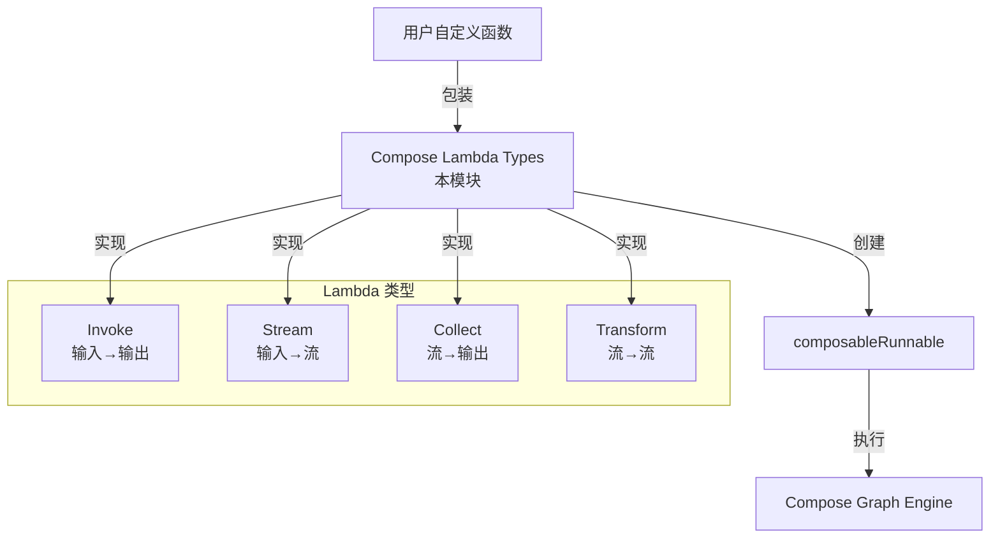

# Compose Lambda Types 模块技术深度解析

## 1. 模块概览

Compose Lambda Types 模块是整个 Compose Graph Engine 生态系统中的"桥梁构建者"。它提供了一种优雅的方式，让开发者可以将任意自定义函数包装成可在 Graph、Chain（包括 Parallel 和 Branch）中使用的标准节点。这解决了一个核心问题：如何让用户定义的任意逻辑与框架提供的组件（如 ChatModel、Tool、Retriever 等）无缝协作，同时保持类型安全和接口一致性。

简单来说，如果你有一个函数想塞进工作流图里，这个模块就是你的"适配器工厂"。

## 2. 核心问题与设计洞见

### 问题空间

在构建复杂的 AI 应用工作流时，开发者面临一个矛盾：
- 框架提供了标准化的组件接口（如 [Component Interfaces](Component Interfaces.md) 中定义的各种接口），确保了组件间的互操作性
- 但实际业务逻辑往往是高度定制化的，开发者需要插入各种"胶水代码"来连接这些组件

一个 naive 的解决方案是要求所有自定义逻辑都实现框架的完整接口，但这会带来巨大的样板代码负担，而且对于简单的转换函数来说过度设计。

### 设计洞见

Compose Lambda Types 模块的核心洞察是：**大多数自定义逻辑可以归约为四种基本的函数签名模式**。通过定义这四种标准模式，框架可以：
1. 用统一的方式包装任意函数
2. 保持类型安全（通过 Go 的泛型）
3. 提供一致的选项和回调机制
4. 与图引擎的执行模型无缝集成

## 3. 核心类型与心智模型

### 四种基本函数类型

模块定义了四种核心的 lambda 函数类型，对应数据处理的四种基本模式：

```go
// 1. Invoke: 输入 → 输出（单次转换，类似函数调用）
type Invoke[I, O, TOption any] func(ctx context.Context, input I, opts ...TOption) (output O, err error)

// 2. Stream: 输入 → 流输出（产生流式数据）
type Stream[I, O, TOption any] func(ctx context.Context, input I, opts ...TOption) (output *schema.StreamReader[O], err error)

// 3. Collect: 流输入 → 输出（消费流并聚合结果）
type Collect[I, O, TOption any] func(ctx context.Context, input *schema.StreamReader[I], opts ...TOption) (output O, err error)

// 4. Transform: 流输入 → 流输出（流式转换，类似管道）
type Transform[I, O, TOption any] func(ctx context.Context, input *schema.StreamReader[I], opts ...TOption) (output *schema.StreamReader[O], err error)
```

**类比理解**：你可以把这四种类型想象成水管系统的不同组件：
- **Invoke** 是一个水过滤器，拿一杯水进去，出来一杯净化水
- **Stream** 是一个水龙头，按一下开关，水流源源不断出来
- **Collect** 是一个蓄水池，收集所有流进来的水，最后给你一个总量
- **Transform** 是一个管道过滤器，水流过的时候不断被处理

### Lambda 结构体

`Lambda` 是这个模块的门面，它包装了用户的函数并使其成为图中的标准节点：

```go
type Lambda struct {
    executor *composableRunnable
}
```

`Lambda` 本身很简单，它的复杂性隐藏在内部的 `composableRunnable` 中（来自 [Compose Graph Engine](Compose Graph Engine.md) 模块）。

### 选项配置

模块提供了两个关键选项来定制 Lambda 的行为：

```go
type lambdaOpts struct {
    enableComponentCallback bool  // 是否启用组件回调
    componentImplType string      // 组件实现类型标识
}
```

这些选项通过 `LambdaOpt` 函数式选项模式设置，提供了灵活性而不破坏 API 稳定性。

## 4. 数据流程与架构角色

### 在图引擎中的位置

Lambda 模块在整个架构中扮演着"适配器层"的角色：



```
┌─────────────────┐
│  用户自定义函数 │
└────────┬────────┘
         │
         ▼
┌─────────────────────────────────┐
│  Compose Lambda Types           │  ← 本模块
│  - 类型适配                      │
│  - 选项包装                      │
│  - 回调集成                      │
└────────┬────────────────────────┘
         │
         ▼
┌─────────────────────────────────┐
│  Compose Graph Engine           │
│  - composableRunnable           │
│  - 图执行                        │
└─────────────────────────────────┘
```

### 创建 Lambda 的流程

让我们以 `InvokableLambda` 为例，追踪数据流程：

1. **用户调用**：`lambda := compose.InvokableLambda(myFunc)`
2. **函数包装**：`myFunc`（类型 `InvokeWOOpt`）被包装成接受 `unreachableOption` 的 `Invoke` 类型函数
3. **内部转换**：调用 `anyLambda`，它进一步调用 `runnableLambda`（来自 [Compose Graph Engine](Compose Graph Engine.md)）创建 `composableRunnable`
4. **元数据设置**：配置 `executorMeta`，包括回调启用状态和组件类型
5. **返回包装**：最终返回 `*Lambda`，可以添加到图或链中

### 运行时执行

当包含 Lambda 的图运行时：
1. 图引擎调用 `Lambda.executor` 的相应方法（`Invoke`/`Stream`/`Collect`/`Transform`）
2. `composableRunnable` 处理回调逻辑（如果启用）
3. 最终调用用户最初提供的函数
4. 结果沿原路返回

## 5. 核心组件深入解析

### 5.1 unreachableOption 的巧妙设计

```go
type unreachableOption struct{}
```

这个看似奇怪的空结构体是一个精妙的设计。它用于处理"无选项"和"有选项"函数之间的类型转换：

- 对于不接受选项的函数（如 `InvokeWOOpt`），模块将其包装成接受 `...unreachableOption` 的函数
- `unreachableOption` 没有任何导出字段，外部代码无法创建其实例
- 这确保了这些包装后的函数只能被框架内部调用，而不会被用户错误地传入选项

**设计意图**：这是一种类型安全的哨兵模式，既统一了内部接口，又防止了 API 误用。

### 5.2 工厂函数家族

模块提供了一系列工厂函数，每种函数类型都有两个变体：
- 带选项版本（如 `InvokableLambdaWithOption`）
- 无选项版本（如 `InvokableLambda`）

这种设计体现了**渐进式复杂性**原则：简单场景用简单 API，复杂场景用灵活 API。

### 5.3 实用工具 Lambda

模块还提供了两个预构建的实用 Lambda，展示了该模式的强大：

#### ToList

```go
func ToList[I any](opts ...LambdaOpt) *Lambda
```

将单个输入转换为单元素切片。这在需要适配期望切片输入的组件时非常有用。

**实现细节**：它同时实现了 `Invoke`（单次转换）和 `Transform`（流式转换），确保在不同执行模式下都能正确工作。

#### MessageParser

```go
func MessageParser[T any](p schema.MessageParser[T], opts ...LambdaOpt) *Lambda
```

将 [Schema Core Types](Schema Core Types.md) 中的 `MessageParser` 包装成 Lambda，常用于在 ChatModel 后解析输出。

**设计亮点**：它自动设置 `componentImplType` 为 "MessageParse"，便于监控和调试。

## 6. 设计决策与权衡

### 6.1 函数式选项 vs 结构体选项

**选择**：使用函数式选项模式（`LambdaOpt`）而不是配置结构体。

**原因**：
- 向前兼容性：添加新选项不会破坏现有代码
- 灵活性：可以选择性地设置任意组合的选项
- 可读性：`WithLambdaCallbackEnable(true)` 比 `LambdaOpts{CallbackEnable: true}` 更清晰

**权衡**：稍微增加了实现的复杂性，但换来的 API 灵活性是值得的。

### 6.2 泛型的边界

**选择**：在公共 API 中大量使用泛型，但内部实现保持非泛型。

**原因**：
- 类型安全：用户代码获得编译时类型检查
- 实现简洁：内部 `composableRunnable` 使用 `any` 类型，避免了代码爆炸
- 封装性：类型复杂性被限制在模块边界内

**权衡**：内部代码需要更多的类型断言，但这是一个可接受的工程权衡。

### 6.3 回调控制权

**选择**：提供 `enableComponentCallback` 选项，让用户决定回调是由框架处理还是自己处理。

**原因**：
- 灵活性：高级用户可能希望完全控制回调逻辑
- 简单性：普通用户可以让框架处理所有回调
- 渐进式采用：用户可以先使用框架回调，需要时再接管

**权衡**：增加了概念复杂度，但对于需要精细控制的场景是必要的。

## 7. 依赖关系分析

### 7.1 上游依赖

- **[Schema Core Types](Schema Core Types.md)**：依赖 `schema.StreamReader` 和 `schema.MessageParser`
- **[Compose Graph Engine](Compose Graph Engine.md)**：深度依赖 `composableRunnable`、`runnableLambda`、`executorMeta` 等内部组件

### 7.2 下游依赖

这个模块被几乎所有构建工作流的代码使用，包括：
- **[Compose Workflow](Compose Workflow.md)**：Chain、Parallel、Branch 都可以添加 Lambda
- **[ADK ChatModel Agent](ADK ChatModel Agent.md)**：可能在内部使用 Lambda 进行数据转换
- 各种应用代码：任何需要将自定义逻辑插入工作流的地方

### 7.3 关键契约

模块与依赖方之间的关键契约：
1. Lambda 必须能被转换为 `composableRunnable`
2. 四种函数类型的签名必须与图引擎的期望匹配
3. `StreamReader` 的实现必须正确处理流式数据的生命周期

## 8. 使用指南与最佳实践

### 8.1 基本用法

创建一个简单的 Invoke Lambda：

```go
lambda := compose.InvokableLambda(func(ctx context.Context, input string) (output string, err error) {
    return "processed: " + input, nil
})
```

### 8.2 带选项的 Lambda

```go
type MyOptions struct {
    UpperCase bool
}

lambda := compose.InvokableLambdaWithOption(
    func(ctx context.Context, input string, opts ...MyOptions) (output string, err error) {
        result := "processed: " + input
        if len(opts) > 0 && opts[0].UpperCase {
            result = strings.ToUpper(result)
        }
        return result, nil
    },
    compose.WithLambdaType("MyProcessor"),
)
```

### 8.3 在 Chain 中使用

```go
chain := compose.NewChain[string, string]()
chain.AppendLambda(lambda)
chain.AppendChatModel(chatModel)
```

### 8.4 最佳实践

1. **优先使用无选项版本**：除非你确实需要选项，否则使用更简单的 API
2. **设置有意义的类型名称**：使用 `WithLambdaType` 为监控和调试提供上下文
3. **小心处理流式 Lambda**：确保正确处理 `StreamReader` 的关闭和错误
4. **保持 Lambda 简洁**：Lambda 应该是小的、专注的函数，复杂逻辑应委托给其他组件

## 9. 陷阱与注意事项

### 9.1 类型不匹配错误

当 Lambda 的输入输出类型与图中相邻节点不匹配时，Go 编译器会给出复杂的错误信息。

**解决方法**：使用显式类型参数，如 `compose.InvokableLambda[string, int](...)` 而不是让编译器推断。

### 9.2 忘记处理 context

Lambda 函数接收 `context.Context` 参数，但很容易忽略它。

**后果**：超时、取消信号无法正确传播，可能导致资源泄漏。

**最佳实践**：始终在长时间运行的操作中检查 `ctx.Done()`。

### 9.3 StreamReader 生命周期管理

在实现 `Stream` 或 `Transform` Lambda 时，很容易忘记正确关闭 `StreamReader`。

**后果**：资源泄漏，特别是在错误路径上。

**最佳实践**：使用 `defer` 确保在所有路径上都关闭流。

### 9.4 选项切片可能为空

在带选项的 Lambda 中，`opts ...TOption` 切片可能是空的，不要假设 `opts[0]` 存在。

## 10. 总结与亮点回顾

Compose Lambda Types 模块是一个优雅的适配器层设计，它展示了如何通过精心设计的类型系统和工厂函数，将复杂性封装在模块内部，同时为用户提供简单、类型安全的 API。

**核心亮点**：
1. **四种基本模式**：洞察到大多数数据处理可以归约为四种模式
2. **渐进式 API**：简单场景简单用，复杂场景灵活用
3. **类型安全**：通过泛型保证编译时类型检查
4. **无缝集成**：与图引擎的执行模型完美配合
5. **实用工具**：提供 `ToList` 和 `MessageParser` 等常用工具

这个模块虽然小巧，但它是连接用户自定义逻辑和框架组件的关键桥梁，体现了"简单的事情保持简单，复杂的事情成为可能"的设计哲学。
