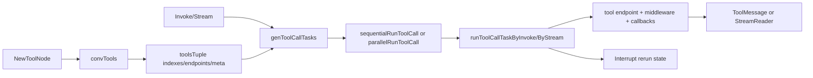

# Compose Tool Node

`Compose Tool Node` 可以把一条 Assistant message 里的多个 `ToolCalls`，安全、可观测、可恢复地执行完，并按原顺序产出 `ToolMessage`。如果把 agent 执行想成一次“外包调度”，LLM 负责“下派工单”，而 `ToolsNode` 就是“工单执行中心”：它要处理并发、流式/非流式差异、多模态结果、回调埋点、未知工具兜底，以及中断后的断点续跑。一个朴素的 for-loop 调工具很快会在这些维度上失控，这个模块存在的意义就是把这些复杂性收敛成统一节点语义。

## 为什么需要它：问题空间先行

在真实 agent 里，tool calling 不是“调用一个函数然后返回字符串”这么简单。首先，模型可能一次返回多个 `ToolCalls`，而且调用顺序和返回顺序需要稳定映射；其次，不同工具实现能力不同：有的只支持 `InvokableRun`，有的只支持 `StreamableRun`，还有增强版多模态 `ToolResult`；再者，线上需要 callback 链路、context 地址、panic 防护和可重试中断。如果每个上层编排节点都自己拼这些逻辑，就会重复实现、行为不一致、并且很难保证“中断后不会重复执行已完成工具”。

`ToolsNode` 的核心设计洞察是：**把“工具能力差异”和“执行策略差异”都提前标准化为 endpoint task，再统一调度**。这就是 `convTools -> genToolCallTasks -> run -> collect` 这条主线。

## 心智模型：一个“多制式插座 + 调度器”

可以把 `ToolsNode` 想成一个支持多制式的电源排插：

- 不同工具接口（invokable/streamable/enhanced）是不同国家插头；
- `convTools` 是适配器层，把它们转成统一 endpoint；
- middleware 像串联的稳压器/审计器；
- `Invoke` / `Stream` 是两种供电模式；
- interrupt-rerun 状态是断电恢复机制，保证恢复后只补跑失败工单。

这个模型下，调用方不需要关心每个工具“原生支持什么”，只关心：给我一条含 `ToolCalls` 的 `*schema.Message`，返回对应工具结果。

## 架构与数据流



初始化阶段，`NewToolNode` 会拆分 `ToolMiddleware` 到四类中间件列表，然后调用 `convTools` 把 `[]tool.BaseTool` 编译为 `toolsTuple`。`toolsTuple` 是运行期热路径缓存：按工具名索引到 endpoint、meta、能力形态。

执行阶段（`Invoke` 或 `Stream`），先读取可选中断状态 `GetInterruptState[*toolsInterruptAndRerunState]`，再由 `genToolCallTasks` 把每个 `ToolCall` 变成 `toolCallTask`。随后按配置选择串行或并行 runner。每个 task 在 `runToolCallTaskByInvoke` 或 `runToolCallTaskByStream` 内完成上下文注入（callbacks run info、tool call id、address segment）并真正调用 endpoint。最后聚合输出：正常时返回 tool messages；若出现 `InterruptRerunError`，则构建 `ToolsInterruptAndRerunExtra` 和内部 rerun state，走 `CompositeInterrupt`。

## 组件深潜

### `ToolsNodeConfig` 与 `NewToolNode`

`ToolsNodeConfig` 定义了这个节点的策略面：`Tools`、`UnknownToolsHandler`、`ExecuteSequentially`、`ToolArgumentsHandler`、`ToolCallMiddlewares`。`NewToolNode` 不做重业务逻辑，它做三件事：

1. 将 `ToolCallMiddlewares` 扁平化成四条中间件链（标准/流式/增强标准/增强流式）。
2. 调 `convTools` 做一次能力探测与 endpoint 预编译。
3. 固化配置到 `ToolsNode` 实例，供 `Invoke`/`Stream` 热路径直接读取。

这里的设计取舍是典型“初始化多做一点，运行期少判断”。

### `convTools`：能力归一化的核心

`convTools` 是模块最关键的“编译步骤”。它对每个 `tool.BaseTool`：

- 先调 `Info(ctx)` 拿 `toolName`；
- 再做 type assertion 探测四种能力接口；
- 用 `wrap*ToolCall` 叠加 callback 与 middleware；
- 若缺少某个对应模式，则自动适配（如 `streamableToInvokable` / `invokableToStreamable`，增强版同理）；
- 写入 `toolsTuple`。

这解决了一个非常现实的问题：上层希望统一调用，但工具作者不一定都实现完整双接口。自动桥接策略提升了接入宽容度。

但这里也有 tradeoff：桥接意味着语义降级/升格。比如 `streamableToInvokable` 需要 `concatStreamReader` 把流一次性拼接，可能带来内存峰值；`invokableToStreamable` 只是把单次结果包装成单元素 stream，不具备真正增量输出。

### `wrapToolCall` / `wrapStreamToolCall` / `wrapEnhanced*`

这些 `wrap` 函数体现了统一装配模式：

- 先按“逆序”包 middleware（后注册先执行，形成洋葱模型）；
- 再按 `needCallback` 决定是否包 `*WithCallback` 适配器；
- 最后落到真实 `InvokableRun` / `StreamableRun`。

`needCallback` 来自 `parseExecutorInfoFromComponent` 的 `meta.isComponentCallbackEnabled`。也就是说，若工具本身已启用组件级 callback，就避免重复包裹，减少重复事件。

### `toolCallTask` 与 `genToolCallTasks`

`toolCallTask` 是一次工具调用的“执行单元”，把输入字段、endpoint、meta、输出缓存、错误状态集中在一个 struct。`genToolCallTasks` 做任务生成与恢复拼接：

- 校验输入必须是 `schema.Assistant` 且 `ToolCalls` 非空；
- 若该 callID 已在 `executedTools` 或 `executedEnhancedTools` 中，标记 `executed=true` 并直接回填结果；
- 否则从 `tuple.indexes` 找 endpoint；找不到则走 `UnknownToolsHandler`（若未配置则报错）；
- 对新任务应用 `ToolArgumentsHandler` 预处理参数。

这段逻辑的关键价值是 **callID 级幂等恢复**：rerun 时不重做已完成调用。

### `runToolCallTaskByInvoke` / `runToolCallTaskByStream`

这两个函数是单任务执行器。它们在真正调用前做三层上下文增强：

- `callbacks.ReuseHandlers`：复用当前 callback handlers 并附上 `RunInfo`；
- `setToolCallInfo`：把 callID 放进 context，供下游 `GetToolCallID` 读取；
- `appendToolAddressSegment`：给 interrupt 地址链追加 tool segment。

之后根据 `task.useEnhanced` 走增强或标准 endpoint，写回 task 输出或错误。

### `sequentialRunToolCall` vs `parallelRunToolCall`

`parallelRunToolCall` 的实现有一个非显眼但很务实的选择：主 goroutine 处理 `tasks[0]`，其余任务起 goroutine。这避免了“全部都起 goroutine”的额外调度成本，也让至少一个任务在当前栈直接执行。

并行分支对 goroutine 内 panic 做 `recover`，并转成 `safe.NewPanicErr` 挂到任务错误字段，避免整个进程被击穿。

### `Invoke` 与 `Stream`

二者流程相同，主要差异在输出形态与中断时的结果持久化策略：

- `Invoke`：直接收集字符串或 `*schema.ToolResult`，成功后构造 `schema.ToolMessage`（增强结果通过 `ToMessageInputParts` 写到 `UserInputMultiContent`）。
- `Stream`：保留每个工具的 stream reader，然后用 `schema.StreamReaderWithConvert` 转成“按索引位置写入的 `[]*schema.Message` 流”，最后 `schema.MergeStreamReaders` 合并。

在 `Stream` 的中断场景里，已执行工具的流会先 `concatStreamReader` 落成最终值再写入 rerun 状态，这是一种“恢复优先于流式纯度”的选择。

### `ToolsInterruptAndRerunExtra` 与 `toolsInterruptAndRerunState`

`ToolsInterruptAndRerunExtra` 是暴露给 interrupt 体系的外部信息，包含：原始 `ToolCalls`、已执行结果、待重跑 callID、每个待重跑工具的额外信息。`toolsInterruptAndRerunState` 是内部恢复状态，包含输入 message 与已完成结果映射。

`init()` 里通过 `schema.RegisterName` 注册这两类结构，意味着它们会进入可序列化命名体系，便于 checkpoint/interrupt 反序列化恢复。

### `GetToolCallID`

`GetToolCallID` 是一个小而关键的隐式契约：只有在 `ToolsNode` 执行上下文内（`setToolCallInfo` 已设置）才有值。下游 middleware 或工具实现可以用它做日志关联、幂等键生成。

## 依赖分析：它连向哪里、被谁依赖

从源码可确认的下游依赖（`ToolsNode` 调用它们）包括：

- `components/tool`：能力接口与 `tool.Option`；
- `schema`：`Message`、`ToolCall`、`ToolResult`、stream utilities（`StreamReaderFromArray`、`StreamReaderWithConvert`、`MergeStreamReaders`）；
- `callbacks`：`ReuseHandlers` + `RunInfo` 传播；
- interrupt 相关函数（同 package 内）：`GetInterruptState`、`IsInterruptRerunError`、`WrapInterruptAndRerunIfNeeded`、`CompositeInterrupt`、`appendToolAddressSegment`；
- `internal/safe`：panic 包装。

从模块边界可推断的上游调用方：`ToolsNode` 作为 Compose 层节点能力，通常被图执行路径集成（见 [Compose Graph Engine](compose_graph_engine.md)），也常被 agent 工作流层封装使用。**注意：当前提供的信息没有精确函数级反向调用图**，因此这里不对具体调用函数名做断言。

数据契约方面，最重要的三条是：

1. 输入 `*schema.Message` 必须 `Role == schema.Assistant` 且含 `ToolCalls`；
2. 输出数组顺序严格对应输入 `ToolCalls` 顺序（无论串行并行）；
3. rerun 以 `toolCall.ID` 为幂等键，调用方必须保证 callID 稳定。

## 关键设计取舍与背后理由

这个模块在多处选择了“统一行为优先”：

- 通过 endpoint 适配统一能力面，而不是要求所有工具实现全部接口；
- 通过 task struct 统一执行状态，而不是在多处散落局部变量；
- 通过 callID 映射保存恢复状态，而不是简单失败即全量重跑。

代价是一定的中间层复杂度，尤其在流式桥接和中断合并逻辑里代码路径较多。但对于 agent/tool 编排场景，这个代价换来的是更强的可运维性与一致性。

## 使用方式与示例

```go
conf := &compose.ToolsNodeConfig{
    Tools: []tool.BaseTool{myToolA, myToolB},
    ExecuteSequentially: false,
    UnknownToolsHandler: func(ctx context.Context, name, input string) (string, error) {
        return "tool not found: " + name, nil
    },
    ToolArgumentsHandler: func(ctx context.Context, name, arguments string) (string, error) {
        // 可做参数审计/修正
        return arguments, nil
    },
}
node, err := compose.NewToolNode(ctx, conf)
```

```go
out, err := node.Invoke(ctx, assistantMsg,
    compose.WithToolOption(toolOpt1),
    compose.WithToolList(runtimeToolList...), // 可覆盖默认工具集
)
```

```go
sr, err := node.Stream(ctx, assistantMsg)
if err != nil { /* handle */ }
defer sr.Close()
for {
    chunk, err := sr.Recv()
    if err != nil { break }
    // chunk 是 []*schema.Message，只有对应索引位置有值
    _ = chunk
}
```

```go
mw := compose.ToolMiddleware{
    Invokable: func(next compose.InvokableToolEndpoint) compose.InvokableToolEndpoint {
        return func(ctx context.Context, in *compose.ToolInput) (*compose.ToolOutput, error) {
            // before
            out, err := next(ctx, in)
            // after
            return out, err
        }
    },
}
```

## 新贡献者最容易踩的坑

首先，`Invoke`/`Stream` 对输入 message 有强约束：不是 `Assistant` 或没有 `ToolCalls` 会直接报错，这不是“空结果”语义。其次，并行执行时 task 结构体字段会被并发写入各自元素，当前实现依赖“每个 goroutine 只写自己的 task 指针”这一事实；扩展代码时不要引入跨 task 共享可变状态。

另外，增强与非增强路径是分叉的，`useEnhanced` 一旦判定错误，会导致输出写入位置不匹配。新增能力类型时要同时考虑 `Invoke` 与 `Stream` 两条路径，尤其是中断后状态落盘格式。

还有一个隐式点：`UnknownToolsHandler` 走的是标准字符串输出路径（`newUnknownToolTask` 仅设置 `endpoint/streamEndpoint`），不会产生增强多模态结果；如果你需要未知工具也返回多模态，目前需要额外设计。

最后，`GetToolCallID` 依赖 context 注入，仅在工具调用栈中可靠；不要在节点外层逻辑里假设它总是有值。

## 相关模块参考

- [Compose Graph Engine](compose_graph_engine.md)：`ToolsNode` 作为图节点能力的承载上下文
- [Compose Checkpoint](compose_checkpoint.md)：中断/恢复状态如何持久化
- [Callbacks System](callbacks_system.md)：`ReuseHandlers` 与回调事件链
- [Component Interfaces](component_interfaces.md)：`tool.BaseTool` 及各工具能力接口定义
- [Schema Core Types](schema_core_types.md)：`schema.Message`、`ToolCall`、`ToolResult` 契约
- [Schema Stream](schema_stream.md)：流式 reader/merge/convert 机制
