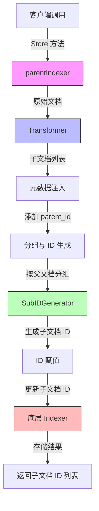

# Flow Indexers 模块技术深度解析

## 1. 问题定位与模块使命

在检索增强生成（RAG）系统中，文档分片是一个常见且关键的操作。当我们将一个大文档切分成多个小片段以便于向量化和检索时，一个关键问题随之而来：**如何在检索到片段后，仍然能够追溯到它来自哪个原始文档？**

想象一下，你有一份 100 页的技术白皮书，你将其切分成 500 个段落级别的片段。当用户的查询命中其中某个片段时，你可能不仅想展示这个片段，还想展示它在原文档中的上下文，或者提供完整文档的链接。如果没有父子文档关系的维护，这些需求将难以实现。

Flow Indexers 模块的核心组件 `parentIndexer` 正是为了解决这个问题而设计的。它的使命是：
- 为子文档分配稳定且可追溯的唯一标识
- 维护子文档与原始父文档之间的关联关系
- 将这些处理后的文档安全地存储到底层索引系统中

## 2. 核心抽象与心智模型

理解 `parentIndexer` 的关键在于建立一个**文档流水线**的心智模型。你可以把它想象成一个文档加工厂：

1. **原料输入**：原始文档（父文档）从一端进入
2. **切割工序**：`Transformer` 将大文档切割成小片段（子文档）
3. **标识工序**：为每个子文档打上"出生证明"——记录它的父文档 ID，并生成自己的唯一 ID
4. **入库工序**：将处理好的子文档通过底层 `Indexer` 存入索引系统

这里的核心抽象是：
- **父文档**：原始的完整文档，拥有自己的 ID
- **子文档**：从父文档切分出来的片段，继承父文档的 ID 作为元数据，同时拥有自己的唯一 ID
- **转换流水线**：由 Transformer、ID 生成器和底层 Indexer 组成的处理链

## 3. 架构设计与数据流向

让我们通过一个 Mermaid 图表来可视化这个架构：



### 数据流向详解

1. **输入阶段**：客户端调用 `parentIndexer.Store()` 方法，传入原始文档列表
2. **转换阶段**：`parentIndexer` 将这些文档传递给配置的 `Transformer`，得到切分后的子文档列表
3. **元数据注入阶段**：遍历每个子文档，将其当前 ID（即父文档 ID）存入元数据的 `ParentIDKey` 字段
4. **分组阶段**：按文档 ID 对子文档进行分组（相同 ID 的子文档来自同一个父文档）
5. **ID 生成阶段**：对每组子文档，调用 `SubIDGenerator` 生成唯一的子文档 ID
6. **ID 赋值阶段**：将生成的 ID 赋值给对应的子文档
7. **存储阶段**：将处理好的子文档传递给底层 `Indexer` 进行存储
8. **返回阶段**：返回底层 Indexer 存储后的子文档 ID 列表

## 4. 核心组件深度解析

### 4.1 Config 结构体

`Config` 是 `parentIndexer` 的配置中心，它定义了所有必要的依赖项和行为参数。

```go
type Config struct {
    Indexer        indexer.Indexer
    Transformer    document.Transformer
    ParentIDKey    string
    SubIDGenerator func(ctx context.Context, parentID string, num int) ([]string, error)
}
```

**设计意图**：
- **依赖注入**：通过配置传入 `Indexer` 和 `Transformer`，使得 `parentIndexer` 可以灵活地适配不同的底层实现
- **行为可配置**：`ParentIDKey` 和 `SubIDGenerator` 允许用户自定义父子关系的存储方式和子 ID 的生成规则
- **关注点分离**：`parentIndexer` 只负责协调流程，不负责具体的索引存储和文档转换逻辑

### 4.2 parentIndexer 结构体

`parentIndexer` 是模块的核心实现，它实现了 `indexer.Indexer` 接口。

```go
type parentIndexer struct {
    indexer        indexer.Indexer
    transformer    document.Transformer
    parentIDKey    string
    subIDGenerator func(ctx context.Context, parentID string, num int) ([]string, error)
}
```

**设计特点**：
- **组合而非继承**：通过持有 `indexer.Indexer` 接口，而不是继承它，实现了更灵活的功能扩展
- **无状态设计**：除了配置项外，不持有任何可变状态，使得实例可以安全地并发使用
- **接口一致性**：完全实现 `indexer.Indexer` 接口，可以无缝替换其他索引器实现

### 4.3 Store 方法

`Store` 是 `parentIndexer` 的核心方法，它包含了整个父子文档处理的完整逻辑。

```go
func (p *parentIndexer) Store(ctx context.Context, docs []*schema.Document, opts ...indexer.Option) ([]string, error) {
    // 1. 转换文档
    subDocs, err := p.transformer.Transform(ctx, docs)
    if err != nil {
        return nil, fmt.Errorf("transform docs fail: %w", err)
    }
    if len(subDocs) == 0 {
        return nil, fmt.Errorf("doc transformer returned no documents")
    }
    
    // 2. 处理元数据和ID生成
    currentID := subDocs[0].ID
    startIdx := 0
    for i, subDoc := range subDocs {
        if subDoc.MetaData == nil {
            subDoc.MetaData = make(map[string]any)
        }
        subDoc.MetaData[p.parentIDKey] = subDoc.ID

        if subDoc.ID == currentID {
            continue
        }

        // 为一组子文档生成ID
        subIDs, err_ := p.subIDGenerator(ctx, subDocs[startIdx].ID, i-startIdx)
        // ... 错误处理和ID赋值 ...
        startIdx = i
        currentID = subDoc.ID
    }
    
    // 3. 处理最后一组子文档
    // ... 类似的ID生成和赋值逻辑 ...
    
    // 4. 存储到下层索引器
    return p.indexer.Store(ctx, subDocs, opts...)
}
```

**关键设计点**：

1. **流式分组处理**：代码使用单次遍历的方式，通过跟踪 `currentID` 和 `startIdx` 来识别来自同一父文档的子文档组，避免了额外的内存开销

2. **原地修改**：直接修改 `subDocs` 切片中的文档对象，而不是创建新的切片，这种设计在处理大量文档时可以显著减少内存分配

3. **错误包装**：使用 `fmt.Errorf("transform docs fail: %w", err)` 的方式包装错误，保留了原始错误信息的同时添加上下文，便于调试

4. **边界条件处理**：特别处理了循环结束后最后一组子文档的 ID 生成，确保没有遗漏

## 5. 依赖关系分析

### 5.1 输入依赖

`parentIndexer` 依赖以下核心组件：

1. **indexer.Indexer**：来自 `components/indexer/interface` 模块
   - 作用：提供底层文档索引存储能力
   - 依赖方式：通过 `Config.Indexer` 注入
   - 关键交互：调用其 `Store` 方法存储处理后的子文档

2. **document.Transformer**：来自 `components/document/interface` 模块
   - 作用：将原始文档转换为子文档列表
   - 依赖方式：通过 `Config.Transformer` 注入
   - 关键交互：调用其 `Transform` 方法切分文档

3. **schema.Document**：来自 `schema/document` 模块
   - 作用：定义文档数据结构
   - 关键字段：`ID`、`MetaData`

### 5.2 被依赖情况

`parentIndexer` 通常会被以下类型的组件使用：

1. **RAG 流水线构建器**：用于构建完整的检索增强生成系统
2. **文档处理工作流**：作为文档索引阶段的一部分
3. **高层索引器封装**：可能有更复杂的索引器会组合使用 `parentIndexer`

### 5.3 隐含契约

使用 `parentIndexer` 时需要注意以下隐含契约：

1. **Transformer 的输出契约**：`Transformer` 输出的子文档必须使用父文档的 ID 作为自己的初始 ID，这是 `parentIndexer` 能够识别父子关系的基础
2. **元数据修改**：`parentIndexer` 会修改子文档的 `MetaData`，添加 `ParentIDKey` 指定的字段
3. **ID 稳定性**：`SubIDGenerator` 应该对于相同的输入参数生成相同的 ID，以确保可重复性
4. **ID 数量一致性**：`SubIDGenerator` 必须生成恰好 `num` 个 ID，否则会导致错误

## 6. 设计决策与权衡

### 6.1 组合 vs 继承

**决策**：使用组合模式，通过持有 `indexer.Indexer` 接口来扩展功能，而不是继承某个基础索引器类

**理由**：
- 更灵活：可以在运行时动态替换底层索引器实现
- 符合开闭原则：对扩展开放，对修改关闭
- 避免继承带来的耦合：不依赖于某个具体基类的实现细节

**权衡**：
- 需要手动转发所有接口方法（当前只需要 `Store`）
- 对于只想简单扩展某个具体索引器的场景，可能显得稍显复杂

### 6.2 原地修改 vs 创建新文档

**决策**：直接修改 `Transformer` 返回的子文档对象，而不是创建新的文档副本

**理由**：
- 性能更好：避免了大量文档对象的内存分配和复制
- 简化逻辑：不需要处理文档深拷贝的复杂性

**权衡**：
- 有副作用：如果 `Transformer` 返回的文档对象在其他地方被引用，可能会导致意外的结果
- 降低了不可变性：违反了函数式编程中偏爱不可变对象的原则

### 6.3 单次遍历分组 vs 先分组再处理

**决策**：使用单次遍历的方式，在遍历过程中动态识别子文档组

**理由**：
- 时间效率：只需要一次遍历，时间复杂度为 O(n)
- 空间效率：不需要额外的 map 或其他数据结构来存储分组

**权衡**：
- 代码复杂度稍高：需要维护 `currentID` 和 `startIdx` 状态
- 隐含假设：依赖于来自同一父文档的子文档在列表中是连续的这一假设

这里有一个重要的隐含依赖：`Transformer` 输出的子文档列表必须是按父文档分组的，即来自同一父文档的子文档在列表中是连续的。如果这个假设不成立，代码将会错误地分组。

### 6.4 错误处理策略

**决策**：在每个可能出错的地方立即返回错误，并使用错误包装添加上下文信息

**理由**：
- 快速失败：避免在出错状态下继续执行，导致更严重的问题
- 可调试性：错误包装保留了完整的错误链，便于定位问题

**权衡**：
- 可能导致较多的错误检查代码：函数中有多处 `if err != nil { return nil, err }` 模式
- 调用者需要处理所有可能的错误类型

## 7. 使用指南与最佳实践

### 7.1 基本使用示例

```go
// 创建底层索引器（例如 Milvus 索引器）
milvusIndexer := createMilvusIndexer()

// 创建文档转换器（例如文本分片器）
textSplitter := createTextSplitter()

// 创建 parentIndexer
indexer, err := parent.NewIndexer(ctx, &parent.Config{
    Indexer:     milvusIndexer,
    Transformer: textSplitter,
    ParentIDKey: "parent_doc_id",
    SubIDGenerator: func(ctx context.Context, parentID string, num int) ([]string, error) {
        ids := make([]string, num)
        for i := 0; i < num; i++ {
            ids[i] = fmt.Sprintf("%s_chunk_%d", parentID, i+1)
        }
        return ids, nil
    },
})
if err != nil {
    // 处理错误
}

// 使用索引器存储文档
docIDs, err := indexer.Store(ctx, documents)
```

### 7.2 SubIDGenerator 的设计建议

设计 `SubIDGenerator` 时，建议考虑以下几点：

1. **可读性**：生成的 ID 应该能够直观地看出父子关系，例如使用 `parentID_chunk_index` 的格式
2. **稳定性**：对于相同的输入，应该总是生成相同的 ID
3. **唯一性**：确保生成的 ID 在整个索引中是唯一的
4. **排序友好**：如果可能，生成的 ID 应该具有自然排序性，便于按原文档顺序检索

示例：
```go
SubIDGenerator: func(ctx context.Context, parentID string, num int) ([]string, error) {
    // 使用固定长度的序号，便于排序
    format := fmt.Sprintf("%s_chunk_%%0%dd", parentID, len(strconv.Itoa(num)))
    ids := make([]string, num)
    for i := 0; i < num; i++ {
        ids[i] = fmt.Sprintf(format, i+1)
    }
    return ids, nil
}
```

### 7.3 性能优化建议

1. **批量处理**：尽量一次性传入多个文档，而不是多次调用 `Store`，这样可以减少底层索引器的批量操作 overhead
2. **ID 生成效率**：`SubIDGenerator` 应该尽量高效，避免在其中进行耗时操作
3. **转换器优化**：确保 `Transformer` 的实现是高效的，这通常是整个处理流程的瓶颈

## 8. 边缘情况与常见陷阱

### 8.1 空文档处理

`parentIndexer` 对空输入有特殊处理：
- 如果 `Transformer` 返回空列表，会返回错误
- 如果原始 `docs` 为空，会传递给 `Transformer`，具体行为取决于 `Transformer` 的实现

### 8.2 子文档顺序依赖

如前所述，`parentIndexer` 假设来自同一父文档的子文档在 `Transformer` 的输出列表中是连续的。如果这个假设不成立，会导致错误的分组和 ID 生成。

**解决方案**：确保你的 `Transformer` 输出满足这个条件，或者在使用 `parentIndexer` 前先对子文档进行排序。

### 8.3 元数据覆盖风险

`parentIndexer` 会无条件地设置子文档元数据中的 `ParentIDKey` 字段。如果子文档已经有这个字段，它会被覆盖。

**解决方案**：
- 使用一个不太可能与现有元数据冲突的键名
- 在自定义的 `Transformer` 中避免使用与 `ParentIDKey` 相同的键

### 8.4 ID 生成数量不匹配

如果 `SubIDGenerator` 返回的 ID 数量与请求的数量不一致，`parentIndexer` 会返回错误。这是一个安全检查，防止部分文档没有被正确分配 ID。

### 8.5 上下文传递

`parentIndexer` 会将传入的 `ctx` 传递给 `Transformer`、`SubIDGenerator` 和底层 `Indexer`。这意味着你可以通过上下文传递超时、取消信号和其他值，但需要注意：
- 上下文的取消会中断整个操作
- 确保所有依赖组件都正确处理上下文

## 9. 扩展与定制点

`parentIndexer` 的设计提供了几个明确的扩展点：

1. **自定义 Transformer**：可以实现自己的 `document.Transformer` 来控制文档的切分逻辑
2. **自定义 SubIDGenerator**：可以提供自己的 ID 生成函数，满足特定的命名需求
3. **自定义 ParentIDKey**：可以选择合适的元数据键名来存储父文档 ID
4. **可替换的底层 Indexer**：可以使用任何实现了 `indexer.Indexer` 接口的组件作为底层存储

如果需要更复杂的功能，例如：
- 支持多级父子关系（孙文档）
- 在存储前对子文档进行额外的处理
- 记录更详细的父子关系元数据

可以考虑基于 `parentIndexer` 的模式创建自己的索引器，或者组合使用多个索引器。

## 10. 总结

Flow Indexers 模块的 `parentIndexer` 是一个专注于解决特定问题的优雅组件：在文档分片场景下维护父子关系。它的设计体现了几个重要的软件工程原则：

1. **单一职责**：只关注父子文档关系的维护，不涉及具体的索引存储逻辑
2. **依赖注入**：通过配置注入所有依赖，提高了灵活性和可测试性
3. **组合优于继承**：使用组合方式扩展功能，而不是继承
4. **错误处理**：完善的错误检查和上下文信息包装

虽然它的代码量不大，但其中包含了许多值得学习的设计决策和实现技巧。理解这些设计思想，不仅能帮助你更好地使用这个组件，也能为你自己的代码设计提供参考。

## 11. 相关模块参考

- [Schema Core Types](Schema Core Types.md)：文档数据结构定义
- [Component Interfaces](Component Interfaces.md)：Indexer 和 Transformer 接口定义
- [Flow Retrievers](Flow Retrievers.md)：与索引器配对使用的检索器模块
