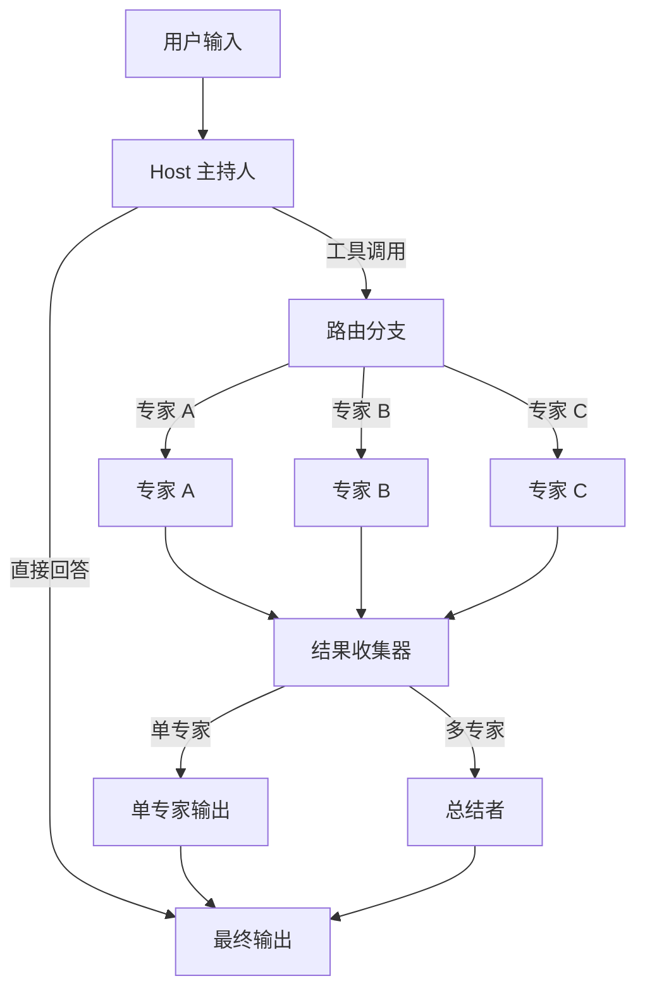
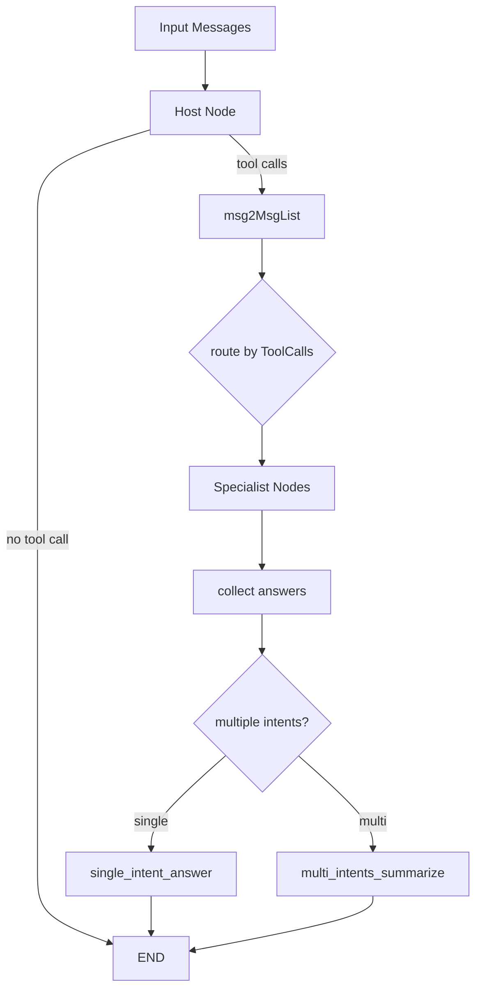

# Flow Multi-Agent Host 模块

## 概述

Flow Multi-Agent Host 模块实现了一个"主持人-专家"模式的多智能体系统。想象一个专家会诊场景：主持人负责分析问题，决定应该由哪位或哪些专家来处理；专家们各自负责自己擅长的领域，完成具体任务后将结果返回给主持人；最后主持人整合所有专家的意见，给出最终答案。

这个模块解决的核心问题是：**如何将复杂任务分解为子任务，并路由给合适的专业智能体处理，最终整合结果**。它提供了一种灵活的方式来组合多个智能体，让每个智能体专注于自己的专长，同时通过一个中心协调者来管理任务流转。

`Flow Multi-Agent Host` 是一个“总控路由器”式多智能体编排模块：它先让 `Host` 决定“该不该转交、转交给谁”，再让一个或多个 `Specialist` 执行，最后在需要时由 `Summarizer` 合并结果。它存在的意义不是“多加几个 agent”这么简单，而是把 **路由决策、并行分发、结果收敛、流式/非流式一致性** 放进一套可复用的图运行时里，避免业务方手写脆弱的 if/else + stream 拼接逻辑。

---

## 1. 这个模块解决什么问题（先讲问题，再讲方案）

单 Agent 在复杂请求里常见两个瓶颈：

1. **能力冲突**：同一个模型既要做规划、又要做检索、又要做代码决策，容易“样样懂一点，样样不稳定”。
2. **流程不透明**：即使模型调用了工具，也很难标准化地观察“它为什么把任务交给了谁”。

`Flow Multi-Agent Host` 的答案是 Host Pattern：

- `Host` 专注“分诊”（像医院导诊台）；
- `Specialist` 专注“执行”；
- `Summarizer` 负责“会诊结论”；
- 这些角色被编译成 `compose.Graph`，由统一运行时执行。

这比“让一个大模型自己决定一切”更可控，也比“把专家顺序硬编码串起来”更灵活。

---

## 2. 心智模型：把它想成“AI 分诊台 + 会诊系统”

可以用这个比喻理解核心抽象：

- **Host (`Host`)**：分诊医生，只做“该找谁”。
- **Specialist (`Specialist`)**：专科医生，真正处理子任务。
- **Summarizer (`Summarizer`)**：会诊秘书，把多位专家答案整合成最终回复。
- **MultiAgent (`MultiAgent`)**：医院调度系统本体（可执行、可流式、可导出子图）。

`AgentMeta{Name, IntendedUse}` 就是专家门牌和科室简介；Host 通过 tool call 的 `Function.Name` 指向具体 Specialist。

---

## 3. 核心概念与架构

### 核心抽象

模块围绕三个核心概念构建：

1. **Host（主持人）**：负责决策的智能体，它接收输入，分析问题，决定调用哪个或哪些专家
2. **Specialist（专家）**：专注于特定任务的智能体，可以是简单的 ChatModel，也可以是复杂的 Agent
3. **Summarizer（总结者）**：当多个专家被调用时，负责整合他们的输出

### 架构图



### 数据流向

1. **输入阶段**：用户输入消息传递给 Host
2. **决策阶段**：Host 分析输入，决定是直接回答还是调用专家
3. **路由阶段**：如果需要调用专家，系统根据 Host 的工具调用选择相应的 Specialist
4. **执行阶段**：选中的 Specialist 执行任务
5. **收集阶段**：所有专家的输出被收集
6. **整合阶段**：如果只有一个专家被调用，直接使用其输出；如果有多个专家，则通过 Summarizer 整合
7. **输出阶段**：最终结果返回给用户

---

## 4. 架构总览



### 文字走查（端到端）

1. `NewMultiAgent` 先调用 `MultiAgentConfig.validate()`，确保至少有 Host 和 Specialists。  
2. 构建 `compose.Graph[[]*schema.Message, *schema.Message]`，并通过局部 `state` 保存原始消息及“是否多意图”。  
3. Host 节点（`addHostAgent`）先读取输入；若配置 `SystemPrompt`，会前置一条 system message。  
4. `addDirectAnswerBranch` 用 `StreamToolCallChecker` 判断 Host 输出：
   - 没有 tool call：直接结束；
   - 有 tool call：进入专家分发路径。  
5. `addMultiSpecialistsBranch` 根据 Host 消息里的 `ToolCalls[*].Function.Name` 扇出到对应 Specialist。  
6. 专家输出汇聚到 `specialistsAnswersCollectorNodeKey`：
   - 单专家：`singleIntentAnswerNodeKey` 直接透传；
   - 多专家：`multiIntentSummarizeNodeKey` 汇总（自定义 `Summarizer` 或默认拼接）。

---

## 5. 核心组件详解

### MultiAgent 结构体

`MultiAgent` 是整个系统的入口点，它封装了一个 `compose.Graph` 来管理整个多智能体协作流程。

```go
type MultiAgent struct {
    runnable         compose.Runnable[[]*schema.Message, *schema.Message]
    graph            *compose.Graph[[]*schema.Message, *schema.Message]
    graphAddNodeOpts []compose.GraphAddNodeOpt
}
```

它提供了两个主要方法：
- `Generate`：同步执行，返回最终消息
- `Stream`：流式执行，返回消息流
- `ExportGraph`：导出底层图，用于将此多智能体系统嵌入到更大的图中

### MultiAgentConfig 配置

`MultiAgentConfig` 是配置多智能体系统的核心结构：

```go
type MultiAgentConfig struct {
    Host        Host
    Specialists []*Specialist
    Name        string
    HostNodeName string
    StreamToolCallChecker func(ctx context.Context, modelOutput *schema.StreamReader[*schema.Message]) (bool, error)
    Summarizer *Summarizer
}
```

关键配置项说明：

1. **Host**：主持人配置，必须提供 `ToolCallingChatModel`（旧版 `ChatModel` 已弃用）
2. **Specialists**：专家列表，每个专家可以是 ChatModel 或可调用/可流式的组件
3. **StreamToolCallChecker**：流式模式下检测工具调用的函数，**对于 Claude 等模型特别重要**
4. **Summarizer**：可选的总结者，当调用多个专家时使用

### Host 主持人

主持人是多智能体系统的"大脑"，负责决策：

```go
type Host struct {
    ToolCallingModel model.ToolCallingChatModel
    ChatModel        model.ChatModel  // 已弃用
    SystemPrompt     string
}
```

主持人的工作原理：
- 将所有专家视为工具
- 根据输入消息决定调用哪个工具（专家）
- 可以直接回答问题，而不调用任何专家

### Specialist 专家

专家是实际执行任务的组件：

```go
type Specialist struct {
    AgentMeta
    ChatModel    model.BaseChatModel
    SystemPrompt string
    Invokable    compose.Invoke[[]*schema.Message, *schema.Message, agent.AgentOption]
    Streamable   compose.Stream[[]*schema.Message, *schema.Message, agent.AgentOption]
}
```

专家的灵活性体现在：
- 可以是简单的 ChatModel
- 可以是复杂的 Agent（如 React Agent）
- 可以支持同步调用、流式调用，或两者都支持

### Summarizer 总结者

当主持人调用多个专家时，总结者负责整合他们的输出：

```go
type Summarizer struct {
    ChatModel    model.BaseChatModel
    SystemPrompt string
}
```

如果不提供总结者，系统会使用默认实现：简单地将所有专家的输出拼接成一个消息。**注意：默认总结者不支持流式模式**。

---

## 6. 工作原理深度解析

### 图构建过程

当调用 `NewMultiAgent` 时，系统会构建一个复杂的执行图：

1. **创建基础图**：初始化带有本地状态的图
2. **添加专家节点**：为每个专家创建节点，并连接到结果收集器
3. **添加主持人节点**：创建主持人节点，作为图的入口
4. **添加分支逻辑**：
   - 直接回答分支：主持人不调用任何专家时使用
   - 多专家分支：根据工具调用选择专家
5. **添加结果处理节点**：
   - 单专家输出节点
   - 多专家总结节点
6. **编译图**：将图编译为可执行的 Runnable

### 状态管理

系统使用一个简单的状态结构来在节点之间传递信息：

```go
type state struct {
    msgs              []*schema.Message
    isMultipleIntents bool
}
```

- `msgs`：存储原始输入消息，供专家节点使用
- `isMultipleIntents`：标记是否调用了多个专家

### 回调系统

模块提供了 `MultiAgentCallback` 接口，用于监听专家切换事件：

```go
type MultiAgentCallback interface {
    OnHandOff(ctx context.Context, info *HandOffInfo) context.Context
}
```

当主持人决定调用某个专家时，会触发 `OnHandOff` 回调，传递目标专家名称和参数。

---

## 4. 关键设计决策与取舍

### 设计决策与权衡

### 1. 基于图的执行模型

**决策**：使用 `compose.Graph` 作为底层执行引擎

**原因**：
- 图模型天然适合表达多智能体之间的依赖关系和控制流
- 可以利用已有的 Compose Graph Engine 的能力，如分支、并行执行等
- 支持将整个 MultiAgent 作为子图嵌入到更大的系统中

**权衡**：
- ✅ 优点：灵活性高，可组合性强
- ❌ 缺点：增加了一定的复杂性，需要理解图执行模型

### 2. 工具调用作为路由机制

**决策**：将专家视为工具，主持人通过工具调用来路由任务

**原因**：
- 工具调用是 LLM 天然支持的能力
- 可以利用模型的推理能力来做决策，无需硬编码路由规则
- 与现有的 ToolCallingChatModel 接口兼容

**权衡**：
- ✅ 优点：决策灵活，可扩展性强
- ❌ 缺点：依赖模型的工具调用能力，可能需要针对不同模型调整

### 3. 流式模式下的工具调用检测

**决策**：提供可自定义的 `StreamToolCallChecker` 接口

**背景**：不同模型在流式模式下输出工具调用的方式不同：
- OpenAI 等模型直接在第一个 chunk 中输出工具调用
- Claude 等模型先输出文本，再输出工具调用

**权衡**：
- ✅ 优点：灵活性高，可以适配各种模型
- ❌ 缺点：增加了配置复杂度，用户需要了解自己使用的模型的行为

### 4. 支持多种专家类型

**决策**：专家可以是 ChatModel、Invokable、Streamable 或它们的组合

**原因**：
- 提供最大的灵活性，允许用户使用各种组件作为专家
- 可以逐步迁移：从简单的 ChatModel 开始，逐步升级为复杂的 Agent

**权衡**：
- ✅ 优点：灵活性极高，适配各种场景
- ❌ 缺点：API 表面较大，需要理解多种接口

### 决策 A：用 Graph 编排，而不是手写流程控制

**选择**：基于 `compose.Graph` + 分支节点 + state。  
**为什么**：多路径（直答/单专家/多专家）+ 流式分支判断，用图表达更清晰，可组合到更大系统。  
**代价**：初学者调试门槛更高，需要理解节点 key、分支、状态处理。

### 决策 B：Host 决策通过 tool call 表达

**选择**：把 Specialist 暴露为 Host 可调用的“工具”，工具名即专家名。  
**为什么**：复用 LLM tool-calling 生态，不引入额外路由协议。  
**代价**：强依赖 `schema.Message.ToolCalls` 语义；若上游模型 tool call 行为异常，路由会偏。

### 决策 C：默认流式 tool-call 检测很轻量（`firstChunkStreamToolCallChecker`）

**选择**：默认检查首个有效 chunk。  
**为什么**：实现简单、开销低、对“先输出 tool call 的模型”足够好。  
**代价**：对先出文本后出工具调用的模型（注释里提到 Claude 类）不稳，需要自定义 `StreamToolCallChecker`。

### 决策 D：Summarizer 可选，未配置时降级拼接

**选择**：`Summarizer` 非必填；默认把多个 `msg.Content` 直接拼接。  
**为什么**：先保证功能闭环，降低接入成本。  
**代价**：默认路径质量有限且不支持流式总结。

### 决策 E：回调只盯 Host 节点

**选择**：`Generate/Stream` 中通过 `DesignateNode(ma.HostNodeKey())` 绑定回调到 Host。  
**为什么**：`OnHandOff` 语义是“Host 把任务交给谁”，不应混入 Specialist 内部行为噪声。  
**代价**：如果你想观测 Specialist 层事件，需要额外 callback 设计。

---

## 5. 依赖关系与耦合面（跨模块）

该模块在系统里是“编排层”，对上下游都有明确契约：

- 对下依赖：
  - [Compose Graph Engine](Compose Graph Engine.md)：图构建、分支、编译、运行；
  - [Schema Core Types](Schema Core Types.md)：`schema.Message` / `ToolCalls` / `StreamReader`；
  - [Component Interfaces](Component Interfaces.md)：`model.BaseChatModel`、`model.ToolCallingChatModel`；
  - [Flow React Agent](Flow React Agent.md)（可作为 `Specialist.Invokable/Streamable` 的候选实现）。

- 对上提供：
  - 稳定入口：`NewMultiAgent`、`MultiAgent.Generate`、`MultiAgent.Stream`；
  - 可组合能力：`ExportGraph()` 把此模块作为子图嵌入更大工作流。

**隐式耦合点**：

1. Host 输出必须能解析出 `ToolCalls`，否则专家分发链路不会触发。  
2. `AgentMeta.Name` 与 Host tool 名是同一命名空间，重复名会引发覆盖或歧义。  
3. `StreamToolCallChecker` 有资源契约：必须关闭输入流。

---

## 6. 核心组件详解

### MultiAgent 结构体

`MultiAgent` 是整个系统的入口点，它封装了一个 `compose.Graph` 来管理整个多智能体协作流程。

```go
type MultiAgent struct {
    runnable         compose.Runnable[[]*schema.Message, *schema.Message]
    graph            *compose.Graph[[]*schema.Message, *schema.Message]
    graphAddNodeOpts []compose.GraphAddNodeOpt
}
```

它提供了两个主要方法：
- `Generate`：同步执行，返回最终消息
- `Stream`：流式执行，返回消息流
- `ExportGraph`：导出底层图，用于将此多智能体系统嵌入到更大的图中

### MultiAgentConfig 配置

`MultiAgentConfig` 是配置多智能体系统的核心结构：

```go
type MultiAgentConfig struct {
    Host        Host
    Specialists []*Specialist
    Name        string
    HostNodeName string
    StreamToolCallChecker func(ctx context.Context, modelOutput *schema.StreamReader[*schema.Message]) (bool, error)
    Summarizer *Summarizer
}
```

关键配置项说明：

1. **Host**：主持人配置，必须提供 `ToolCallingChatModel`（旧版 `ChatModel` 已弃用）
2. **Specialists**：专家列表，每个专家可以是 ChatModel 或可调用/可流式的组件
3. **StreamToolCallChecker**：流式模式下检测工具调用的函数，**对于 Claude 等模型特别重要**
4. **Summarizer**：可选的总结者，当调用多个专家时使用

### Host 主持人

主持人是多智能体系统的"大脑"，负责决策：

```go
type Host struct {
    ToolCallingModel model.ToolCallingChatModel
    ChatModel        model.ChatModel  // 已弃用
    SystemPrompt     string
}
```

主持人的工作原理：
- 将所有专家视为工具
- 根据输入消息决定调用哪个工具（专家）
- 可以直接回答问题，而不调用任何专家

### Specialist 专家

专家是实际执行任务的组件：

```go
type Specialist struct {
    AgentMeta
    ChatModel    model.BaseChatModel
    SystemPrompt string
    Invokable    compose.Invoke[[]*schema.Message, *schema.Message, agent.AgentOption]
    Streamable   compose.Stream[[]*schema.Message, *schema.Message, agent.AgentOption]
}
```

专家的灵活性体现在：
- 可以是简单的 ChatModel
- 可以是复杂的 Agent（如 React Agent）
- 可以支持同步调用、流式调用，或两者都支持

### Summarizer 总结者

当主持人调用多个专家时，总结者负责整合他们的输出：

```go
type Summarizer struct {
    ChatModel    model.BaseChatModel
    SystemPrompt string
}
```

如果不提供总结者，系统会使用默认实现：简单地将所有专家的输出拼接成一个消息。**注意：默认总结者不支持流式模式**。

---

## 7. 工作原理深度解析

### 图构建过程

当调用 `NewMultiAgent` 时，系统会构建一个复杂的执行图：

1. **创建基础图**：初始化带有本地状态的图
2. **添加专家节点**：为每个专家创建节点，并连接到结果收集器
3. **添加主持人节点**：创建主持人节点，作为图的入口
4. **添加分支逻辑**：
   - 直接回答分支：主持人不调用任何专家时使用
   - 多专家分支：根据工具调用选择专家
5. **添加结果处理节点**：
   - 单专家输出节点
   - 多专家总结节点
6. **编译图**：将图编译为可执行的 Runnable

### 状态管理

系统使用一个简单的状态结构来在节点之间传递信息：

```go
type state struct {
    msgs              []*schema.Message
    isMultipleIntents bool
}
```

- `msgs`：存储原始输入消息，供专家节点使用
- `isMultipleIntents`：标记是否调用了多个专家

### 回调系统

模块提供了 `MultiAgentCallback` 接口，用于监听专家切换事件：

```go
type MultiAgentCallback interface {
    OnHandOff(ctx context.Context, info *HandOffInfo) context.Context
}
```

当主持人决定调用某个专家时，会触发 `OnHandOff` 回调，传递目标专家名称和参数。

---

## 6. 新贡献者最该留意的坑

1. **`HostNodeName` 不是 Host 节点 key**：显示名可变，但 `HostNodeKey()` 当前返回固定 `defaultHostNodeKey`。  
2. **Specialist 配置优先级是“代码逻辑”而非强校验**：若同时给 `ChatModel` 和 `Invokable/Streamable`，会优先走 lambda 路径。  
3. **流式 callback 是异步拼接再回调**：`ConvertCallbackHandlers` 的 `OnEndWithStreamOutput` 开 goroutine，时序不与主链路强绑定。  
4. **默认多专家总结顺序可能不稳定**：map 迭代天然无序，默认拼接输出顺序可能变化。  
5. **默认 Summarizer 只做拼接**：质量要求高时务必自定义 `Summarizer.ChatModel`。

---

## 7. 使用指南

### 基本用法

```go
// 创建主持人
host := host.Host{
    ToolCallingModel: myToolCallingModel,
    SystemPrompt: "你是一个 helpful 的助手，决定由哪个专家来处理用户的问题。",
}

// 创建专家
specialists := []*host.Specialist{
    {
        AgentMeta: host.AgentMeta{
            Name: "code_expert",
            IntendedUse: "用于编写和审查代码",
        },
        ChatModel: codeModel,
        SystemPrompt: "你是一个代码专家。",
    },
    {
        AgentMeta: host.AgentMeta{
            Name: "writing_expert",
            IntendedUse: "用于写作和编辑文本",
        },
        Invokable: writingAgent.Generate,
        Streamable: writingAgent.Stream,
    },
}

// 创建多智能体系统
config := &host.MultiAgentConfig{
    Host: host,
    Specialists: specialists,
    Name: "my_multi_agent",
}

ma, err := host.NewMultiAgent(ctx, config)
if err != nil {
    // 处理错误
}

// 使用多智能体系统
result, err := ma.Generate(ctx, inputMessages)
```

### 流式模式与 Claude 模型

对于 Claude 等在流式模式下不先输出工具调用的模型，需要自定义 `StreamToolCallChecker`：

```go
config := &host.MultiAgentConfig{
    // ... 其他配置
    StreamToolCallChecker: func(ctx context.Context, modelOutput *schema.StreamReader[*schema.Message]) (bool, error) {
        defer modelOutput.Close()
        
        // 读取所有消息并拼接
        fullMsg, err := schema.ConcatMessageStream(modelOutput)
        if err != nil {
            return false, err
        }
        
        // 检查是否有工具调用
        return len(fullMsg.ToolCalls) > 0, nil
    },
}
```

### 自定义总结者

当需要调用多个专家时，可以提供自定义总结者：

```go
summarizer := &host.Summarizer{
    ChatModel: myModel,
    SystemPrompt: "请综合以下专家的意见，给出一个简洁明了的总结。",
}

config := &host.MultiAgentConfig{
    // ... 其他配置
    Summarizer: summarizer,
}
```

### 使用回调

```go
type MyCallback struct{}

func (c *MyCallback) OnHandOff(ctx context.Context, info *host.HandOffInfo) context.Context {
    fmt.Printf("切换到专家: %s, 参数: %s\n", info.ToAgentName, info.Argument)
    return ctx
}

// 使用回调
result, err := ma.Generate(ctx, inputMessages, host.WithAgentCallbacks(&MyCallback{}))
```

---

## 8. 子模块导读

> 所有页面均位于同一层级目录（flat docs folder），可直接通过文件名跳转。

- [types_and_config](types_and_config.md)  
  聚焦 `MultiAgent`、`MultiAgentConfig`、`Host`、`Specialist`、`Summarizer`、`AgentMeta` 的结构语义、校验策略与执行入口设计。

- [graph_composition_runtime](graph_composition_runtime.md)  
  深入 `NewMultiAgent` 与各 `add*` 组装函数，解释图节点、分支、状态、收敛路径和运行时行为。

- [callback_and_options](callback_and_options.md)  
  解释 `WithAgentCallbacks`、`convertCallbacks`、`ConvertCallbackHandlers` 如何把 Host handoff 事件桥接到通用 callback 系统。

---

## 9. 实践建议（落地层面）

- 生产环境优先使用 `Host.ToolCallingModel`（`Host.ChatModel` 已标注 Deprecated）。  
- 接入新模型做流式时，第一件事就是验证 tool call 输出时机，并按需自定义 `StreamToolCallChecker`。  
- 对多专家结果有质量要求时，尽量配置 `Summarizer`，并把原始用户问题和专家输出一起纳入提示词设计。  
- 若要接入更大编排体系，优先用 `ExportGraph()` 复用，而不是复制一份 Host/Specialist 逻辑。
