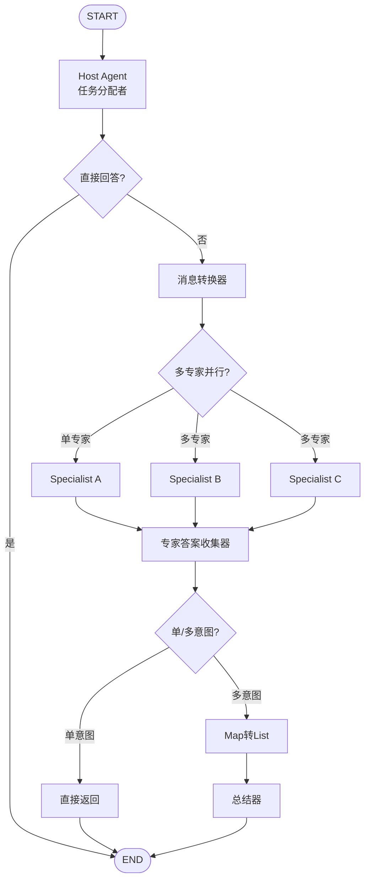
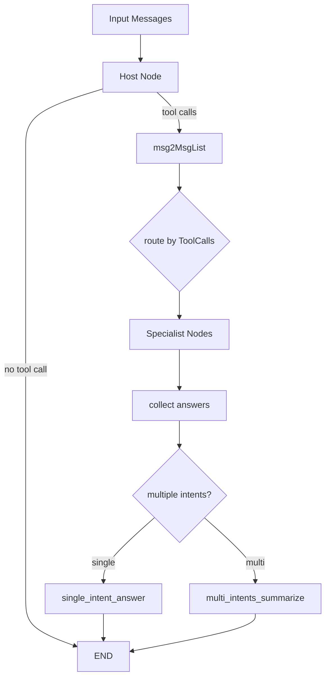

# Flow Multi-Agent Host 模块技术深度解析

## 概述

**Flow Multi-Agent Host** 模块实现了一种高效的"主机模式"（Host Pattern）的多智能体系统，让一个中心的 Host 智能体作为任务分配者，智能地决定应该将任务"移交"（hand off）给哪个或哪些专家智能体（Specialist）来处理。

想象一个团队工作场景：你有一个项目经理（Host），他负责理解客户的复杂需求，然后根据团队中最合适的工程师（Specialist）分配工作。如果需要多个工程师协作，项目经理还会整合他们的成果并提供最终答案。这正是本模块所实现的核心思想。

### 为什么这个模块与众不同？

- 它不是简单的智能体串联，而是通过 LLM 智能路由
- 它不是硬编码的决策树，而是利用模型的工具调用能力
- 它不是一次性的脚本，而是可组合、可复用的图结构
- 它不仅支持单专家，还支持多专家并行和结果整合

## 1. 核心问题与解决方案

### 问题空间

在构建复杂的 AI 应用时，单智能体系统经常遇到以下瓶颈：

1. **能力冲突**：同一个模型既要做规划、又要做检索、又要做代码决策，容易"样样懂一点，样样不稳定"。
2. **专业度不足**：通用模型在特定领域（如代码审查、医疗诊断）的表现往往不如专门优化的模型。
3. **流程不透明**：即使模型调用了工具，也很难标准化地观察"它为什么把任务交给了谁"。
4. **扩展性差**：随着功能增加，单智能体的提示词会变得越来越复杂，难以维护。

### Host Pattern 解决方案

`Flow Multi-Agent Host` 的答案是 Host Pattern：

- **Host**：专注"分诊"（像医院导诊台），只做任务分配决策
- **Specialist**：专注"执行"，每个专家只负责自己的专业领域
- **Summarizer**：负责"会诊结论"，在需要时整合多个专家的输出
- 这些角色被编译成 `compose.Graph`，由统一运行时执行

这比"让一个大模型自己决定一切"更可控，也比"把专家顺序硬编码串起来"更灵活。

## 2. 心智模型与核心概念

### 医院分诊台比喻

可以用这个比喻理解核心抽象：

- **Host (`Host`)**：分诊医生，只做"该找谁"的决策
- **Specialist (`Specialist`)**：专科医生，真正处理子任务
- **Summarizer (`Summarizer`)**：会诊秘书，把多位专家答案整合成最终回复
- **MultiAgent (`MultiAgent`)**：医院调度系统本体（可执行、可流式、可导出子图）

`AgentMeta{Name, IntendedUse}` 就是专家门牌和科室简介；Host 通过 tool call 的 `Function.Name` 指向具体 Specialist。

### 核心概念

模块围绕三个核心概念构建：

1. **Host（主持人）**：负责决策的智能体，它接收输入，分析问题，决定调用哪个或哪些专家
2. **Specialist（专家）**：专注于特定任务的智能体，可以是简单的 ChatModel，也可以是复杂的 Agent
3. **Summarizer（总结者）**：当多个专家被调用时，负责整合他们的输出

## 3. 架构设计与数据流

### 整体架构图



### 详细数据流



### 端到端流程走查

1. **初始化与验证**：`NewMultiAgent` 先调用 `MultiAgentConfig.validate()`，确保至少有 Host 和 Specialists。
   
2. **图构建**：构建 `compose.Graph[[]*schema.Message, *schema.Message]`，并通过局部 `state` 保存原始消息及"是否多意图"。

3. **Host 处理**：Host 节点（`addHostAgent`）先读取输入；若配置 `SystemPrompt`，会前置一条 system message。

4. **分支决策**：`addDirectAnswerBranch` 用 `StreamToolCallChecker` 判断 Host 输出：
   - 没有 tool call：直接结束；
   - 有 tool call：进入专家分发路径。

5. **专家路由**：`addMultiSpecialistsBranch` 根据 Host 消息里的 `ToolCalls[*].Function.Name` 扇出到对应 Specialist。

6. **结果收集与整合**：专家输出汇聚到 `specialistsAnswersCollectorNodeKey`：
   - 单专家：`singleIntentAnswerNodeKey` 直接透传；
   - 多专家：`multiIntentSummarizeNodeKey` 汇总（自定义 `Summarizer` 或默认拼接）。

## 4. 核心组件详解

### MultiAgent 结构体

`MultiAgent` 是整个系统的主入口，它封装了：

```go
type MultiAgent struct {
    runnable         compose.Runnable[[]*schema.Message, *schema.Message]
    graph            *compose.Graph[[]*schema.Message, *schema.Message]
    graphAddNodeOpts []compose.GraphAddNodeOpt
}
```

**核心方法**：
- `Generate()`: 同步执行并返回最终消息
- `Stream()`: 流式执行并返回消息流
- `ExportGraph()`: 导出底层图以便嵌入到更大的系统中
- `HostNodeKey()`: 返回 Host 节点的固定 key（当前是 "host"）

### MultiAgentConfig 配置

这是系统的配置中心，包含：

```go
type MultiAgentConfig struct {
    Host        Host
    Specialists []*Specialist

    Name         string
    HostNodeName string
    StreamToolCallChecker func(ctx context.Context, modelOutput *schema.StreamReader[*schema.Message]) (bool, error)
    Summarizer *Summarizer
}
```

**关键配置项**：

1. **Host**：主机智能体配置，必须提供 `ToolCallingChatModel`
2. **Specialists**：专家智能体列表
3. **StreamToolCallChecker**：流式工具调用检测函数（对于 Claude 等模型特别重要）
4. **Summarizer**：多专家输出总结器

### Host 结构体

Host 是任务分配者，目前它只能是 `model.ChatModel` 或 `model.ToolCallingChatModel`。

```go
type Host struct {
    ToolCallingModel model.ToolCallingChatModel
    ChatModel      model.ChatModel  // Deprecated
    SystemPrompt   string
}
```

### Specialist 结构体

Specialist 是任务执行者，它可以是：
- `model.ChatModel`
- 任何 `Invokable` 和/或 `Streamable`（如 React Agent）

```go
type Specialist struct {
    AgentMeta
    ChatModel    model.BaseChatModel
    SystemPrompt string
    Invokable  compose.Invoke[[]*schema.Message, *schema.Message, agent.AgentOption]
    Streamable compose.Stream[[]*schema.Message, *schema.Message, agent.AgentOption]
}
```

**重要设计**：
- `ChatModel` 和 `(Invokable/Streamable)` 是互斥的
- 可以同时提供 `Invokable` 和 `Streamable`，此时使用 `AnyLambda`

### AgentMeta 结构体

```go
type AgentMeta struct {
    Name        string // 智能体名称，在多智能体系统中应该唯一
    IntendedUse string // 智能体的预期用途，作为多智能体系统移交控制权给这个智能体的原因
}
```

### Summarizer 结构体

当 Host 选择了多个专家时，Summarizer 负责总结所有专家的输出。

```go
type Summarizer struct {
    ChatModel    model.BaseChatModel
    SystemPrompt string
}
```

如果不提供 Summarizer，默认会使用简单拼接所有输出的默认总结器（注意：默认总结器不支持流式）。

## 5. 内部实现深度解析

### 状态管理

系统使用一个简单但关键的状态结构来在节点之间传递信息：

```go
type state struct {
    msgs              []*schema.Message
    isMultipleIntents bool
}
```

这个状态在整个执行过程中扮演着重要角色：

1. **`msgs`**：存储原始输入消息
   - 在 Host 节点的 `preHandler` 中保存
   - 在 Specialist 节点的 `preHandler` 中重新取出使用
   - 这样设计确保专家看到的是原始用户消息，而不是 Host 的工具调用消息

2. **`isMultipleIntents`**：标记是否调用了多个专家
   - 在 `addMultiSpecialistsBranch` 中设置
   - 在 `addAfterSpecialistsBranch` 中检查，决定是直接返回还是需要总结
   - 这个标志让我们能够区分单专家和多专家场景

**关键设计决策**：为什么需要保存原始消息？
- 如果不保存，专家看到的将是 Host 的工具调用消息，而不是用户的原始问题
- 这确保了专家能够在完整的上下文中工作
- 同时，Host 的 SystemPrompt 和专家的 SystemPrompt 可以各自独立

### 图节点详解

系统创建了以下关键节点：

1. **Host 节点** (`defaultHostNodeKey`): 
   - 处理用户输入
   - 决定是直接回答还是调用专家
   - 将专家表示为工具

2. **专家答案收集器** (`specialistsAnswersCollectorNodeKey`): 
   - 收集所有专家的输出
   - 作为多专家并行执行的同步点

3. **单意图答案** (`singleIntentAnswerNodeKey`): 
   - 处理单个专家的输出
   - 直接透传结果

4. **多意图总结** (`multiIntentSummarizeNodeKey`): 
   - 总结多个专家的输出
   - 使用自定义 Summarizer 或默认拼接

5. **Map 转 List** (`map2ListConverterNodeKey`): 
   - 转换专家输出格式，从 map 转为 list

### 分支逻辑

系统有三个关键分支：

1. **直接回答分支** (`addDirectAnswerBranch`):
   - 检查 Host 是否直接回答
   - 使用 `StreamToolCallChecker` 检测工具调用

2. **多专家分支** (`addMultiSpecialistsBranch`):
   - 根据工具调用决定调用哪些专家
   - 设置 `isMultipleIntents` 标志

3. **专家后分支** (`addAfterSpecialistsBranch`):
   - 决定是单意图直接返回还是多意图总结
   - 检查 `isMultipleIntents` 状态

### 回调系统

模块提供了 `MultiAgentCallback` 接口来监听移交事件：

```go
type MultiAgentCallback interface {
    OnHandOff(ctx context.Context, info *HandOffInfo) context.Context
}
```

`HandOffInfo` 包含：
- `ToAgentName`: 目标智能体名称
- `Argument`: 移交参数

**回调机制的关键设计**：
- 回调只绑定到 Host 节点（通过 `DesignateNode(ma.HostNodeKey())`）
- 流式回调是异步的，在 goroutine 中执行
- 回调不会阻塞主执行流

## 6. 关键设计决策与权衡

### 决策 A：基于图的执行模型 vs 手写流程控制

**选择**：使用 `compose.Graph` 作为底层执行引擎

**原因**：
- 图模型天然适合表达多智能体之间的依赖关系和控制流
- 可以利用已有的 Compose Graph Engine 的能力，如分支、并行执行等
- 支持将整个 MultiAgent 作为子图嵌入到更大的系统中

**权衡**：
- ✅ 优点：灵活性高，可组合性强
- ❌ 缺点：增加了一定的复杂性，需要理解图执行模型

### 决策 B：工具调用作为路由机制

**选择**：将专家视为工具，Host 通过工具调用来"移交"任务

**原因**：
- 这是 LLM 已经理解的范式
- 支持清晰的多专家选择
- 可以传递参数给专家
- 自然支持并行调用多个专家

**替代方案考虑**：
- 直接消息路由：更简单但不够灵活
- 显式的移交消息：需要自定义协议，兼容性差

**权衡**：
- 强依赖 `schema.Message.ToolCalls` 语义
- 若上游模型 tool call 行为异常，路由会偏

### 决策 C：流式工具调用检测策略

**选择**：提供可配置的 `StreamToolCallChecker` 来检测流式输出中的工具调用

**背景**：
- 不同模型有不同的流式输出行为：
  - OpenAI 等直接输出工具调用
  - Claude 等先输出文本，然后输出工具调用

**设计决策**：
- 默认检查第一个块是否包含工具调用（`firstChunkStreamToolCallChecker`）
- 允许用户自定义检测逻辑

**权衡**：
- 简单默认值适用于大多数模型
- 对于 Claude 等需要额外配置

### 决策 D：Summarizer 的可选性

**选择**：`Summarizer` 非必填；默认把多个 `msg.Content` 直接拼接。

**原因**：
- 先保证功能闭环，降低接入成本
- 不是所有场景都需要高质量的总结

**权衡**：
- 默认路径质量有限且不支持流式总结
- 用户可以根据需要提供自定义 Summarizer

### 决策 E：多种专家类型支持

**选择**：专家可以是 ChatModel、Invokable、Streamable 或它们的组合

**原因**：
- 提供最大的灵活性，允许用户使用各种组件作为专家
- 可以逐步迁移：从简单的 ChatModel 开始，逐步升级为复杂的 Agent

**权衡**：
- API 表面较大，需要理解多种接口
- Specialist 配置优先级是"代码逻辑"而非强校验

## 7. 依赖关系与耦合

该模块在系统里是"编排层"，对上下游都有明确契约：

### 对下依赖

- **[Compose Graph Engine](Compose Graph Engine.md)**：图构建、分支、编译、运行
- **[Schema Core Types](Schema Core Types.md)**：`schema.Message` / `ToolCalls` / `StreamReader`
- **[Component Interfaces](Component Interfaces.md)**：`model.BaseChatModel`、`model.ToolCallingChatModel`
- **[Flow React Agent](Flow React Agent.md)**：可作为 `Specialist.Invokable/Streamable` 的候选实现

### 对上提供

- 稳定入口：`NewMultiAgent`、`MultiAgent.Generate`、`MultiAgent.Stream`
- 可组合能力：`ExportGraph()` 把此模块作为子图嵌入更大工作流

### 隐式耦合点

1. **Host 输出必须能解析出 `ToolCalls`**，否则专家分发链路不会触发。
2. **`AgentMeta.Name` 与 Host tool 名是同一命名空间**，重复名会引发覆盖或歧义。
3. **`StreamToolCallChecker` 有资源契约**：必须关闭输入流。

## 8. 新贡献者最该留意的坑

1. **`HostNodeName` 不是 Host 节点 key**：显示名可变，但 `HostNodeKey()` 当前返回固定 `defaultHostNodeKey`。

2. **Specialist 配置优先级是"代码逻辑"而非强校验**：若同时给 `ChatModel` 和 `Invokable/Streamable`，会优先走 lambda 路径。

3. **流式 callback 是异步拼接再回调**：`ConvertCallbackHandlers` 的 `OnEndWithStreamOutput` 开 goroutine，时序不与主链路强绑定。

4. **默认多专家总结顺序可能不稳定**：map 迭代天然无序，默认拼接输出顺序可能变化。

5. **默认 Summarizer 只做拼接**：质量要求高时务必自定义 `Summarizer.ChatModel`。

6. **`StreamToolCallChecker` 必须关闭流**：忘记关闭会导致资源泄漏。

## 9. 使用指南

### 基本用法

```go
// 创建 Host
host := host.Host{
    ToolCallingModel: myToolCallingModel,
    SystemPrompt: "你是一个 helpful 的助手，决定由哪个专家来处理用户的问题。",
}

// 创建专家
specialists := []*host.Specialist{
    {
        AgentMeta: host.AgentMeta{
            Name: "code_expert",
            IntendedUse: "用于编写和审查代码",
        },
        ChatModel: codeModel,
        SystemPrompt: "你是一个代码专家。",
    },
    {
        AgentMeta: host.AgentMeta{
            Name: "writing_expert",
            IntendedUse: "用于写作和编辑文本",
        },
        Invokable: writingAgent.Generate,
        Streamable: writingAgent.Stream,
    },
}

// 创建配置
config := &host.MultiAgentConfig{
    Host: host,
    Specialists: specialists,
    Name: "my_multi_agent",
}

// 创建多智能体系统
ma, err := host.NewMultiAgent(ctx, config)

// 运行
result, err := ma.Generate(ctx, messages)
```

### 流式模式与 Claude 模型

对于 Claude 等在流式模式下不先输出工具调用的模型，需要自定义 `StreamToolCallChecker`：

```go
config := &host.MultiAgentConfig{
    // ... 其他配置
    StreamToolCallChecker: func(ctx context.Context, modelOutput *schema.StreamReader[*schema.Message]) (bool, error) {
        defer modelOutput.Close()
        
        // 读取所有消息并拼接
        fullMsg, err := schema.ConcatMessageStream(modelOutput)
        if err != nil {
            return false, err
        }
        
        // 检查是否有工具调用
        return len(fullMsg.ToolCalls) > 0, nil
    },
}
```

### 自定义总结者

当需要调用多个专家时，可以提供自定义总结者：

```go
summarizer := &host.Summarizer{
    ChatModel: myModel,
    SystemPrompt: "请综合以下专家的意见，给出一个简洁明了的总结。",
}

config := &host.MultiAgentConfig{
    // ... 其他配置
    Summarizer: summarizer,
}
```

### 使用回调

```go
type MyCallback struct{}

func (c *MyCallback) OnHandOff(ctx context.Context, info *host.HandOffInfo) context.Context {
    fmt.Printf("切换到专家: %s, 参数: %s\n", info.ToAgentName, info.Argument)
    return ctx
}

// 使用回调
result, err := ma.Generate(ctx, inputMessages, host.WithAgentCallbacks(&MyCallback{}))
```

## 10. 子模块导读

> 所有页面均位于同一层级目录（flat docs folder），可直接通过文件名跳转。

- [types_and_config](types_and_config.md)  
  聚焦 `MultiAgent`、`MultiAgentConfig`、`Host`、`Specialist`、`Summarizer`、`AgentMeta` 的结构语义、校验策略与执行入口设计。

- [graph_composition_runtime](graph_composition_runtime.md)  
  深入 `NewMultiAgent` 与各 `add*` 组装函数，解释图节点、分支、状态、收敛路径和运行时行为。

- [callback_and_options](callback_and_options.md)  
  解释 `WithAgentCallbacks`、`convertCallbacks`、`ConvertCallbackHandlers` 如何把 Host handoff 事件桥接到通用 callback 系统。

## 11. 实践建议

- 生产环境优先使用 `Host.ToolCallingModel`（`Host.ChatModel` 已标注 Deprecated）。

- 接入新模型做流式时，第一件事就是验证 tool call 输出时机，并按需自定义 `StreamToolCallChecker`。

- 对多专家结果有质量要求时，尽量配置 `Summarizer`，并把原始用户问题和专家输出一起纳入提示词设计。

- 若要接入更大编排体系，优先用 `ExportGraph()` 复用，而不是复制一份 Host/Specialist 逻辑。

- 专家的 `IntendedUse` 描述要清晰具体，这直接影响 Host 的路由决策质量。

- 对于复杂场景，可以考虑分层：用一个 MultiAgent 作为另一个 MultiAgent 的 Specialist。
