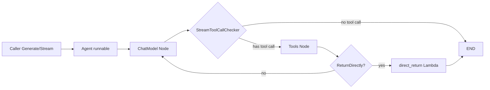

# Flow React Agent

`Flow React Agent` 是把“模型会思考、会调用工具、会继续思考”这件事，落成可执行工程结构的一层。你可以把它理解成一个专门负责 ReAct 循环的“小型调度内核”：它不实现模型，也不实现工具，而是负责把两者串成稳定的闭环（`chat -> tools -> chat ...`），并在需要时短路返回、流式判断、事件旁路采集。

它存在的根本原因是：**真实 Agent 不是一次 LLM 调用，而是多步反馈系统**。如果你只写一个 for-loop，很快会在流式工具调用判定、消息累积改写、工具结果观测、恢复语义这些细节上失控。这个模块用 `compose.Graph` + 局部 `state` + `AgentOption` 桥接，把复杂性集中到一处。

---

## 架构总览

### 架构叙事（按执行顺序）

1. `NewAgent` 先把 `ToolsConfig.Tools` 转成 `[]*schema.ToolInfo`（`genToolInfos`），再调用 `agent.ChatModelWithTools(...)` 生成模型执行入口。  
2. 图里有两个主节点：`chat`（模型）和 `tools`（工具执行）。`START -> chat` 是固定入口。  
3. `chat` 输出是流，分支条件由 `StreamToolCallChecker` 决定：
   - 有工具调用：进入 `tools`
   - 无工具调用：直接 `END`
4. `tools` 执行后有第二层分支：
   - 命中 `ReturnDirectlyToolCallID`：去 `direct_return`，直接从工具结果流里抽取对应 `ToolCallID` 的消息返回
   - 否则回到 `chat` 继续下一轮
5. 整体通过 `compose.WithMaxRunSteps(config.MaxStep)` 限制最多步数，避免无限循环。

这说明该模块的建筑角色是 **orchestrator（编排层）+ policy layer（策略层）**。

---

## 1) 这个模块解决什么问题？（先问题后方案）

### 问题空间

ReAct 在工程上有四个硬问题：

- **循环控制**：什么时候继续调用工具，什么时候停止？
- **状态一致性**：每轮模型输入要带历史，历史还可能要压缩/改写。
- **流式差异**：不同模型输出 `ToolCalls` 的时机不同（首块就给、或先吐文本再给）。
- **提前结束**：某些工具结果就是最终答案，不应再回模型总结。

### 本模块的方案

- 用图节点表达循环，不把逻辑写死在 `for`：`AddChatModelNode` / `AddToolsNode` / `AddBranch`
- 用 `state` 承载累积消息与短路标志：`Messages` + `ReturnDirectlyToolCallID`
- 用可注入的 `StreamToolCallChecker` 适配模型厂商差异
- 用 `buildReturnDirectly` 独立构建短路返回节点（`direct_return`）

---

## 2) 心智模型：把它当“带短路开关的双工位流水线”

- `chat` 工位负责“决定是否调用工具”；
- `tools` 工位负责“执行工具并产出 ToolMessage”；
- `state` 是流水线中央看板，记录历史和短路标记；
- `ToolMiddleware` 是旁路传感器：不改变主流程，但把工具结果送到观测通道（`WithMessageFuture` 用）。

一个重要细节：`MessageRewriter` 和 `MessageModifier` 不是同一层抽象。前者改写 **state 中累积历史**，后者改写 **本次送入模型的输入副本**，顺序是先 `MessageRewriter` 再 `MessageModifier`。

---

## 3) 关键数据流（端到端）

### A. 构建阶段（`NewAgent`）

- `genToolInfos` 对每个工具调用 `Info(ctx)`，失败即返回错误。  
- `agent.ChatModelWithTools(config.Model, config.ToolCallingModel, toolInfos)` 选择并包装模型能力。  
- `newToolResultCollectorMiddleware()` 被 prepend 到 `config.ToolsConfig.ToolCallMiddlewares`，确保工具结果可旁路采集。  
- 图编译后得到 `runnable`，`Generate/Stream` 都走它。

### B. 运行阶段：`Generate`

- `Agent.Generate` -> `r.runnable.Invoke(ctx, input, agent.GetComposeOptions(opts...)...)`
- `modelPreHandle` 把输入并入 `state.Messages`，执行改写逻辑
- 模型产出无 `ToolCalls`：结束
- 若有 `ToolCalls`：进 `tools`
- `toolsNodePreHandle` 更新 `state.ReturnDirectlyToolCallID`
- 若短路命中：`direct_return` 按 `ToolCallID` 过滤并返回
- 否则继续下一轮 `chat`

### C. 运行阶段：`Stream`

- `Agent.Stream` -> `r.runnable.Stream(...)`
- 模型输出是 `*schema.StreamReader[*schema.Message]`，分支判断依赖 `StreamToolCallChecker`
- 默认 checker 是 `firstChunkStreamToolCallChecker`：
  - 遇到前置空 chunk 会跳过
  - 一旦看到 `ToolCalls` 返回 true
  - 若先遇到非空文本则返回 false
- 因此对“先文本后工具调用”的模型可能误判，需要自定义 checker（并在 checker 内关闭流）

### D. 旁路消息观测（`WithMessageFuture`）

- `WithMessageFuture` 通过 `compose.WithCallbacks` 挂 graph/model callback
- graph start 时把 `toolResultSenders` 放入 context（`setToolResultSendersToCtx`）
- 工具中间件 `newToolResultCollectorMiddleware` 在工具返回后调用 sender
- `cbHandler` 把模型消息与工具消息都写入 `UnboundedChan`，调用方通过 `Iterator.Next()` 异步消费

这条链路是本模块里最关键的跨文件契约：`react.go` 的 sender 注入机制，与 `option.go` 的 sender 实现一一对应。

---

## 4) 关键设计决策与权衡

### 决策一：图编排而不是手写循环

- 选择：`compose.Graph` + 分支 + state handler
- 好处：可组合、可导出（`ExportGraph`）、便于嵌入更大工作流
- 代价：理解成本高于单函数循环

### 决策二：context 侧通道传递工具结果 sender

- 选择：`toolResultSenderCtxKey` + `get/setToolResultSendersFromCtx`
- 好处：工具执行链不依赖上层观测实现
- 代价：隐式依赖更强，类型断言错误会 panic（`v.(*toolResultSenders)`）

### 决策三：流式结果复制（`Copy(2)`）换正确性

- 选择：中间件里对 stream 结果复制两份
- 好处：旁路消费和主流程消费互不抢流
- 代价：有额外内存/调度成本

### 决策四：短路返回按 `ToolCallID` 精确匹配

- 选择：`direct_return` 节点按 `ToolCallID == state.ReturnDirectlyToolCallID` 过滤
- 好处：多工具并发或同名工具时更正确
- 代价：依赖上游完整传播 call id

### 决策五：配置 API 分层（`WithTools` vs `WithToolList`）

- `WithTools` 同时配置模型可见 schema + 工具执行列表（推荐）
- `WithToolList` 仅配置工具执行（已 Deprecated）
- 这是“显式一致性优先”的选择：尽早避免模型知道/执行器不知道（或反过来）

---

## 5) 新贡献者最该注意的隐式契约与坑

1. **`MaxStep` 没有在 `NewAgent` 内做默认赋值**。注释提到默认 12，但当前代码只把 `config.MaxStep` 直接传入图编译选项；若传 0，行为由下游 compose 决定。  
2. **`StreamToolCallChecker` 必须关闭流**。这是注释里的硬约束，不关闭可能泄漏/阻塞。  
3. **`SetReturnDirectly` 与 `ToolReturnDirectly` 的优先级**：运行时 `SetReturnDirectly` 更高，且同一步多次调用“最后一次生效”。  
4. **`WithMessageFuture` 的 handler 生命周期**：`cbHandler` 内部会 `close(h.started)`，同一个 future 选项不应跨多次运行复用。  
5. **`MessageRewriter` 是持久影响**：它改写的是 `state.Messages` 本体，不是临时副本。  
6. **`WithToolList` 已废弃语义**：只改 ToolsNode，不会自动把工具 schema 注入模型。

---

## 核心组件速览

- `Agent`：对外执行入口，封装 `runnable` 与可导出图。  
- `AgentConfig`：策略面板（模型、工具、消息改写、流判定、短路策略、命名）。  
- `state`：局部运行状态（消息历史 + 直接返回 call id）。  
- `toolResultSenders` / `toolResultSenderCtxKey`：工具结果旁路上报机制。  
- `MessageFuture` / `Iterator` / `cbHandler`：异步消息消费接口及实现。  
- `AgentOption`（来自 `flow/agent/agent_option.go`）：Agent 选项统一桥接容器。

---

## 子模块说明

> 建议阅读顺序：先看执行内核，再看运行时选项，再看通用 Option 桥接。
> 1) [react_graph_runtime_core](react_graph_runtime_core.md)  
> 2) [react_runtime_options_and_message_future](react_runtime_options_and_message_future.md)  
> 3) [agent_option_bridge](agent_option_bridge.md)

### 1. [react_graph_runtime_core](react_graph_runtime_core.md)

聚焦 `react.go` 的图构建与执行核心：`NewAgent` 如何组装 chat/tools 节点、如何分支、如何短路返回、`SetReturnDirectly` 如何写 state、工具结果中间件如何采集四类工具输出（普通/流式/增强）。如果你要改执行路径，这个文档是第一站。

### 2. [react_runtime_options_and_message_future](react_runtime_options_and_message_future.md)

聚焦 `option.go`：`WithTools` / `WithToolOptions` / `WithChatModelOptions` 如何桥接到底层 compose 选项，以及 `WithMessageFuture` 如何把 graph/model/tool 的输出统一喂给 `Iterator`。如果你要做可观测性扩展或运行时选项增强，这里最关键。

### 3. [agent_option_bridge](agent_option_bridge.md)

聚焦通用 `AgentOption` 机制：`WithComposeOptions`、`GetComposeOptions`、`WrapImplSpecificOptFn`、`GetImplSpecificOptions`。这是 Flow/ADK 侧很多 Agent 共享的参数分拣底座。

---

## 跨模块依赖（按职责）

- [Compose Graph Engine](Compose Graph Engine.md)：图建模、分支、编译、状态处理。  
- [Compose Tool Node](Compose Tool Node.md)：工具执行节点及 `ToolMiddleware` 协议。  
- [Component Interfaces](Component Interfaces.md)：`model.ToolCallingChatModel` 等能力接口。  
- [Schema Core Types](Schema Core Types.md)：`schema.Message`、`schema.ToolInfo`、`schema.ToolResult`。  
- [Schema Stream](Schema Stream.md)：`StreamReader` 复制与转换（`Copy`、`StreamReaderWithConvert`）。  
- [ADK React Agent](ADK React Agent.md)：同类 ReAct 思路在 ADK 层的实现，对比理解设计演进很有价值。

> 备注：以上依赖是基于当前源码中的直接调用与类型引用；对于仓库内更远层的反向调用链，本文不做未验证推断。
