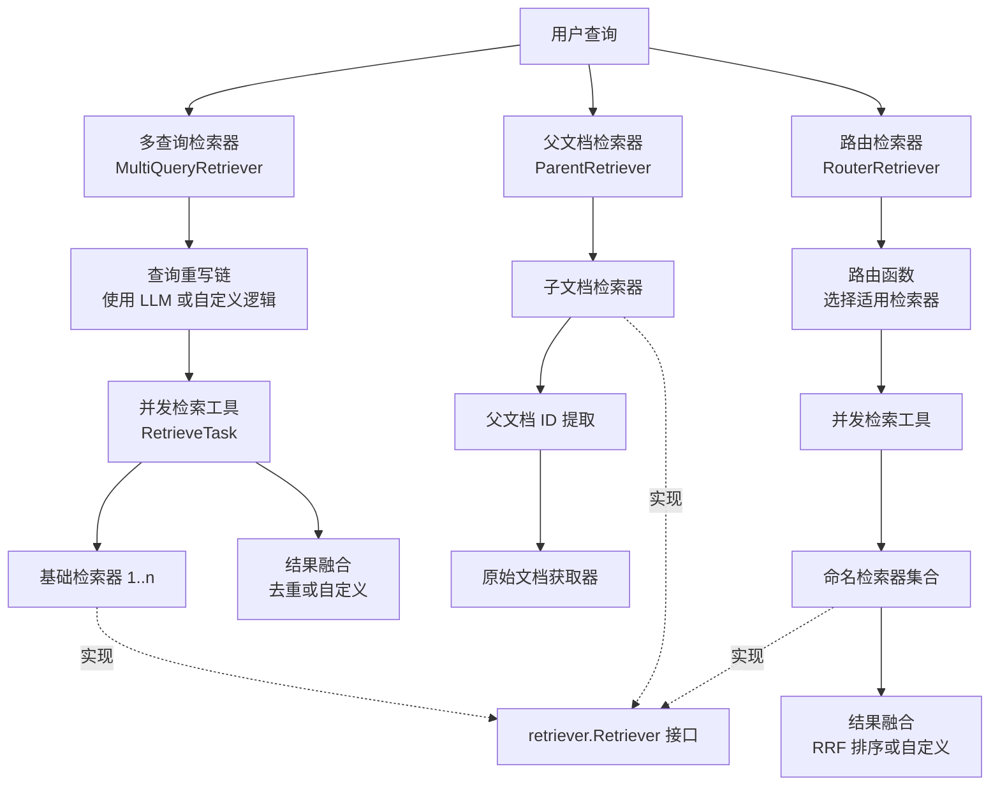

# Flow Retrievers 模块技术深度解析

## 模块概述

Flow Retrievers 是一个高级检索编排层，它不是简单的文档检索器，而是一套用于构建复杂检索策略的"积木"。就像搜索引擎不会只用一种查询方式一样，Flow Retrievers 提供了多种策略来解决"如何从知识库中找到最相关的信息"这个难题——包括查询扩展、子文档检索后父文档还原、以及多检索器的智能路由与融合。

这个模块解决了单一检索器的局限性：
- 单一查询可能因为表述方式不同而遗漏相关文档
- 向量检索在小块文本上效果好，但用户需要完整上下文
- 不同检索器各有所长（向量 vs 关键词 vs 混合），需要协同工作

## 架构总览

从架构角色看，这个模块是一个 **retrieval orchestration layer（检索编排层）**，包含三类能力：

1. **查询侧扩展**：`multiQueryRetriever` 先改写 query，再并发查同一个 `OrigRetriever`。
2. **执行侧分发**：`routerRetriever` 先选 retriever，再并发查多个 retriever。
3. **结果侧还原**：`parentRetriever` 把子文档召回结果映射回父文档。
4. **共用执行底座**：`utils.ConcurrentRetrieveWithCallback` 负责并发、回调埋点、panic 兜底。

换个比喻：`Flow Retrievers` 像一个物流调度中心——有"改写地址的客服"（multi-query）、"分单系统"（router）、"子包裹回溯主订单"（parent）、"统一车队调度"（utils）。

## 核心设计理念

### 1. 组合优于继承
Flow Retrievers 没有构建一个庞大的"全能检索器"，而是采用了装饰器模式和组合模式。每个检索器都包装另一个 `retriever.Retriever`，在不改变基础检索器的前提下增强其能力。这种设计使得你可以轻松堆叠多种策略，例如：先用 `ParentRetriever` 还原完整文档，再用 `RouterRetriever` 混合不同检索来源。

### 2. 职责分离：检索、路由、融合
模块清晰地分离了三个关注点：
- **检索**：由底层 `retriever.Retriever` 负责，关注"如何找到文档"
- **路由/扩展**：由 `Router` 或 `MultiQuery` 负责，关注"用什么查询/从哪里找"
- **融合**：由 `FusionFunc` 负责，关注"如何合并多个结果集"

### 3. 并发优先
检索通常是 I/O 密集型操作，模块在设计时就考虑了并发。`utils.ConcurrentRetrieveWithCallback` 提供了安全的并发检索基础设施，自动处理 panic 恢复和回调通知，让多个检索请求并行执行而不会增加代码复杂度。

## 关键设计决策与取舍

### 决策 A：策略函数注入，而不是硬编码策略对象
`Router`、`FusionFunc`、`RewriteHandler`、`OrigDocGetter` 都采用函数注入。好处是灵活、接入轻；代价是更多运行时契约（空函数、返回值格式）需要调用方自律。

### 决策 B：统一并发执行工具
选择 `utils.ConcurrentRetrieveWithCallback` 做"一任务一 goroutine + WaitGroup"。好处是实现简单、延迟友好；代价是没有内建并发上限，任务规模大时可能冲击下游检索系统。

### 决策 C：默认融合策略保守
- multiquery 默认：按 `Document.ID` 去重（稳定、低复杂度）
- router 默认：`rrf`（跨异构 retriever 的 rank 融合更稳）

这是"先保证通用可用，再交给业务自定义排序"的取向。

### 决策 D：错误处理偏"全有或全无"
`multiQueryRetriever` 与 `routerRetriever` 都是任一 task 出错即返回错误，不做部分成功返回。语义简单、便于上层处理；但在高可用场景可能显得过严。

### 决策 E：回调体系深度耦合可观测性
该模块大量使用 `callbacks` 与 `RunInfo`（如 `Type: Router/FusionFunc`）。这提升了可调试性，但也意味着如果回调契约变化，检索链路观测会首先受影响。

## 子模块摘要

- [MultiQuery 检索器](multiquery_retriever.md)  
  负责 query 改写 + 并发多次检索 + 融合。它是"提升召回覆盖率"的主力模块，支持 LLM 改写与自定义改写两条路径，并通过 `compose` 链式编排实现可替换性。

- [Parent 检索器](parent_retriever.md)  
  负责从 chunk 召回结果回捞 parent 文档。它是"检索结果语义升维"的适配层：检索阶段细粒度，输出阶段完整化。

- [Router 检索器](router_retriever.md)  
  负责 query 到 retriever 集合的路由，并对多路结果融合排序。它更像"检索网关"，把异构检索器统一封装到一个 `retriever.Retriever` 实现里。

- [检索工具模块](retrieval_utils.md)  
  提供通用并发执行与回调埋点能力。它是整个模块族的"执行底盘"，减少重复并统一错误/观测语义。

## 跨模块依赖关系

`Flow Retrievers` 与以下模块存在直接耦合：

- [Component Interfaces](Component Interfaces.md)：核心依赖 `retriever.Retriever` 接口契约。
- [Schema Core Types](Schema Core Types.md)：统一使用 `schema.Document` / `schema.Message` 数据结构。
- [Compose Graph Engine](Compose Graph Engine.md)：`multiquery` 使用 `compose.NewChain`/`Runnable` 组装 query rewrite 流程。
- [Callbacks System](Callbacks System.md)：router/multiquery/utils 都依赖回调生命周期事件与 `RunInfo`。

隐含契约最关键的是：
1. `Document.ID` 需要稳定（否则融合与去重失真）。
2. Parent 场景中 metadata 的 `ParentIDKey` 需与索引侧一致。
3. 路由输出名称必须在 `Retrievers` map 中注册。

## 新贡献者最该注意的坑

1. **router 默认路由实现存在实现风险**：`NewRetriever` 内计算了本地 `router` 默认值，但返回结构体时字段赋值是 `config.Router`。当 `config.Router == nil` 时，`Retrieve` 可能调用空函数（panic 风险）。
2. **multiquery 的 `opts ...retriever.Option` 当前未透传到底层任务**：`RetrieveTask` 构造时未填 `RetrieveOptions`，传入 option 可能被静默忽略。
3. **默认 `LLMOutputParser` 仅按换行 split**：不会自动过滤空行，可能产生空 query。
4. **parent 去重是 O(n²)**：`inList` 线性查重在大召回量下会成为热点。
5. **并发无内建限流**：上游若放大 query 数/路由数，可能压垮底层 retriever。

## 使用建议与注意事项

### 使用场景选择指南
- 当你的查询可能有多种表述方式时 → 使用 **MultiQueryRetriever**
- 当你索引的是文档片段但需要返回完整文档时 → 使用 **ParentRetriever**
- 当你有多个检索源且需要智能选择或融合时 → 使用 **RouterRetriever**

### 常见陷阱
1. **MultiQuery 成本控制**：LLM 查询重写会增加延迟和成本，考虑设置合理的 `MaxQueriesNum`（默认 5），或在成本敏感场景使用自定义 `RewriteHandler`
2. **ParentRetriever 元数据约定**：确保子文档元数据中确实有 `ParentIDKey` 字段，否则会静默过滤掉结果
3. **RouterRetriever 命名一致性**：路由函数返回的名字必须与 `Retrievers` 映射中的键完全匹配，否则会报错
4. **融合函数中的错误处理**：自定义 `FusionFunc` 应该优雅处理空结果，而不是直接返回错误

### 扩展点
- 所有三个检索器都支持自定义融合策略
- MultiQueryRetriever 支持完全替换查询重写逻辑
- RouterRetriever 支持完全自定义路由决策

## 实践建议（如何安全扩展）

- 想增强召回：优先改 `RewriteHandler`/`LLMOutputParser`，不要先改并发底座。
- 想增强排序：优先自定义 `FusionFunc`，并明确 `Document.ID` 去重策略。
- 想提升可用性：在上层实现"部分失败容忍"策略（当前默认是 fail-fast）。
- 想加观测：沿用现有 `callbacks.RunInfo` 命名风格，保证链路可比性。

如果你第一次改这个模块，建议顺序是：先读 [检索工具模块](retrieval_utils.md) -> 再读 [Router 检索器](router_retriever.md) 与 [MultiQuery 检索器](multiquery_retriever.md) -> 最后看 [Parent 检索器](parent_retriever.md) 的结果升维逻辑。

## 总结

Flow Retrievers 模块展示了如何通过组合和装饰来构建强大的检索系统。它不 reinvent the wheel——而是通过智能的编排让现有的检索器更强大。无论是需要提高召回率、还原完整上下文，还是混合多种检索来源，这个模块都提供了即插即用的解决方案，同时保持了足够的灵活性以适应特殊需求。
