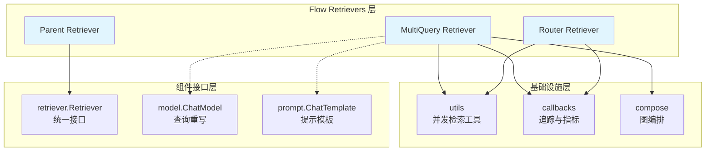
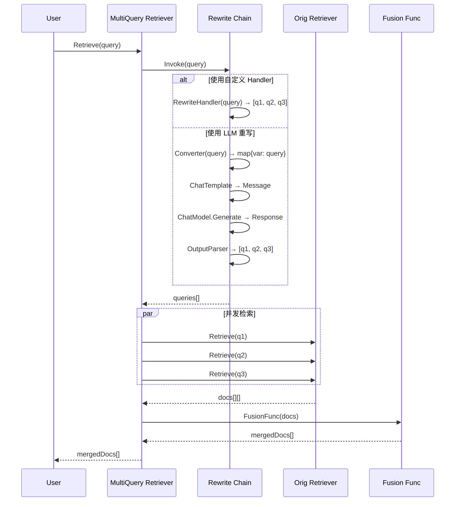
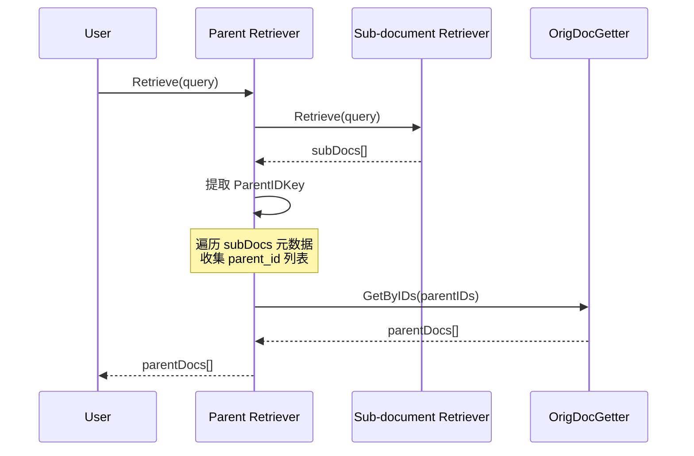
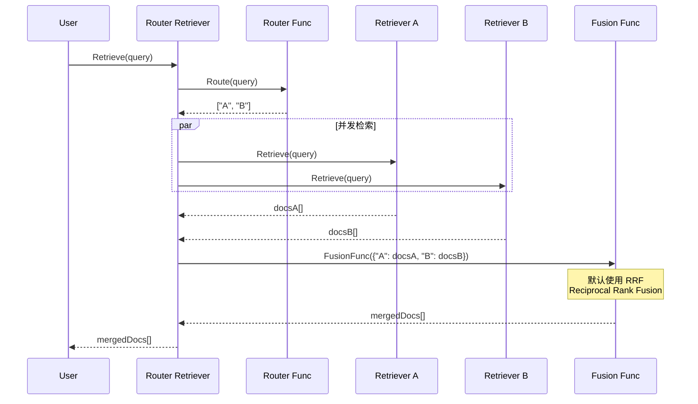
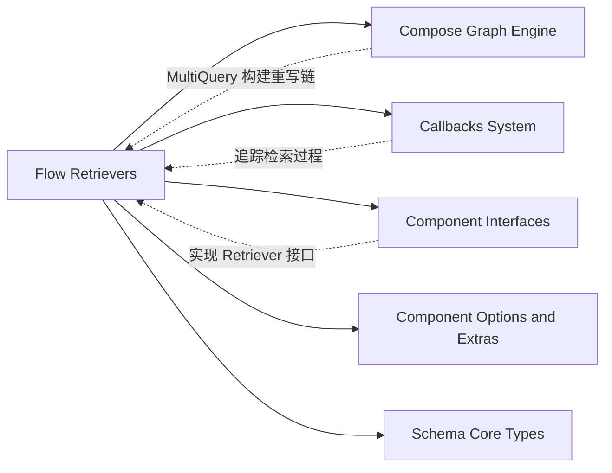

# Flow Retrievers 模块深度解析

## 30 秒速览

Flow Retrievers 是 Eino 框架中的**检索增强层**，它解决了单一检索策略在面对复杂查询时的局限性。想象你正在一个庞大的图书馆找资料：传统的检索就像只问一个管理员；而 Flow Retrievers 则像是组建了一支专业的检索团队——有人负责把问题换个角度问（MultiQuery）、有人专门查找原始档案（Parent）、还有人同时询问多个部门并整合答案（Router）。这个模块通过组合多种检索模式，显著提升了召回率和结果质量，同时保持与 Eino 组件生态的无缝集成。

---

## 问题空间：为什么需要这个模块？

在 RAG（检索增强生成）系统中，检索质量直接决定生成质量。但单一检索器面临三个核心挑战：

### 1. 查询表达多样性问题
用户提问"如何构建 Agent"和"Eino 框架的入门指南"可能指向同一批文档，但传统向量检索难以捕捉这种语义关联。这导致**低召回率**——相关文档就在库中，但查询向量没找对方向。

### 2. 粒度不匹配问题
向量数据库通常存储文本块（chunks）以便语义匹配，但用户需要的是完整的原始文档。检索到子文档后，如何高效获取其父文档，是 Parent Retriever 要解决的核心问题。

### 3. 多源异构检索问题
生产环境中，数据往往分散在向量数据库（语义检索）、Elasticsearch（全文检索）、图数据库（关系检索）等多个系统中。如何智能路由查询、并发检索、并融合多源结果，是 Router Retriever 的设计动机。

**替代方案考量**：
- 在应用层手动组合多个检索器？可行，但需要处理并发控制、错误处理、结果融合、回调追踪等横切关注点，代码会快速膨胀。
- 使用外部编排工具？引入了额外的运维复杂度。

Flow Retrievers 选择在框架层提供声明式的检索组合能力，利用 [Compose Graph Engine](Compose Graph Engine.md) 的基础设施，让复杂的检索逻辑像搭积木一样组合。

---

## 心智模型：把检索想象成分布式查询系统

理解 Flow Retrievers 的关键是接受**"检索即数据流转换"**这一心智模型：

```
原始查询 → [查询变换] → [并发检索] → [结果融合] → 最终文档列表
```

每个 Retriever 都是这个管道的一个特定实现：

| Retriever 类型 | 核心能力 | 类比 |
|--------------|---------|------|
| **MultiQuery** | 查询重写与扩展 | 翻译官团队——把一个问题翻译成多个等价表述 |
| **Parent** | 子文档→父文档溯源 | 档案管理员——找到摘要卡后调取完整卷宗 |
| **Router** | 多路检索与结果融合 | 调度中心——同时询问多个部门，加权汇总 |

这些 Retriever 都实现了统一的 `retriever.Retriever` 接口，意味着它们可以：
1. 互相嵌套（Router 可以路由到 MultiQuery）
2. 被 [Compose Graph Engine](Compose Graph Engine.md) 的 Chain/Graph 消费
3. 享受统一的回调追踪和指标采集

---

## 架构设计与数据流

### 整体架构图



### 关键数据流详解

#### 1. MultiQuery Retriever 数据流



**关键设计点**：
- **查询重写链**：利用 [Compose Graph Engine](Compose Graph Engine.md) 的 Chain API 构建，支持自定义 Handler 或 LLM 驱动的重写
- **并发控制**：通过 `utils.ConcurrentRetrieveWithCallback` 并行执行多个检索任务
- **去重策略**：默认按 Document ID 去重，支持自定义 Fusion 函数

#### 2. Parent Retriever 数据流



**关键设计点**：
- **两阶段检索**：先检索子文档（用于语义匹配），再获取父文档（用于完整上下文）
- **元数据驱动**：依赖子文档的 `MetaData[ParentIDKey]` 字段建立关联
- **去重逻辑**：自动去重相同的 parent ID，避免重复获取

#### 3. Router Retriever 数据流



**关键设计点**：
- **动态路由**：Router 函数决定查询应该发送到哪些检索器
- **命名空间隔离**：每个检索器的结果被标记名称，Fusion 函数可以区分来源
- **RRF 融合**：默认使用 Reciprocal Rank Fusion 算法（$score = \sum_{i} \frac{1}{rank_i + 60}$）

---

## 设计决策与权衡

### 1. 构建于 Compose 之上 vs. 独立实现

**选择**：MultiQuery 的查询重写链使用 [Compose Graph Engine](Compose Graph Engine.md) 的 Chain API 构建。

**权衡分析**：
- ✅ **复用**：自动获得图编排的回调追踪、错误处理、类型安全
- ✅ **可组合**：用户可以替换 Chain 中的任意节点（自定义 Template、Model、Parser）
- ⚠️ **依赖**：强依赖 Compose 模块，增加了模块耦合

**未选择的路径**：
- 硬编码 LLM 调用逻辑：更简单，但失去灵活性
- 完全独立实现：避免依赖，但会重复实现大量横切关注点

### 2. 默认 RRF 融合算法

**RRF 公式**：
$$RRF(d) = \sum_{r \in R} \frac{1}{k + rank_r(d)}$$

其中 $k=60$ 是平滑常数，$rank_r(d)$ 是文档 $d$ 在检索器 $r$ 中的排名。

**选择原因**：
- 无需调参，对 score 分布不敏感（不同检索器的 score 可能不可比）
- 对排名靠前的文档给予更高权重
- 计算简单，适合实时场景

**替代方案**：
- 加权求和：需要人工调参，score 需归一化
- 机器学习融合：效果更好但需要训练数据

### 3. 并发检索的错误处理策略

**当前行为**：
```go
for i, task := range tasks {
    if task.Err != nil {
        return nil, task.Err  // 任一失败即整体失败
    }
}
```

**权衡分析**：
- ✅ **简单明确**：调用方知道结果是完整的
- ⚠️ **可用性**：单个检索器故障会导致整体失败

**可能的改进**：
- 部分成功模式：返回成功检索的结果 + 错误信息
- 降级策略：失败时重试或使用备用检索器

### 4. Parent Retriever 的接口设计

**关键决策**：`OrigDocGetter` 是一个函数类型，而非检索器接口：

```go
OrigDocGetter func(ctx context.Context, ids []string) ([]*schema.Document, error)
```

**理由**：
- 父文档获取通常基于主键精确查找，与语义检索的接口语义不同
- 允许直接使用文档存储（如数据库、对象存储），不强制包装成 Retriever
- 批量获取接口（`[]string` → `[]*Document`）减少 IO 往返

### 5. 回调追踪的粒度设计

每个 Retriever 在关键节点注入回调：

| 阶段 | Callback 类型 | 携带数据 |
|------|--------------|---------|
| Router 决策 | OnStart/OnEnd | query / retrieverNames[] |
| 单个检索 | OnStart/OnEnd | query / docs[] |
| Fusion | OnStart/OnEnd | docs[][] / mergedDocs[] |

**设计意图**：
- 细粒度追踪每个子检索器的性能
- Fusion 阶段可观测输入输出的文档数量变化
- 通过 `RunInfo` 区分不同组件类型（ComponentOfLambda vs ComponentOfRetriever）

---

## 子模块导航

| 子模块 | 职责 | 复杂度 |
|--------|------|--------|
| [multiquery](multiquery.md) | 查询重写与多路并发检索 | 高 |
| [parent](parent.md) | 子文档到父文档的溯源检索 | 中 |
| [router](router.md) | 多检索器路由与结果融合 | 高 |
| [utils](utils.md) | 并发检索基础设施 | 低 |

---

## 跨模块依赖

### 上游依赖（本模块依赖谁）



**详细依赖关系**：

| 依赖模块 | 使用方式 | 耦合强度 |
|---------|---------|---------|
| [Compose Graph Engine](Compose Graph Engine.md) | MultiQuery 使用 `compose.Chain` 构建查询重写管道 | 强 |
| [Callbacks System](Callbacks System.md) | 所有 Retriever 通过 `callbacks.OnStart/OnEnd/OnError` 注入追踪点 | 强 |
| [Component Interfaces](Component Interfaces.md) | 实现 `components/retriever.Retriever` 接口 | 强 |
| [Schema Core Types](Schema Core Types.md) | 使用 `schema.Document`, `schema.Message` | 强 |
| [Component Options and Extras](Component Options and Extras.md) | 透传 `retriever.Option` 到下游检索器 | 中 |

### 下游依赖（谁依赖本模块）

目前 Flow Retrievers 是顶层模块，主要被用户代码直接使用，或嵌入到 [Flow React Agent](Flow React Agent.md) 等 Agent 实现中作为知识检索组件。

---

## 新贡献者必读：陷阱与最佳实践

### 1. 元数据契约（Parent Retriever）

**隐性契约**：使用 Parent Retriever 时，索引阶段必须在子文档的 `MetaData` 中写入 `ParentIDKey` 指定的字段。

```go
// 索引时
chunk.MetaData["parent_id"] = originalDoc.ID  // 必须与 Config.ParentIDKey 一致
```

**常见错误**：配置 `ParentIDKey: "source_id"`，但索引时写入 `parent_id`，导致检索结果为空。

### 2. Fusion 函数的幂等性

MultiQuery 和 Router 都接受自定义 `FusionFunc`。这个函数会被并发调用（每个查询上下文一次），应确保：
- 无外部副作用（不要在此写数据库）
- 对输入的 `[][]*schema.Document` 只做读取和重组

### 3. Query 变量名一致性（MultiQuery）

使用自定义 `RewriteTemplate` 时，`QueryVar` 必须与模板变量名完全匹配：

```go
// 正确
tpl := prompt.FromMessages(schema.Jinja2, schema.UserMessage("{{question}}"))
config := &multiquery.Config{
    RewriteTemplate: tpl,
    QueryVar: "question",  // 与模板一致
}

// 错误 - 将导致变量未替换
config := &multiquery.Config{
    RewriteTemplate: tpl,
    QueryVar: "query",  // 与模板中的 {{question}} 不匹配
}
```

### 4. 并发数控制

`utils.ConcurrentRetrieveWithCallback` 使用裸 goroutine 并发，没有限制并发数。当：
- MultiQuery 生成大量查询（`MaxQueriesNum` 设置过大）
- Router 注册了大量检索器

可能导致下游系统（如向量数据库）过载。建议：
- 合理设置 `MaxQueriesNum`（默认 5）
- 监控下游系统负载

### 5. Router 的返回值契约

Router 函数返回的 retriever 名称必须在 `Config.Retrievers` map 中存在：

```go
router := func(ctx context.Context, query string) ([]string, error) {
    return []string{"milvus", "es"}, nil  // "milvus" 和 "es" 必须已注册
}
```

返回未注册的名称会导致运行时错误：
```
router output[unknown_retriever] has not registered
```

### 6. 错误处理的级联效应

当前实现中，任一子检索器失败会导致整个检索失败。在生产环境中，建议：
- 包装 Retriever 添加重试逻辑
- 或使用自定义 Router 实现熔断降级

---

## 总结

Flow Retrievers 是 Eino 框架在 RAG 领域的核心能力体现。它通过三种检索模式（MultiQuery、Parent、Router）解决了查询多样性、粒度匹配和多源异构的问题，同时借助 [Compose Graph Engine](Compose Graph Engine.md) 的基础设施保持了良好的可扩展性和可观测性。

理解这个模块的关键是把握**"检索即数据流"**的心智模型：原始查询经过变换、分发、并发执行、结果融合，最终产出高质量的上下文文档。每个 Retriever 都是这个管道的一个特定实现，它们可以嵌套组合，构建出复杂的检索策略。
