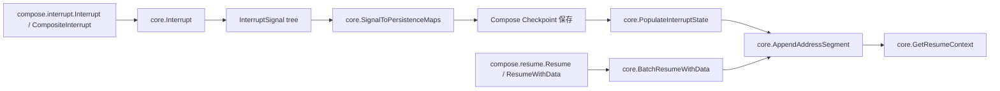

# Internal Core

`Internal Core` 是整套可中断执行体系的“交通中枢”：它不负责真正跑业务节点，而是负责回答两个最关键的问题——**现在执行到哪了（Address）**，以及**中断后该从哪恢复、带什么状态恢复（Interrupt + Resume routing）**。如果把 [Compose Graph Engine](Compose Graph Engine.md) 看作发动机，那 `Internal Core` 就是导航与黑匣子协议层；没有它，恢复只能靠粗暴重跑，或者让每个上层模块各自发明一套不兼容的中断语义。

在构建复杂的分布式系统和工作流引擎时，我们经常会遇到这样的问题：**如何在执行过程中优雅地中断，保存完整的上下文状态，并在之后精确地恢复执行**？这正是 Internal Core 模块要解决的核心挑战。想象一下，你正在处理一个由多个 Agent、Graph 节点和工具调用组成的复杂工作流，执行到一半时需要暂停。你不能简单地停止进程丢失所有状态，也不能重新从头执行浪费时间。Internal Core 模块就像是一个**智能的执行快照系统**，它能在任意时刻"冻结"整个执行状态树，然后在需要时精确地"解冻"并恢复执行。

## 1) 问题空间：这个模块为什么存在

在 Eino 这类嵌套编排系统里（graph 调 node，node 调 tool，tool 内可能再调子 graph/agent），中断恢复的难点不是“抛个 error”，而是：

- 如何唯一定位中断点（并行同名调用会冲突）
- 如何把恢复数据精确投递到目标层级
- 如何避免恢复数据被重复消费
- 如何把内部中断树转换成对外可理解的上下文链
- 如何让 checkpoint 保存的是可恢复协议，而不是一次性运行时对象

`internal/core/address.go` + `internal/core/interrupt.go` 正是为这些问题提供统一底层协议。

## 2) 心智模型：一棵执行树 + 两套投影

可以把它想成“城市导航系统”：

- `Address` / `AddressSegment` = 经纬度路径（你在哪）
- `globalResumeInfo` = 全局路由表（哪些点要恢复、状态是什么）
- `InterruptSignal` = 内部事故树（机器处理视图）
- `InterruptCtx` = 对外事故报告链（用户/跨模块视图）

同一个中断事实会有两种表达：

1. 运行时内部：`InterruptSignal` 树
2. 对外暴露：`[]*InterruptCtx`（每个 root cause 带 Parent 链）

这也是 `ToInterruptContexts` / `FromInterruptContexts` 存在的根本原因：不是重复建模，而是桥接不同消费方。

## 3) 架构概览与数据流



### 核心数据模型

Internal Core 的核心是两个紧密关联的数据模型：

**地址系统**：
```go
// Address 表示执行结构中某个点的完整层次化地址
type Address []AddressSegment

// AddressSegment 表示执行点层次化地址中的单个段
type AddressSegment struct {
    ID    string              // 该段的唯一标识符，如节点键或工具名
    Type  AddressSegmentType  // 指示地址段的类型：图节点、工具调用、Agent 等
    SubID string              // 用于保证唯一性的子ID，如并行工具调用时
}
```

**中断信号**：
```go
// InterruptSignal 表示一个中断信号
type InterruptSignal struct {
    ID             string
    Address
    InterruptInfo
    InterruptState
    Subs           []*InterruptSignal  // 子中断信号，形成中断树
}

// InterruptState 保存中断点的状态
type InterruptState struct {
    State                any  // 组件的核心状态
    LayerSpecificPayload any  // 层特定的元数据
}
```

### 流程解读（端到端）

1. 上层中断入口（`compose.interrupt.Interrupt` / `StatefulInterrupt` / `CompositeInterrupt`）调用 `core.Interrupt` 构造 `InterruptSignal`。  
2. 图运行时在中断落盘前调用 `core.SignalToPersistenceMaps`，把信号树拍平为 `id -> Address` 与 `id -> InterruptState`，写入 [Compose Checkpoint](Compose Checkpoint.md)。  
3. 恢复时，checkpoint 读取后通过 `core.PopulateInterruptState` 将映射重新注入 context。  
4. 调用方通过 `compose.resume.Resume` 或 `compose.resume.ResumeWithData`（内部调用 `core.BatchResumeWithData`）注入“目标恢复 ID -> 恢复数据”。  
5. 执行链每深入一层调用 `core.AppendAddressSegment`，按当前地址匹配恢复状态和恢复数据，并更新 `isResumeTarget`。  
6. 组件通过 `core.GetResumeContext`（定义在 `internal/core/resume`）读取结果，决定是否恢复执行。

### 内部工作原理与实现细节

#### 地址匹配与恢复目标识别

`AppendAddressSegment()` 函数中有一个巧妙的设计：它不仅检查当前地址是否为恢复目标，还检查是否有任何后代地址是恢复目标。这允许复合组件（如包含嵌套图的工具）知道它们应该执行子组件以到达实际的恢复目标。

```go
// 标记后代地址为恢复目标
if !runCtx.isResumeTarget {
    for id_, addr := range rInfo.id2Addr {
        if len(addr) > len(currentAddress) && addr[:len(currentAddress)].Equals(currentAddress) {
            if !rInfo.id2ResumeDataUsed[id_] {
                runCtx.isResumeTarget = true
                break
            }
        }
    }
}
```

#### 中断信号与用户上下文的转换

模块提供了 `ToInterruptContexts()` 和 `FromInterruptContexts()` 两个关键函数，用于在内部中断信号树和用户友好的中断上下文列表之间转换。这种分离允许内部实现灵活变化，同时保持稳定的用户 API。

## 4) 关键设计决策与取舍

### 决策 A：用层级地址，不用扁平 ID

选择：`Address []AddressSegment`，每段含 `Type/ID/SubID`，并支持 `Equals`/`String`。  
放弃方案：只用单一字符串 ID。  

**为什么这样选**：

- 层级地址天然支持前缀匹配（判断子树是否包含恢复目标）
- `SubID` 解决并发同名调用冲突
- 比“业务方自己拼字符串”更稳

代价是路由逻辑更复杂，需要维护地址一致性。

### 决策 B：恢复数据与中断状态“一次性消费”

选择：`id2ResumeDataUsed` + `id2StateUsed`。  
放弃方案：每次匹配都可重复读取。  

**为什么这样选**：

- 防止多层嵌套中同一恢复载荷被重复命中
- 降低“看起来恢复了，实际上重复执行”这类隐性 bug

代价是需要调用方理解：数据被消费后再次进入同地址可能拿不到同一份值，这是设计行为。

### 决策 C：中断既是结构体，也是 error

选择：`InterruptSignal` 实现 `Error()`，沿 Go error 通道传播。  
放弃方案：自定义单独返回通道。  

**为什么这样选**：

- 与 Go 生态兼容，现有调用栈不用重写
- 仍保留结构化字段（`Address`、`State`、`Subs`）

代价是调用方必须用 `errors.As` 做类型提取，不能只依赖字符串。

### 决策 D：内部树与外部链双模型并存

选择：`InterruptSignal`（树）与 `InterruptCtx`（链）双向转换。  
放弃方案：强迫所有层都只用同一种结构。  

**为什么这样选**：

- checkpoint/恢复逻辑更适合树
- API/跨边界展示更适合 root-cause 列表 + parent 链
- `allowedSegmentTypes` 支持按层级裁剪暴露信息

代价是转换逻辑复杂，且过滤后地址不一定还能用于内部精确匹配。

## 5) 子模块总览

### [地址管理子模块](地址管理子模块.md)

这个子模块负责“你在哪、该往哪恢复”。核心入口是 `AppendAddressSegment`：每进入一层执行结构，就扩展地址并尝试从全局恢复表提取状态/数据。它的非显式但关键能力是“后代恢复目标探测”——即使当前层不是最终恢复点，只要子树里有目标，也会标记 `isResumeTarget`，避免编排器过早短路。详细信息请参考[地址管理子模块文档](地址管理子模块.md)。

### [中断管理子模块](中断管理子模块.md)

这个子模块负责“如何表达中断事实，并在内部/外部表示间可逆转换”。`Interrupt` 构造 `InterruptSignal`，`ToInterruptContexts`/`FromInterruptContexts` 负责跨模块桥接，`SignalToPersistenceMaps` 负责为 checkpoint 拍平。它是 [Compose Interrupt](Compose Interrupt.md)、[Compose Checkpoint](Compose Checkpoint.md) 与 ADK 中断信息之间的语义连接器。详细信息请参考[中断管理子模块文档](中断管理子模块.md)。

## 6) 与其他模块的依赖关系（架构位置）

- 上游触发者：
  - [Compose Interrupt](Compose Interrupt.md) 的 `Interrupt` / `StatefulInterrupt` / `CompositeInterrupt` 调用 `core.Interrupt`。
- 持久化消费者：
  - [Compose Checkpoint](Compose Checkpoint.md) 使用 `core.SignalToPersistenceMaps` 落盘，并在恢复时用 `core.PopulateInterruptState` 回填。
- 运行时执行器：
  - [Compose Graph Engine](Compose Graph Engine.md) 的 `runner.handleInterrupt` 与恢复路径围绕上述能力组织。
- 工具节点/代理桥接：
  - [Compose Tool Node](Compose Tool Node.md) 与 ADK 层通过中断上下文桥接语义协同。

换句话说，`Internal Core` 在体系中的角色是**中断-恢复协议内核**：上游写入语义，下游消费语义，它本身不承载业务策略。

## 7) 新贡献者最需要警惕的点

1. **地址稳定性是硬约束**：`Type/ID/SubID` 一旦生成策略变化（尤其并发场景忘记 `SubID`），恢复匹配就会漂移。  
2. **`isResumeTarget` 不等于“我就是终点”**：也可能是“后代里有目标”，不要据此直接跳过子执行。  
3. **过滤后的 `InterruptCtx.Address` 是展示视图**：`ToInterruptContexts` 传 `allowedSegmentTypes` 后，地址可能不再适合作为内部精确定位键。  
4. **`any` 带来运行时风险**：`Info`/`State`/`LayerSpecificPayload` 灵活，但序列化与类型断言错误会后置到运行时。  
5. **并发写入要谨慎**：`globalResumeInfo` 有锁，但调用侧仍应避免无序并发 mutate 同一恢复上下文。

## 8) 实践建议

- 把地址段构造封装成统一 helper，避免各层自己拼 `Type/ID/SubID`。  
- 业务代码读取恢复信息时优先用 `GetResumeContext[T]` 的泛型断言，显式处理 `hasData=false`。  
- 对外暴露中断时，先明确是否需要 `allowedSegmentTypes` 裁剪；裁剪后不要再回灌到内部精确恢复流程。  
- 做故障排查时，同时打印 `InterruptSignal.Error()` 与 `Address.String()`，比只看 message 更可靠。
