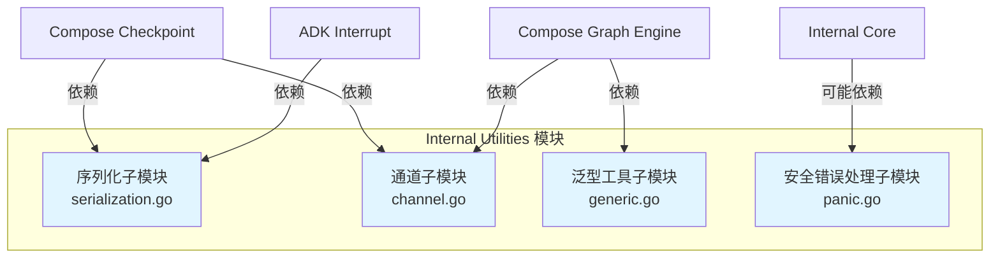

# Internal Utilities 模块技术深度文档

## 概述

Internal Utilities 模块是整个系统的基础设施层，提供了一组低层次、可复用的工具组件，解决了系统中跨领域的共性问题。它就像建筑工地上的工具箱，包含了各种基础工具，让上层建筑能够高效、安全地构建。

这个模块的核心价值在于：
1. **提供类型安全的序列化机制** - 解决Go语言中interface{}类型的序列化/反序列化难题
2. **实现无界通道** - 解决标准库channel容量限制的问题
3. **封装通用泛型工具** - 减少重复代码，提高开发效率
4. **提供安全的panic处理** - 保留堆栈信息，便于调试

这个模块的设计理念是"提供最小但足够强大的工具集"，避免过度设计，同时确保每个组件都能解决实际问题。它不处理业务逻辑，而是为上层模块提供通用的技术支持。

## 架构总览



这个模块由四个相对独立的子模块组成：

1. **序列化子模块**：提供类型感知的序列化/反序列化能力，解决Go语言中interface{}类型的序列化难题
2. **通道子模块**：实现无界容量的并发安全通道，解决标准库channel容量限制的问题
3. **泛型工具子模块**：提供通用的泛型辅助函数和数据结构，减少重复代码
4. **安全错误处理子模块**：增强 panic 捕获和错误信息展示，保留堆栈信息便于调试

它们的共同特点是：
- 不依赖系统的其他内部模块（除了标准库和少量第三方库）
- 专注于解决单一、明确的技术问题
- 设计上考虑了性能和类型安全
- 提供简洁、直观的 API

## 核心设计决策与权衡

### 1. 类型感知序列化 vs 标准 JSON 序列化

**选择**：实现了自定义的 `InternalSerializer`，而不是直接使用标准库的 JSON 序列化。

**为什么**：
- 标准 JSON 序列化在处理 `interface{}` 类型时会丢失类型信息，反序列化后只能得到 `map[string]interface{}` 或 `[]interface{}`
- 系统中的 [Compose Checkpoint](Compose Checkpoint.md) 和 [ADK Interrupt](ADK Interrupt.md) 模块需要精确还原原始类型
- 需要支持指针、复杂嵌套结构、map非string键等 Go 特有类型

**核心实现原理**：
序列化模块通过 `internalStruct` 和 `valueType` 两个结构体，在序列化数据中嵌入完整的类型信息：
- `valueType` 记录类型信息：指针层数、类型名称、复合类型的元素类型等
- `internalStruct` 根据类型的不同，选择不同的存储方式：JSONValue（简单类型）、MapValues（结构体/map）、SliceValues（切片/数组）

**权衡分析**：

| 方面 | 选择 | 权衡 |
|------|------|------|
| 类型注册 | 显式注册机制 | 增加了使用成本，但提高了安全性和可控性 |
| 序列化格式 | 自定义嵌套结构 | 比标准JSON更复杂，但能保留完整类型信息 |
| 性能 | 基于反射实现 | 比标准JSON序列化慢，但功能更强大 |

### 2. 无界通道的设计

**选择**：实现 `UnboundedChan`，而不是使用固定大小的 Go channel。

**为什么**：
- [Compose Graph Engine](Compose Graph Engine.md) 中的某些场景无法预测消息量
- 固定大小通道可能导致死锁或生产者阻塞，特别是在图执行的复杂依赖关系中
- 需要一个既能保证并发安全，又不会限制容量的通信机制

**核心实现原理**：
```go
type UnboundedChan[T any] struct {
    buffer   []T        // 内部缓冲区，动态扩容
    mutex    sync.Mutex // 保护缓冲区访问
    notEmpty *sync.Cond // 条件变量，用于等待数据
    closed   bool       // 通道是否已关闭
}
```
- 使用切片作为内部缓冲区，可以动态扩容
- 使用互斥锁保护缓冲区的并发访问
- 使用条件变量实现阻塞等待语义，保持与标准channel类似的API

**权衡分析**：

| 方面 | 选择 | 权衡 |
|------|------|------|
| 容量 | 无界 | 不会阻塞生产者，但可能消耗大量内存 |
| 实现方式 | 切片+互斥锁+条件变量 | 简单可靠，但性能略低于标准channel |
| API | 与标准channel类似但不同 | 易于理解，但无法直接替换标准channel |

### 3. 泛型工具的集中管理

**选择**：将常用的泛型辅助函数集中在一个模块中。

**为什么**：
- Go 1.18+ 引入泛型后，很多通用操作（如 `Pair`、`Reverse`）可以类型安全地实现
- 避免每个模块重复实现相同的泛型工具
- 提供一致的实现和行为

**核心组件**：
- `Pair`：用于存储两个相关值的简单结构体
- `NewInstance`：创建类型实例，智能处理指针类型（包括多层指针）
- `Reverse`：反转切片，返回新切片
- `CopyMap`：浅拷贝映射

**设计理念**：只提供最常用的工具，保持模块简洁，避免过度设计。

### 4. 增强的 panic 错误包装

**选择**：创建 `panicErr` 类型，包装原始 panic 信息和堆栈跟踪。

**为什么**：
- 标准的 `recover()` 只能获取 panic 值，没有堆栈信息，难以定位问题
- 回调系统和图执行引擎需要完整的错误上下文来调试
- 便于将 panic 转换为常规错误处理，实现优雅降级

**核心实现**：
```go
type panicErr struct {
    info  any
    stack []byte
}
```
- 包装原始 panic 信息
- 保存堆栈跟踪
- 实现 `error` 接口，便于统一错误处理

## 子模块详解

### 序列化子模块

序列化子模块是 Internal Utilities 的核心，提供了类型感知的序列化能力。它的设计类似于一个"类型保存器"——在序列化时不仅保存数据，还保存数据的类型信息，反序列化时能精确还原原始类型。

这个子模块主要服务于 [Compose Checkpoint](Compose Checkpoint.md) 和 [ADK Interrupt](ADK Interrupt.md) 模块，用于保存和恢复执行状态。

关键特性：
- 支持基本类型、结构体、映射、切片、数组、指针等
- 自动处理实现了 `json.Marshaler`/`json.Unmarshaler` 的类型
- 通过 `GenericRegister` 预先注册自定义类型
- 使用 sonic 库提升 JSON 处理性能

详细文档请参考 [序列化子模块](internal_serialization.md)

### 通道子模块

通道子模块实现了无界容量的并发安全通道，解决了标准库固定大小通道可能导致的死锁问题。它的设计类似于一个"无限邮箱"——发送者可以随时投递信件，不必担心邮箱已满，而接收者可以在需要时取信。

这个子模块主要服务于 [Compose Graph Engine](Compose Graph Engine.md)，用于图节点间的异步通信。

详细文档请参考 [通道子模块](internal_channel.md)

### 泛型工具子模块

泛型工具子模块提供了一组通用的泛型辅助函数和数据结构，避免代码重复，提高开发效率。它就像一个"通用工具箱"，包含了各种常用的小工具。

详细文档请参考 [通用类型子模块](internal_generic.md)

### 安全错误处理子模块

安全错误处理子模块增强了 panic 捕获能力，包装原始 panic 信息和堆栈跟踪，便于调试和错误处理。它就像一个"黑匣子"，记录下 panic 发生时的完整信息，便于事后分析。

详细文档请参考 [安全处理子模块](internal_safe.md)

## 详细子模块文档

为了更深入地了解每个子模块的实现细节和使用方法，请参考以下专门的子模块文档：

- [序列化子模块](internal_serialization.md)：详细介绍类型感知序列化的实现原理、API 使用方法和注意事项
- [通道子模块](internal_channel.md)：深入解析无界通道的设计思路、并发安全机制和性能特点
- [泛型工具子模块](internal_generic.md)：全面介绍各种泛型工具函数的使用场景和实现细节
- [安全错误处理子模块](internal_safe.md)：说明如何使用 panicErr 来增强错误处理和调试能力

## 跨模块依赖关系

Internal Utilities 是一个底层支撑模块，它的依赖关系非常清晰：

**被依赖**：
- [Compose Checkpoint](Compose Checkpoint.md)：使用序列化子模块保存检查点
- [ADK Interrupt](ADK Interrupt.md)：使用序列化子模块保存中断状态
- [Compose Graph Engine](Compose Graph Engine.md)：使用通道子模块进行节点通信
- [Callbacks System](Callbacks System.md)：使用安全错误处理子模块捕获 panic
- 多个其他模块：使用泛型工具子模块的通用功能

**依赖**：
- 标准库：reflect, encoding/json, sync, fmt
- 第三方库：github.com/bytedance/sonic（高性能 JSON 库）

## 使用指南与注意事项

### 序列化子模块

**何时使用**：
- 当你需要序列化包含 `interface{}` 的数据结构时
- 当你需要精确还原 Go 特有类型（如指针、结构体）时
- 当你实现 checkpoint 或持久化机制时

**基本使用示例**：
```go
// 1. 首先注册自定义类型
err := serialization.GenericRegister[MyType]("my_namespace.my_type")
if err != nil {
    // 处理错误
}

// 2. 创建序列化器
serializer := &serialization.InternalSerializer{}

// 3. 序列化
data, err := serializer.Marshal(myValue)

// 4. 反序列化
var result MyType
err = serializer.Unmarshal(data, &result)
```

**注意事项**：
- 自定义类型必须先通过 `GenericRegister` 注册，且注册的 key 必须全局唯一
- 类型注册必须在序列化/反序列化操作之前进行，通常在 init 函数中完成
- 只序列化导出的（大写开头）字段
- 对于实现了 `json.Marshaler` 的类型，会直接使用其 MarshalJSON 方法
- 不支持循环引用的序列化，会导致堆栈溢出

**常见陷阱**：
- 忘记注册类型：会导致序列化失败，返回 "unknown type" 错误
- 注册 key 冲突：会导致类型注册失败
- 循环引用：会导致无限递归和堆栈溢出

### 通道子模块

**何时使用**：
- 当你需要一个不会阻塞生产者的通道时
- 当消息量不可预测时
- 当你在实现事件总线或任务队列时

**基本使用示例**：
```go
// 创建无界通道
ch := internal.NewUnboundedChan[int]()

// 启动发送者 goroutine
go func() {
    for i := 0; i < 10; i++ {
        ch.Send(i)
    }
    ch.Close()
}()

// 接收数据
for {
    value, ok := ch.Receive()
    if !ok {
        break // 通道已关闭且为空
    }
    fmt.Println("Received:", value)
}
```

**注意事项**：
- 虽然是无界的，但仍需注意内存使用，避免生产者速度远快于消费者导致 OOM
- 关闭后发送会 panic，这与标准 channel 行为一致，需要确保发送操作在关闭前完成
- `Receive()` 会阻塞直到有数据或通道关闭
- 返回的第二个值 `ok` 用于区分"通道关闭且为空"和"收到零值"两种情况

**常见陷阱**：
- 忘记关闭通道：可能导致接收者 goroutine 泄漏
- 在关闭后发送数据：会导致 panic
- 无限制地发送数据：可能导致内存耗尽
- 忽略 `ok` 返回值：可能导致错误地处理零值

### 泛型工具子模块

**何时使用**：
- 当你需要一个简单的 Pair 结构时
- 当你需要反转切片或复制映射时
- 当你需要创建一个类型的零值实例（包括指针类型）时

**基本使用示例**：
```go
// Pair 使用
pair := generic.Pair[int, string]{First: 42, Second: "hello"}

// 创建类型实例
// 值类型：返回零值
intVal := generic.NewInstance[int]() // 0
// 指针类型：返回指向零值的指针（非 nil）
intPtr := generic.NewInstance[*int]() // *int 指向 0
// 多层指针：也会正确初始化
intPtrPtr := generic.NewInstance[**int]() // **int 指向 *int 指向 0

// 反转切片
original := []int{1, 2, 3}
reversed := generic.Reverse(original) // [3, 2, 1]

// 复制映射
src := map[string]int{"a": 1, "b": 2}
dst := generic.CopyMap(src)
```

**注意事项**：
- `NewInstance[*int]()` 会返回一个指向 0 的指针，而不是 nil，这与 Go 的默认零值行为不同
- `Reverse()` 返回新切片，不修改原切片
- `CopyMap()` 是浅拷贝，只复制映射的键值对，不复制值指向的对象
- `Pair` 是一个简单的结构体，没有实现任何特殊方法（如比较、哈希等）

### 安全错误处理子模块

**何时使用**：
- 当你在使用 recover() 捕获 panic 时
- 当你需要保存 panic 的堆栈信息时
- 当你在实现回调系统或插件机制时

**基本使用示例**：
```go
func SafeFunction() (err error) {
    defer func() {
        if r := recover(); r != nil {
            stack := debug.Stack()
            err = safe.NewPanicErr(r, stack)
        }
    }()
    
    // 可能 panic 的代码
    riskyOperation()
    
    return nil
}
```

**注意事项**：
- 需要与 `recover()` 配合使用，且必须在 defer 函数中调用
- 堆栈信息是创建 `panicErr` 时的堆栈，不是 panic 发生时的堆栈（需要调用者在 recover 后立即创建）
- `panicErr` 实现了 `error` 接口，可以像普通错误一样处理
- 堆栈信息包含了完整的调用栈，有助于定位问题，但也可能包含敏感信息

**常见陷阱**：
- 没有正确使用 defer 和 recover：无法捕获 panic
- 延迟创建 panicErr：堆栈信息可能不准确
- 直接打印 panicErr：可能暴露敏感信息

## 总结

Internal Utilities 模块是整个系统的"隐形英雄"。它不处理业务逻辑，而是为上层模块提供坚实的技术基础。每个子模块都解决了一个特定的技术问题，并且设计得足够通用，可以在多个场景中复用。

### 核心价值回顾

1. **解决 Go 语言的局限性**：
   - 序列化模块解决了 `interface{}` 类型的序列化难题
   - 无界通道解决了标准 channel 容量限制的问题
   - 泛型工具利用 Go 1.18+ 的新特性，提供类型安全的通用操作

2. **提供稳定可靠的基础设施**：
   - 所有组件都经过精心设计，考虑了并发安全和错误处理
   - API 简洁直观，易于使用和维护
   - 依赖关系清晰，不引入不必要的复杂性

3. **支撑上层模块的关键能力**：
   - 为 [Compose Checkpoint](Compose Checkpoint.md) 提供持久化能力
   - 为 [ADK Interrupt](ADK Interrupt.md) 提供中断恢复能力
   - 为 [Compose Graph Engine](Compose Graph Engine.md) 提供异步通信能力

### 设计哲学

使用这个模块时，记住它的设计哲学：
- **简单性**：每个组件只解决一个问题，且解决得很好
- **可靠性**：优先考虑正确性和安全性，而不是极致的性能
- **可复用性**：提供通用的解决方案，而不是针对特定场景的 hack
- **类型安全**：充分利用 Go 的类型系统，减少运行时错误

### 对新贡献者的建议

1. **先理解再修改**：这个模块是底层基础设施，修改时需要特别谨慎
2. **保持 API 稳定**：避免 breaking changes，因为多个上层模块都依赖它
3. **充分测试**：添加新功能或修改现有功能时，确保有充分的测试覆盖
4. **文档先行**：修改代码的同时，也要更新相关文档

Internal Utilities 模块虽然代码量不大，但它是整个系统的基石。它的稳定性和可靠性至关重要，值得我们精心维护和持续改进。
