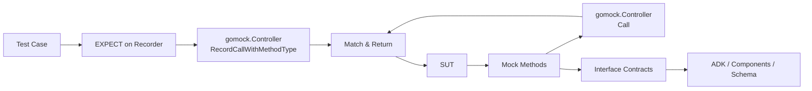

# Mock Utilities 模块技术文档

## 模块概览

`Mock Utilities` 是这个代码库里专门服务测试的"接口替身层"。它解决的核心问题不是业务计算，而是**让复杂依赖（Agent、ChatModel、Document pipeline、Embedding/Retriever/Indexer）在单测里变得可控、可断言、可复现**。你可以把它理解成一套"可编程的替身演员系统"：真实演员（线上组件）很贵、很慢、会受环境影响；替身演员（mock）负责按剧本出场，让你只验证剧情编排是否正确。

想象一下，你正在导演一部电影，但主演（真实组件）日程紧张、费用高昂。你不会用主演来排练每一个场景，而是使用替身演员（mock）来测试镜头角度、灯光效果和动作编排。Mock Utilities 就是这样一个"替身演员经纪公司"，为你提供各种类型的专业替身。

## 1. 这个模块解决什么问题（Problem Space）

在这个仓库中，很多核心接口都天然带有外部性或异步性：

- `adk.Agent.Run` 返回 `*adk.AsyncIterator[*adk.AgentEvent]`
- `BaseChatModel.Generate/Stream` 涉及模型调用与流输出
- `Loader.Load` / `Transformer.Transform` 涉及文档加载和变换
- `Embedder.EmbedStrings`、`Retriever.Retrieve`、`Indexer.Store` 对应向量链路

如果在单测里直接跑真实实现，会遇到三个老问题：

1. **不确定性高**：网络、外部服务、数据状态都会让测试漂移。  
2. **定位困难**：失败时很难区分是“被测逻辑错”还是“依赖波动”。  
3. **维护成本高**：手写 fake 容易和接口签名漂移。

`Mock Utilities` 的选择是：用 `mockgen` 生成强签名 mock，把“依赖行为”收敛为 gomock 的期望-回放模型。

---

## 2. 心智模型（Mental Model）

理解这套模块时，建议脑中固定三层角色：

- **Mock 实例**（如 `MockAgent`, `MockChatModel`, `MockLoader`）：拦截真实调用并转发给 controller。  
- **Recorder**（如 `MockAgentMockRecorder`）：登记“预期会发生什么调用”。  
- **`gomock.Controller`**：运行时仲裁者，匹配调用、返回结果、校验次数与参数。

这像“安检系统”：

- Recorder 是安检规则录入台；
- Mock 方法是闸机；
- Controller 是最终判定系统。

---

## 3. 架构总览与数据流



### 叙事化流程（端到端）

一次典型测试路径如下：

1. 测试代码通过 `NewMock*` 创建 mock（例如 `NewMockAgent`, `NewMockToolCallingChatModel`, `NewMockLoader`）。
2. 调用 `EXPECT()` 获取 recorder，声明预期（如 `Run(...)`, `Generate(...)`, `Retrieve(...)`, `Store(...)`）。
3. 被测对象（SUT）像调用真实依赖一样调用 mock 方法。
4. mock 方法把参数（含 variadic 参数）转发到 `m.ctrl.Call(...)`。
5. gomock 将实际调用与之前登记的期望匹配，返回预设值并做校验。
6. 测试结束时（通常 `ctrl.Finish()`）统一验证交互契约是否满足。

> 这个模块几乎不承载业务语义，核心价值是“交互契约验证”。

---

## 4. 关键设计决策与权衡（Why these choices）

### 决策 A：生成代码（mockgen）优先，而不是手写 fake

**选择**：全部是 `Code generated by MockGen. DO NOT EDIT.` 风格。  
**收益**：接口变更后可重生成，契约漂移会在编译期/测试期尽早暴露。  
**代价**：可读性一般，且不适合承载自定义语义。

### 决策 B：强耦合接口签名（包括 variadic）

**选择**：mock 方法严格复制接口签名，如：

- `Run(ctx, input, options ...adk.AgentRunOption)`
- `Generate(ctx, input, opts ...model.Option)`
- `Load(ctx, src, opts ...document.LoaderOption)`

**收益**：调用契约精准可测。  
**代价**：接口签名一改，相关测试会集体感知（短期“痛”，长期“稳”）。

### 决策 C：薄封装，逻辑外置到 gomock.Controller

**选择**：mock 方法只做参数组装 + `Call`/`RecordCallWithMethodType`。  
**收益**：行为统一、维护面小。  
**代价**：测试作者必须明确设置 `EXPECT` 和 `Return`，否则容易出现零值/匹配失败。

---

## 5. 子模块概览

### 5.1 ADK Agent 方向
见：[adk_agent_mocks](adk_agent_mocks.md)

这个子模块覆盖 `adk.Agent` 与 `adk.OnSubAgents` 的替身实现：`MockAgent`、`MockOnSubAgents` 及其 recorder。重点是测试 Agent 生命周期交互（如 `OnSetSubAgents`、`OnSetAsSubAgent`）和异步运行入口 `Run` 的调用契约，而不是测试真实 agent 推理行为。它让你能够模拟各种代理行为和响应，而不必启动完整的代理运行时。

### 5.2 ChatModel 方向
见：[chat_model_mocks](chat_model_mocks.md)

该子模块覆盖 `MockBaseChatModel`、`MockChatModel`、`MockToolCallingChatModel`。它让你在不触发真实模型服务的前提下验证 `Generate`、`Stream`、`BindTools`、`WithTools` 的参数传递和分支处理。尤其适合验证"工具绑定后是否正确走链路"。你可以精确控制模型的返回值、模拟流式输出、以及测试各种错误场景。

### 5.3 Document Pipeline 方向
见：[document_pipeline_mocks](document_pipeline_mocks.md)

该子模块包含 `MockLoader` 与 `MockTransformer`，用于隔离文档加载/转换依赖。适合测试文档处理编排是否正确调用 `Load` 与 `Transform`，并覆盖错误传播路径。你可以模拟各种文档格式、内容和转换结果，而无需访问真实的文件系统或文档源。

### 5.4 Embedding / Retrieval / Indexing 方向
见：[embedding_retrieval_indexing_mocks](embedding_retrieval_indexing_mocks.md)

该子模块提供 `MockEmbedder`、`MockRetriever`、`MockIndexer`。它支撑 RAG 相关链路的契约测试：输入 query/texts 是否正确、文档结果是否按预期处理、索引返回 ID 是否被上层正确消费。你可以精确控制嵌入向量、检索结果和索引操作的响应，使 RAG 系统的测试变得快速和可靠。

---

## 6. 跨模块依赖关系（How it connects）

`Mock Utilities` 本身处于测试层，但它紧贴以下生产契约模块：

- [ADK Agent Interface](ADK Agent Interface.md)：`Agent`, `OnSubAgents`, `AgentInput`, `AgentEvent`
- [ADK Utils](ADK Utils.md)：`AsyncIterator`
- [Component Interfaces](Component Interfaces.md)：`BaseChatModel`, `ToolCallingChatModel`, `Embedder`, `Source` 等接口定义
- [Schema Core Types](Schema Core Types.md)：`schema.Message`, `schema.ToolInfo`, `schema.Document`
- [Schema Stream](Schema Stream.md)：`schema.StreamReader`
- [model_options_and_callback_extras](model_options_and_callback_extras.md)：`model.Option` 等模型调用选项
- [embedding_retriever_indexer_options_and_callbacks](embedding_retriever_indexer_options_and_callbacks.md)：`embedding.Option`、`retriever.Option`、`indexer.Option`
- [document_loader_transformer_and_parser_options](document_loader_transformer_and_parser_options.md)：`document.LoaderOption`、`document.TransformerOption`

同时，它统一依赖 `go.uber.org/mock/gomock` 作为执行引擎，这是该模块的“单点基础设施依赖”。

---

## 7. 新贡献者操作指南与高频坑

1. **不要手改生成文件**：所有 `*_mock.go` 都应通过 `mockgen` 更新。  
2. **小心 variadic 参数匹配**：`opts ...Option` 在内部是展开传入，不是一个整体切片。  
3. **返回值类型必须精确**：例如 `Retrieve` 必须返回 `[]*schema.Document`。  
4. **`WithTools` 返回接口实例**：若后续要链式调用，别随手返回 `nil, nil`。  
5. **这不是语义模拟器**：它验证调用契约，不验证 LLM 质量、召回质量、索引一致性。  
6. **并发时序需测试层显式断言**：mock 层只负责转发和匹配，不帮你设计并发协议。

---

## 8. 实际使用示例

让我们通过一个完整的例子来说明如何使用这些 mock 组件：

### 测试一个简单的 RAG 系统

```go
func TestRAGSystem(t *testing.T) {
    ctrl := gomock.NewController(t)
    defer ctrl.Finish()
    
    // 创建 mock 组件
    mockRetriever := retriever.NewMockRetriever(ctrl)
    mockModel := model.NewMockChatModel(ctrl)
    
    // 设置检索期望
    testQuery := "什么是 Go 语言？"
    expectedDocs := []*schema.Document{
        {Content: "Go 是一种开源编程语言", Metadata: map[string]any{"source": "doc1"}},
        {Content: "Go 由 Google 开发", Metadata: map[string]any{"source": "doc2"}},
    }
    
    mockRetriever.EXPECT().
        Retrieve(gomock.Any(), testQuery, gomock.Any()).
        Return(expectedDocs, nil)
    
    // 设置模型期望 - 验证输入包含检索到的文档
    mockModel.EXPECT().
        Generate(gomock.Any(), gomock.Any(), gomock.Any()).
        DoAndReturn(func(ctx context.Context, msgs []*schema.Message, opts ...model.Option) (*schema.Message, error) {
            // 验证最后一条消息包含检索到的内容
            lastMsg := msgs[len(msgs)-1]
            assert.Contains(t, lastMsg.Content, "Go 是一种开源编程语言")
            assert.Contains(t, lastMsg.Content, "Go 由 Google 开发")
            
            return &schema.Message{Content: "Go 是 Google 开发的开源编程语言"}, nil
        })
    
    // 创建并测试 RAG 系统
    ragSystem := NewRAGSystem(mockRetriever, mockModel)
    answer, err := ragSystem.Query(context.Background(), testQuery)
    
    assert.NoError(t, err)
    assert.Equal(t, "Go 是 Google 开发的开源编程语言", answer)
}
```

### 测试多代理协调

```go
func TestMultiAgentCoordinator(t *testing.T) {
    ctrl := gomock.NewController(t)
    defer ctrl.Finish()
    
    // 创建 mock agents
    mockResearcher := adk.NewMockAgent(ctrl)
    mockWriter := adk.NewMockAgent(ctrl)
    
    // 设置 researcher 期望
    mockResearcher.EXPECT().Name(gomock.Any()).Return("researcher")
    mockResearcher.EXPECT().Description(gomock.Any()).Return("负责研究任务")
    
    // 创建一个模拟的事件迭代器
    researcherEvents := createMockEventIterator("研究完成")
    mockResearcher.EXPECT().
        Run(gomock.Any(), gomock.Any(), gomock.Any()).
        Return(researcherEvents)
    
    // 设置 writer 期望
    mockWriter.EXPECT().Name(gomock.Any()).Return("writer")
    mockWriter.EXPECT().Description(gomock.Any()).Return("负责写作任务")
    
    writerEvents := createMockEventIterator("写作完成")
    mockWriter.EXPECT().
        Run(gomock.Any(), gomock.Any(), gomock.Any()).
        Return(writerEvents)
    
    // 测试协调器
    coordinator := NewMultiAgentCoordinator([]adk.Agent{mockResearcher, mockWriter})
    result, err := coordinator.Execute(context.Background(), "写一篇关于 AI 的文章")
    
    assert.NoError(t, err)
    assert.Contains(t, result, "研究完成")
    assert.Contains(t, result, "写作完成")
}
```

## 9. 一句话总结

`Mock Utilities` 的架构角色是"测试世界的接口网关"。它牺牲了一部分直观可读性，换来接口契约的一致性、测试的确定性和变更可审计性——对一个快速演进的 agent/LLM 体系来说，这是非常务实且可扩展的选择。