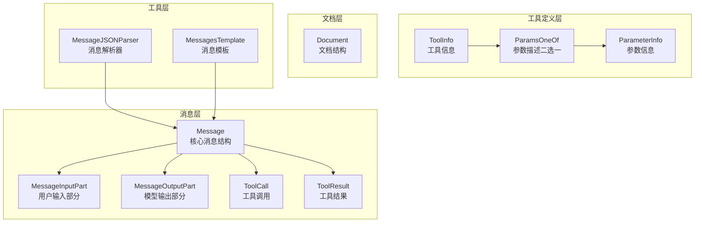
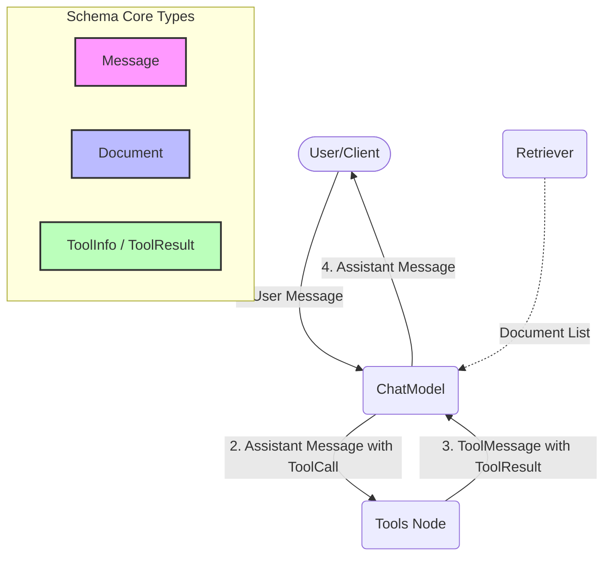

# Schema Core Types 模块深度解析

## 1. 模块概览

Schema Core Types 模块是整个系统的"数据语言"——它定义了所有组件之间交换信息的标准格式和结构。想象一下，如果没有统一的货币，国际贸易将变得混乱不堪；同样，如果没有统一的数据结构，LLM 应用中的各个组件（模型、工具、文档处理）也将无法顺畅地协作。

这个模块解决的核心问题是：**如何用一种统一、可扩展、与具体模型提供商无关的方式，来表示对话历史、工具调用、多模态内容和文档？**

### 为什么需要这个模块？

在 LLM 应用开发中，您可能会遇到这些问题：
- OpenAI 的消息格式和 Anthropic 的不一样，每次换模型都要重写代码
- 工具调用的参数描述没有统一标准，不同模型需要不同的 schema
- 多模态内容（图片、音频、视频）的表示方式五花八门
- 流式输出的消息碎片如何合并成完整消息没有统一逻辑

Schema Core Types 模块就是为了解决这些问题而存在的——它提供了一套"中间语言"，让您的业务逻辑可以专注于功能，而不必纠结于不同提供商的格式差异。

当你看到这个模块时，不要把它仅仅当作一堆结构体（Structs）的集合。请把它想象成整个应用架构的“货币”：`Message` 是交流的货币，`Document` 是知识的货币，而 `ToolInfo` 则是行动的货币。

## 2. 核心架构



### 架构解读

这个模块的设计采用了清晰的分层架构：

1. **消息层**：以 `Message` 为核心，构建了完整的对话表示体系
   - 支持四种角色：`User`（用户）、`Assistant`（助手）、`System`（系统）、`Tool`（工具）
   - 支持纯文本和多模态内容（图片、音频、视频、文件）
   - 内置流式输出合并逻辑

2. **工具定义层**：以 `ToolInfo` 为核心，提供了灵活的工具描述方式
   - 支持两种参数描述方式：简单直观的 `ParameterInfo` 和标准的 `JSONSchema`
   - 内置转换逻辑，可以自动将简单描述转换为 JSONSchema

3. **文档层**：以 `Document` 为核心，表示检索系统中的文档
   - 支持元数据扩展，可以存储向量、分数、子索引等高级信息

4. **工具层**：提供辅助功能，如消息解析和模板渲染

---

## 架构概览与控制流

虽然这个模块主要是数据类型，但它们的设计深刻影响了数据的流转方式。



**数据流转路径：**
1. **对话输入**：用户的文本或多模态内容（图片、音频）被封装为 `Message`（Role: User）。此时，检索器（Retriever）可能会提取出 `Document` 列表，将其内容注入到 `Message` 中。
2. **模型生成**：`Message` 流入 ChatModel。模型返回新的 `Message`（Role: Assistant）。
3. **工具调度**：如果模型决定调用工具，返回的 `Message` 中会包含 `ToolCall` 字段。工具节点（Tools Node）拦截这个消息，利用 `ToolInfo` 的定义进行校验并执行本地函数。
4. **结果回传**：工具执行完毕后，生成包含多模态结果的 `ToolResult`，并被包装为新的 `Message`（Role: Tool）再次传给模型。
5. **最终输出**：模型最终生成纯文本或多模态输出，通过 `MessageParser` 可以将其进一步解析为强类型的结构体。

---

## 3. 核心组件深度解析

### 3.1 Message：系统的"数据货币"

`Message` 是整个模块中最重要的结构——它是所有组件之间交换信息的基本单位。

#### 设计亮点：多模态内容的清晰分离

```go
type Message struct {
    Role RoleType `json:"role"`
    Content string `json:"content"`
    
    // 用户输入的多模态内容
    UserInputMultiContent []MessageInputPart `json:"user_input_multi_content,omitempty"`
    
    // 模型生成的多模态内容
    AssistantGenMultiContent []MessageOutputPart `json:"assistant_output_multi_content,omitempty"`
    
    // ... 其他字段
}
```

**为什么要分开 UserInputMultiContent 和 AssistantGenMultiContent？**

这是一个精心设计的选择。虽然用户输入和模型输出都可能包含多模态内容，但它们的语义和用途完全不同：
- 用户输入的多模态内容是给模型"看"的
- 模型输出的多模态内容是给用户"看"的

如果用同一个字段，就会产生歧义：这个图片是用户发的还是模型生成的？分开两个字段让意图更清晰，也避免了混用导致的 bug。

#### 流式合并：ConcatMessages 的智慧

流式输出是 LLM 应用的常见需求，但如何将流式的消息碎片合并成完整消息是一个挑战。`ConcatMessages` 函数提供了一个优雅的解决方案：

```go
func ConcatMessages(msgs []*Message) (*Message, error) {
    // 1. 检查所有消息的角色和名称是否一致
    // 2. 合并文本内容
    // 3. 合并工具调用（通过 Index 字段匹配）
    // 4. 合并非文本的多模态内容
    // 5. 合并元数据（Token 使用情况、LogProbs 等）
}
```

**关键设计决策：**
- 工具调用通过 `Index` 字段匹配，支持同一轮对话中的多个工具调用
- 非文本的多模态内容（图片、音频等）不合并，只保留完整的
- Token 使用情况取最大值，因为不同 chunk 可能包含不同的统计信息

### 3.2 ToolInfo + ParamsOneOf：灵活的工具描述

工具调用是 LLM 应用的核心能力之一，但不同模型提供商对工具参数的描述方式差异很大。`ToolInfo` 和 `ParamsOneOf` 的设计提供了一种"两全其美"的解决方案。

#### 两种描述方式，自由选择

```go
// 方式一：简单直观的 ParameterInfo（适合大多数场景）
params := map[string]*schema.ParameterInfo{
    "location": {
        Type: schema.String,
        Desc: "城市名称，如北京、上海",
        Required: true,
    },
    "unit": {
        Type: schema.String,
        Desc: "温度单位，可选值为 celsius 或 fahrenheit",
        Enum: []string{"celsius", "fahrenheit"},
    },
}
toolInfo := &schema.ToolInfo{
    Name: "get_weather",
    Desc: "获取指定城市的天气信息",
    ParamsOneOf: schema.NewParamsOneOfByParams(params),
}

// 方式二：标准的 JSONSchema（适合复杂场景）
jsonschema := &jsonschema.Schema{
    // 完整的 JSONSchema 定义
}
toolInfo := &schema.ToolInfo{
    Name: "get_weather",
    Desc: "获取指定城市的天气信息",
    ParamsOneOf: schema.NewParamsOneOfByJSONSchema(jsonschema),
}
```

**为什么设计成 ParamsOneOf？**

这是一个典型的"灵活性与简单性的权衡"：
- 对于 80% 的简单场景，`ParameterInfo` 足够用了，而且更易读易写
- 对于 20% 的复杂场景（需要 oneOf、anyOf、复杂验证等），`JSONSchema` 提供了完整的表达能力

`ParamsOneOf.ToJSONSchema()` 方法会自动将简单描述转换为标准 JSONSchema，这样模型实现只需要处理一种格式即可。

### 3.3 Document：带元数据的知识载体

`Document` 结构看起来很简单，但它的设计体现了"可扩展的简单性"原则：

```go
type Document struct {
    ID string `json:"id"`
    Content string `json:"content"`
    MetaData map[string]any `json:"meta_data"`
}
```

**元数据的妙用：**

`MetaData` 字段是一个 `map[string]any`，这看起来很普通，但模块提供了一系列类型安全的辅助方法：

```go
// 设置和获取子索引（用于多索引搜索）
doc.WithSubIndexes([]string{"index1", "index2"})
doc.SubIndexes()

// 设置和获取向量（用于向量检索）
doc.WithDenseVector([]float64{0.1, 0.2, 0.3})
doc.DenseVector()

// 设置和获取分数（用于重排序）
doc.WithScore(0.95)
doc.Score()
```

这种设计的好处是：
- 核心结构保持简单
- 常用的元数据操作有类型安全的方法
- 新的元数据类型可以通过添加新方法来支持，无需修改核心结构


## 4. 关键设计决策

### 4.1 多模态内容：URL vs Base64Data

在 `MessagePartCommon` 中，您会看到：

```go
type MessagePartCommon struct {
    URL *string `json:"url,omitempty"`
    Base64Data *string `json:"base64data,omitempty"`
    MIMEType string `json:"mime_type,omitempty"`
}
```

**为什么同时支持 URL 和 Base64Data？**

这是基于实际场景的考虑：
- **URL 适合**：公开可访问的资源，不需要额外处理，带宽占用小
- **Base64Data 适合**：私有资源、临时生成的资源、或者需要确保数据不离开系统的场景

两种方式的共存给了开发者选择的自由，同时 `MIMEType` 字段确保了接收方知道如何处理数据。

### 4.2 模板系统：支持三种格式

`MessagesTemplate` 接口支持三种模板格式：
- FString（Python 风格的格式化字符串）
- GoTemplate（Go 标准库模板）
- Jinja2（流行的模板语言）

**为什么要支持这么多？**

这是一个"为了用户体验而增加复杂度"的决策。不同背景的开发者熟悉不同的模板语言：
- Python 开发者习惯 FString 或 Jinja2
- Go 开发者习惯 GoTemplate

支持多种格式降低了学习曲线，让开发者可以用自己最熟悉的方式工作。

### 4.3 向后兼容：旧字段的保留

您可能注意到代码中有一些 `Deprecated` 的字段，如 `MultiContent`。

**为什么不直接删除？**

这是一个关于"演进 vs 断裂"的选择。保留旧字段并标记为 Deprecated，可以：
- 让现有代码继续工作
- 给开发者时间迁移到新 API
- 避免"升级即崩溃"的糟糕体验

这是一个成熟的库应该做的事情——尊重用户的投资。

---

## 5. 数据流与依赖关系

### 5.1 消息的生命周期

让我们追踪一条消息在典型 LLM 应用中的完整旅程：

```
1. 用户输入
   ↓
2. 创建 Message（Role=User，Content=用户输入）
   ↓
3. 模板渲染（可选）：MessagesTemplate.Format()
   ↓
4. 传递给 ChatModel
   ↓
5. ChatModel 返回 Message（Role=Assistant）
   ↓
6. 如果有 ToolCalls：
   a. 解析 ToolCall 参数（MessageJSONParser）
   b. 执行工具
   c. 创建 ToolResult
   d. 转换为 Message（Role=Tool）
   e. 回到步骤 4
   ↓
7. 如果是流式输出：ConcatMessages() 合并碎片
   ↓
8. 展示给用户
```

### 5.2 模块间依赖

Schema Core Types 是整个系统的基础模块，它被几乎所有其他模块依赖：

- **Component Interfaces**：定义的接口使用 Schema 类型作为输入输出
- **Compose Graph Engine**：在节点之间传递 Message 和 Document
- **ADK Agent Interface**：Agent 的输入输出都是 Schema 类型
- **Schema Stream**：处理 Schema 类型的流式数据

这种依赖关系是健康的——基础模块应该是稳定的、被依赖的，而不是依赖其他模块的。

---

## 6. 使用指南与最佳实践

### 6.1 创建消息的正确方式

```go
// ✅ 推荐：使用辅助函数
userMsg := schema.UserMessage("你好")
assistantMsg := schema.AssistantMessage("你好！有什么可以帮你的？", nil)
systemMsg := schema.SystemMessage("你是一个有用的助手")
toolMsg := schema.ToolMessage("天气：晴朗，25°C", "call_123", schema.WithToolName("get_weather"))

// ✅ 推荐：多模态用户输入
multiModalMsg := &schema.Message{
    Role: schema.User,
    UserInputMultiContent: []schema.MessageInputPart{
        {Type: schema.ChatMessagePartTypeText, Text: "这张图片里有什么？"},
        {Type: schema.ChatMessagePartTypeImageURL, Image: &schema.MessageInputImage{
            MessagePartCommon: schema.MessagePartCommon{
                URL: toPtr("https://example.com/image.jpg"),
            },
            Detail: schema.ImageURLDetailHigh,
        }},
    },
}
```

### 6.2 定义工具的最佳实践

```go
// ✅ 推荐：简单场景用 ParameterInfo
params := map[string]*schema.ParameterInfo{
    "query": {
        Type: schema.String,
        Desc: "搜索查询",
        Required: true,
    },
    "limit": {
        Type: schema.Integer,
        Desc: "返回结果数量，默认 10",
        Required: false,
    },
}
toolInfo := &schema.ToolInfo{
    Name: "search",
    Desc: "搜索文档",
    ParamsOneOf: schema.NewParamsOneOfByParams(params),
}

// ✅ 推荐：复杂场景用 JSONSchema（需要 oneOf、anyOf 等）
jsonschema := &jsonschema.Schema{
    // 完整的 JSONSchema 定义
}
toolInfo := &schema.ToolInfo{
    Name: "complex_tool",
    Desc: "复杂工具",
    ParamsOneOf: schema.NewParamsOneOfByJSONSchema(jsonschema),
}
```

### 6.3 解析工具调用参数

```go
// ✅ 推荐：使用 MessageJSONParser
type GetWeatherParams struct {
    Location string `json:"location"`
    Unit string `json:"unit"`
}

config := &schema.MessageJSONParseConfig{
    ParseFrom: schema.MessageParseFromToolCall,
}
parser := schema.NewMessageJSONParser[GetWeatherParams](config)

params, err := parser.Parse(ctx, assistantMsg)
if err != nil {
    // 处理错误
}
```

### 6.4 合并流式消息

```go
// ✅ 推荐：使用 ConcatMessages
var chunks []*schema.Message
for {
    chunk, err := stream.Recv()
    if err == io.EOF {
        break
    }
    if err != nil {
        // 处理错误
    }
    chunks = append(chunks, chunk)
}

fullMsg, err := schema.ConcatMessages(chunks)
if err != nil {
    // 处理错误
}
```

---

## 7. 常见陷阱与注意事项

### 7.1 多模态字段的混用

**❌ 错误：**
```go
// 不要混用 UserInputMultiContent 和 AssistantGenMultiContent
msg := &schema.Message{
    Role: schema.User,
    AssistantGenMultiContent: []schema.MessageOutputPart{...}, // 错了！
}
```

**✅ 正确：**
```go
// 用户输入用 UserInputMultiContent
msg := &schema.Message{
    Role: schema.User,
    UserInputMultiContent: []schema.MessageInputPart{...}, // 对！
}

// 模型输出用 AssistantGenMultiContent
msg := &schema.Message{
    Role: schema.Assistant,
    AssistantGenMultiContent: []schema.MessageOutputPart{...}, // 对！
}
```

### 7.2 URL 和 Base64Data 同时设置

**❌ 错误：**
```go
// 不要同时设置 URL 和 Base64Data
image := &schema.MessageInputImage{
    MessagePartCommon: schema.MessagePartCommon{
        URL: toPtr("https://example.com/image.jpg"),
        Base64Data: toPtr("base64_encoded_data"), // 不要同时设置！
    },
}
```

**✅ 正确：**
```go
// 只设置其中一个
image := &schema.MessageInputImage{
    MessagePartCommon: schema.MessagePartCommon{
        URL: toPtr("https://example.com/image.jpg"), // 或者用 Base64Data
    },
}
```

### 7.3 忘记检查 tool calls 的长度

**❌ 错误：**
```go
// 不要假设 ToolCalls 一定有元素
toolCall := msg.ToolCalls[0] // 可能会 panic！
```

**✅ 正确：**
```go
// 先检查长度
if len(msg.ToolCalls) > 0 {
    toolCall := msg.ToolCalls[0]
    // 处理 toolCall
}
```

### 7.4 ParamsOneOf 的 nil 检查

**❌ 错误：**
```go
// 不要在 ParamsOneOf 为 nil 时调用 ToJSONSchema
var paramsOneOf *schema.ParamsOneOf
js, err := paramsOneOf.ToJSONSchema() // 虽然不会 panic，但要明确意图
```

**✅ 正确：**
```go
// 如果工具不需要参数，明确设置为 nil
toolInfo := &schema.ToolInfo{
    Name: "get_current_time",
    Desc: "获取当前时间",
    ParamsOneOf: nil, // 明确表示不需要参数
}

// 然后在使用时检查
if toolInfo.ParamsOneOf != nil {
    js, err := toolInfo.ParamsOneOf.ToJSONSchema()
    // 处理 js
}
```

---

## 8. 心智模型（Mental Model）

建议新同学脑中保持一个三层模型：

1. **容器层（Container）**：`Message` / `ToolResult` / `Document`，负责“装什么”。
2. **归并层（Reducer）**：`Concat*` 函数，负责“碎片如何合成最终语义”。
3. **契约层（Contract Transformer）**：`ParamsOneOf.ToJSONSchema`、`MessageJSONParser.Parse`，负责“不同表达如何互转”。

类比：
- `Message` 像网络分片后的应用层包；
- `ConcatMessages` 像 TCP 重组 + 语义校验；
- `ParamsOneOf` 像 API 网关的 schema 适配器；
- `Document` 像 RAG 流水线的标准托盘。

---

## 9. 关键数据流（基于代码调用链）

### 9.1 流式消息归并路径

`ConcatMessageStream` -> 循环 `Recv()` 直到 `io.EOF` -> `ConcatMessages`

`ConcatMessages` 内部会：
- 校验 `Role` / `Name` / `ToolCallID` / `ToolName` 一致性；
- 归并 `Content`、`ReasoningContent`；
- 调用 `concatToolCalls` 聚合分片工具调用；
- 调用 `concatAssistantMultiContent` / `concatUserMultiContent` 合并多模态文本（及特定音频分片）；
- 合并 `ResponseMeta`（`FinishReason`、`Usage`、`LogProbs`）。

这是典型“字段级 reducer”而不是“原始字节拼接”。

### 9.2 工具输出回填路径

`ToolResult.ToMessageInputParts` -> `convToolOutputPartToMessageInputPart`

该路径把工具多模态输出（text/image/audio/video/file）转换为模型可接受输入 part。关键约束：`Type` 与具体字段必须匹配，否则报错（如 `ToolPartTypeImage` 但 `Image == nil`）。

### 9.3 工具参数契约路径

`NewParamsOneOfByParams` 或 `NewParamsOneOfByJSONSchema` -> `ParamsOneOf.ToJSONSchema`

如果走 `params` 路径，会递归 `paramInfoToJSONSchema` 并按 key 排序，确保输出稳定；否则直接返回原始 `jsonschema`。

### 9.4 消息到强类型对象路径

`NewMessageJSONParser` -> `MessageJSONParser.Parse` -> `extractData` -> `parse`

- 数据源：`Content` 或首个 `ToolCall` 参数；
- 可选路径提取：`ParseKeyPath`；
- 最终反序列化到泛型 `T`。

## 10. 关键设计决策与取舍（补充）

### 决策 A：严格一致性校验（正确性优先）

`ConcatMessages` 对角色/名称/工具 ID 冲突直接报错，不做“尽量拼”。

- 优点：早失败，避免脏数据悄悄扩散。
- 代价：对上游 chunk 质量要求高。

### 决策 B：多模态拆分 input/output 类型（语义清晰优先）

`MessageInputPart` 与 `MessageOutputPart` 分离，而不是单一大 union。

- 优点：输入输出语义清楚，减少误用。
- 代价：类型数量上升、维护面更大。

### 决策 C：双轨参数描述（易用性与表达力平衡）

`ParamsOneOf` 允许 `ParameterInfo` DSL 或原生 JSON Schema。

- 优点：简单场景好写，复杂场景可逃生。
- 代价：one-of 约束主要靠约定，运行时不强校验。

### 决策 D：开放 MetaData（扩展性优先）

`Document.MetaData map[string]any` 承载扩展。

- 优点：跨模块演进快，不频繁破坏结构体。
- 代价：类型安全后移到运行时。

### 决策 E：模板能力可插拔但限制 Jinja 关键字（安全与能力折中）

`formatContent` 支持 `FString` / `GoTemplate` / `Jinja2`，但 `getJinjaEnv` 禁用 `include/extends/import/from`。

- 优点：降低模板执行侧风险、行为更可预测。
- 代价：Jinja 能力不是 full feature。

---

## 11. 新贡献者高频踩坑清单（补充）

1. **`ConcatMessageArray` 默认访问 `mas[0]`**：调用前必须保证输入非空。
2. **`Message.Format` 不处理 `AssistantGenMultiContent`**：只格式化 `Content`、`MultiContent`、`UserInputMultiContent`。
3. **`MessageJSONParser.Parse` 未对 `m == nil` 防御**：上游需保证非空指针。
4. **`MessageParseFromToolCall` 只取第一个 tool call**：多工具调用场景需先做路由决策。
5. **`ResponseMeta.Usage` 归并是“取最大值”不是“求和”**：这与流式累进计数语义绑定。
6. **`ToolResult` 非文本 part 跨 chunk 冲突会报错**：当前策略偏保守，扩展多模态分片前需先改规则。
7. **`Document.MetaData` 是 `map[string]any`**：跨模块约定键名和类型必须稳定，否则读取方会静默拿默认值。

---

## 12. 实践建议（给刚入组的 senior）

- 把 `ConcatMessages` 当成系统的“事实收敛点”，任何新增消息字段都要同步定义 merge 语义。
- 设计新工具时，先用 `ParameterInfo` 起步；需要复杂 JSON Schema 再切 `NewParamsOneOfByJSONSchema`。
- 引入新的 `Document.MetaData` 键时，务必提供成对 helper（`WithXxx/Xxx`）并统一命名约定。
- 任何“看起来只是字符串”的字段（如 tool arguments）都应尽早转为强类型，避免错误延迟到业务深处。

---

## 13. 总结

Schema Core Types 模块是整个系统的"数据脊梁"——它看似简单，实则蕴含了深思熟虑的设计决策。

**核心价值：**
1. **统一语言**：让所有组件用同一种方式交流
2. **灵活性与简单性的平衡**：简单场景简单用，复杂场景有办法
3. **向后兼容**：尊重用户的投资，平滑演进
4. **多模态原生**：从设计之初就考虑多模态内容

**作为新贡献者，您需要记住：**
- 这个模块是基础，稳定性至关重要
- 修改时要考虑向后兼容性
- 保持核心结构的简单性，通过辅助方法增加功能
- 多模态内容的处理要考虑 URL 和 Base64Data 两种方式

这个模块就像是系统的"语法规则"——它不直接产生价值，但没有它，整个系统就无法顺畅地"对话"。

---

## 14. 子模块详细文档

为了更深入地了解各个组件的实现细节和使用方法，请参考以下子模块文档：

- [消息模块详解](schema_message.md)：深入了解 `Message` 结构的设计、多模态内容处理、流式合并逻辑等
- [工具模块详解](schema_tool.md)：探索工具描述的灵活方式、参数定义的最佳实践
- [文档模块详解](schema_document.md)：了解文档结构、元数据扩展和向量存储
- [消息解析模块详解](schema_message_parser.md)：学习如何将消息解析为强类型对象

## 15. 与其他模块的依赖关系

- 与 [Schema Stream](Schema%20Stream.md)：流式组件高度依赖此模块中的类型。`Message` 是 `StreamReader` 和 `StreamWriter` 中最常见的泛型参数 T。
- 与 [Component Interfaces](Component%20Interfaces.md)：所有的核心组件接口（如 `BaseChatModel`、`Embedder`、`Retriever`）的数据契约全部由本模块提供。
- 与 [Compose Graph Engine](Compose%20Graph%20Engine.md)：本模块的数据类型是在 Graph 节点间传递的默认 `State` 或数据载荷。
- 与 Compose Tool Node：`ToolCall`、`ToolResult`、`Message` 是工具节点编排和回填流程里的核心载体。