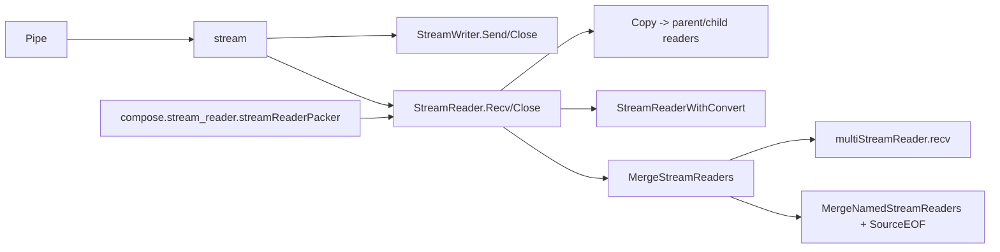

# Schema Stream

`Schema Stream` 模块是 Eino 里“把值一段一段送出去”的基础设施。它解决的不是“怎么传一个值”，而是“怎么在并发、可中断、可组合的场景里，稳定地传一串值，并且让上层还能做复制、合并、类型转换和命名追踪”。如果你把整个系统想成一座工厂，这个模块就是传送带系统：不仅要送货，还要支持分叉、汇流、贴标签、以及异常停机时的可控行为。

## 为什么需要这个模块（问题空间）

在 Go 里，最朴素的流式实现是裸 `chan T`。但在这个工程里，裸 channel 很快不够用：你需要显式关闭语义（发送端结束 vs 接收端提前停止）、需要把一个流复制给多个消费者、需要把多个流并成一个、需要在流上做类型转换并支持“过滤掉某些元素”，还要让上层编排框架（Compose）能把不同类型流统一成抽象接口。单个 `chan` 能做一部分，但这些能力叠加后，调用方会陷入大量样板代码、生命周期泄漏和竞态细节。

`Schema Stream` 的核心设计洞察是：把“流读取”抽象成统一的 `StreamReader[T]`，再在内部用不同 reader 形态（真实 stream / array / multi-stream / convert / child-copy）做多态分发。这样上层只需面对 `Recv()` / `Close()` / `Copy()` 这一小组 API，复杂性被压在模块内部。

## 心智模型：一条主干 + 五种读取器形态

理解这个模块最有效的方式是把 `StreamReader[T]` 想成一个“读取门面（facade）”，内部挂着不同驱动器：

- `readerTypeStream`：真实 channel 驱动（`stream[T]`）
- `readerTypeArray`：静态数组回放（`arrayReader[T]`）
- `readerTypeMultiStream`：多源汇聚（`multiStreamReader[T]`）
- `readerTypeWithConvert`：读取后映射（`streamReaderWithConvert[T]`）
- `readerTypeChild`：由 `Copy` 派生的子读者（`childStreamReader[T]`）

你可以把它类比成“统一电源插座 + 适配器系统”：外部看到一个接口，内部可能接的是市电、移动电源、并联电路或变压器。

## 架构与数据流



典型链路是：`Pipe` 创建一对 `StreamWriter` / `StreamReader`，数据通过 `Send` 写入 `stream.items`，消费者通过 `Recv` 拉取。之后你可以在 reader 侧叠加能力：`Copy` 做一进多出，`StreamReaderWithConvert` 做类型映射与过滤，`MergeStreamReaders` / `MergeNamedStreamReaders` 做汇流。Compose 层通过 `streamReaderPacker` 把它封进图引擎自己的 `streamReader` 抽象，再继续做图节点间流转与检查点转换。

## 组件深潜

### `Pipe[T](cap int)`、`StreamWriter[T]`、`stream[T]`

`Pipe` 是入口工厂，返回一对写端和读端。内部 `stream[T]` 维护两个 channel：`items`（承载 `streamItem{chunk, err}`）和 `closed`（接收端关闭信号）。

这个双通道设计是一个关键取舍：`items` 表示“生产者是否结束”（`closeSend` 会关闭它，读端看到 `io.EOF`），`closed` 表示“消费者不想再收了”（`closeRecv` 关闭它，写端 `send` 会尽早返回 `closed=true`）。它把“自然结束”和“主动取消”拆开，避免单一关闭语义导致双方互相误伤。

`StreamWriter.Send(chunk, err)` 允许每个数据片段携带错误，这让流中错误传播变成 first-class data path，而不是额外 side channel。`send` 在发送前后都检查 `closed`，降低接收端提前关闭时的阻塞风险。

### `StreamReader[T]`：统一门面与类型分派

`StreamReader[T]` 的 `Recv()` / `Close()` 本质是一个基于 `typ` 的 switch 分发器。这个选择牺牲了一点“纯接口式优雅”，换来更低的对象层级和更清晰的内存布局（每种 reader 的状态直接挂在 struct 字段上）。对于高频 `Recv` 路径，这种显式分派比深层接口链更可控。

`toStream()` 是内部桥接函数：无论当前 reader 形态是什么，都可降格成 `*stream[T]`，这让 merge 与 named-merge 能统一处理多种输入来源。

### `StreamReaderFromArray` 与 `arrayReader[T]`

`arrayReader` 提供“静态数组伪流”。它的价值不是性能，而是把非流式数据塞进同一消费模型，避免上层写两套逻辑。`Copy(n)` 对 array 形态是 cheap copy（共享底层 `arr`，复制 `index`），不需要复杂并发结构。

### `StreamReader.Copy(n)`、`copyStreamReaders`、`parentStreamReader` / `childStreamReader`

这是模块里最有设计味道的一段。

`Copy` 的目标是让多个子 reader 都能独立读取同一上游序列。朴素做法通常是“一个 fan-out goroutine + 每个 child 一个缓冲队列”，但会引入缓冲管理、背压不一致和额外 goroutine 生命周期问题。

当前实现使用 `cpStreamElement` 单向链表 + `sync.Once`：

- 所有 child 初始指向同一个“空尾节点”
- 任一 child 首次触达某节点时，`once.Do` 驱动一次真实 `p.sr.Recv()`，把结果写入该节点
- 若不是 EOF，再挂一个新的空尾节点
- 每个 child 只需前进自己的指针，互不阻塞地读取已填充节点

它像“多人共读一本不断续写的笔记”：谁先翻到新页，谁负责把这一页从上游抄下来；其他人随后直接读同一页内容。

隐含契约非常重要：`parentStreamReader.peek` 注释明确“同一个 child 索引不应被并发 Recv”。也就是每个 child reader 应在单 goroutine 中顺序消费，否则你会自己打破它的线程安全假设。

另一个关键行为：所有 child 都 `Close()` 后，父 reader 才会真正 `Close()` 上游（`closedNum` 计数）。这保证了未关闭 child 不会被过早截断。

### `MergeStreamReaders`、`multiStreamReader`

`MergeStreamReaders` 会先把输入 readers 归一化：

- 纯 stream 直接加入合并集合
- array 内容先拼到本地 `arr`
- multi-stream 取其未关闭子流
- convert / child 先 `toStream()`

若只有数组数据，直接返回 array reader；否则构建 `multiStreamReader`。数组和流混合时，数组会被 `arrToStream` 包装成一个 stream 再参与 merge。

`multiStreamReader.recv` 有一个性能导向分支：当输入流数量 `<= maxSelectNum`（在 `schema/select.go` 中是 5）时，使用手写 `select`（`receiveN`）；超过 5 时用 `reflect.Select`。这避免小规模高频场景下反射开销，同时保留大规模多路复用能力。

### `MergeNamedStreamReaders`、`SourceEOF`、`GetSourceName`

命名合并在普通 merge 之上增加“来源结束事件”：某个源结束时，`Recv` 返回 `*SourceEOF`（携带源名），而不是直接吞掉并继续。这样调用方可以感知“哪个支路先结束”，适合做进度跟踪、动态策略切换等场景。

注意这里的语义：`SourceEOF` 不是全局结束；只有当全部源都结束时，才会得到真正的 `io.EOF`。

### `StreamReaderWithConvert`、`ErrNoValue`、`WithErrWrapper`

`StreamReaderWithConvert` 把一个 `StreamReader[T]` 映射成 `StreamReader[D]`。`convert` 返回 `ErrNoValue` 时会跳过该元素（继续读下一条），这使“map + filter”可在一个转换器里完成。

`WithErrWrapper` 用于包装上游 reader 的错误（不是 `convert` 返回的错误）。这在 Compose 层做错误归因、打标签时很实用。

需要特别小心：当前实现中，如果 `errWrapper` 把错误变成 `nil`，`recv()` 会直接返回零值 chunk 与 `nil`，而不是继续读取下一条。注释写的是“nil/ErrNoValue 可忽略 chunk”，但实际行为更接近“返回一次空成功”。因此 wrapper 最安全的用法是返回明确错误或 `ErrNoValue`，不要返回 `nil`。

### `SetAutomaticClose`

这个方法用 `runtime.SetFinalizer` 在对象被 GC 回收时自动调用 `Close`，用于兜底资源释放。它对 `stream` 和 `multiStreamReader` 会设置 `automaticClose`，并通过 `atomic.CompareAndSwapUint32` 防止 finalizer 与手动关闭重复 close channel。

这是“安全网”而不是“正常控制流”：finalizer 触发时机不可预测，且方法本身注明“NOT concurrency safe”。工程实践里仍应显式 `defer sr.Close()`。

## 依赖关系与契约

`Schema Stream` 对外几乎只依赖标准库并发原语，以及 `internal/safe.NewPanicErr`（在 `toStream` 的 goroutine recover 中把 panic 转为可传递错误）。这说明它被设计成低耦合基础层。

更关键的是“谁依赖它”：

`[Compose Graph Engine](compose_graph_engine.md)` 中的 `compose.stream_reader.streamReaderPacker` 直接封装 `*schema.StreamReader[T]`，并调用：

- `Copy`（图分支复制流）
- `MergeStreamReaders` / `InternalMergeNamedStreamReaders`（图汇流）
- `StreamReaderWithConvert`（类型适配、map 包装）
- `Close`

`[Compose Checkpoint](compose_checkpoint.md)` 通过 `streamConvertPair`（见 `compose/generic_helper.go` 与 `compose/checkpoint.go`）把流“压缩为单值再恢复”，其中默认恢复使用 `schema.StreamReaderFromArray([]T{value})`。这意味着检查点恢复后的默认流是“单元素重放流”，不是原始时序流。

数据契约层面，调用方要遵守三件事：

- EOF 契约：`io.EOF` 表示流整体结束；命名合并中 `SourceEOF` 仅表示单源结束。
- 生命周期契约：读完或提前退出都应 `Close`，否则上游可能持续阻塞或泄漏 goroutine。
- 并发契约：单个 child reader 不能多 goroutine 并发 `Recv`。

## 设计决策与权衡

这个模块在多个维度做了明确取舍。

首先是“简单 API vs 内部复杂实现”：外部接口非常小，但内部通过 readerType + 多结构体来承载复杂能力。这对使用者友好，对维护者要求更高。

其次是“性能 vs 通用性”：`multiStreamReader` 对小规模流使用手写 `select`，大规模时才退到 `reflect.Select`，是典型 hot-path 优化。

再者是“正确性 vs 便利性”：`SetAutomaticClose` 提供便利，但并不保证及时关闭；代码鼓励显式 `Close`，自动关闭只是兜底。

最后是“低耦合核心 vs 上层语义扩展”：`Schema Stream` 本身不理解图节点、检查点、Agent，只提供通用流语义；Compose 在其上叠加类型系统、命名、序列化策略。这种分层让基础层稳定，但也要求上层严格遵守契约。

## 使用方式（面向新贡献者）

最常见模式是 `Pipe + goroutine send + Recv loop + Close`：

```go
sr, sw := schema.Pipe[int](8)
go func() {
    defer sw.Close()
    for i := 0; i < 10; i++ {
        if closed := sw.Send(i, nil); closed {
            return
        }
    }
}()

defer sr.Close()
for {
    v, err := sr.Recv()
    if errors.Is(err, io.EOF) {
        break
    }
    if err != nil {
        // handle item-level error
        continue
    }
    _ = v
}
```

做转换与过滤：

```go
out := schema.StreamReaderWithConvert(in, func(v int) (string, error) {
    if v%2 == 0 {
        return "", schema.ErrNoValue // filter out even values
    }
    return fmt.Sprintf("odd_%d", v), nil
})
```

做命名合并并识别单源结束：

```go
merged := schema.MergeNamedStreamReaders(map[string]*schema.StreamReader[string]{
    "tool": toolSR,
    "llm":  llmSR,
})

defer merged.Close()
for {
    chunk, err := merged.Recv()
    if err != nil {
        if name, ok := schema.GetSourceName(err); ok {
            // one source finished
            _ = name
            continue
        }
        if errors.Is(err, io.EOF) {
            break
        }
        // handle non-EOF error
        continue
    }
    _ = chunk
}
```

## 边界条件与坑点

新同学最容易踩的坑集中在生命周期和语义细节。

第一，`Close` 不是可选项。无论是原始 reader、copy 出来的 child reader，还是 convert/merge 后 reader，都应在消费结束后关闭。尤其是提前 `break` 时，不关闭会让上游 writer 长时间拿不到 `closed` 信号。

第二，`Copy` 后原始 reader 语义上应视为“交给复制机制管理”。注释写明“original StreamReader will become unusable after Copy”。在实践里，不要混用原 reader 与 child readers 去并发消费同一上游。

第三，命名 merge 的 `SourceEOF` 会出现多次（每个源一次）。如果你把所有 error 都当成终止条件，会过早退出。

第四，`ErrNoValue` 只应在 `StreamReaderWithConvert` 的 convert 函数里用。它是一个协议值，不是通用业务错误。

第五，`SetAutomaticClose` 非并发安全，且 finalizer 触发不确定。把它当作“防呆”而非“主流程控制”。

第六，`toStream` 在 goroutine 中做 recover 并把 panic 包装成 error 发到流里。这对稳定性很好，但也意味着你可能在消费端看到来自内部 panic 的错误对象；调试时要留意这一层包装。

## 参考阅读

如果你希望继续理解这个模块在系统中的位置，建议按下面顺序读：

- [Schema Core Types](schema_core_types.md)：了解 `schema` 层整体职责边界。
- [Compose Graph Engine](compose_graph_engine.md)：`streamReaderPacker` 如何把 `Schema Stream` 接入图执行模型。
- [Compose Checkpoint](compose_checkpoint.md)：流在检查点持久化中的“流/非流”双向转换。
