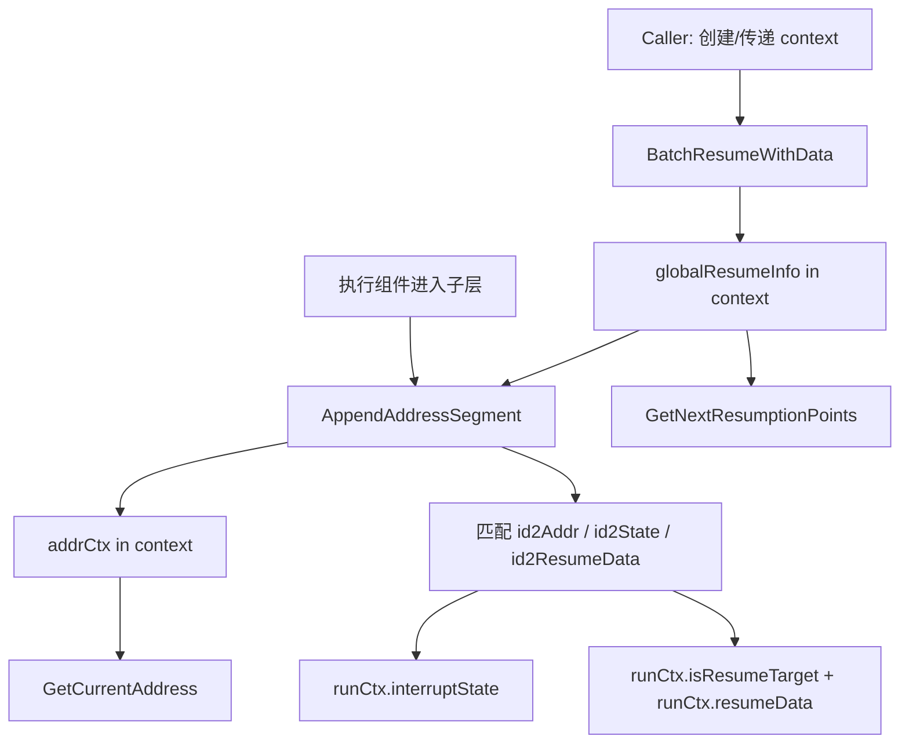

# address_and_resume_routing 深度技术解析

`address_and_resume_routing` 模块本质上是在做一件非常“底层但关键”的事：给一条可能高度嵌套、可中断、可恢复的执行链路，提供**精确寻址**与**恢复路由**能力。你可以把它想成分布式快递系统里的“地址体系 + 转运规则”：中断发生时，系统要知道“包裹（状态）停在哪一层、哪个节点、哪次调用”；恢复时，系统要能把恢复数据准确投递回那个位置，而不是模糊地“从差不多的地方继续”。如果没有这个模块，恢复流程通常会退化为粗粒度重跑、状态错配或恢复点歧义，在复杂 agent/graph/tool 组合场景里几乎不可维护。

---

## 架构视图（概念与数据流）



这个图里有两个并行但协作的“上下文通道”。第一条是 `addrCtx`：它描述“我现在执行到哪里了”（`Address`）以及当前点是否是恢复目标。第二条是 `globalResumeInfo`：它像全局索引，持有“哪些地址需要恢复、对应状态是什么、是否已经消费过”。`AppendAddressSegment` 是路由枢纽：每进入一层执行结构，就把地址向下扩展一段，并尝试从 `globalResumeInfo` 里提取与新地址匹配的恢复状态/恢复数据。

从架构角色看，这个模块是一个**执行上下文路由层（routing layer）**，不是业务执行器。它不决定“要不要中断”，而是保证一旦中断/恢复机制介入，路径定位和数据投递是可预测、可复现、可去重的。

---

## 模块要解决的核心问题（先讲问题，再讲解法）

在嵌套执行结构中（例如 agent 调 graph，graph 节点调 tool，tool 内再含子流程），恢复并不是“回到某个函数”那么简单。真正的问题有三层：

第一层是**位置唯一性**。仅靠一个节点名常常不够，比如并行调用同名 tool 时会冲突。模块通过 `AddressSegment{Type, ID, SubID}` 组合，形成层次地址 `Address`，再通过 `Address.String()` 生成稳定 ID。

第二层是**目标路由**。恢复数据可能一次注入多个目标（批量恢复），执行流在下钻过程中需要动态判断：当前点是不是恢复点？如果不是，它的后代里有没有恢复点（决定是否需要继续执行子层）？这由 `AppendAddressSegment` 内部的匹配与“后代扫描”实现。

第三层是**消费语义**。恢复数据和中断状态如果被重复消费，会导致同一恢复点被重复命中，引发语义错误。模块使用 `id2ResumeDataUsed` 与 `id2StateUsed` 显式记录“已消费”，实现一次性提取。

---

## 心智模型：一棵执行树 + 两本账本

建议新同学脑中始终保持这个模型：

执行过程是一棵不断向下遍历的树，`Address` 是从根到当前节点的“路径”。与此同时，系统维护两本账本：

- 一本是“**恢复目标账本**”：`id2ResumeData` / `id2ResumeDataUsed`
- 一本是“**中断状态账本**”：`id2State` / `id2StateUsed`

`AppendAddressSegment` 每次“进入子节点”时，都会拿当前路径去两本账本里核对并领料：

- 路径命中 -> 领取状态与数据（并标记已用）
- 路径未命中但后代有命中 -> 标记 `isResumeTarget=true`，提示“继续往下走，目标在子树里”

这就是它为什么不仅做地址拼接，还承担恢复路由判断。

---

## 组件深潜（按职责）

### 1) `AddressSegment` 与 `Address`

`AddressSegment` 定义了地址段三元组：

- `Type AddressSegmentType`
- `ID string`
- `SubID string`

设计要点是 `SubID`：注释里明确写了“某些情况下 ID 不够唯一（如并行同名 tool call）”。这是一种很务实的折中：不把唯一性硬编码到 `ID` 语义里，而是提供二级区分位，避免上层为唯一性拼接脆弱字符串。

`Address` 是 `[]AddressSegment`，核心方法：

- `String() string`：序列化为 `Type:ID[:SubID];...`，用于稳定标识
- `Equals(other Address) bool`：逐段比较，避免字符串反序列化

这里选择“结构比较 + 可打印字符串”双轨设计：内部逻辑更安全地用结构比较，外部传输/索引用字符串。

### 2) `addrCtx` / `addrCtxKey`

`addrCtx` 是挂在 `context.Context` 上的运行时局部上下文：

- `addr Address`
- `interruptState *InterruptState`
- `isResumeTarget bool`
- `resumeData any`

它表达的是“当前执行点视角”的信息，不是全局视图。`addrCtxKey` 采用私有空 struct 作为 context key，避免 key 冲突，这是 Go 社区常见实践。

### 3) `globalResumeInfo` / `globalResumeInfoKey`

`globalResumeInfo` 是跨层共享的恢复索引，字段含义非常关键：

- `id2Addr map[string]Address`：恢复 ID 到结构化地址
- `id2State map[string]InterruptState`：恢复 ID 到中断状态
- `id2ResumeData map[string]any`：恢复 ID 到恢复载荷
- `id2StateUsed` / `id2ResumeDataUsed`：一次性消费标记
- `mu sync.Mutex`：并发保护

它是“全局账本”，和 `addrCtx` 的关系是“全局索引 -> 局部提取”。

### 4) `GetCurrentAddress(ctx)`

这是最基础读取接口：从 `addrCtxKey` 取 `*addrCtx`，返回其中 `addr`，取不到返回 `nil`。语义很干净：不抛错，不推断。

### 5) `AppendAddressSegment(ctx, segType, segID, subID)`

这是模块最关键入口。内部可拆成四步：

1. **构造新地址**：在当前地址后追加一段（首段则创建新切片）。
2. **初始化局部运行上下文**：`runCtx := &addrCtx{addr: currentAddress}`。
3. **按地址匹配恢复状态/数据**：遍历 `id2Addr` 找 `Equals(currentAddress)`；命中后按 `used` 标记提取 `id2State` 与 `id2ResumeData`。
4. **后代目标推断**：若当前点不是显式恢复点，再扫描是否存在“以当前地址为前缀且未消费”的目标地址；有则置 `isResumeTarget=true`。

第 4 步是非显然但很重要的设计：复合节点（例如“容器节点”）本身可能不是终点恢复位，但必须知道“子树里有目标”，否则它可能直接跳过子执行，导致永远到不了真正恢复点。

### 6) `GetNextResumptionPoints(ctx)`

功能是“给定当前地址，找下一层直接子恢复点”。实现策略是前缀匹配：

- 候选地址必须比父地址长
- 候选地址必须以父地址为前缀
- 只取 `parentLen : parentLen+1` 这一段作为**直接子层**

返回 `map[string]bool`（child ID 集合），并去重。若 context 中无 `globalResumeInfo`，返回错误。

这个函数在编排器做“选择性下钻”时很有价值：只推进有恢复目标的分支。

### 7) `BatchResumeWithData(ctx, resumeData)`

这是批量注入恢复数据的入口。关键行为：

- 若上下文没有 `globalResumeInfo`，新建并**复制**传入 map（防外部后续修改）
- 若已有，merge 到 `id2ResumeData`
- 初始化 used-map（首次创建时）

这里体现了“可增量注入”的策略：允许分批补充恢复目标，而不强制一次性准备完整全集。

### 8) `PopulateInterruptState(ctx, id2Addr, id2State)`

作用是把“中断 ID -> 地址/状态”映射灌入 `globalResumeInfo`，并尝试立即对当前 `runCtx` 做匹配填充。也就是说，它既是“写全局账本”，也是“当前节点快速对齐”的优化路径。

需要注意：该函数里对 `rInfo` map 的写入与 used 标记更新并非全程在同一临界区；虽然结构上有 `mu`，但加锁粒度并不统一，调用侧最好遵循“单线程初始化后再并发执行”的模式，避免竞态风险。

### 9) `getResumeInfo(ctx)` 与 `InterruptInfo`

- `getResumeInfo`：内部 helper，读取 `globalResumeInfo`
- `InterruptInfo{Info any, IsRootCause bool}`：用户可读中断信息封装，`String()` 用于日志打印

`InterruptInfo` 本身很轻量，真正的路由决策不在它身上，而在地址和账本匹配逻辑。

---

## 关键数据流（端到端）

典型恢复流程可以概括为：

1. 上层先通过 `BatchResumeWithData` 注入 `resumeData`（键是 interrupt ID，通常即地址字符串）。
2. 中断系统把 `id2Addr` 与 `id2State` 通过 `PopulateInterruptState` 注入上下文。
3. 执行器每进入一层结构就调用 `AppendAddressSegment`。
4. `AppendAddressSegment` 用当前 `Address` 去 `id2Addr` 反查 ID，再领取对应 `id2State` / `id2ResumeData`。
5. 命中时写入 `addrCtx.interruptState`、`addrCtx.resumeData` 并标记 `used`；未命中但后代命中则标记 `isResumeTarget=true`。
6. 组件可用 `GetCurrentAddress` 做观测，用 `GetNextResumptionPoints` 决定下一层执行分支。

这条链路把“恢复语义”从业务逻辑中剥离出来，业务组件只需遵循 context 传递与地址追加约定。

---

## 依赖与耦合分析

从代码可直接确认的依赖关系：

- 本模块依赖 `context`、`sync`、`strings`、`fmt` 标准库。
- 依赖 `github.com/cloudwego/eino/internal/generic` 的 `PtrOf`（用于把 `InterruptState` 取地址）。
- 与同一内部核心域的 `InterruptState`（定义见 `interrupt_signal_and_context_bridge`）形成数据契约。

跨模块契约层面（基于类型定义可见性）：

- `InterruptCtx.ID` 注释明确说明 ID 是 fully-qualified address（`Address` 字符串形式），这与本模块 `Address.String()` 形成天然契约对齐。可参考 [interrupt_signal_and_context_bridge](interrupt_signal_and_context_bridge.md)。
- ADK 侧 `ResumeInfo` 暴露 `IsResumeTarget`、`ResumeData`、`InterruptState` 等字段，语义上与本模块在 `addrCtx`/`globalResumeInfo` 中的路由结果一致。可参考 [adk_interrupt](adk_interrupt.md)。

由于当前提供的信息是模块树而非完整调用图，无法在此精确枚举“哪些函数直接调用了 `AppendAddressSegment`”。这部分建议结合全仓库引用检索补齐。

---

## 设计取舍与背后原因

这个模块的设计明显偏向“正确恢复语义优先”，而非最简实现。

首先，它选择了**层次地址 + 前缀路由**，而不是平铺 ID。代价是匹配逻辑更复杂，但换来对子树恢复、复合节点透传、并行同名场景的覆盖能力。

其次，它引入了**一次性消费标记**。这增加了状态管理成本，却避免了恢复数据/状态在嵌套调用中被重复提取，减少“幽灵恢复”这类极难排查的问题。

再次，它把信息放进 `context`，得到天然的调用链传播能力；代价是 compile-time 类型约束变弱，错误更偏运行时暴露。

最后，并发模型采用了“有锁但非全覆盖临界区”的折中。实现上减少了锁持有时间，但也要求调用方不要在未约束的高并发写场景滥用这些入口。

---

## 新贡献者最该注意的坑

最常见错误是地址不稳定。只要 `Type/ID/SubID` 生成策略在重试、并发、恢复前后不一致，恢复就会“找不到点”或“命中错点”。尤其并行同名调用时，`SubID` 不是可选装饰，而是避免冲突的必要维度。

第二个坑是误解 `isResumeTarget`。它不只表示“当前点就是恢复终点”，还可能表示“我的后代里有恢复终点”。因此业务代码看到 `isResumeTarget=true` 不应一概短路退出。

第三个坑是忽略一次性语义。`id2ResumeDataUsed/id2StateUsed` 一旦置位，再次进入同地址可能拿不到原数据，这是设计行为，不是 bug。

第四个坑是上下文丢失。任何中间层如果新建 `context.Background()` 而不是传递已有 ctx，地址链和恢复账本都会断裂。

---

## 使用建议与示例

```go
// 1) 注入恢复数据（可批量）
ctx = BatchResumeWithData(ctx, map[string]any{
    "agent:A;node:graph_a;tool:search:call_1": map[string]any{"q": "resume"},
})

// 2) 注入 interrupt 状态与地址映射
ctx = PopulateInterruptState(ctx, id2Addr, id2State)

// 3) 进入执行层级时追加地址
ctx = AppendAddressSegment(ctx, AddressSegmentType("agent"), "A", "")
ctx = AppendAddressSegment(ctx, AddressSegmentType("node"), "graph_a", "")
ctx = AppendAddressSegment(ctx, AddressSegmentType("tool"), "search", "call_1")

// 4) 组件可读取当前地址
addr := GetCurrentAddress(ctx)
_ = addr.String()

// 5) 组件可查询下一跳恢复子点
next, err := GetNextResumptionPoints(ctx)
_ = next
_ = err
```

实践上，建议把地址段生成策略封装在统一 helper 中，避免不同组件各自拼装导致不一致。

---

## 参考文档

- [interrupt_signal_and_context_bridge](interrupt_signal_and_context_bridge.md)
- [compose_checkpoint](compose_checkpoint.md)
- [compose_interrupt](compose_interrupt.md)
- [adk_interrupt](adk_interrupt.md)

如果你在看调用链编排，建议再结合上层执行引擎文档阅读：

- [compose_graph_engine](compose_graph_engine.md)
- [adk_runner](adk_runner.md)
