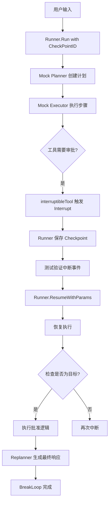

# planexecute_resilience_tests 模块技术深度解析

## 概述

`planexecute_resilience_tests` 模块是 eino 框架中针对 **Plan-Execute-Replan（计划-执行-重规划）** 模式编写的**弹性测试套件**。这个模块解决的问题非常实际：在生产环境中，AI Agent 的执行往往是长时间运行的多步骤流程，如果 중간（途中）发生错误或需要人工介入，如何安全地保存执行状态并支持后续恢复？

想象一下，你正在运行一个复杂的自动化流程，涉及数十次 LLM 调用和工具执行。突然间，流程中的某个工具需要人工审批（比如"确认转账"、"批准删除操作"）。没有弹性机制的话，你只能选择：
1. 中断流程从头再来（浪费计算资源）
2. 硬编码跳过该步骤（绕过安全检查）
3. 祈祷不会中断（不现实）

这个模块通过 **Checkpoint（检查点）** 和 **Interrupt/Resume（中断/恢复）** 机制，让上述问题有了优雅的解决方案。

## 核心组件

本模块包含两个核心测试组件，均位于 `adk/prebuilt/planexecute/plan_execute_test.go` 文件中：

### 1. checkpointStore - 内存检查点存储

```go
type checkpointStore struct {
    data map[string][]byte
}
```

这是一个**内存实现的 CheckpointStore 接口**，用于测试场景中的状态持久化。它的设计遵循了简单的键值存储模式：

- **`Set(ctx, key, value)`**: 将序列化后的执行状态保存到内存 map 中
- **`Get(ctx, key)`**: 根据 key 检索之前保存的状态

**为什么需要这个组件？**

在实际生产环境中，你可能使用 Redis、数据库或文件系统作为 checkpoint 存储。但对于单元测试来说，内存存储更轻量、速度更快，也更容易设置和清理。`checkpointStore` 体现了接口隔离原则 —— 它实现了 `CheckPointStore` 接口，这样测试时可以替换成任何存储实现，而生产代码无需任何改动。

### 2. interruptibleTool - 可中断工具

```go
type interruptibleTool struct {
    name string
    t    *testing.T
}
```

这是一个**模拟需要人工审批的工具**，完美展示了工具层的 Interrupt 机制是如何工作的：

```go
func (m *interruptibleTool) InvokableRun(ctx context.Context, argumentsInJSON string, _ ...tool.Option) (string, error) {
    // 第一次执行：触发中断
    wasInterrupted, _, _ := tool.GetInterruptState[any](ctx)
    if !wasInterrupted {
        return "", tool.Interrupt(ctx, fmt.Sprintf("Tool '%s' requires human approval", m.name))
    }

    // 恢复执行：检查是否是恢复目标
    isResumeTarget, hasData, data := tool.GetResumeContext[string](ctx)
    if !isResumeTarget {
        return "", tool.Interrupt(ctx, fmt.Sprintf("Tool '%s' requires human approval", m.name))
    }

    // 执行批准后的逻辑
    if hasData {
        return fmt.Sprintf("Approved action executed with data: %s", data), nil
    }
    return "Approved action executed", nil
}
```

这个工具的行为可以类比为**机场安检**：
- 第一次通过安检门时，报警器响了，你被拦下（Interrupt）
- 安检人员检查后放行（Resume），你再次通过安检门
- 这次安检门不再报警（因为你是被批准放行的，而不是新通过的）

`interruptibleTool` 利用 `tool.GetInterruptState` 和 `tool.GetResumeContext` 两个函数来区分：
- 初始中断：需要暂停等待审批
- 恢复执行：如果当前工具是被批准的那个，继续执行；否则再次中断

## 架构与数据流

### Plan-Execute-Replan 模式回顾

在深入测试之前，我们需要理解被测系统的架构。根据 `plan_execute.go` 的实现，Plan-Execute-Replan 模式的工作流程如下：

```
用户输入 → [Planner] → 生成执行计划 → 
    [Executor] → 执行第一步 → 
        [Replanner] → 判断完成或重规划 → 
            (循环直到完成)
```

三个子 Agent 的职责：
- **Planner**: 将用户目标分解为可执行的步骤列表
- **Executor**: 逐个执行计划中的步骤
- **Replanner**: 评估执行结果，决定是完成任务还是修订计划

### 测试中的数据流

`TestPlanExecuteAgentInterruptResume` 展示了完整的中断-恢复流程：



**关键步骤解析**：

1. **设置 CheckpointID**: `runner.Run(ctx, userInput, adk.WithCheckPointID("test-interrupt-1"))` - 为执行设置唯一标识，便于后续恢复

2. **触发中断**: 当 `interruptibleTool` 首次执行时，调用 `tool.Interrupt()` 返回错误，这个错误被框架捕获并转换为 `AgentEvent{Action.Interrupted}` 

3. **保存状态**: Runner 自动将以下内容持久化：
   - 执行上下文（`runContext`）
   - 中断信息（哪些组件被中断、地址层级）
   - 中断状态（每个中断点的状态数据）

4. **验证中断事件**: 测试断言中断事件包含：
   - `event.Action.Interrupted` 不为空
   - 有 `InterruptContexts` 列表
   - 存在根因中断 ID（`IsRootCause: true`）

5. **恢复执行**: `runner.ResumeWithParams(ctx, "test-interrupt-1", &adk.ResumeParams{Targets: ...})` 
   - 根据 checkpoint ID 加载之前保存的状态
   - 通过 `Targets` 参数传入审批数据
   - 框架会根据地址层级找到正确的目标工具恢复执行

6. **验证恢复结果**: 检查恢复后的事件流是否：
   - 包含工具响应（"Approved action executed"）
   - 包含助手完成消息
   - 包含 `BreakLoop` 动作（表示流程完成）

## 设计决策与权衡

### 1. 双重模型支持：ChatModelWithFormattedOutput vs ToolCallingChatModel

Planner 支持两种配置方式：

```go
type PlannerConfig struct {
    // 方式1: 使用预配置的结构化输出模型
    ChatModelWithFormattedOutput model.BaseChatModel
    
    // 方式2: 使用工具调用模型 + 工具定义
    ToolCallingChatModel model.ToolCallingChatModel
    ToolInfo *schema.ToolInfo
}
```

**设计权衡**：
- **灵活性 vs 简单性**: 方式1更简单（模型直接输出 JSON），方式2更灵活（模型通过工具调用返回结构化数据）
- **测试覆盖**: 测试用例 `TestNewPlannerWithFormattedOutput` 和 `TestNewPlannerWithToolCalling` 分别覆盖了这两种路径，确保两种配置方式都能正常工作

### 2. 内存 vs 持久化 CheckpointStore

测试使用内存实现而不是真实数据库：

```go
type checkpointStore struct {
    data map[string][]byte
}
```

**权衡分析**：
- **优点**: 测试速度快、无外部依赖、易于清理、不需要 mock 复杂的数据库行为
- **缺点**: 不能测试真正的分布式环境下的持久化保证（如 Redis 集群、数据库事务）
- **当前选择是合理的**: 这是单元测试，关注的是业务逻辑正确性，而非存储可靠性

### 3. Mock 策略：完全控制 vs 真实组件

测试大量使用 `gomock` 创建 mock 对象：

```go
mockToolCallingModel := mockModel.NewMockToolCallingChatModel(ctrl)
mockPlanner := mockAdk.NewMockAgent(ctrl)
```

**为什么不全使用真实组件？**
- **速度**: 真实 LLM 调用耗时且需要 API key
- **确定性**: Mock 可以精确控制返回内容，测试更容易稳定复现
- **隔离性**: 不受外部服务可用性影响

**代价**：
- 如果实现变更，Mock 可能与真实行为不一致
- 需要维护 Mock 的期望设置

### 4. 中断状态的双层检查

代码中使用了两个函数来检查中断状态：

```go
// 层1: 检查是否曾经被中断过
wasInterrupted, hasState, state := tool.GetInterruptState[any](ctx)

// 层2: 检查是否是本次恢复的目标
isResumeTarget, hasData, data := tool.GetResumeContext[string](ctx)
```

**设计意图**：
- `GetInterruptState`: 用于恢复工具的内部状态（比如"执行到第5步"）
- `GetResumeContext`: 用于判断当前调用是恢复流程还是全新执行

这种分离允许：
- 工具在中断时保存复杂的内部状态
- 恢复时精确控制哪些工具需要重新执行、哪些直接通过

## 使用指南与扩展点

### 为现有 Agent 添加中断支持

如果你有一个现有工具需要支持人工审批，只需三步：

```go
// 1. 工具实现
func (t *MyTool) InvokableRun(ctx context.Context, args string, opts ...Option) (string, error) {
    // 检查是否需要审批
    if needsHumanApproval(args) {
        return "", tool.Interrupt(ctx, "需要人工审批")
    }
    
    // 检查是否是恢复执行
    wasInterrupted, _, _ := tool.GetInterruptState[any](ctx)
    if wasInterrupted {
        isTarget, hasData, data := tool.GetResumeContext[string](ctx)
        if isTarget {
            return executeApproved(args, data), nil
        }
        // 不是目标，重新中断
        return "", tool.Interrupt(ctx, "等待审批")
    }
    
    return execute(args), nil
}

// 2. 配置 Agent 时提供 CheckpointStore
runner := adk.NewRunner(ctx, adk.RunnerConfig{
    Agent:           myAgent,
    CheckPointStore: myCheckpointStore, // 必须实现 CheckPointStore 接口
})

// 3. 运行和恢复
iter := runner.Run(ctx, messages, adk.WithCheckPointID("unique-id"))

// 恢复时
resumeIter, err := runner.ResumeWithParams(ctx, "unique-id", &adk.ResumeParams{
    Targets: map[string]any{
        "interrupt-id-1": "approved-data",
    },
})
```

### 配置 CheckpointStore

框架支持多种存储后端，只需要实现接口：

```go
type CheckPointStore interface {
    Set(ctx context.Context, key string, value []byte) error
    Get(ctx context.Context, key string) ([]byte, bool, error)
}
```

常见的实现方式：
- **Redis**: 适合分布式环境，提供 TTL 支持
- **数据库**: 适合需要强一致性的场景
- **文件系统**: 简单场景，直接存储为文件

### 自定义中断行为

使用 `tool.Interrupt` 的变体：

```go
// 基础中断
return "", tool.Interrupt(ctx, "需要审批")

// 带状态的中断（恢复时需要）
return "", tool.StatefulInterrupt(ctx, "处理中", MyState{Step: 1})

// 复合中断（工具内部调用了图或其他可中断组件）
return "", tool.CompositeInterrupt(ctx, "图中断", myState, subErrors...)
```

## 常见陷阱与注意事项

### 1. CheckPointStore 必须实现完整接口

常见的错误是只实现了 `Set` 而忘记 `Get`，或者返回了错误的"是否存在"标志。检查点加载失败时会返回明确错误：

```go
data, existed, err := r.store.Get(ctx, checkpointID)
if !existed {
    return nil, nil, nil, fmt.Errorf("checkpoint[%s] not exist", checkpointID)
}
```

### 2. Resume 时必须使用正确的 CheckpointID

```go
// 错误: 改变了 checkpoint ID
iter := runner.Run(ctx, messages, adk.WithCheckPointID("first-run"))
resumeIter, err := runner.ResumeWithParams(ctx, "different-id", params) // 找不到!

// 正确: 使用相同的 ID
iter := runner.Run(ctx, messages, adk.WithCheckPointID("my-execution"))
resumeIter, err := runner.ResumeWithParams(ctx, "my-execution", params) // 正确
```

### 3. 工具恢复时的"再中断"逻辑

如果多个工具都可能触发中断，恢复执行时**不是所有工具都会直接通过**。框架会重新执行到中断点，但只有**被明确指定为目标**的工具才会真正执行：

```go
// 在 interruptibleTool 中的逻辑
isResumeTarget, hasData, _ := tool.GetResumeContext[string](ctx)
if !isResumeTarget {
    // 不是恢复目标，重新中断（这是正确的！）
    return "", tool.Interrupt(ctx, "...")
}
```

### 4. 序列化兼容性

CheckPointStore 保存的数据使用 Go 的 `gob` 编码：

```go
func (r *Runner) saveCheckPoint(...) error {
    // ...
    err := gob.NewEncoder(buf).Encode(&serialization{...})
    // ...
}
```

**警告**: 序列化结构中的字段变更（如重命名、类型改变）会导致旧 Checkpoint 无法恢复。这是典型的**破坏性变更**，需要谨慎处理。

### 5. 中断上下文中的地址层级

中断事件中的 `InterruptContexts` 包含完整的地址层级，用于精确追踪中断发生的位置：

```go
// 假设执行路径是: plan_execute_replan -> execute_replan -> executor -> approve_action
// 中断上下文会包含每一层的地址信息
for _, ctx := range interruptEvent.Action.Interrupted.InterruptContexts {
    t.Logf("Address: %v", ctx.Address)
    // 可能输出: [agent/plan_execute_replan, agent/execute_replan, agent/executor, tool/approve_action]
}
```

## 相关模块参考

- **[planexecute_core_and_state](adk-prebuilt-agents-planexecute-core-and-state.md)**: Plan-Execute-Replan 模式的完整实现，包含 Planner、Executor、Replanner 的具体逻辑
- **[interrupt_and_addressing_runtime_primitives](internal_runtime_and_mocks-interrupt_and_addressing_runtime_primitives.md)**: 中断机制的核心运行时实现，包括中断状态的传播和恢复
- **[checkpointing_and_rerun_persistence](compose_graph_engine-checkpointing_and_rerun_persistence.md)**: 检查点持久化的底层实现细节

## 总结

`planexecute_resilience_tests` 模块虽然以测试文件的形式存在，但它实际上是对 **eino 框架弹性能力** 的完整验证。通过这个模块，你可以理解：

1. **Checkpoint 机制**: 如何在长时间运行的 Agent 流程中保存状态
2. **Interrupt/Resume 模式**: 如何优雅地处理需要人工介入的场景
3. **工具层的中断支持**: 工具如何与框架的中断机制配合
4. **测试策略**: 如何通过 Mock 实现可预测、可重复的集成测试

这些能力使得 eino 框架能够支撑生产级别的 AI Agent 应用，在复杂的多步骤任务中保持可靠性和可控性。