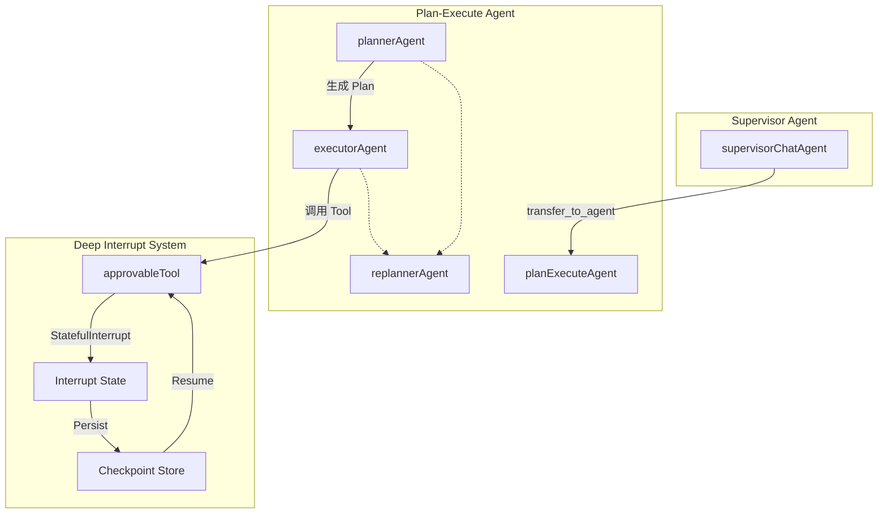

# cross_prebuilt_integration_scenarios 模块技术深度解析

## 模块概述

这个模块是一个集成测试文件，演示了 ADK 框架中多个预置组件协同工作的复杂场景：**Supervisor 模式**、**Plan-Execute-Replan 模式**以及**深度中断/恢复机制**的组合使用。

### 解决的问题

在企业级 AI Agent 应用中，单一 agent 通常无法完成复杂的业务任务，需要多个 agent 协作完成。典型的挑战包括：

1. **任务分解与委托**： Supervisor 需要将复杂任务委托给专门的子 agent，同时保留对整体流程的控制权
2. **多步骤执行规划**： 子任务本身可能需要多步骤的计划、执行和重规划能力
3. **人工审批介入**： 某些敏感操作（如资金分配、数据删除）需要人工审批后才能继续执行
4. **状态持久化与恢复**： 审批流程可能跨越较长时间，需要将 agent 执行状态持久化，并在审批通过后从中断点恢复

一个 naive 的解决方案是在每个 agent 内部硬编码这些逻辑，但这会导致：
- 代码重复
- 职责边界不清
- 难以复用和测试

本模块展示了如何通过组合现有的 Supervisor、PlanExecute 和 Interrupt/Resume 机制来解决这些问题。

## 架构设计

### 核心组件



### 组件职责

| 组件 | 角色 | 说明 |
|------|------|------|
| `supervisorChatAgent` | 协调者 | Supervisor 模式的顶层 agent，负责接收用户请求并委托给子 agent |
| `planExecuteAgent` | 执行者 | Plan-Execute-Replan 模式的实现，包含 planner、executor、replanner 三个子 agent |
| `approvableTool` | 可审批工具 | 一个需要人工审批才能执行的工具，展示深度中断机制 |
| `integrationCheckpointStore` | 持久化存储 | 内存实现的检查点存储，用于保存中断状态 |
| `approvalInfo` | 中断信息 | 工具中断时传递给上层的用户可见信息 |
| `approvalResult` | 审批结果 | 用户审批或拒绝时传递的数据结构 |

### 数据流分析

```
1. 用户输入
   ↓
2. Runner.Run() 启动 Supervisor Agent
   ↓
3. Supervisor 决定将任务委托给 project_execution_agent (PlanExecute Agent)
   ↓
4. PlanExecute Agent 的 Planner 生成执行计划: ["Allocate budget", "Complete task"]
   ↓
5. Executor 执行第一步：调用 allocate_budget 工具
   ↓
6. approvableTool 检测到需要审批，调用 tool.StatefulInterrupt()
   ↓
7. 中断信号层层上报：Tool → Executor → Replanner → PlanExecute → Supervisor → Runner
   ↓
8. Runner 检测到中断，保存检查点到 store，然后返回中断事件
   ↓
9. 用户审批（通过 runner.ResumeWithParams）
   ↓
10. Runner 从检查点恢复状态，重新路由到被中断的工具
   ↓
11. approvableTool 收到 approvalResult{Approved: true}，继续执行
   ↓
12. 执行完成后，PlanExecute 继续重规划，确认任务完成
   ↓
13. Supervisor 获得最终响应，返回给用户
```

## 核心组件深度解析

### approvableTool — 可中断工具的实现

这是本模块最核心的设计展示：如何让一个工具在执行过程中暂停，等待外部输入后再继续。

```go
func (m *approvableTool) InvokableRun(ctx context.Context, argumentsInJSON string, _ ...tool.Option) (string, error) {
    // 第一次执行：触发中断
    wasInterrupted, _, storedArguments := tool.GetInterruptState[string](ctx)
    if !wasInterrupted {
        return "", tool.StatefulInterrupt(ctx, &approvalInfo{
            ToolName:        m.name,
            ArgumentsInJSON: argumentsInJSON,
            ToolCallID:      compose.GetToolCallID(ctx),
        }, argumentsInJSON)  // 保存原始参数作为状态
    }

    // 恢复执行：检查是否被选为目标
    isResumeTarget, hasData, data := tool.GetResumeContext[*approvalResult](ctx)
    if !isResumeTarget {
        // 不是恢复目标，重新中断（保持等待状态）
        return "", tool.StatefulInterrupt(ctx, &approvalInfo{
            ToolName:        m.name,
            ArgumentsInJSON: storedArguments,
            ToolCallID:      compose.GetToolCallID(ctx),
        }, storedArguments)
    }

    // 处理恢复数据
    if data.Approved {
        return fmt.Sprintf("Tool '%s' executed successfully with args: %s", m.name, storedArguments), nil
    }
    // ... 处理拒绝情况
}
```

**设计意图**：

1. **双阶段执行模式**：工具通过检查 `GetInterruptState` 判断是首次执行还是恢复执行
2. **状态保存**：使用 `StatefulInterrupt` 的第二个参数保存工具的内部状态（本例中是原始参数），确保恢复时能继续工作
3. **恢复目标判断**：`GetResumeContext` 用于区分"我是恢复目标"和"我只是被重新执行"

这种设计类似于 HTTP 的 idempotent 特性：无论中断点在哪里，恢复流程都能正确工作。

### approvalInfo — 中断信息的传递

```go
type approvalInfo struct {
    ToolName        string
    ArgumentsInJSON string
    ToolCallID      string
}
```

这个结构体承载了工具中断时需要让上层知晓的信息。值得注意的是，这些信息会被序列化后存入检查点，因此：

- 必须使用可序列化的类型
- 应该只包含必要的调试/展示信息，不包含敏感的大数据

### integrationCheckpointStore — 轻量级测试存储

```go
type integrationCheckpointStore struct {
    data map[string][]byte
}
```

这是一个内存实现的检查点存储，专门用于集成测试。真实环境中，你会使用 Redis、数据库或文件系统实现。

## 设计决策与权衡

### 1. 深度中断 vs 浅层中断

**设计选择**：采用深度中断（Deep Interrupt）机制，即中断可以穿透 agent 边界向上传播。

**权衡分析**：
- **优势**：Supervisor 可以感知到子 agent 内部的中断，作出更智能的决策
- **劣势**：实现复杂度高，需要完整的状态传递链路

如果使用浅层中断，子 agent 的中断只会停留在子 agent 内部，Supervisor 无法感知，审批流程就无法实现。

### 2. 有状态中断 vs 无状态中断

**设计选择**：使用 `tool.StatefulInterrupt` 保存工具参数作为状态。

**权衡分析**：
- **无状态中断**（`tool.Interrupt`）：适用于工具可以完全重新执行的情况
- **有状态中断**（`tool.StatefulInterrupt`）：适用于工具执行有副作用或需要恢复现场的情况

本例中需要保存原始参数，因为工具需要在恢复后使用相同的参数执行。

### 3. 同步审批 vs 异步审批

**设计选择**：通过检查点机制支持异步审批。

这允许审批流程跨越任意时间长度——用户可能几秒后审批，也可能几天后才审批。框架会自动持久化必要状态。

## 扩展点与使用方式

### 创建可审批工具

```go
type MyApprovableTool struct {
    name string
}

func (t *MyApprovableTool) Info(ctx context.Context) (*schema.ToolInfo, error) {
    return &schema.ToolInfo{
        Name: t.name,
        // ...
    }, nil
}

func (t *MyApprovableTool) InvokableRun(ctx context.Context, args string, opts ...tool.Option) (string, error) {
    wasInterrupted, hasState, savedState := tool.GetInterruptState[string](ctx)
    
    if !wasInterrupted {
        // 首次执行：触发中断
        return "", tool.StatefulInterrupt(ctx, MyApprovalInfo{
            ToolName: t.name,
            Args:     args,
        }, args)
    }
    
    // 恢复执行
    isTarget, hasData, data := tool.GetResumeContext[MyApprovalResult](ctx)
    if !isTarget {
        // 重新中断
        return "", tool.StatefulInterrupt(ctx, MyApprovalInfo{...}, savedState)
    }
    
    if data.Approved {
        // 执行实际逻辑
        return doSomething(args), nil
    }
    return "Operation denied", nil
}
```

### 配置检查点存储

```go
store := &MyCheckPointStore{...} // 实现 CheckPointStore 接口
runner := adk.NewRunner(ctx, adk.RunnerConfig{
    Agent:           agent,
    CheckPointStore: store,
})
```

### 执行与恢复

```go
// 启动执行
iter := runner.Run(ctx, messages, adk.WithCheckPointID("my-checkpoint"))

// 等待中断
event := <-iter
interruptID := event.Action.Interrupted.InterruptContexts[0].ID

// ... 用户审批 ...

// 恢复执行
resumeIter, err := runner.ResumeWithParams(ctx, "my-checkpoint", &adk.ResumeParams{
    Targets: map[string]any{
        interruptID: &MyApprovalResult{Approved: true},
    },
})
```

## 已知限制与注意事项

### 1. 状态序列化限制

使用 `tool.StatefulInterrupt` 保存的状态必须能够被 `encoding/gob` 序列化。自定义类型需要满足 gob 序列化要求（通常是导出字段）。

### 2. 恢复目标的确定性

当有多个工具实例或并行执行时，正确判断恢复目标很重要。框架通过 `InterruptContext.ID` 来精确路由恢复数据。

### 3. 检查点存储的生命周期

检查点应该在不再需要时清理，否则会造成存储泄漏。真实环境应该实现 TTL 机制。

### 4. 嵌套 Supervisor 的中断传播

如果 Supervisor 嵌套多层，中断会逐层传播。设计时需要考虑最顶层的 Runner 能否正确处理多层的 InterruptContext。

## 相关模块

- [supervisor-agent-configuration-and-tests](adk-prebuilt-supervisor-agent-configuration-and-tests.md) — Supervisor 模式实现
- [planexecute-core-and-state](adk-prebuilt-planexecute-core-and-state.md) — Plan-Execute-Replan 模式实现
- [interrupt-and-runner-test-harnesses](adk-runtime-interrupt-and-runner-test-harnesses.md) — 中断机制测试工具
- [runner-execution-and-resume](adk-runtime-runner-execution-and-resume.md) — Runner 的执行与恢复逻辑
- [compose-interrupt](compose-interrupt.md) — Compose 层的_interrupt.go 模块