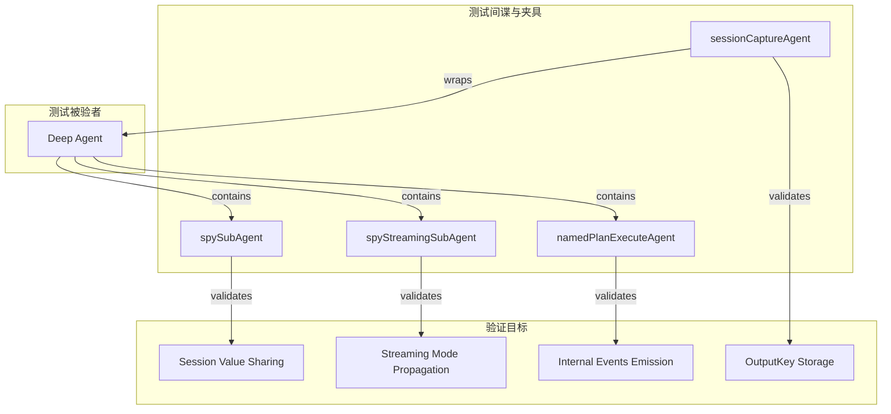

# deep_agent_test_spies_and_harnesses 技术深度解析

> 本文档面向刚加入团队的高级工程师，假设你已经熟悉 Go 语言和基本的 Agent 架构设计。我们将深入探讨这个测试模块的设计意图、架构角色以及关键设计决策背后的考量。

## 概述

`deep_agent_test_spies_and_harnesses` 模块（对应文件 `adk/prebuilt/deep/deep_test.go`）是 Deep Agent 的**测试基础设施模块**，它不实现任何业务逻辑，而是提供了一套精心设计的**测试间谍（Spy）**和**测试 Harness（测试夹具）**，用于验证 Deep Agent 在复杂场景下的行为正确性。

**这个模块解决的核心问题是**：如何验证一个多层次 Agent 系统中的隐式行为——比如父 Agent 与子 Agent 之间的上下文共享、流式模式的传递、以及内部事件的正确分发。这些行为在常规功能测试中很难被直接观察和断言。

试想一个场景：当你在 Deep Agent 中配置了一个子 Agent，然后通过 Runner 执行一个对话。你如何知道子 Agent 能否看到父 Agent 设置的 Session 值？你如何验证流式模式是否正确传递给了子 Agent？这正是这个模块要回答的问题。

## 架构设计



### 核心组件角色

| 组件 | 角色 | 验证的行为 |
|------|------|------------|
| `spySubAgent` | 轻量级测试间谍 | 父 Agent 的 Session 值能否传递给子 Agent |
| `spyStreamingSubAgent` | 流式模式测试间谍 | `EnableStreaming` 标志是否正确传递 |
| `namedPlanExecuteAgent` | Plan-Execute 适配器 | 将通用 Agent 包装为命名的子 Agent |
| `sessionCaptureAgent` | Session 捕获 Harness | 拦截 Agent 执行并捕获最终的 Session 状态 |

## 核心组件深度解析

### 1. spySubAgent —— 上下文共享的验证者

```go
type spySubAgent struct {
    seenParentValue any
}

func (s *spySubAgent) Name(context.Context) string        { return "spy-subagent" }
func (s *spySubAgent) Description(context.Context) string { return "spy" }
func (s *spySubAgent) Run(ctx context.Context, _ *adk.AgentInput, _ ...adk.AgentRunOption) *adk.AsyncIterator[*adk.AgentEvent] {
    s.seenParentValue, _ = adk.GetSessionValue(ctx, "parent_key")
    // ... 返回一个包含助手消息的事件迭代器
}
```

**设计意图**：`spySubAgent` 是一个极简的 Agent 实现，它的核心逻辑只有一个——在 `Run` 方法执行时尝试从 context 中读取名为 `parent_key` 的 Session 值。通过这个值是否被正确设置，我们可以验证 Deep Agent 在调用子 Agent 时是否正确传递了父级的 Session 上下文。

**为什么不用普通的 Mock**：普通的 Mock Agent 只会验证方法是否被调用，而不会验证调用时的上下文参数。`spySubAgent` 的设计让我们能够"透视"子 Agent 接收到的实际状态。

**测试用例解读**（`TestDeepSubAgentSharesSessionValues`）：

```go
// 1. 通过 adk.WithSessionValues 传入父 Session 值
it := r.Run(ctx, []adk.Message{schema.UserMessage("hi")}, 
    adk.WithSessionValues(map[string]any{"parent_key": "parent_val"}))

// 2. spySubAgent 在执行时尝试读取这个值
// 3. 测试断言: assert.Equal(t, "parent_val", spy.seenParentValue)
```

### 2. spyStreamingSubAgent —— 流式传递的验证者

```go
type spyStreamingSubAgent struct {
    seenEnableStreaming bool
}

func (s *spyStreamingSubAgent) Run(ctx context.Context, input *adk.AgentInput, _ ...adk.AgentRunOption) *adk.AsyncIterator[*adk.AgentEvent] {
    if input != nil {
        s.seenEnableStreaming = input.EnableStreaming
    }
    // ...
}
```

**设计意图**：这个测试间谍验证 `EnableStreaming` 标志是否通过 `AgentInput` 正确传递给了子 Agent。在流式交互场景中，这个标志决定了模型调用是使用 `Stream()` 还是 `Generate()` 方法，因此它的正确传递至关重要。

**与 spySubAgent 的对比**：两者都验证输入参数的传递，但 `spySubAgent` 验证的是 Context 中的 Session 状态（通过 `adk.GetSessionValue` 读取），而 `spyStreamingSubAgent` 验证的是 `AgentInput` 结构体中的字段。这是两种不同的上下文传递机制。

### 3. sessionCaptureAgent —— Session 状态的捕获器

```go
type sessionCaptureAgent struct {
    adk.Agent
    captureSession func(map[string]any)
}

func (s *sessionCaptureAgent) Run(ctx context.Context, input *adk.AgentInput, opts ...adk.AgentRunOption) *adk.AsyncIterator[*adk.AgentEvent] {
    innerIt := s.Agent.Run(ctx, input, opts...)
    it, gen := adk.NewAsyncIteratorPair[*adk.AgentEvent]()
    go func() {
        defer gen.Close()
        for {
            event, ok := innerIt.Next()
            if !ok {
                break
            }
            gen.Send(event)
        }
        // 关键：在所有事件处理完毕后捕获 Session 状态
        s.captureSession(adk.GetSessionValues(ctx))
    }()
    return it
}
```

**设计意图**：这个 Harness 使用了**装饰器模式**。它包装了一个真实的 Agent，并在其执行完成后（所有事件都已输出）捕获当前的 Session 状态。这种设计特别适合验证 `OutputKey` 功能——即 Agent 的输出是否被正确存储到 Session 中。

**为什么需要在所有事件处理完后捕获**：在流式输出的场景下，最终的响应内容可能是分块返回的。只有当整个 Agent 执行流程完成后，Session 中的值才是完整的。

**测试用例解读**（`TestDeepAgentOutputKey`）：

```go
// OutputKey 配置会将 Agent 输出存储到 Session
agent, err := New(ctx, &Config{
    // ...
    OutputKey: "deep_output",
})

// 使用 sessionCaptureAgent 捕获执行后的 Session
wrappedAgent := &sessionCaptureAgent{
    Agent:          agent,
    captureSession: func(values map[string]any) { capturedSessionValues = values },
}

// 验证 Session 中包含正确的输出
assert.Contains(t, capturedSessionValues, "deep_output")
assert.Equal(t, "Hello from DeepAgent", capturedSessionValues["deep_output"])
```

### 4. namedPlanExecuteAgent —— 子 Agent 的适配器

```go
type namedPlanExecuteAgent struct {
    adk.ResumableAgent
    name        string
    description string
}

func (n *namedPlanExecuteAgent) Name(_ context.Context) string {
    return n.name
}

func (n *namedPlanExecuteAgent) Description(_ context.Context) string {
    return n.description
}
```

**设计意图**：这个组件解决了一个关键问题——Plan-Execute Agent（计划执行 Agent）本身没有自定义名称，它内部的 Planner、Executor、Replanner 子组件使用默认名称。在测试内部事件分发时，我们需要能够根据名称区分不同 Agent 的事件。通过包装一个 `adk.ResumableAgent` 并显式设置 `name` 和 `description`，我们可以让事件路由变得可追踪。

**使用场景**：在 `TestDeepAgentWithPlanExecuteSubAgent_InternalEventsEmitted` 测试中，我们验证当使用 Plan-Execute 作为子 Agent 时，其内部组件（planner、executor、replanner）的事件是否能够正确上报到父 Agent。

## 数据流分析

### 场景一：Session 值共享

```
Runner.Run()
    │
    ▼
Deep Agent 执行
    │
    ├── 调用 spySubAgent.Run(ctx, input, opts...)
    │       │
    │       ▼
    │   adk.GetSessionValue(ctx, "parent_key")
    │       │
    │       ▼
    │   返回 "parent_val" (如果传递正确)
    │       │
    ▼
测试断言: spy.seenParentValue == "parent_val"
```

关键传递路径：
1. `Runner` 接收 `WithSessionValues` 选项
2. `Runner` 将 Session 值通过 `adk.AgentInput` 的 Context 传递给 Deep Agent
3. Deep Agent 在调用子 Agent 时，需要将这些值注入到子 Agent 的 Context 中
4. 子 Agent 通过 `adk.GetSessionValue` 读取

**这是一个跨 Agent 边界的上下文传播问题**，也是多 Agent 系统中常见的设计挑战。

### 场景二：OutputKey 存储

```
Deep Agent (配置了 OutputKey: "deep_output")
    │
    ▼
模型 Generate/Stream 调用
    │
    ▼
获取最终响应 "Hello from DeepAgent"
    │
    ▼
adk.AddSessionValue(ctx, "deep_output", "Hello from DeepAgent")
    │
    ▼
Runner 迭代完成
    │
    ▼
sessionCaptureAgent 捕获 Session
    │
    ▼
验证 capturedSessionValues["deep_output"] == "Hello from DeepAgent"
```

这个流程展示了 Deep Agent 如何将最终输出持久化到 Session 中，供后续的 Agent 或外部系统使用。

## 设计决策与权衡

### 1. 为什么使用轻量级 Spy 而不是完整 Mock？

**选择**：每个测试间谍只有十几行代码，实现了最小必要的接口。

**理由**：
- **关注点分离**：我们只关心验证特定行为（Session 传递、流式标志），而不需要模拟整个 Agent 的复杂逻辑
- **减少脆弱性**：如果使用完整的 Mock，任何 Agent 实现的内部变化都可能导致测试失败
- **可读性**：测试代码清晰表达了我们验证的行为，而不是隐藏在意图不明确的 Mock 配置中

**替代方案**：如果需要验证更复杂的行为（如工具调用参数、消息序列），可以考虑使用 `gomock` 配合更精细的期望设置。

### 2. 为什么 sessionCaptureAgent 使用 goroutine 进行事件转发？

```go
go func() {
    defer gen.Close()
    for {
        event, ok := innerIt.Next()
        if !ok {
            break
        }
        gen.Send(event)
    }
    // 在所有事件处理完后才捕获 Session
    s.captureSession(adk.GetSessionValues(ctx))
}()
```

**设计选择**：将内部迭代器的事件异步转发到外部迭代器，并在转发完成后捕获 Session 状态。

**权衡考量**：
- **正确性优先**：必须在所有事件输出完成后才能捕获最终 Session 状态，因为 `OutputKey` 的值可能依赖于完整的执行流程
- **非阻塞**：异步转发确保了不会因为 Session 捕获而阻塞事件的输出
- **潜在风险**：如果事件迭代器没有正确关闭，可能导致 goroutine 泄漏。但在测试场景下，Runner 的迭代器总是会正确关闭的

### 3. namedPlanExecuteAgent 实现了哪些接口？

```go
type namedPlanExecuteAgent struct {
    adk.ResumableAgent  // 嵌入
    name        string
    description string
}
```

**设计选择**：只覆盖 `Name()` 和 `Description()` 方法，其他方法委托给嵌入的 `ResumableAgent`。

**权衡**：
- **最小干预**：不需要重新实现 `Run`、`GetPrompt`、`BindTools` 等方法
- **灵活性**：任何 `adk.ResumableAgent` 都可以被包装
- **局限性**：如果内部 Agent 已经有自定义的 Name 实现，会被这个包装器覆盖（这是测试场景下的预期行为）

## 依赖分析

### 这个模块依赖什么

| 依赖模块 | 用途 |
|----------|------|
| `adk` | Agent 接口定义、Runner、Session 操作、AgentInput/AgentEvent |
| `adk/prebuilt/planexecute` | Plan-Execute Agent，用于测试子 Agent 集成 |
| `components/model` | Model 接口，用于配置 Mock |
| `schema` | Message、ToolCall 等数据结构 |
| `internal/mock/components/model` | 测试用的 Mock 模型 |

### 什么模块依赖这个

这个模块是 **deep agent 的测试基础设施**，它不作为运行时依赖被任何生产模块引用。它的消费者是测试代码本身。

### 关键 API 契约

- **`adk.GetSessionValue(ctx context.Context, key string) (any, bool)`**：从 Context 中读取 Session 值
- **`adk.GetSessionValues(ctx context.Context) map[string]any`**：获取所有 Session 值
- **`adk.AddSessionValue(ctx context.Context, key string, value any)`**：向 Session 添加值
- **`adk.AgentInput`**：包含 `EnableStreaming`、`Messages` 等字段，是 Agent 接收的输入结构
- **`adk.Runner.Run()`**：返回 `*adk.AsyncIterator[*adk.AgentEvent]`，用于遍历执行事件

## 常见陷阱与注意事项

### 1. Session 值传递的隐式依赖

**陷阱**：测试 `TestDeepSubAgentSharesSessionValues` 假设 Session 值会自动传递给子 Agent。如果这个测试失败，可能意味着：
- Deep Agent 的实现没有正确地将父级 Session 值注入到子 Agent 的 Context
- 这是一个需要修复的 bug，而不是测试的问题

**建议**：在修改 Deep Agent 的上下文传播逻辑后，始终运行这个测试来验证。

### 2. 流式模式与同步模式的区别

**陷阱**：`spyStreamingSubAgent` 测试的是 `input.EnableStreaming` 字段，但在某些实现中，流式模式可能影响事件发射的方式。

**注意**：测试同时覆盖了同步（`Generate`）和流式（`Stream`）两种模型调用路径，确保两种情况下标志都能正确传递。

### 3. OutputKey 与流式输出

**陷阱**：`TestDeepAgentOutputKey` 中的流式测试用例展示了在流式场景下，最终输出是分块拼接的：

```go
// 模型分块返回
schema.AssistantMessage("Hello", nil)
schema.AssistantMessage(" from", nil)
schema.AssistantMessage(" DeepAgent", nil)

// 最终 Session 中存储的是拼接后的完整字符串
assert.Equal(t, "Hello from DeepAgent", capturedSessionValues["deep_output"])
```

**实现要求**：Deep Agent 需要在流式场景下累积所有chunk，拼接成完整响应后再存储到 Session。

### 4. 内部事件发射的配置

**陷阱**：`TestDeepAgentWithPlanExecuteSubAgent_InternalEventsEmitted` 使用了 `ToolsConfig: adk.ToolsConfig{EmitInternalEvents: true}`。

**注意**：默认情况下，子 Agent 的内部事件不会上报到父 Agent。只有显式启用这个选项后，才能观察到 Planner、Executor、Replanner 的独立事件。

## 测试扩展指南

### 添加新的行为验证

如果你需要验证 Deep Agent 的一个新行为（比如工具选择的确定性、或者特定错误处理），可以：

1. **创建一个新的 Spy Agent**：实现 `adk.Agent` 接口，在 `Run` 方法中记录你关心的状态
2. **配置 Deep Agent 使用这个 Spy**：将 Spy 添加到 `Config.SubAgents` 列表
3. **编写测试用例**：触发特定场景，然后断言 Spy 中记录的状态

示例模板：

```go
type spyNewBehavior struct {
    capturedSomething any
}

func (s *spyNewBehavior) Name(context.Context) string { return "spy-new-behavior" }
func (s *spyNewBehavior) Description(context.Context) string { return "spy for new behavior" }
func (s *spyNewBehavior) Run(ctx context.Context, input *adk.AgentInput, opts ...adk.AgentRunOption) *adk.AsyncIterator[*adk.AgentEvent] {
    // 记录关心的状态
    s.capturedSomething = input.SomeField
    // 返回一个有效的迭代器
    it, gen := adk.NewAsyncIteratorPair[*adk.AgentEvent]()
    gen.Send(adk.EventFromMessage(schema.AssistantMessage("ok", nil), nil, schema.Assistant, ""))
    gen.Close()
    return it
}
```

### 调试失败的测试

当测试失败时，按以下顺序检查：

1. **Spy 是否正确实现了接口**：确认 `Name()`、`Description()`、`Run()` 方法签名正确
2. **Deep Agent 配置是否正确**：检查 `SubAgents` 列表是否包含你的 Spy
3. **Session 值是否正确传递**：使用 `spySubAgent` 的模式先验证基本的消息传递
4. **事件迭代是否完成**：确认测试代码正确遍历了所有事件（`for { if !it.Next() { break } }`）

## 相关文档

- [deep_agent_configuration_and_todo_schema](adk-prebuilt-deep-deep_agent_configuration_and_todo_schema.md) - Deep Agent 配置与 TODO 模式
- [task_tool_definition](adk-prebuilt-deep-task_tool_definition.md) - 任务工具定义
- [planexecute_core_and_state](adk-prebuilt-planexecute-planexecute_core_and_state.md) - Plan-Execute 核心实现
- [agent_contracts_and_handoff](adk-runtime-agent_contracts_and_handoff.md) - Agent 契约与交接协议
- [react_agent_core_runtime](flow_agents_and_retrieval-react_agent_core_runtime.md) - React Agent 运行时