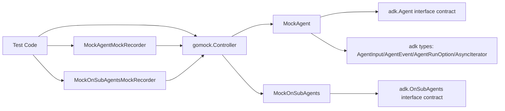

# adk_agent_mocks 深度解析

`adk_agent_mocks` 模块本质上是 ADK Agent 抽象在测试环境下的“可编排替身系统”。在真实运行时，一个 `Agent` 会牵涉异步事件流、上下文传递、子 Agent 关系、运行选项等复杂行为；如果在单元测试里直接使用真实实现，测试会变成“端到端集成测试”，难以精准定位问题。这个模块的价值就在于：它把 `Agent` 和 `OnSubAgents` 的交互收敛为可声明、可验证、可回放的调用契约，让测试可以像“搭脚手架”一样，只关注当前被测逻辑与外部依赖的边界是否正确。

## 架构角色与数据流



从架构定位看，这个模块不是业务执行器，也不是编排器，而是**测试隔离层（test double adapter）**。它把接口调用分成两条路径：

第一条是“录制路径（recording path）”。测试代码通过 `EXPECT()` 拿到 recorder，然后调用如 `Run(...)`、`Name(...)`、`OnSetSubAgents(...)` 这类 recorder 方法。recorder 不执行业务逻辑，而是通过 `gomock.Controller.RecordCallWithMethodType` 记录“期望发生什么调用”。

第二条是“回放/校验路径（playback path）”。被测代码实际调用 mock 方法（例如 `MockAgent.Run`）时，方法体会转发到 `gomock.Controller.Call`。`gomock` 内部将这次真实调用与之前记录的期望进行匹配，决定返回值并执行调用次数、参数匹配、顺序等校验。

可以把它想象成机场安检系统：recorder 像提前发布的安检规则，mock 方法像旅客过闸机时的实时扫描，`gomock.Controller` 是最终裁决者，负责判断“是否符合规则”。

## 模块要解决的核心问题（Why）

### 为什么不能用“手写假实现”替代？

朴素做法是手写一个 `fakeAgent`，实现 `Name/Description/Run`，在字段里塞一些返回值。但在 ADK 场景里这很快失效，原因有三点。

第一，`Run` 是变参签名：`Run(ctx context.Context, input *adk.AgentInput, options ...adk.AgentRunOption)`。手写 fake 往往只覆盖固定参数模式，难以系统性校验不同 `options` 组合是否被正确传递。

第二，`Run` 返回的是 `*adk.AsyncIterator[*adk.AgentEvent]`，这是异步流抽象，不是单一返回值。手写 fake 通常只关注“返回了什么”，忽略“是否按预期被调用、调用几次、调用参数是否正确”。

第三，`OnSubAgents` 是生命周期/拓扑相关回调（设置父子关系、禁止向父转移等），测试常常需要验证“某个边界行为有没有发生”，而不是执行其真实逻辑。mock 的 declarative expectation（声明式期望）比手写 fake 更适合做交互测试。

这个模块的设计洞察是：**对 agent 体系而言，很多测试关注的是交互契约而非计算结果**。因此采用 gomock 生成代码，把契约验证能力前置。

## 心智模型（How it thinks）

理解这个模块，建议在脑中保留三个对象：

`MockAgent` / `MockOnSubAgents` 是“接口替身”，实现与真实接口同签名的方法；`MockAgentMockRecorder` / `MockOnSubAgentsMockRecorder` 是“规则录入器”；`gomock.Controller` 是“规则引擎 + 调用日志中心”。

构造方式也体现这个模型：`NewMockAgent(ctrl)` 与 `NewMockOnSubAgents(ctrl)` 接收外部 controller，说明 mock 不持有测试生命周期，它把生命周期管理交给测试框架层。这是经典的依赖倒置：mock 依赖 controller，而不是反过来。

## 组件级深挖

### `MockAgent`

`MockAgent` 结构体有三个字段：`ctrl`、`recorder`、`isgomock`。前两个是核心，最后一个是 gomock 代码生成约定字段（用于标记/兼容）。

`MockAgent` 通过以下方法覆盖 `adk.Agent` 契约：

- `Name(ctx context.Context) string`
- `Description(ctx context.Context) string`
- `Run(ctx context.Context, input *adk.AgentInput, options ...adk.AgentRunOption) *adk.AsyncIterator[*adk.AgentEvent]`

这些方法内部没有业务逻辑，统一模式是：先 `m.ctrl.T.Helper()` 标记辅助函数，再调用 `m.ctrl.Call(...)`，最后进行类型断言返回。

`Run` 的实现里有一个关键细节：先把 `(ctx, input)` 放入 `varargs := []any{ctx, input}`，再把变参 `options` 展平 append 进去，最后 `Call(m, "Run", varargs...)`。这保证了变参在 gomock 匹配层按真实调用形态展开，而不是以切片作为单一参数传递。

### `MockAgentMockRecorder`

它只持有 `mock *MockAgent`，是一个非常薄的“期望注册器”。

例如 `Run(ctx, input any, options ...any) *gomock.Call` 里同样把参数拼成 `varargs`，再调用 `RecordCallWithMethodType`。`reflect.TypeOf((*MockAgent)(nil).Run)` 这一段非常关键：它给 gomock 提供精确的方法类型信息，避免在重载风格或复杂签名下出现反射匹配歧义。

`EXPECT()` 方法只是把 recorder 暴露出去，语义上把“声明期望”与“执行调用”分离，这是 gomock 的核心使用模式。

### `MockOnSubAgents`

这个 mock 对应 `adk.OnSubAgents` 接口，覆盖三个生命周期方法：

- `OnSetSubAgents(ctx context.Context, subAgents []adk.Agent) error`
- `OnSetAsSubAgent(ctx context.Context, parent adk.Agent) error`
- `OnDisallowTransferToParent(ctx context.Context) error`

这组方法的价值不在于返回值本身（都是 `error`），而在于可验证“层级关系管理是否被触发”。在多 Agent 组合、主从代理切换、禁止上行转移这类场景下，交互顺序常常比结果对象更重要。

### `MockOnSubAgentsMockRecorder`

与 `MockAgentMockRecorder` 同构，负责把上述三个方法的期望注册给 controller。接口设计非常克制：只做转发，不额外引入 DSL，意味着它几乎完全继承 gomock 的能力边界与语义。

## 依赖与调用关系分析

从代码可直接确认的下游依赖有三类。

第一类是 `go.uber.org/mock/gomock`，这是模块的执行核心。所有 mock 方法最终走 `Controller.Call`，所有期望声明走 `Controller.RecordCallWithMethodType`。如果未来替换 mock 框架，这个模块需要整体重生成，而不是局部替换。

第二类是 `reflect`，仅用于提供 method type 给 gomock。它不是业务反射，而是“签名锚点”。

第三类是 ADK 接口与类型契约，包括 [ADK Agent Interface](ADK Agent Interface.md) 里的 `Agent`、`OnSubAgents`、`AgentInput`、`AgentEvent`，以及 [ADK Utils](ADK Utils.md) 的 `AsyncIterator` 与 [agent_run_option_system](agent_run_option_system.md) 的 `AgentRunOption`。

从上游调用看，当前提供代码里没有直接展示具体调用方函数；但按模块位置 `internal/mock/...` 与生成注释（`mockgen ... -source interface.go`）可确定，它是供测试代码注入依赖使用，而非运行时生产路径。换句话说，这是“被测试调用”的基础设施，而不是“被业务调用”的核心模块。

数据流端到端可概括为：测试先 `NewMockX(ctrl)` 创建替身并设置 `EXPECT`；被测对象持有该替身并触发方法调用；调用进入 `ctrl.Call` 与期望比对；返回预设值（如 `string`、`error`、`*AsyncIterator[*AgentEvent]`）并完成断言。

## 设计取舍与隐含权衡

这个模块选择了“生成代码 + 框架约束”的路线，而不是“手工可读实现”。收益是统一、稳定、低维护：接口一改，重新生成即可同步。代价是可读性较弱、扩展灵活性低，因为你不应该在这里手改逻辑。

它也选择了“强耦合接口签名”。比如 `Run` 的变参和返回泛型指针都被精确复制，确保契约严格一致；但这意味着接口签名任何变动都会让旧测试编译失败。对大型团队来说，这是有意为之：让破坏性变更尽早暴露。

另外，mock 方法内部对类型断言失败采用“忽略 ok 值”的风格（`ret0, _ := ret[0].(string)`）。这是一种 gomock 生成代码常见取舍：简化模板、把类型正确性前移到期望设置阶段。若测试中返回类型配错，最终表现通常是零值返回或 gomock 断言异常，需要开发者在测试编写时更谨慎。

## 使用方式与示例

下面是典型模式（示意代码，API 名称均来自现有组件）：

```go
ctrl := gomock.NewController(t)
defer ctrl.Finish()

agent := adk.NewMockAgent(ctrl)
agent.EXPECT().Name(gomock.Any()).Return("planner")
agent.EXPECT().Description(gomock.Any()).Return("test agent")
agent.EXPECT().Run(gomock.Any(), gomock.Any(), gomock.Any()).Return(nil)

sub := adk.NewMockOnSubAgents(ctrl)
sub.EXPECT().OnSetAsSubAgent(gomock.Any(), gomock.Any()).Return(nil)
```

在真实测试里，你通常会把 `agent` 或 `sub` 注入被测对象，然后让被测对象触发调用，再由 `ctrl.Finish()` 统一做期望校验。

## 新贡献者需要特别注意的坑

第一，这个文件头部明确写着 `Code generated by MockGen. DO NOT EDIT.`。不要手改，否则下次生成会被覆盖，且容易引入不可见偏差。

第二，`Run` 的期望要正确处理变参。record 时参数是“展开”的，而不是 `[]adk.AgentRunOption` 整体。若匹配器写错，常见症状是“明明调用了却匹配不上”。

第三，`Run` 返回 `*adk.AsyncIterator[*adk.AgentEvent]`。如果测试关注事件消费流程，需要提供可消费的 iterator，而不是仅返回 `nil`；否则你测到的只是“调用发生”，而非“流行为正确”。

第四，`OnSetSubAgents` 参数是 `[]adk.Agent`。切片匹配时要注意内容匹配语义（引用/顺序/长度）；必要时使用自定义 matcher 提升断言可读性。

第五，这个模块不负责并发安全策略，它只转发到 gomock。并发场景中的调用时序断言需要在测试层明确设置。

## 与其他文档的关系

- `Agent`/`OnSubAgents` 的语义定义见 [ADK Agent Interface](ADK Agent Interface.md)
- `AsyncIterator` 的基础抽象见 [ADK Utils](ADK Utils.md)
- `AgentRunOption` 选项机制见 [agent_run_option_system](agent_run_option_system.md)

如果你在改动 `adk/interface.go` 中相关接口，建议同步检查本模块生成结果以及所有依赖这些 mock 的测试用例，确保契约升级是显式且可审计的。
