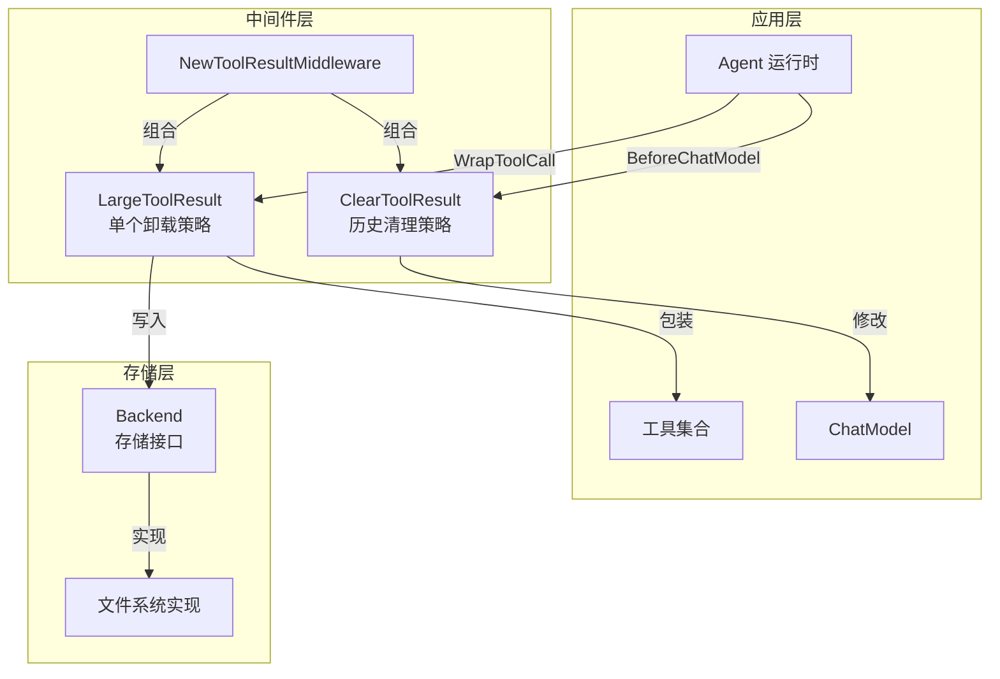

# generic_tool_result_reduction 模块技术深度解析

## 1. 模块概述

**generic_tool_result_reduction** 模块是一个专门用于管理和优化大语言模型（LLM）对话上下文的中间件系统。在多轮对话场景中，工具调用结果往往会累积大量 token，导致上下文窗口溢出或消耗过多的计算资源。这个模块就像对话上下文的"智能管家"，通过两种互补策略来保持上下文的健康：**历史工具结果清理**和**大型工具结果卸载**。

想象一下，你正在整理一个不断增长的对话记录文件夹——有些历史邮件虽然重要但不需要随时查看，有些附件太大无法随身携带。这个模块做的事情类似：把不再需要立即使用的旧工具结果"归档"（用占位符替换），把超大的工具结果"存入云盘"（写入文件系统），只在需要时再取用。

## 2. 架构设计

### 2.1 核心组件关系图



### 2.2 数据流动分析

这个模块在两个关键节点介入对话流程：

1. **工具调用后（WrapToolCall）**：当工具返回结果时，`LargeToolResult` 中间件会检查结果大小。如果超过阈值，会将完整结果写入存储后端，返回一个包含摘要和文件位置的提示消息。

2. **调用 ChatModel 前（BeforeChatModel）**：在发送消息给模型前，`ClearToolResult` 中间件会计算所有工具结果的总 token 数。如果超过阈值，会将最近指定 token 预算之外的旧工具结果替换为占位符。

这两个策略形成了"点面结合"的防御：`LargeToolResult` 处理单个超大结果（点），`ClearToolResult` 管理整体累积量（面）。

## 3. 核心设计理念与决策

### 3.1 双重策略组合：为什么不只用一种？

设计团队选择了两种策略而非单一方案，这是基于对工具调用结果特征的深入分析：

**单个超大结果**（如一个 100KB 的数据库查询结果）→ 适合用**卸载策略**：
- 这类结果通常只在特定时刻需要完整查看
- 保留一个简短摘要和文件位置，让 LLM 知道如何按需获取
- 避免了因单个大结果导致整个上下文膨胀

**多个小结果累积**（如多次调用搜索工具，每次返回 1KB 结果）→ 适合用**清理策略**：
- 历史结果可能已失去时效性
- 全部保留会导致上下文逐渐饱和
- 用占位符标记让 LLM 知道有信息但已被清理

### 3.2 Token 估算：为什么选择字符数/4？

模块中使用了 `字符数 / 4` 作为 token 估算的启发式算法。这个选择体现了在**准确性**和**性能**之间的权衡：

- **为什么不是精确 token 化**：精确的 token 计数需要调用特定模型的 tokenizer，这会增加依赖和计算开销
- **为什么是 4**：这是一个经验值，在大多数语言（尤其是英语）中，平均每个 token 约对应 4 个字符
- **可自定义**：设计团队预留了 `TokenCounter` 接口，允许用户根据实际需求替换为更精确的实现

### 3.3 近期消息保护：为什么不简单地按时间或顺序删除？

`ClearToolResult` 策略不是简单地删除最早的消息，而是保护最近的一个 token 预算窗口内的所有消息。这个设计考虑了对话的**局部连续性**：

- 最近的对话通常与当前任务最相关
- 保护一个 token 预算窗口而非固定数量的消息，适应了消息大小不一的情况
- 这类似于操作系统的"工作集"概念——保留最近使用的内容

## 4. 关键组件详解

### 4.1 ToolResultConfig：统一配置入口

`ToolResultConfig` 是模块的核心配置结构，它将两个策略的配置整合在一起：

```go
type ToolResultConfig struct {
    // 清理策略相关配置
    ClearingTokenThreshold      int           // 触发清理的总 token 阈值
    KeepRecentTokens            int           // 保护近期消息的 token 预算
    ClearToolResultPlaceholder  string        // 替换旧结果的占位符
    
    // 卸载策略相关配置
    Backend                     Backend       // 存储后端（必需）
    OffloadingTokenLimit        int           // 单个结果触发卸载的阈值
    ReadFileToolName            string        // LLM 用于读取文件的工具名
    
    // 通用配置
    TokenCounter                func(msg *schema.Message) int
    ExcludeTools                []string
    PathGenerator               func(...) (string, error)
}
```

**设计意图**：通过一个统一的配置结构，用户可以一次性设置两种策略，而不必分别配置两个独立的中间件。

### 4.2 Backend 接口：存储抽象

```go
type Backend interface {
    Write(context.Context, *filesystem.WriteRequest) error
}
```

这个简单的接口是模块可扩展性的关键：

- **职责单一**：只定义写入操作，因为模块只负责存储结果，不负责读取
- **灵活实现**：用户可以提供文件系统、对象存储、数据库等任何实现
- **与文件系统中间件解耦**：虽然默认设计与文件系统中间件配合，但接口本身不依赖它

### 4.3 两种中间件的组合

`NewToolResultMiddleware` 函数将两种策略组合成一个 `adk.AgentMiddleware`：

```go
return adk.AgentMiddleware{
    BeforeChatModel: bc,  // 清理策略在模型调用前执行
    WrapToolCall:    tm,  // 卸载策略在工具调用后执行
}
```

这种组合方式体现了**关注点分离**：每个策略在最适合的时机执行，互不干扰但协同工作。

## 5. 使用指南与注意事项

### 5.1 典型配置示例

```go
// 创建一个文件系统后端（或使用你自己的实现）
backend := myFileSystemBackend

// 配置中间件
config := &reduction.ToolResultConfig{
    Backend:               backend,
    ClearingTokenThreshold: 20000,    // 总工具结果超过 20000 token 时触发清理
    KeepRecentTokens:       40000,    // 保留最近 40000 token 的消息完整
    OffloadingTokenLimit:   20000,    // 单个工具结果超过 20000 token 时卸载
    ReadFileToolName:       "read_file", // 与文件系统中间件配合使用
}

// 创建中间件
middleware, err := reduction.NewToolResultMiddleware(ctx, config)
```

### 5.2 关键注意事项

**1. 必须提供 read_file 工具**
- 模块只负责将大结果写入存储，不负责读取
- 你需要确保 agent 有访问相同后端的 `read_file` 工具
- 文件系统中间件（`filesystem_large_tool_result_offloading`）已自动提供此工具

**2. Token 估算精度**
- 默认的 `字符数/4` 估算对于非英语文本可能不够准确
- 对于中文等字符集，建议提供自定义的 `TokenCounter`
- 考虑到估算误差，建议将阈值设置得比实际期望稍低一些

**3. ExcludeTools 的使用**
- 某些工具的结果可能始终需要保留（如身份验证、状态检查等）
- 使用 `ExcludeTools` 列表保护这些工具的结果不被清理

**4. 与文件系统中间件的关系**
- 如果你已经在使用文件系统中间件，它已包含此功能
- 如需单独使用此模块，需设置文件系统中间件的 `WithoutLargeToolResultOffloading = true`

### 5.3 故障排查

| 问题 | 可能原因 | 解决方案 |
|------|----------|----------|
| 大工具结果没有被卸载 | `OffloadingTokenLimit` 设置过高 | 降低阈值或检查 TokenCounter 实现 |
| LLM 无法读取卸载的结果 | 缺少 `read_file` 工具或工具名不匹配 | 确保 agent 有正确的读文件工具 |
| 上下文仍然膨胀 | `ClearingTokenThreshold` 或 `KeepRecentTokens` 设置过高 | 降低这些值 |
| 重要的历史结果被清理 | 未使用 `ExcludeTools` | 将重要工具添加到排除列表 |

## 6. 子模块

本模块包含以下子模块，每个子模块处理特定的功能方面：

- [reduction_tool_result_contracts](adk_middlewares_and_filesystem-generic_tool_result_reduction-reduction_tool_result_contracts.md)：定义核心接口和配置契约
- [clear_tool_result_policy](adk_middlewares_and_filesystem-generic_tool_result_reduction-clear_tool_result_policy.md)：实现历史工具结果清理策略
- [large_tool_result_offloading](adk_middlewares_and_filesystem-generic_tool_result_reduction-large_tool_result_offloading.md)：实现大型工具结果卸载策略
- [large_tool_result_offloading_test_backends](adk_middlewares_and_filesystem-generic_tool_result_reduction-large_tool_result_offloading_test_backends.md)：提供测试用的后端实现

## 7. 与其他模块的关系

- **[filesystem_large_tool_result_offloading](adk_middlewares_and_filesystem-filesystem_large_tool_result_offloading.md)**：文件系统中间件已集成此模块的功能
- **[filesystem_backend_core](adk_middlewares_and_filesystem-filesystem_backend_core.md)**：可作为 `Backend` 接口的实现
- **[adk_runtime](adk_runtime.md)**：此模块作为中间件插入 agent 运行时

## 8. 总结

**generic_tool_result_reduction** 模块通过两个互补的策略——清理历史结果和卸载大型结果——有效管理对话上下文的大小。它的设计体现了以下核心思想：

1. **分层防御**：从单个结果和整体累积两个维度控制上下文大小
2. **灵活抽象**：通过 `Backend` 接口支持多种存储实现
3. **启发式优化**：在准确性和性能之间取得平衡
4. **组合设计**：将两种策略无缝整合，同时保持各自的独立性

对于构建生产级 LLM 应用来说，这个模块是管理上下文、控制成本和维持对话质量的重要基础设施。
