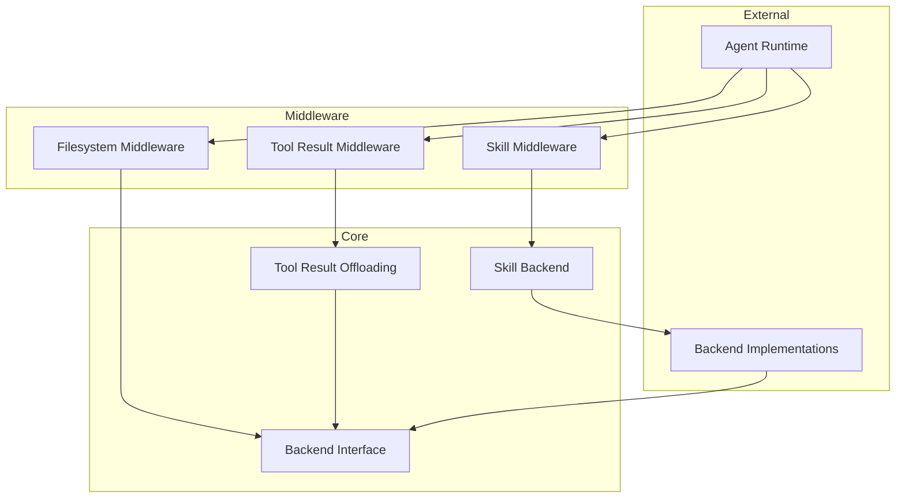

# adk_middlewares_and_filesystem 模块深度解析

## 模块概览

`adk_middlewares_and_filesystem` 模块是一个为 AI Agent 提供文件系统操作、工具结果管理和技能加载能力的中间件集合。它解决了 Agent 运行时的三个核心问题：

1. **文件系统抽象**：为 Agent 提供统一的文件操作接口，支持内存、本地磁盘等多种后端实现
2. **工具结果管理**：处理大型工具结果的上下文溢出问题，通过 offloading 和清理策略优化 token 使用
3. **技能加载**：支持从文件系统加载预定义技能，增强 Agent 的能力扩展

**为什么这个模块很重要？**
- 当 Agent 需要操作文件时，它提供了标准化的工具集（ls, read_file, write_file, edit_file 等）
- 当工具返回大量数据时，它避免了上下文窗口溢出，同时保持了数据的可访问性
- 当需要复用 Agent 能力时，它提供了技能管理的基础设施

## 架构总览



### 核心组件关系

1. **Backend 接口**：整个模块的基石，定义了文件系统操作的统一契约
2. **中间件**：将 Backend 接口转换为 Agent 可直接使用的工具和功能
3. **工具结果管理**：独立于文件系统，但复用其 Backend 接口进行存储
4. **技能系统**：通过 Backend 接口从文件系统加载技能定义

## 设计决策分析

### 1. 基于接口的抽象设计

**决策**：使用 `Backend` 接口而非直接实现文件系统操作

**原因**：
- 支持多种后端实现（内存、本地文件系统、远程存储等）
- 便于测试（使用 `InMemoryBackend` 无需真实文件系统）
- 允许用户自定义实现以满足特殊需求

**权衡**：
- ✅ 灵活性高，可扩展性强
- ✅ 测试友好
- ❌ 增加了一层抽象，理解成本稍高

### 2. 结构体参数模式

**决策**：所有 `Backend` 方法都使用结构体参数（如 `ReadRequest`、`WriteRequest`）

**原因**：
- 向后兼容：添加新字段不会破坏现有实现
- 自文档化：结构体字段名本身就是文档
- 可选参数处理：通过零值表示可选参数

**示例**：
```go
// 而不是 Read(ctx, path, offset, limit)
type ReadRequest struct {
    FilePath string
    Offset   int
    Limit    int
}
Read(ctx, &ReadRequest{FilePath: "/file.txt", Offset: 0, Limit: 100})
```

### 3. 工具结果管理的双重策略

**决策**：同时提供 "offloading" 和 "clearing" 两种策略

**策略对比**：
- **Offloading**：将单个大结果保存到文件系统，返回摘要和访问路径
- **Clearing**：当总工具结果超过阈值时，清理旧结果，保留最近的

**原因**：
- Offloading 适合处理单个超大结果（如大文件内容）
- Clearing 适合处理大量小结果累积的情况
- 两者结合提供了全面的解决方案

### 4. 技能的文件系统存储格式

**决策**：使用 Markdown 文件 + YAML Frontmatter 格式存储技能

**格式示例**：
```markdown
---
name: pdf-processing
description: 处理 PDF 文件的技能
---
这里是技能的具体内容...
```

**原因**：
- 人类可读，易于编辑
- 支持元数据（通过 Frontmatter）
- 版本控制友好
- 无需复杂的数据库

## 子模块说明

### [filesystem_backend_core](adk_middlewares_and_filesystem-filesystem_backend_core.md)
定义了文件系统操作的核心接口和数据结构，包括 `Backend` 接口、各种请求/响应结构体，以及内存实现 `InMemoryBackend`。这是整个模块的基础。

### [filesystem_tool_middleware](adk_middlewares_and_filesystem-filesystem_tool_middleware.md)
将 `Backend` 接口转换为 Agent 可直接调用的工具集（ls, read_file, write_file 等），并提供配置选项。

### [filesystem_large_tool_result_offloading](adk_middlewares_and_filesystem-filesystem_large_tool_result_offloading.md)
实现大型工具结果的 offloading 功能，将大结果保存到文件系统并返回摘要信息。

### [generic_tool_result_reduction](adk_middlewares_and_filesystem-generic_tool_result_reduction.md)
提供通用的工具结果管理策略，包括结果清理和 offloading，可独立于文件系统中间件使用。

### [skill_middleware](adk_middlewares_and_filesystem-skill_middleware.md)
实现技能加载和管理功能，支持从文件系统读取技能定义并提供给 Agent 使用。

## 与其他模块的关系

### 依赖关系
- **依赖**：`adk_runtime`（提供 AgentMiddleware 接口）、`components_core`（提供工具接口）
- **被依赖**：`adk_prebuilt_agents`（可能使用这些中间件构建预定义 Agent）

### 数据流向
1. Agent 调用文件系统工具 → filesystem 中间件 → Backend 实现
2. 工具返回结果 → tool_result 中间件检查大小 → 可能 offload 到文件系统
3. Agent 请求技能 → skill 中间件 → 从 Backend 读取技能定义

## 使用指南

### 基本使用：文件系统中间件

```go
// 创建内存后端（用于测试）
backend := filesystem.NewInMemoryBackend()

// 配置中间件
config := &filesystem.Config{
    Backend: backend,
    // 默认启用 large tool result offloading
}

// 创建中间件
middleware, err := filesystem.NewMiddleware(ctx, config)
```

### 高级使用：工具结果管理

```go
// 组合使用文件系统和工具结果管理
config := &reduction.ToolResultConfig{
    Backend:                backend,
    ClearingTokenThreshold: 20000,
    OffloadingTokenLimit:   10000,
    KeepRecentTokens:       40000,
}

middleware, err := reduction.NewToolResultMiddleware(ctx, config)
```

### 技能加载

```go
// 创建本地文件系统后端
backend, err := skill.NewLocalBackend(&skill.LocalBackendConfig{
    BaseDir: "./skills",
})

// 创建技能中间件
middleware, err := skill.New(ctx, &skill.Config{
    Backend: backend,
})
```

## 注意事项和陷阱

1. **路径格式**：所有路径必须是绝对路径（以 `/` 开头），`InMemoryBackend` 会自动规范化
2. **Edit 操作的幂等性**：当 `ReplaceAll=false` 时，确保 `OldString` 在文件中只出现一次，否则操作会失败
3. **Token 估算**：默认使用字符数/4 估算 token，对于非英语文本可能不准确，可以自定义 `TokenCounter`
4. **Offloading 与读取工具**：使用 offloading 时，确保 Agent 有 `read_file` 工具可用，否则无法读取 offloaded 的结果
5. **技能目录结构**：技能必须存储在子目录中，每个子目录包含一个 `SKILL.md` 文件

## 扩展点

1. **自定义 Backend**：实现 `Backend` 接口以支持新的存储后端
2. **自定义 Token 计数器**：通过 `TokenCounter` 选项提供更准确的 token 估算
3. **自定义路径生成器**：通过 `PathGenerator` 控制 offloaded 结果的存储路径
4. **自定义技能后端**：实现 `skill.Backend` 接口从其他来源加载技能

## 总结

`adk_middlewares_and_filesystem` 模块为 AI Agent 提供了三个关键能力：

1. **文件系统操作**：通过统一的 `Backend` 接口和预定义工具，让 Agent 能够安全地操作文件
2. **工具结果管理**：通过 offloading 和 clearing 策略，有效管理上下文窗口大小
3. **技能加载**：通过文件系统存储和加载技能定义，支持 Agent 能力的模块化扩展

该模块的设计遵循了接口抽象、向后兼容和可测试性的原则，同时提供了丰富的配置选项和扩展点。无论是在开发测试环境（使用 `InMemoryBackend`）还是生产环境（使用本地文件系统或自定义后端），都能提供稳定可靠的支持。
