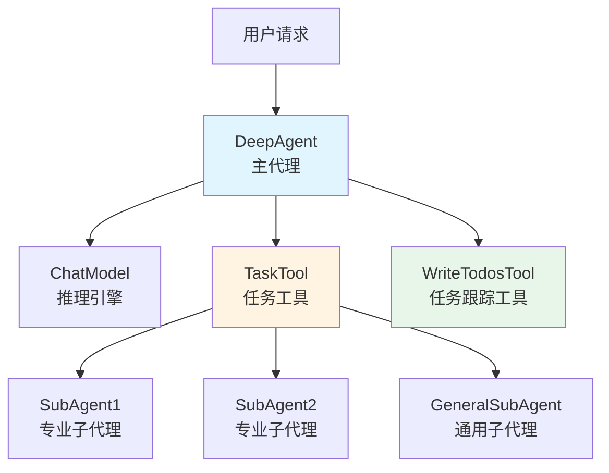
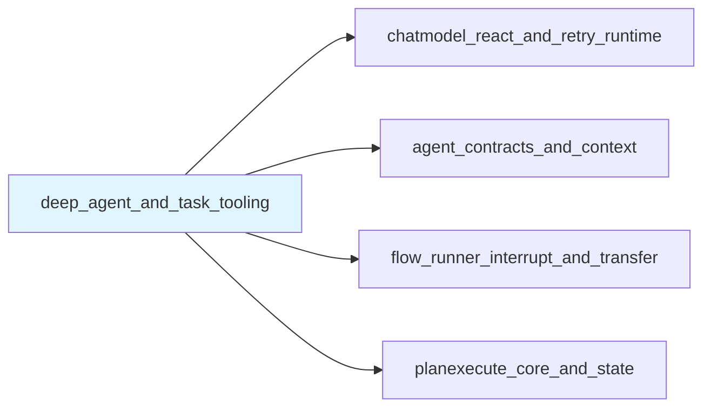

# Deep Agent and Task Tooling 模块深度解析

## 1. 问题空间与模块使命

在构建复杂的 AI 应用时，我们经常面临这样的挑战：单个代理（agent）虽然能够处理特定任务，但面对需要分解的复杂问题时，需要一种能够将任务智能分配给专业子代理并协调它们工作的机制。

想象一下你是一位项目经理：你需要将一个复杂项目分解为多个任务，根据每个团队成员的专业技能分配任务，跟踪进度，并最终整合所有人的工作成果。这正是 `deep_agent_and_task_tooling` 模块要解决的问题——它就像是 AI 代理世界中的"项目经理"。

### 这个模块解决的核心问题：
1. **任务分解与协调**：复杂问题需要被分解为子任务，由不同专业的代理来处理
2. **子代理编排**：需要一种方式来动态选择、调用和协调多个子代理
3. **状态共享**：主代理和子代理之间需要共享上下文和状态
4. **任务追踪**：需要记录和跟踪任务进度，确保复杂任务能够按计划完成

这个模块的设计目标是提供一个**开箱即用的深度任务编排代理**，让开发者可以快速构建具有多代理协作能力的应用。

## 2. 核心架构与设计思想

### 2.1 架构概览

让我们通过一个 Mermaid 图来理解这个模块的核心架构：



### 2.2 核心设计思想

这个模块采用了**分层代理模式**（Layered Agent Pattern），其核心思想是：

1. **主代理作为协调者**：不直接处理所有任务，而是专注于"做什么"和"谁来做"的决策
2. **工具即能力**：通过工具（Tool）的形式向主代理暴露能力，包括调用子代理的能力
3. **中间件增强**：使用中间件模式动态添加工具和指令，保持核心代码的简洁
4. **会话共享**：主代理和子代理共享同一会话上下文，确保信息流畅传递

### 2.3 关键抽象

让我们深入理解几个核心抽象：

#### Config 结构体
`Config` 是 DeepAgent 的配置中心，它不仅仅是参数的集合，更是定义代理"个性"和"能力边界"的地方：

- `ChatModel`：代理的"大脑"，负责推理和决策
- `SubAgents`：代理可以调用的"专家团队"
- `ToolsConfig`：代理可以使用的"工具集合"
- `MaxIteration`：代理思考的"最大步数"，防止无限循环

值得注意的是几个开关选项：`WithoutWriteTodos`、`WithoutGeneralSubAgent`，它们体现了设计的灵活性——你可以根据需要选择性地启用或禁用某些内置功能。

#### TaskTool：子代理的网关
`taskTool` 是这个模块最巧妙的设计之一。它将子代理包装成一个工具，让主代理可以像调用普通工具一样调用子代理。这种设计有几个关键优势：

1. **统一接口**：子代理和普通工具使用相同的调用接口
2. **动态发现**：主代理可以在运行时了解有哪些子代理可用
3. **参数转换**：将主代理的自然语言描述转换为子代理的输入

#### TODO 与 WriteTodosTool
`TODO` 结构体和 `write_todos` 工具提供了任务跟踪能力。这体现了一个重要的设计理念：**智能代理需要能够"记住"自己的计划**。通过将待办事项写入会话状态，代理可以在多轮交互中保持任务的连续性。

## 3. 数据流向与关键流程

让我们追踪一个典型的请求从进入到完成的完整路径：

### 3.1 初始化流程

当调用 `New()` 函数创建 DeepAgent 时，发生了以下事情：

```
New() 
  ├─> buildBuiltinAgentMiddlewares()  [构建内置中间件]
  │     └─> newWriteTodos()            [创建任务跟踪工具]
  │
  ├─> 检查是否需要子代理支持
  │     └─> newTaskToolMiddleware()    [创建任务工具中间件]
  │           └─> newTaskTool()        [初始化子代理包装器]
  │                 ├─> 创建通用子代理（如果启用）
  │                 └─> 包装所有用户提供的子代理
  │
  └─> adk.NewChatModelAgent()           [创建底层聊天模型代理]
```

### 3.2 请求处理流程

当用户发送请求时，数据流向如下：

1. **接收请求**：DeepAgent 接收用户输入
2. **生成模型输入**：`genModelInput()` 组合系统指令和用户消息
3. **模型推理**：ChatModel 分析请求，决定下一步行动
   - 可能直接回答用户
   - 可能调用 `write_todos` 记录计划
   - 可能调用 `task_tool` 委派子任务
4. **工具执行**：如果调用工具，执行相应逻辑
   - `write_todos`：将 TODO 列表存入会话
   - `task_tool`：查找并调用指定的子代理
5. **迭代**：根据 `MaxIteration` 限制，重复步骤 3-4
6. **返回结果**：将最终响应返回给用户

### 3.3 子代理调用的详细流程

当主代理决定调用子代理时，`taskTool.InvokableRun()` 会执行以下操作：

```
taskTool.InvokableRun()
  ├─> 解析 JSON 参数，提取 subagent_type 和 description
  ├─> 在 subAgents map 中查找对应的子代理工具
  ├─> 将 description 包装为子代理的请求参数
  └─> 调用子代理工具的 InvokableRun() 方法
```

这里有一个重要的设计细节：子代理的输入被包装为 `{"request": "description"}` 的形式，这种标准化的接口使得任何符合 `adk.Agent` 接口的代理都可以被无缝集成。

## 4. 关键设计决策与权衡

### 4.1 中间件 vs 继承：选择组合而非继承

**决策**：使用中间件（Middleware）模式来增强代理功能，而不是通过继承创建复杂的类层次结构。

**为什么这样选择**：
- **灵活性**：可以根据需要动态添加或移除功能（如通过 `WithoutWriteTodos` 开关）
- **可组合性**：多个中间件可以链式组合，每个中间件负责一个特定功能
- **避免类爆炸**：不需要为每种功能组合创建新的子类

**权衡**：
- 优点：高度灵活，易于扩展
- 缺点：中间件的执行顺序可能会导致意外的交互，需要仔细管理

### 4.2 工具即代理：统一工具与子代理的接口

**决策**：将子代理包装为工具（`taskTool`），使得主代理调用子代理和调用普通工具使用相同的机制。

**为什么这样选择**：
- **简化心智模型**：主代理只需要理解"工具调用"这一种抽象
- **统一错误处理**：工具调用的错误处理机制可以复用到子代理调用
- **易于扩展**：添加新的子代理就像添加新工具一样简单

**权衡**：
- 优点：一致性高，学习曲线平缓
- 缺点：子代理的某些高级特性可能需要通过工具参数来暴露，可能不如直接调用灵活

### 4.3 会话状态共享：上下文传递的设计

**决策**：主代理和子代理共享同一会话上下文，通过 `adk.AddSessionValue` 和 `adk.GetSessionValue` 传递数据。

**为什么这样选择**：
- **信息流畅**：子代理可以访问主代理的上下文，无需显式传递所有信息
- **状态一致性**：避免了状态同步的复杂性
- **简化编程模型**：开发者不需要手动管理上下文传递

**权衡**：
- 优点：使用简单，功能强大
- 缺点：可能导致隐式依赖，子代理可能意外修改主代理依赖的状态

### 4.4 可选的内置功能：默认启用但可禁用

**决策**：内置功能（如 `write_todos` 工具、通用子代理）默认启用，但提供开关选项允许禁用。

**为什么这样选择**：
- **开箱即用**：新用户可以立即获得完整功能
- **灵活性**：高级用户可以根据需要精简代理
- **渐进式采用**：可以先使用默认配置，再逐步定制

**权衡**：
- 优点：兼顾易用性和灵活性
- 缺点：配置选项增多，可能让新用户感到困惑

## 5. 子模块详解

本模块包含以下子模块，每个子模块负责特定的功能领域：

### 5.1 [deep_agent_configuration_and_todo_schema](adk_prebuilt_agents-deep_agent_and_task_tooling-deep_agent_configuration_and_todo_schema.md)
负责 DeepAgent 的配置结构定义和 TODO 任务数据模型。这个子模块定义了代理的"骨架"——配置参数和任务跟踪的数据结构。

### 5.2 [task_tool_definition](adk_prebuilt_agents-deep_agent_and_task_tooling-task_tool_definition.md)
实现了任务工具的核心逻辑，包括子代理的包装和调用机制。这是模块的"心脏"，负责协调主代理和子代理之间的交互。

### 5.3 [deep_agent_test_spies_and_harnesses](adk_prebuilt_agents-deep_agent_and_task_tooling-deep_agent_test_spies_and_harnesses.md)
提供了用于测试 DeepAgent 的间谍（spy）和测试工具。这些工具帮助开发者验证代理的行为是否符合预期。

### 5.4 [task_tool_test_agent_stub](adk_prebuilt_agents-deep_agent_and_task_tooling-task_tool_test_agent_stub.md)
包含用于测试任务工具的代理存根实现，简化了任务工具的单元测试。

## 6. 与其他模块的关系

`deep_agent_and_task_tooling` 模块在整个系统中扮演着**编排层**的角色，它构建在多个底层模块之上：

### 6.1 依赖关系



- **chatmodel_react_and_retry_runtime**：提供了基础的 ChatModel 代理运行时，DeepAgent 构建在这个基础之上
- **agent_contracts_and_context**：定义了代理的契约和会话上下文管理，DeepAgent 依赖这些接口
- **flow_runner_interrupt_and_transfer**：提供了代理执行的运行器，用于运行 DeepAgent
- **planexecute_core_and_state**：虽然不是直接依赖，但 DeepAgent 经常与 PlanExecute 代理配合使用（如测试中所示）

### 6.2 典型使用场景

在实际应用中，DeepAgent 通常作为**顶层协调代理**使用：

1. **接收用户的复杂请求**
2. **将任务分解为多个子任务**（使用 `write_todos` 记录）
3. **根据子任务的性质，调用不同的专业子代理**（使用 `task_tool`）
4. **整合子代理的结果，形成最终响应**

这种模式特别适合构建**多角色协作的 AI 应用**，例如：
- 技术文档写作助手（规划师 + 写手 + 校对）
- 代码开发助手（架构师 + 程序员 + 测试员）
- 客户服务机器人（咨询员 + 技术支持 + 投诉处理）

## 7. 实践指南与注意事项

### 7.1 何时使用 DeepAgent

DeepAgent 最适合以下场景：
- ✅ 问题可以被分解为多个相对独立的子任务
- ✅ 有多个专业的子代理可以处理不同类型的子任务
- ✅ 需要在多轮交互中保持任务的连续性和状态
- ✅ 需要给用户提供任务进度的可见性

### 7.2 配置建议

**初始配置**：
```go
// 对于新项目，建议从简单开始
agent, err := deep.New(ctx, &deep.Config{
    Name:        "my_deep_agent",
    Description: "A helpful assistant that can coordinate multiple specialists",
    ChatModel:   myChatModel,
    SubAgents:   []adk.Agent{mySpecialistAgent1, mySpecialistAgent2},
    MaxIteration: 10,  // 根据任务复杂度调整
})
```

**高级配置**：
```go
// 当你需要更精细的控制时
agent, err := deep.New(ctx, &deep.Config{
    Name:        "advanced_deep_agent",
    Description: "An advanced assistant with custom behaviors",
    ChatModel:   myChatModel,
    Instruction: customSystemPrompt,  // 覆盖默认指令
    SubAgents:   mySubAgents,
    ToolsConfig: adk.ToolsConfig{
        Tools: myAdditionalTools,
        EmitInternalEvents: true,  // 启用内部事件，便于调试
    },
    MaxIteration: 20,
    WithoutWriteTodos: false,  // 明确启用任务跟踪
    WithoutGeneralSubAgent: false,  // 保留通用子代理作为后备
    TaskToolDescriptionGenerator: myCustomDescGenerator,  // 自定义任务工具描述
    OutputKey: "deep_agent_output",  // 将输出保存到会话
})
```

### 7.3 常见陷阱与注意事项

1. **会话状态污染**
   - ⚠️ 问题：子代理可能意外修改主代理依赖的会话值
   - 💡 建议：为不同代理使用命名空间前缀的键名，如 `deep_*`、`specialist_*`

2. **迭代次数限制**
   - ⚠️ 问题：`MaxIteration` 设置过小可能导致任务未完成就停止，过大可能浪费资源
   - 💡 建议：从 10-20 开始，根据实际任务调整；观察日志了解典型的迭代次数

3. **子代理描述的重要性**
   - ⚠️ 问题：子代理的 `Description` 会影响主代理选择哪个子代理
   - 💡 建议：为子代理编写清晰、具体的描述，说明它擅长什么、不擅长什么

4. **错误处理**
   - ⚠️ 问题：子代理的错误可能被包装多层，难以定位
   - 💡 建议：使用 `EmitInternalEvents: true` 启用详细事件，便于调试；考虑添加自定义中间件来包装错误

5. **通用子代理的过度使用**
   - ⚠️ 问题：主代理可能过度依赖通用子代理，而不是选择更专业的子代理
   - 💡 建议：如果专业子代理足够，可以考虑禁用通用子代理（`WithoutGeneralSubAgent: true`）

### 7.4 扩展 DeepAgent

DeepAgent 设计为可扩展的，常见的扩展方式包括：

1. **添加自定义工具**：通过 `ToolsConfig.Tools` 添加你的专用工具
2. **自定义指令**：通过 `Instruction` 字段提供自定义系统提示
3. **自定义中间件**：通过 `Middlewares` 字段添加代理中间件
4. **自定义任务工具描述**：通过 `TaskToolDescriptionGenerator` 定制任务工具的描述
5. **组合使用**：将 DeepAgent 作为另一个 DeepAgent 的子代理，创建多层代理 hierarchy

## 8. 总结

`deep_agent_and_task_tooling` 模块提供了一个强大而灵活的框架，用于构建具有深度任务编排能力的 AI 代理。它的核心价值在于：

1. **抽象了多代理协作的复杂性**：让开发者可以专注于业务逻辑，而不是协调细节
2. **提供了开箱即用的功能**：任务跟踪、子代理编排等功能立即可用
3. **保持了高度的灵活性**：几乎每个方面都可以根据需要定制和扩展

通过理解这个模块的设计思想、数据流向和权衡取舍，你可以更好地利用它来构建强大的 AI 应用。记住，DeepAgent 只是一个工具——真正的魔力来自于你如何设计子代理、如何描述它们的能力，以及如何编排它们的协作。
