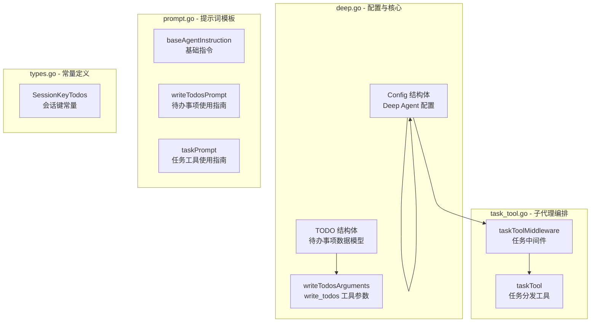

# Deep Agent 配置与 TODO Schema 模块

## 概述

`deep_agent_configuration_and_todo_schema` 模块是 Eino ADK 框架中预构建的 **Deep Agent（深度代理）** 的核心配置与数据 Schema 定义模块。Deep Agent 是一个具备深度任务编排能力的智能代理，它不仅能够独立完成复杂任务，还能通过**子代理（Sub-Agent）**机制将工作委托给专业化的小型代理来完成。

**这个模块解决的问题**：当面对需要多步骤、跨领域专业知识、或需要并行处理的复杂任务时，单一代理往往力不从心。Deep Agent 通过引入任务分发机制和进度追踪能力，提供了一种"代理即协调者"的架构模式——主代理负责理解任务、规划步骤、调度子代理、整合结果，而具体的执行则由各专业子代理负责。

用建筑工地的比喻来说，Deep Agent 就像是工地的**项目经理**：他不需要亲自砌砖或布线，但他知道什么任务需要什么专业工人（子代理），能够追踪整个工程的进度（TODO），并在出现问题时协调资源。

---

## 架构设计

### 核心组件



### 数据流向

```
用户输入
    │
    ▼
┌─────────────────────────────────────────────────────────┐
│  Runner.Run()                                          │
│  ┌───────────────────────────────────────────────────┐  │
│  │  DeepAgent.New(ctx, &Config{...})                 │  │
│  │                                                    │  │
│  │  1. 构建内置中间件 (write_todos 工具)              │  │
│  │  2. 构建任务工具中间件 (子代理分发)                 │  │
│  │  3. 合并用户自定义中间件                           │  │
│  │  4. 创建 ChatModelAgent 并返回                     │  │
│  └───────────────────────────────────────────────────┘  │
└─────────────────────────────────────────────────────────┘
    │
    ▼
┌─────────────────────────────────────────────────────────┐
│  ChatModelAgent.Run()                                  │
│  ┌───────────────────────────────────────────────────┐  │
│  │  循环:                                            │  │
│  │    1. LLM 生成 (含 system prompt)                │  │
│  │    2. 工具调用?                                   │  │
│  │       ├─ write_todos → Session 存储 TODO         │  │
│  │       └─ task → 调用子代理                        │  │
│  │    3. 返回结果                                    │  │
│  └───────────────────────────────────────────────────┘  │
└─────────────────────────────────────────────────────────┘
    │
    ▼
  会话状态 / 事件流
```

---

## 核心组件详解

### 1. Config 结构体（adk.prebuilt.deep.deep.Config）

**设计意图**：`Config` 是创建 Deep Agent 的入口配置类，它将所有影响 Agent 行为的选项整合在一起。设计者采用了"**有opinionated默认值**"的策略——即使不传入任何配置，Agent 也能正常工作，但同时也提供了充分的定制空间。

```go
type Config struct {
    // 基础标识
    Name        string  // 代理名称
    Description string  // 代理描述，用于子代理选择

    // 核心能力
    ChatModel   model.ToolCallingChatModel  // 核心推理模型（必需）
    Instruction string                      // 自定义系统提示词
    SubAgents   []adk.Agent                 // 专业子代理列表
    ToolsConfig adk.ToolsConfig             // 可用工具配置

    // 行为控制
    MaxIteration int  // 最大推理迭代次数

    // 功能开关（默认全部启用）
    WithoutWriteTodos           bool   // 禁用内置 TODO 工具
    WithoutGeneralSubAgent      bool   // 禁用通用子代理
    TaskToolDescriptionGenerator func(...) (string, error)  // 自定义任务工具描述

    // 扩展点
    Middlewares      []adk.AgentMiddleware  // 用户中间件
    ModelRetryConfig *adk.ModelRetryConfig  // 模型重试配置

    // 输出处理
    OutputKey string  // 将最终输出存储到会话的键名
}
```

**关键设计决策**：

- **`WithoutWriteTodos` 和 `WithoutGeneralSubAgent` 开关**：这是一个**渐进式复杂性**的设计选择。新用户可以享受开箱即用的完整功能（TODO 追踪 + 通用子代理），而高级用户如果不需要这些特性，可以通过开关禁用它们，保持 Agent 的轻量。

- **`TaskToolDescriptionGenerator`**：这是一个**依赖注入点**，允许用户完全控制任务工具的描述生成逻辑。默认实现会遍历所有子代理并拼接它们的描述，但用户可以替换为更复杂的逻辑（例如根据任务动态生成描述）。

- **`OutputKey`**：这个字段体现了**状态外部化**的设计思想——Agent 的输出不仅返回给调用者，还会存储到会话状态中供后续使用。

### 2. TODO 结构体（adk.prebuilt.deep.deep.TODO）

**设计意图**：`TODO` 是任务追踪的数据模型，它被设计为轻量级、可序列化的状态单元。值得注意的是，这个结构体在 `init()` 函数中被注册到了 schema 系统，这意味着它可以在跨进程调用（如 RPC）中作为参数或返回值使用。

```go
type TODO struct {
    Content    string `json:"content"`     // 任务描述
    activeForm string `json:"activeForm"`  // 当前活跃状态（未导出JSON）
    status     string `json:"status" jsonschema:"enum=pending,enum=in_progress,enum=completed"`
}
```

**关键设计细节**：

- **activeForm 字段的隐藏**：虽然 `activeForm` 字段存在于结构体中，但它是小写开头的（未导出），这意味着它不会出现在 JSON 序列化输出中。这可能是为了保持 API 稳定性，或者该字段仅用于内部状态管理。

- **status 的枚举约束**：通过 `jsonschema` 标签强制 status 只能是 `pending`、`in_progress`、`completed` 三个值之一。这种**值域约束**确保了数据一致性，避免了"进行中"被拼写成"inprogress"之类的错误。

### 3. writeTodosArguments 结构体

**设计意图**：这是 `write_todos` 工具的参数封装。工具参数使用独立的结构体而非直接在函数签名中使用原始类型，是 ADK 框架的工具定义惯例——这样可以做更精细的参数验证和文档生成。

```go
type writeTodosArguments struct {
    Todos []TODO `json:"todos"`
}
```

**调用链路**：

```
LLM 决定调用 write_todos
    │
    ▼
工具参数 JSON: {"todos": [{"content": "修复bug", "status": "in_progress"}]}
    │
    ▼
writeTodosArguments{} 反序列化
    │
    ▼
adk.AddSessionValue(ctx, SessionKeyTodos, input.Todos)  // 存储到会话
    │
    ▼
返回确认消息: "Updated todo list to [...]"
```

---

## 核心函数解析

### New() 函数

```go
func New(ctx context.Context, cfg *Config) (adk.ResumableAgent, error)
```

这是模块的**工厂函数**，负责将配置转换为可执行的 Agent 实例。其内部逻辑可以分解为以下步骤：

1. **构建内置中间件链**：`buildBuiltinAgentMiddlewares` 根据配置决定是否添加 `write_todos` 工具中间件。

2. **处理系统提示词**：如果用户未提供自定义 `Instruction`，则使用 `baseAgentInstruction`（一个包含安全策略、编码规范、工具使用策略的详细提示词）。

3. **构建任务工具中间件**：当存在子代理或需要通用子代理时，调用 `newTaskToolMiddleware` 创建任务分发能力。

4. **创建底层 Agent**：最终调用 `adk.NewChatModelAgent` 创建核心代理，**中间件的顺序很重要**——内置中间件在前，用户自定义中间件在后，这样用户中间件可以覆盖或拦截内置行为。

**为什么使用中间件模式？**

中间件模式在这里有几个优势：
- **可插拔**：每个功能（TODO追踪、子代理分发）都是独立的中间件，可以独立启用/禁用
- **可叠加**：用户可以添加自己的中间件，而不需要修改核心逻辑
- **关注点分离**：内置功能的实现细节被封装在中间件内部，不污染核心 Agent 的代码

### genModelInput() 函数

```go
func genModelInput(ctx context.Context, instruction string, input *adk.AgentInput) ([]*schema.Message, error)
```

这个函数负责构建发送给 LLM 的消息序列。它的逻辑很简单：如果提供了 instruction，就在消息最前面插入一条 system message。

**设计决策**：将 system prompt 放在消息序列开头而不是每次都重新构建，这是**效率与一致性的权衡**——LLM 的上下文窗口是有限资源，重复发送相同的 system prompt 会浪费 token。

---

## 依赖分析与数据契约

### 上游依赖（谁调用这个模块）

| 依赖模块 | 调用方式 | 期望的返回值 |
|---------|---------|-------------|
| [deep_agent_test_spies_and_harnesses](deep_agent_test_spies_and_harnesses.md) | 测试夹具直接调用 `New()` | `adk.ResumableAgent` 实例 |
| [task_tool_test_agent_stub](task_tool_test_agent_stub.md) | 测试用存根 | Agent 接口实现 |
| 用户代码 | 业务调用 | 配置好的可运行 Agent |

### 下游依赖（这个模块调用什么）

| 依赖模块 | 调用点 | 用途 |
|---------|-------|------|
| `adk` | `NewChatModelAgent`, `AddSessionValue`, `AgentMiddleware` | 核心 Agent 抽象 |
| `model.ToolCallingChatModel` | Config.ChatModel | LLM 推理 |
| `tool` | `utils.InferTool`, `BaseTool` | 工具定义 |
| `schema` | `RegisterName`, `SystemMessage`, `Message` | 类型注册与消息构建 |
| `sonic` | `MarshalString` | 高性能 JSON 序列化 |

### 关键数据契约

1. **SessionKeyTodos** 常量（值为 `"deep_agent_session_key_todos"`）：这个键用于在会话级别存储 TODO 列表。任何需要读取 TODO 状态的代码都应使用这个常量，而不是硬编码字符串。

2. **TODO Schema 注册**：`init()` 函数中注册了 `TODO` 和 `[]TODO` 两种类型到 schema 系统，这意味着这些类型可以跨进程传输。

---

## 设计权衡与trade-offs

### 1. 内置功能 vs 可配置性

Deep Agent 的设计选择了一条**中间路线**：既不是完全内置的"黑盒"代理，也不是需要从头组装的全DIY方案。

- **内置的合理性**：`write_todos` 工具几乎是所有复杂任务代理的标配功能，将其作为默认启用项降低了用户的心智负担
- **可配置的边界**：提供 `WithoutWriteTodos` 等开关，表明设计者认识到"不是所有场景都需要完整的 TODO 功能"

### 2. 子代理管理的耦合方式

任务工具（`task` 工具）是 Deep Agent 的核心能力，但它与子代理的耦合方式是**紧耦合**的——子代理必须是 `adk.Agent` 实例，且通过名称进行分发。

**优点**：
- 简单直接，不需要额外的抽象层
- 利用了 ADK 框架已有的 Agent 抽象

**代价**：
- 如果需要动态创建子代理（而非预配置），需要额外的机制
- 子代理的描述必须在配置时确定，运行时修改需要额外处理

### 3. Session 存储 vs 返回值

TODO 列表通过 `adk.AddSessionValue` 存储到会话状态，而不是仅作为函数返回值。这个选择意味着：

- **状态持久化**：TODO 可以在多轮对话中保持
- **外部可访问**：调用者可以通过 `GetSessionValue` 查询 TODO 状态
- **但增加了隐式依赖**：使用 TODO 功能的代码必须确保 Session 上下文正确传递

---

## 使用指南与最佳实践

### 基本用法

```go
// 创建一个简单的 Deep Agent
agent, err := deep.New(ctx, &deep.Config{
    Name:        "my-deep-agent",
    Description: "一个深度任务处理代理",
    ChatModel:   myChatModel,
    // 使用默认指令
})

// 或者使用自定义配置
agent, err := deep.New(ctx, &deep.Config{
    Name:        "specialized-agent",
    Description: "专门处理代码审查的代理",
    ChatModel:   myChatModel,
    Instruction: "你是一个代码审查专家...",
    SubAgents:   []adk.Agent{reviewAgent, testAgent},
    ToolsConfig: adk.ToolsConfig{
        Tools: []tool.BaseTool{searchTool, readTool},
    },
    WithoutWriteTodos: true,  // 不需要 TODO 功能
})
```

### 读取 TODO 状态

```go
// 在 Agent 运行后读取 TODO
todos, err := adk.GetSessionValue(ctx, deep.SessionKeyTodos)
if err != nil {
    // 处理错误
}
// todos 类型是 []deep.TODO
```

### 自定义任务工具描述

```go
agent, err := deep.New(ctx, &deep.Config{
    // ... 其他配置
    TaskToolDescriptionGenerator: func(ctx context.Context, agents []adk.Agent) (string, error) {
        // 自定义描述生成逻辑
        // 例如根据当前时间添加不同的提示
        return fmt.Sprintf("可用的专业代理: %v", agents), nil
    },
})
```

---

## 边缘情况与注意事项

### 1. Schema 注册的副作用

`init()` 函数中调用了 `schema.RegisterName[TODO]` 和 `schema.RegisterName[[]TODO]`。这意味着：
- **多次导入**：如果多个 package 都导入了 `deep` 包，schema 注册会重复，但框架通常会处理这种情况
- **类型稳定性**：一旦注册，不应更改 TODO 结构体的 JSON 标签，否则可能导致反序列化失败

### 2. 中间件顺序的重要性

在 `New()` 函数中，中间件的合并顺序是：

```go
append(middlewares, cfg.Middlewares...)
```

这意味着：
- **内置中间件先执行**：write_todos 和 task 工具会先被处理
- **用户中间件后执行**：可以拦截、修改或禁用内置行为
- **覆盖行为**：如果用户中间件返回了某个工具调用的结果，内置中间件不会再次处理

### 3. General Sub Agent 的隐式创建

当 `WithoutGeneralSubAgent` 为 `false`（默认值）时，会自动创建一个名为 `"general-purpose"` 的通用子代理。这个子代理使用与主代理相同的模型和工具配置，如果不注意可能会导致**无限递归**（主代理调用 task 工具 → general-purpose 子代理又调用 task 工具）。

**避免递归的建议**：
- 在复杂场景下，禁用 `WithoutGeneralSubAgent` 并显式配置需要的子代理
- 或者给通用子代理配置更严格的工具集

### 4. OutputKey 与流式输出

当使用流式模式（`EnableStreaming: true`）并设置了 `OutputKey` 时，最终输出会在流结束后的会话状态中可用。测试代码显示，输出是所有流式块的拼接结果。

---

## 扩展点与定制

如果需要扩展 Deep Agent 的行为，主要有以下几种方式：

1. **中间件扩展**：通过 `Config.Middlewares` 添加自定义中间件
2. **描述生成器替换**：通过 `TaskToolDescriptionGenerator` 自定义任务工具描述
3. **子代理组合**：配置不同的 `SubAgents` 组合实现不同的专业能力
4. **指令覆盖**：提供自定义 `Instruction` 完全替换默认行为

---

## 相关文档

- [task_tool_definition](task_tool_definition.md) - 任务工具的详细实现
- [deep_agent_test_spies_and_harnesses](deep_agent_test_spies_and_harnesses.md) - 测试相关的测试夹具
- [adk 核心包文档](../adk_runtime.md) - 了解 Agent、Runner、Middleware 等核心抽象
- [planexecute_core_and_state](../adk_prebuilt_agents/planexecute_core_and_state.md) - 另一个预构建代理实现，可作为子代理使用