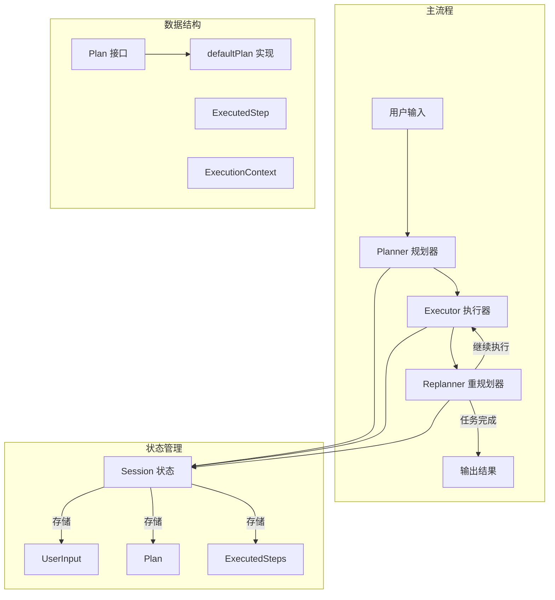

# planexecute_core_and_state 模块深度解析

## 模块概览

`planexecute_core_and_state` 模块实现了一个**计划-执行-重新计划**（Plan-Execute-Replan）风格的智能代理系统。这个模块解决的核心问题是：**如何让 AI 代理在面对复杂任务时，能够先制定结构化计划，再逐步执行，并根据执行结果动态调整计划，最终完成目标**。

想象一下，你让一个助理帮你策划一场公司年会。传统的 AI 可能会直接开始执行，边做边想，容易出错或遗漏重要环节。而这个模块的工作方式更像一个经验丰富的项目经理：
1. 首先制定详细的步骤计划
2. 执行第一步
3. 评估执行结果，决定是完成任务还是调整计划继续执行
4. 重复上述过程直到达成目标

这种方法特别适合需要多步骤、复杂决策的任务，如研究项目、代码开发、复杂问题解决等。

## 核心架构



### 架构详解

这个模块的核心架构是一个**三阶段迭代循环**：

1. **规划阶段（Planner）**：
   - 接收用户输入，生成结构化的执行计划
   - 计划由一系列清晰、可执行的步骤组成
   - 支持通过两种方式生成计划：格式化输出模型或工具调用模型

2. **执行阶段（Executor）**：
   - 接收规划器生成的计划
   - 专注于执行计划的第一步
   - 使用配置的工具集来完成具体任务
   - 记录执行结果

3. **重规划阶段（Replanner）**：
   - 分析已执行的步骤和结果
   - 做出决策：是完成任务还是继续执行
   - 如果继续，生成更新后的计划（仅包含剩余步骤）
   - 如果完成，生成最终响应

这三个阶段通过 **Session 状态** 紧密协作，共享用户输入、当前计划和已执行步骤等信息。

## 核心组件解析

### outputSessionKVsAgent - 会话状态输出包装器

在深入了解三个核心代理之前，我们先看一个简单但重要的辅助组件：`outputSessionKVsAgent`。

这是一个代理包装器，它的作用是在原始代理的所有事件发送完毕后，额外发送一个包含所有 Session 键值对的事件。

**设计意图**：
- 透明包装：嵌入原始代理，不干扰其正常工作
- 状态暴露：使得调用方可以获取到整个执行过程中的所有 Session 状态
- 调试友好：特别有助于开发和调试阶段了解内部状态变化

**工作原理**：
```go
// 1. 运行原始代理
iterator_ := o.Agent.Run(ctx, input, options...)

// 2. 转发所有原始事件
for {
    event, ok := iterator_.Next()
    if !ok {
        break
    }
    generator.Send(event)
}

// 3. 额外发送包含所有 Session 键值的事件
kvs := adk.GetSessionValues(ctx)
event := &adk.AgentEvent{
    Output: &adk.AgentOutput{CustomizedOutput: kvs},
}
generator.Send(event)
```

### Plan 接口与 defaultPlan 实现

`Plan` 接口是整个模块的核心抽象之一，它定义了执行计划的契约：

```go
type Plan interface {
    FirstStep() string
    json.Marshaler
    json.Unmarshaler
}
```

**设计意图**：
- `FirstStep()` 提供了获取当前要执行步骤的统一方式
- JSON 序列化能力使得计划可以在提示词模板中使用，也可以从模型输出中解析
- 接口设计允许自定义计划实现，而不仅限于默认的 `defaultPlan`

`defaultPlan` 是默认实现，包含一个简单的步骤列表：

```go
type defaultPlan struct {
    Steps []string `json:"steps"`
}
```

这种设计体现了**简洁性与可扩展性的平衡**：默认实现简单直观，同时接口允许更复杂的计划结构（如带有依赖关系、条件分支的计划）。

### Planner（规划器）

规划器负责将用户输入转化为结构化计划。它的核心工作流程是：

1. 使用提示词模板格式化用户输入
2. 调用语言模型生成计划
3. 解析模型输出为 `Plan` 对象
4. 将计划存储到 Session 中

**关键设计决策**：
- 支持两种模型配置方式：`ChatModelWithFormattedOutput` 和 `ToolCallingChatModel`
- 通过 `NewPlan` 函数支持自定义计划实现
- 使用 compose 链构建处理流程，提高了代码的可读性和可维护性

### Executor（执行器）

执行器专注于执行计划的当前步骤。它的设计体现了**单一职责原则**：

```go
type ExecutorConfig struct {
    Model         model.ToolCallingChatModel
    ToolsConfig   adk.ToolsConfig
    MaxIterations int
    GenInputFn    GenModelInputFn
}
```

**设计亮点**：
- 通过 `ExecutionContext` 接收完整的上下文信息（用户输入、计划、已执行步骤）
- 使用 `adk.NewChatModelAgent` 复用了通用的聊天模型代理功能
- 将执行结果存储在 Session 中供后续使用

### Replanner（重规划器）

重规划器是整个系统的"大脑"，它做出关键决策：继续还是完成。

**核心决策逻辑**：
1. 分析已执行步骤和结果
2. 选择两个工具之一：
   - `respond`：任务完成，生成最终响应
   - `plan`：继续执行，生成更新后的计划

**设计技巧**：
- 使用工具选择作为决策机制，天然适合语言模型的工作方式
- 更新计划时只保留剩余步骤，保持计划的简洁性
- 扩展 `ExecutedSteps` 列表，维护完整的执行历史

### Session 状态管理

模块使用 Session 来在三个阶段之间共享状态，定义了以下关键 Session 键：

```go
const (
    UserInputSessionKey     = "UserInput"
    PlanSessionKey          = "Plan"
    ExecutedStepSessionKey  = "ExecutedStep"
    ExecutedStepsSessionKey = "ExecutedSteps"
)
```

**设计意图**：
- 使用字符串键而不是类型安全的方式，是为了灵活性和与现有 ADK 框架的兼容性
- 区分单次执行结果（`ExecutedStep`）和历史记录（`ExecutedSteps`）
- 这种状态传递方式使得三个代理可以独立工作，同时共享必要信息

## 数据流程分析

让我们追踪一个典型任务的完整数据流程：

1. **初始化阶段**：
   - 用户输入 → `New()` 函数 → 创建顺序代理
   - 顺序代理包含：Planner + 循环代理（Executor + Replanner）

2. **规划阶段**：
   - `Planner.Run()` 接收用户输入
   - 通过 `PlannerPrompt` 格式化输入
   - 调用模型生成计划
   - 解析计划并存储到 `PlanSessionKey`
   - 发出 `AgentEvent` 包含计划信息

3. **执行阶段**：
   - `Executor.Run()` 从 Session 获取计划和用户输入
   - 通过 `ExecutorPrompt` 格式化执行上下文
   - 调用模型执行第一步
   - 执行结果存储到 `ExecutedStepSessionKey`

4. **重规划阶段**：
   - `Replanner.Run()` 从 Session 获取执行结果
   - 将新执行的步骤添加到 `ExecutedStepsSessionKey`
   - 通过 `ReplannerPrompt` 格式化决策上下文
   - 模型选择使用 `respond` 或 `plan` 工具
   - 如果选择 `plan`，更新 `PlanSessionKey` 并继续循环
   - 如果选择 `respond`，发出 `BreakLoopAction` 结束循环

5. **输出阶段**：
   - `outputSessionKVsAgent` 包装整个代理
   - 在所有事件发送完毕后，额外发送包含所有 Session 键值的事件

## 关键设计决策

### 1. 三代理分离 vs 单一代理

**决策**：将系统拆分为 Planner、Executor、Replanner 三个独立代理

**原因**：
- **职责分离**：每个代理专注于一个任务，提示词更精准，模型表现更好
- **可测试性**：可以独立测试每个代理的功能
- **可组合性**：可以替换其中一个代理而不影响其他部分
- **灵活性**：可以在不同场景下重用单个代理

**权衡**：
- 增加了系统的复杂性
- 需要通过 Session 管理状态传递
- 可能有轻微的性能开销（多次模型调用）

### 2. 基于 Session 的状态传递 vs 直接参数传递

**决策**：使用 Session 作为状态传递机制

**原因**：
- **解耦**：代理之间不需要直接引用彼此
- **灵活性**：可以在不修改代理接口的情况下添加新的状态
- **可恢复性**：Session 状态可以被序列化，支持中断和恢复
- **与 ADK 框架一致**：复用了框架现有的状态管理机制

**权衡**：
- 类型安全性降低（使用字符串键）
- 隐式依赖关系，代码可读性稍差
- 需要仔细管理 Session 键的命名和使用

### 3. 工具调用作为决策机制

**决策**：在 Replanner 中使用工具调用（`plan` vs `respond`）作为决策方式

**原因**：
- **自然契合**：工具调用是语言模型天然支持的机制
- **结构化输出**：可以确保模型输出符合预期格式
- **可扩展性**：未来可以添加更多工具（如"请求澄清"、"报告错误"等）
- **提示词友好**：可以在提示词中清晰描述每个工具的用途

**权衡**：
- 依赖模型正确选择工具
- 需要额外的错误处理（模型选择了错误的工具）
- 增加了提示词的复杂性

### 4. 计划的"剩余步骤"策略

**决策**：在重规划时，新计划只包含剩余步骤，而不是完整计划

**原因**：
- **聚焦当前**：让 Executor 专注于下一步，减少混淆
- **历史保留**：通过 `ExecutedSteps` 保留完整历史
- **模型效率**：减少了计划的长度，降低了模型处理成本
- **清晰的进度**：计划的长度直接反映了剩余工作量

**权衡**：
- 如果需要重新审视已执行步骤，需要从 `ExecutedSteps` 中获取
- 不能简单地用新计划替换旧计划来"回滚"

## 使用指南与最佳实践

### 配置 Planner

有两种方式配置 Planner：

1. **使用格式化输出模型**：
```go
planner, err := NewPlanner(ctx, &PlannerConfig{
    ChatModelWithFormattedOutput: myStructuredOutputModel,
})
```

2. **使用工具调用模型**（更常见）：
```go
planner, err := NewPlanner(ctx, &PlannerConfig{
    ToolCallingChatModel: myToolCallingModel,
    // ToolInfo: &myCustomPlanToolInfo, // 可选，自定义计划结构
})
```

### 自定义 Plan 结构

如果默认的 `defaultPlan` 不能满足需求，可以自定义 Plan 实现：

```go
type MyDetailedPlan struct {
    Steps []struct {
        Description string `json:"description"`
        Tools       []string `json:"tools"`
        EstimatedTime int `json:"estimated_time"`
    } `json:"steps"`
}

func (p *MyDetailedPlan) FirstStep() string {
    if len(p.Steps) == 0 {
        return ""
    }
    // 返回格式化的第一步描述
    return fmt.Sprintf("%s (使用工具: %v)", p.Steps[0].Description, p.Steps[0].Tools)
}

// 实现 MarshalJSON 和 UnmarshalJSON...
```

然后在配置中使用：

```go
planner, err := NewPlanner(ctx, &PlannerConfig{
    ToolCallingChatModel: myModel,
    NewPlan: func(ctx context.Context) Plan {
        return &MyDetailedPlan{}
    },
})
```

### 配置 Executor

Executor 需要配置工具集，这是它完成实际工作的关键：

```go
executor, err := NewExecutor(ctx, &ExecutorConfig{
    Model: myToolCallingModel,
    ToolsConfig: adk.ToolsConfig{
        Tools: []adk.Tool{mySearchTool, myCalculatorTool, myFileSystemTool},
    },
    MaxIterations: 10, // 每个步骤的最大迭代次数
})
```

### 配置 Replanner

Replanner 通常使用默认配置即可，但也可以自定义：

```go
replanner, err := NewReplanner(ctx, &ReplannerConfig{
    ChatModel: myToolCallingModel,
    // PlanTool: &myCustomPlanToolInfo,     // 可选
    // RespondTool: &myCustomRespondToolInfo, // 可选
})
```

### 组装完整代理

最后，将三个代理组装成完整的 Plan-Execute-Replan 代理：

```go
agent, err := New(ctx, &Config{
    Planner:     planner,
    Executor:    executor,
    Replanner:   replanner,
    MaxIterations: 20, // execute-replan 循环的最大次数
})
```

#### 可选：添加会话状态输出

如果需要获取完整的会话状态（对于调试和监控特别有用），可以使用 `agentOutputSessionKVs` 函数包装代理：

```go
// 注意：agentOutputSessionKVs 是包内未导出函数，
// 如需要此功能，可参考 outputSessionKVsAgent 的实现方式
// 自行创建类似的包装器
```

这个包装器会在所有正常事件发送完毕后，额外发送一个包含所有 Session 键值对的事件，使得调用方可以获取到完整的执行状态。

## 常见陷阱与注意事项

### 1. Session 键冲突

**问题**：模块定义的 Session 键（如 "Plan"、"ExecutedSteps"）可能与其他模块冲突。

**解决方案**：
- 遵循模块的命名约定，使用独特的键名
- 如果需要在更大的系统中使用，可以考虑包装这些代理，添加命名空间

### 2. 计划步骤过于模糊

**问题**：如果 Planner 生成的步骤不够具体，Executor 可能无法有效执行。

**解决方案**：
- 自定义 `PlannerPrompt`，提供更具体的步骤指导
- 考虑自定义 Plan 结构，要求更多细节（如工具建议、预期结果等）
- 在示例中展示高质量的计划步骤

### 3. 无限循环风险

**问题**：如果 Replanner 总是决定继续执行，可能会导致无限循环。

**解决方案**：
- 始终设置合理的 `MaxIterations`
- 监控执行过程，在出现异常模式时中断
- 考虑在 Replanner 的提示词中强调"知道何时停止"

### 4. 执行历史过长

**问题**：随着执行步骤增加，`ExecutedSteps` 可能变得很长，导致模型输入超出限制。

**解决方案**：
- 实现执行历史的摘要机制
- 只保留最近 N 步的详细信息
- 在 Replanner 提示词中指导模型关注关键信息

### 5. 工具选择错误

**问题**：Replanner 可能选择错误的工具，或没有选择任何工具。

**解决方案**：
- 增强错误处理和重试逻辑
- 在提示词中提供清晰的工具选择标准
- 考虑添加验证步骤，确保工具选择的合理性

## 与其他模块的关系

`planexecute_core_and_state` 模块在整个系统中处于**应用层**，它构建在以下核心模块之上：

- **[adk_runtime](adk_runtime.md)**：提供了 Agent 接口、Session 管理和事件系统
- **[chatmodel_react_and_retry_runtime](adk_runtime-chatmodel_react_and_retry_runtime.md)**：Executor 内部使用了 ChatModelAgent
- **[schema_models_and_streams](schema_models_and_streams.md)**：提供了消息 schema 和流处理工具
- **[components_core](components_core.md)**：提供了模型、工具和提示词的核心接口

这个模块设计为**可组合的构建块**，可以与其他模块（如 [deep_agent_and_task_tooling](adk_prebuilt_agents-deep_agent_and_task_tooling.md)）一起使用，构建更复杂的代理系统。

## 总结

`planexecute_core_and_state` 模块实现了一个强大而灵活的计划-执行-重新计划代理系统。它的核心价值在于：

1. **结构化问题解决**：将复杂任务分解为可管理的步骤
2. **迭代优化**：根据执行结果动态调整计划
3. **清晰的职责分离**：三个专门的代理协同工作
4. **高度可配置**：几乎每个组件都可以自定义
5. **与 ADK 框架无缝集成**：复用了现有机制和接口

这个模块特别适合需要多步骤推理和执行的复杂任务，是构建高级 AI 代理系统的重要基石。
