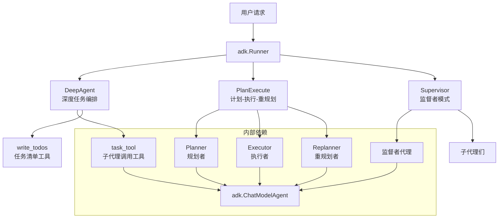

# adk_prebuilt_agents 模块深度解析

## 概述

`adk_prebuilt_agents` 模块是一个精心设计的多智能体协作框架，提供了三种核心的预构建智能体模式：DeepAgent（深度任务编排）、PlanExecute（计划-执行-重规划）和 Supervisor（监督者模式）。这些模式不是简单的工具集合，而是解决复杂问题的架构蓝图——就像建筑中的预制构件，让你可以快速搭建复杂的智能体系统，而无需从零开始。

想象一下：你要建造一栋办公楼，不会从搅拌混凝土开始，而是使用预制梁、楼板和管道系统。同样，这个模块提供的不是零散的代码，而是可重用的"架构组件"，每个都解决了一类特定的智能体协作问题。

## 架构总览



这个模块的核心思想是**分层责任分离**：
- **DeepAgent** 适合需要深度任务分解和子代理协调的场景
- **PlanExecute** 适合需要明确计划、执行和反馈循环的任务
- **Supervisor** 适合需要中心化协调和控制的多代理系统

每个模式都可以独立使用，也可以组合使用（例如 Supervisor 协调多个 PlanExecute 代理）。

## 子模块概览

### [deep_agent_and_task_tooling](adk_prebuilt_agents-deep_agent_and_task_tooling.md)
DeepAgent 是一个具有深度任务编排能力的智能体。它的核心思想是将复杂任务分解为子任务，然后调用专门的子代理来处理每个子任务。就像一位项目经理，它不仅自己能工作，还能将任务分配给团队成员，并跟踪进度。

### [planexecute_core_and_state](adk_prebuilt_agents-planexecute_core_and_state.md)
PlanExecute 实现了经典的"计划-执行-重规划"循环。这种模式将问题解决过程明确分为三个阶段：先制定计划，再执行第一步，然后根据结果决定是完成任务还是调整计划继续执行。这就像自驾导航：先规划路线，行驶一段后根据交通状况重新规划。

### [supervisor_agent_configuration_and_tests](adk_prebuilt_agents-supervisor_agent_configuration_and_tests.md)
Supervisor 模式实现了分层的多代理协调。一个中心监督者代理管理多个子代理，所有子代理只能与监督者通信，不能直接相互通信。这就像公司的组织结构：CEO 管理部门经理，部门经理管理员工，信息只能沿着层级流动。

### [cross_prebuilt_integration_scenarios](adk_prebuilt_agents-cross_prebuilt_integration_scenarios.md)
这个子模块展示了如何将不同的预构建代理模式组合使用，解决更复杂的问题。例如，使用 Supervisor 协调多个 PlanExecute 代理，或者让 DeepAgent 调用 PlanExecute 作为子代理。

## 设计决策分析

### 1. 会话值（Session Values）作为共享状态
**设计选择**：使用 `adk.AddSessionValue` 和 `adk.GetSessionValue` 在代理之间传递状态，而不是显式的参数传递。

**权衡分析**：
- ✅ **优点**：简化了代理之间的状态共享，特别是在嵌套调用场景中；状态自动沿着调用链传递
- ❌ **缺点**：隐式依赖增加了理解难度；会话键名冲突可能导致难以调试的问题

**类比**：这就像公司的内部wiki系统——每个人都可以读取和更新共享信息，但你需要确保大家使用相同的命名约定。

### 2. 工具调用作为代理交互的主要方式
**设计选择**：将代理调用包装为工具（如 `task_tool`、`AgentTool`），而不是提供专门的代理调用API。

**权衡分析**：
- ✅ **优点**：统一了代理调用和工具调用的接口；LLM 可以使用相同的机制调用工具和子代理
- ❌ **缺点**：代理调用的语义被"隐藏"在工具调用背后；错误信息可能不够直观

### 3. 中断/恢复机制作为一等公民
**设计选择**：深度集成了中断（Interrupt）和恢复（Resume）机制，允许在执行过程中暂停并在稍后继续。

**权衡分析**：
- ✅ **优点**：支持人工审批、长时间运行任务、错误恢复等场景；与检查点（Checkpoint）机制结合提供了强大的容错能力
- ❌ **缺点**：增加了系统的复杂性；需要工具和代理正确处理中断状态

### 4. 分层组合而非继承
**设计选择**：通过组合（如 `SequentialAgent`、`LoopAgent`）来构建复杂代理，而不是使用继承。

**权衡分析**：
- ✅ **优点**：更灵活，可以动态组合不同的代理；每个代理保持独立，易于测试
- ❌ **缺点**：组合的逻辑可能变得复杂；调试时需要理解整个组合结构

## 数据流剖析

让我们通过一个典型场景来理解数据如何在这个模块中流动：**Supervisor 协调 PlanExecute 代理执行需要人工审批的任务**。

1. **初始化阶段**：
   - 用户请求 → `adk.Runner` → Supervisor 代理
   - Supervisor 决定将任务转移给 PlanExecute 子代理

2. **计划阶段**：
   - PlanExecute 调用 Planner
   - Planner 使用 LLM 生成计划，存储在会话键 `PlanSessionKey` 下
   - 计划通过 `ExecutedStepSessionKey` 和 `ExecutedStepsSessionKey` 跟踪进度

3. **执行阶段**：
   - Executor 获取当前计划，执行第一步
   - 执行过程中调用需要审批的工具，触发 `StatefulInterrupt`
   - 中断信息向上传播，最终到达 Runner，暂停执行

4. **恢复阶段**：
   - 用户提供审批结果，调用 `Runner.ResumeWithParams`
   - 中断点从检查点存储中恢复
   - 工具继续执行，返回结果
   - Executor 完成执行，结果存储在 `ExecutedStepSessionKey`

5. **重规划阶段**：
   - Replanner 评估执行结果，决定是继续还是完成
   - 如果继续，生成新计划，循环回到执行阶段
   - 如果完成，返回最终响应

6. **结束阶段**：
   - PlanExecute 完成，结果返回给 Supervisor
   - Supervisor 决定下一步或结束整个流程

## 关键使用场景

### 场景1：复杂任务的深度分解（DeepAgent）
当你有一个复杂任务，可以分解为多个子任务，每个子任务最好由专门的代理处理时，使用 DeepAgent。

```go
agent, _ := deep.New(ctx, &deep.Config{
    ChatModel:     chatModel,
    SubAgents:     []adk.Agent{codeAgent, testAgent, deployAgent},
    MaxIteration:  10,
})
```

### 场景2：需要明确计划的任务（PlanExecute）
当任务需要先规划再执行，并且可能需要根据执行结果调整计划时，使用 PlanExecute。

```go
planner, _ := planexecute.NewPlanner(ctx, &planexecute.PlannerConfig{...})
executor, _ := planexecute.NewExecutor(ctx, &planexecute.ExecutorConfig{...})
replanner, _ := planexecute.NewReplanner(ctx, &planexecute.ReplannerConfig{...})

agent, _ := planexecute.New(ctx, &planexecute.Config{
    Planner:   planner,
    Executor:  executor,
    Replanner: replanner,
})
```

### 场景3：多代理协调（Supervisor）
当你需要一个中心代理来协调多个专门的子代理时，使用 Supervisor。

```go
supervisorAgent, _ := adk.NewChatModelAgent(ctx, &adk.ChatModelAgentConfig{...})
agent, _ := supervisor.New(ctx, &supervisor.Config{
    Supervisor: supervisorAgent,
    SubAgents:  []adk.Agent{planAgent, codeAgent, testAgent},
})
```

## 新贡献者注意事项

### 1. 会话键的约定
会话键（Session Keys）是字符串，没有编译时检查。确保：
- 使用常量定义会话键（如 `PlanSessionKey`）
- 在模块文档中记录所有会话键
- 避免在不同模块中使用相同的键名

### 2. 中断状态的处理
实现工具时，记住：
- 首次调用时，`wasInterrupted` 为 false，触发中断
- 恢复时，`isResumeTarget` 为 true，`hasData` 表示是否有恢复数据
- 始终检查中断状态，不要假设工具可以一次性完成

### 3. 子代理的确定性转移
使用 Supervisor 时，子代理会被自动包装为 `AgentWithDeterministicTransferTo`，确保它们只能转移回监督者。不要尝试绕过这个机制。

### 4. 流式输出与事件传播
当 `EnableStreaming` 为 true 时：
- 消息会以流的形式逐块返回
- 确保你的代理正确处理流式输入
- 使用 `EventFromMessage` 的 `streamOutput` 参数传播流

### 5. 内部事件的可见性
设置 `ToolsConfig.EmitInternalEvents = true` 可以让内部代理的事件传播到外层。这对于调试非常有用，但在生产环境中可能会产生太多噪音。

## 与其他模块的关系

- 依赖 [adk_runtime](adk_runtime.md)：提供核心的代理抽象、运行时和会话管理
- 依赖 [compose_graph_engine](compose_graph_engine.md)：提供图执行引擎，用于构建复杂的代理工作流
- 可选依赖 [adk_middlewares_and_filesystem](adk_middlewares_and_filesystem.md)：提供工具中间件，可与这些预构建代理一起使用

这个模块是整个框架的"应用层"——它使用底层的构建块来创建即用型的解决方案。
