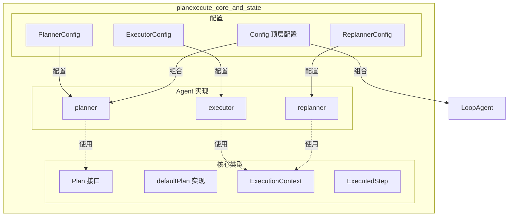

# planexecute_core_and_state 模块

> **30秒概览**：`planexecute_core_and_state` 是 Eino ADK 的一个预置智能体模块，实现了 **Plan-Execute-Replan（计划-执行-重规划）** 模式。这是一种经典的 LLM Agent 架构范式，灵感来自 ReAct 思想但更强调显式规划能力——智能体首先生成一个结构化的步骤列表，然后逐个执行，并根据执行结果决定是继续下一步还是调整计划。

---

## 1. 这个模块解决什么问题？

### 问题空间

在构建复杂任务处理系统时，LLM 面临着**长程推理**的挑战：

1. **一次性生成完整答案不可靠**：对于复杂任务（如"分析这个代码库并生成文档"），LLM 很难在单次调用中完成所有思考和行动
2. **缺乏显式推理过程**：传统 ReAct 模式虽然能逐步思考，但缺少将思考结果固化为可执行计划的能力
3. **无法适应变化**：任务执行过程中可能出现意外情况，需要动态调整策略

### 解决方案

Plan-Execute-Replan 模式通过**三阶段迭代**来解决这些问题：

```
┌─────────────┐    1. 规划     ┌─────────────┐
│   用户输入   │ ───────────► │   Planner   │
└─────────────┘               │ (生成计划)   │
                              └──────┬──────┘
                                     │ Plan
                                     ▼
                              ┌─────────────┐
                              │  Executor   │
                              │ (执行步骤)   │
                              └──────┬──────┘
                                     │ ExecutedStep
                                     ▼
                              ┌─────────────┐
              ┌───────────────┤  Replanner  │
              │               │ (评估/重规划) │
              │               └──────┬──────┘
              │                      │
              │              ┌───────┴───────┐
              │              │               │
              │         [完成任务]       [继续循环]
              │              │               │
              └──────────────┴───────────────┘
```

---

## 2. 核心抽象与心智模型

### 2.1 设计隐喻：厨房工作流程

把 Plan-Execute-Replan 想象成**一家米其林餐厅的后厨**：

| 概念 | 餐厅隐喻 | 技术含义 |
|------|----------|----------|
| **Planner** | 主厨制定菜单和烹饪顺序 | 将用户目标分解为结构化步骤 |
| **Executor** | 厨师执行单个菜品烹饪 | 执行计划中的第一步 |
| **Replanner** | 用餐主管根据食客反馈调整菜单 | 评估执行结果，决定继续或调整 |
| **Plan** | 菜单上的菜品列表 | 包含有序步骤的执行计划 |
| **ExecutedStep** | 已完成菜品的记录 | 步骤 + 执行结果 |

### 2.2 核心类型

#### Plan 接口 — 执行计划的抽象

```go
type Plan interface {
    FirstStep() string          // 获取第一个待执行步骤
    json.Marshaler              // 支持序列化
    json.Unmarshaler            // 支持反序列化
}
```

`Plan` 是整个模式的**核心契约**。`defaultPlan` 是默认实现：

```go
type defaultPlan struct {
    Steps []string `json:"steps"`
}
```

**设计意图**：将计划结构设计为可序列化的 JSON，使得 LLM 可以通过结构化输出或 Tool Calling 生成计划，同时也支持状态的持久化和恢复。

#### ExecutionContext — 执行上下文

```go
type ExecutionContext struct {
    UserInput     []adk.Message  // 用户原始输入
    Plan          Plan           // 当前计划
    ExecutedSteps []ExecutedStep // 已完成步骤及结果
}
```

这是 Planner、Executor、Replanner 之间的**数据桥梁**，确保每个阶段都能访问完整的执行历史。

#### Session Keys — 状态存储

模块使用 Session Keys 在不同 Agent 之间传递状态：

```go
const (
    UserInputSessionKey     = "UserInput"
    PlanSessionKey          = "Plan"
    ExecutedStepSessionKey  = "ExecutedStep"
    ExecutedStepsSessionKey = "ExecutedSteps"
)
```

---

## 3. 架构设计与数据流

### 3.1 整体架构



### 3.2 组合模式：Sequential + Loop

`New()` 函数体现了核心组合思想：

```go
func New(ctx context.Context, cfg *Config) (adk.ResumableAgent, error) {
    // 1. 创建 LoopAgent（Executor + Replanner 循环）
    loop, err := adk.NewLoopAgent(ctx, &adk.LoopAgentConfig{
        SubAgents: []adk.Agent{cfg.Executor, cfg.Replanner},
        MaxIterations: maxIterations,
    })
    
    // 2. 创建 SequentialAgent（Planner -> Loop）
    return adk.NewSequentialAgent(ctx, &adk.SequentialAgentConfig{
        SubAgents: []adk.Agent{cfg.Planner, loop},
    })
}
```

这形成了一个 **Planner → Loop(Executor ↔ Replanner)** 的执行拓扑：

```
[Planner] → [Loop] → [Executor] → [Replanner] → [Loop 继续?]
                                  ↓ (BreakLoop)
                              [完成]
```

### 3.3 详细数据流

#### 阶段1：规划 (Planning)

```
用户输入 → Planner.Run()
    │
    ├─► PlannerPrompt.Format() → 生成规划提示词
    │
    ├─► ChatModel (带 PlanTool) → 生成结构化 JSON 计划
    │
    └─► Plan.UnmarshalJSON() → 解析为 Plan 对象
        │
        └─► adk.AddSessionValue(ctx, PlanSessionKey, plan)
```

#### 阶段2：执行 (Execution)

```
Loop 开始 → Executor.Run()
    │
    ├─► 获取 Session 中的 Plan
    │
    ├─► ExecutorPrompt.Format() → 包含原始输入 + 计划 + 已执行步骤
    │
    ├─► ChatModelAgent (带 Tools) → 执行第一步
    │
    └─► OutputKey = ExecutedStepSessionKey
        │
        └─► adk.AddSessionValue(ctx, ExecutedStepSessionKey, result)
```

#### 阶段3：重规划 (Replanning)

```
Executor 完成 → Replanner.Run()
    │
    ├─► 获取 Session 中的 Plan 和 ExecutedStep
    │
    ├─► ReplannerPrompt.Format() → 评估进度
    │
    ├─► ChatModel (带 PlanTool + RespondTool) → 决定继续还是完成
    │
    └─► Tool Call 决策:
        │
        ├─► respond_tool → NewBreakLoopAction() → 退出循环 → 完成
        │
        └─► plan_tool → 更新 Plan → 继续循环
```

---

## 4. 关键设计决策与权衡

### 4.1 为什么要用 Tool Calling 而不是直接文本输出？

**决策**：Planner 和 Replanner 默认使用 Tool Calling (ToolChoiceForced) 生成结构化输出。

**权衡分析**：

| 方案 | 优点 | 缺点 |
|------|------|------|
| **Tool Calling (chosen)** | 结构化保证、解析可靠、错误处理简单 | 需要模型支持 Tool Calling |
| **JSON 文本输出 | 通用性更强 | 需要额外解析、格式不稳定 |

**选择理由**：对于 Plan 这种需要可靠解析的结构，使用 Tool Calling 可以确保 LLM 输出的格式完全符合预期，减少解析失败的概率。

### 4.2 为什么 Executor 用 ChatModelAgent 而不是自定义 Agent？

**决策**：Executor 基于 `adk.NewChatModelAgent` 构建，本质上是一个 ReAct Agent。

**权衡分析**：

| 方案 | 优点 | 缺点 |
|------|------|------|
| **ChatModelAgent (chosen)** | 成熟的工具调用循环、可重试、超时控制 | 灵活性受限 |
| **自定义 Agent** | 完全控制执行逻辑 | 实现复杂度高 |

**选择理由**：Executor 需要能够调用外部工具（搜索、计算、API等），ChatModelAgent 已经实现了完整的 ReAct 循环，复用它可以避免重复造轮子。

### 4.3 Session State vs 参数传递

**决策**：使用 Session Values 在 Agent 之间传递状态，而不是通过输入参数链式传递。

**权衡分析**：

| 方案 | 优点 | 缺点 |
|------|------|------|
| **Session Values (chosen)** | 解耦 Agent、状态自动保持、可中断恢复 | 隐式依赖、调试困难 |
| **参数传递** | 显式数据流、调试友好 | 强耦合、破坏封装 |

**选择理由**：
1. 符合 ADK 的多 Agent 架构模式
2. 支持中断恢复（checkpoint）时状态自动持久化
3. Replanner 需要访问完整的执行历史，Session 是最自然的共享方式

### 4.4 默认迭代次数为什么是 10？

```go
if maxIterations <= 0 {
    maxIterations = 10  // 默认值
}
```

**设计理由**：
- 10 次迭代对于大多数复杂任务足够
- 防止无限循环（LLM 可能持续重规划而不进展）
- 可通过配置调整（ExecutorConfig.MaxIterations 也可以单独控制内部 ChatModelAgent 的迭代）

---

## 5. 与其他模块的关系

### 5.1 依赖关系

| 上游模块 | 依赖内容 |
|----------|----------|
| `adk` (core) | `Agent`, `ResumableAgent` 接口, `NewChatModelAgent`, `NewSequentialAgent`, `NewLoopAgent`, Session Values API |
| `compose` | `compose.Chain`, `compose.InvokableLambda` 构建工作流 |
| `schema` | `Message`, `ToolInfo`, `ToolChoiceForced` |
| `components/model` | `BaseChatModel`, `ToolCallingChatModel` 接口 |
| `components/prompt` | `prompt.FromMessages` 构建提示词模板 |

### 5.2 类似模块对比

| 模块 | 模式 | 适用场景 |
|------|------|----------|
| **planexecute** | Plan-Execute-Replan | 需要显式规划、长程推理、多步骤复杂任务 |
| **supervisor** | Supervisor (路由/分发) | 任务分发、多专家协作 |
| **deep** | Deep Agent (TODO) | 深度推理任务 |

> **注意**：上述对比仅为模块特性差异。详细内容请参考各模块文档：
> - [Supervisor 预置 Agent](../adk_prebuilt_supervisor.md)
> - [Deep Agent 预置 Agent](../adk_prebuilt_deep.md)（开发中）

---

## 6. 实用指南

### 6.1 快速使用示例

```go
// 1. 创建 Planner
planner, err := planexecute.NewPlanner(ctx, &planexecute.PlannerConfig{
    ToolCallingChatModel: myModel,
    // 或使用 ChatModelWithFormattedOutput
})

// 2. 创建 Executor
executor, err := planexecute.NewExecutor(ctx, &planexecute.ExecutorConfig{
    Model:       myModel,
    ToolsConfig: myTools,
})

// 3. 创建 Replanner
replanner, err := planexecute.NewReplanner(ctx, &planexecute.ReplannerConfig{
    ChatModel: myModel,
})

// 4. 组装
agent, err := planexecute.New(ctx, &planexecute.Config{
    Planner:   planner,
    Executor:  executor,
    Replanner: replanner,
})

// 5. 运行
result := agent.Run(ctx, &adk.AgentInput{
    Messages: []adk.Message{userMessage},
})
```

### 6.2 提示词自定义

模块提供了三个内置提示词模板：
- `PlannerPrompt` — 初始规划
- `ExecutorPrompt` — 步骤执行
- `ReplannerPrompt` — 评估与重规划

可以通过配置覆盖：

```go
planexecute.NewExecutor(ctx, &planexecute.ExecutorConfig{
    Model: myModel,
    GenInputFn: func(ctx context.Context, in *planexecute.ExecutionContext) ([]adk.Message, error) {
        // 自定义输入生成逻辑
    },
})
```

### 6.3 Plan 结构扩展

如果默认的 `defaultPlan` 不满足需求，可以实现自定义 Plan：

```go
type MyPlan struct {
    Steps     []string `json:"steps"`
    Reasoning string   `json:"reasoning"`  // 添加思考过程字段
}

func (p *MyPlan) FirstStep() string { ... }
func (p *MyPlan) MarshalJSON() ([]byte, error) { ... }
func (p *MyPlan) UnmarshalJSON([]byte) error { ... }

planexecute.NewPlanner(ctx, &planexecute.PlannerConfig{
    ToolCallingChatModel: myModel,
    NewPlan: func(ctx context.Context) planexecute.Plan {
        return &MyPlan{}
    },
})
```

---

## 7. 注意事项与陷阱

### 7.1 常见问题

1. **模型不支持 Tool Calling**
   - 解决：使用 `ChatModelWithFormattedOutput` 配置结构化输出模型

2. **迭代次数过多导致超时**
   - 解决：降低 `MaxIterations` 或为 Executor 配置更小的 `MaxIterations`

3. **状态泄漏**
   - 注意：Session Values 在整个 Agent 生命周期内保持，调试时可调用 `adk.GetSessionValues(ctx)` 查看

### 7.2 设计约束

1. **Executor 必须设置 OutputKey**
   - 否则 Replanner 无法获取执行结果
   - 代码中硬依赖 `ExecutedStepSessionKey`

2. **Replanner 必须在 Loop 中**
   - Replanner 通过 `NewBreakLoopAction` 控制循环退出
   - 没有 LoopAgent 包装时，Replanner 无法终止执行

3. **工具名称必须匹配**
   - `PlanToolInfo` 和 `RespondToolInfo` 的名称必须与 ReplannerPrompt 中的占位符一致
   - 代码中通过 `{plan_tool}` 和 `{respond_tool}` 动态注入

---

## 8. 子模块概览

本模块包含以下子模块文档：

- **[plan_execute 核心实现](adk_prebuilt_planexecute_plan_execute.md)** — 详细的 Agent 实现分析
  - Plan 接口与 defaultPlan 实现
  - Planner 的规划和输入生成机制
  - Executor 基于 ChatModelAgent 的执行流程
  - Replanner 的决策机制和循环控制
  - Session State 通信机制详解
  - Sequential + Loop 组合架构

- **[utils 辅助工具](adk_prebuilt_planexecute_utils.md)** — Session KV 输出包装器
  - outputSessionKVsAgent 的设计和使用
  - 事件流分析与扩展思路

---

## 参考资料

- 原始代码：`adk/prebuilt/planexecute/plan_execute.go`
- 相关 ADK 接口：`adk/interface.go`, `adk/workflow.go`, `adk/chatmodel.go`