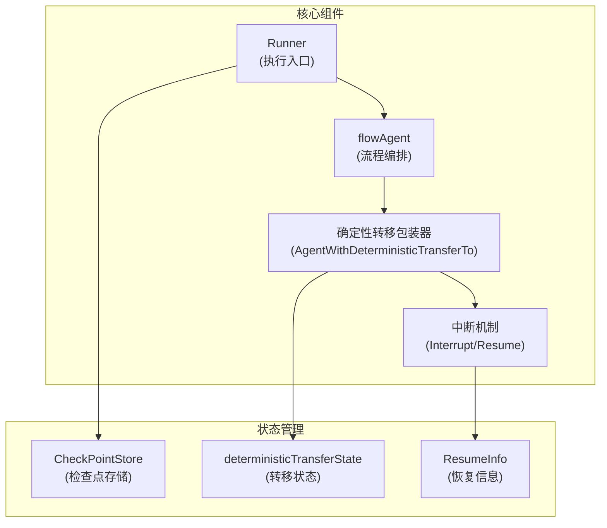

# flow_runner_interrupt_and_transfer 模块

## 概述

`flow_runner_interrupt_and_transfer` 模块是 eino 框架中实现复杂代理协作的核心基础设施。它提供了一套完整的机制来处理：

1. **确定性转移**：在代理完成后自动将控制权转移给指定代理
2. **中断与恢复**：允许代理在执行过程中暂停并在稍后从断点继续
3. **流程编排**：管理多代理协作的执行流程

想象一下这个模块就像一个**智能任务调度器**：它就像一个项目经理，知道每个团队成员（代理）完成工作后应该把任务交给谁，当有人需要外部信息时（中断），它能保存当前状态，等信息回来后再从断点继续工作。

## 架构概览



### 主要组件说明

1. **Runner**：执行代理的主要入口点，负责启动、恢复执行和检查点管理
2. **flowAgent**：包装普通代理，添加子代理管理、历史记录重写等流程编排能力
3. **确定性转移包装器**：在代理完成后自动发送转移事件到指定代理
4. **中断机制**：提供中断、状态保存和恢复执行的能力

## 核心设计决策

### 1. 事件驱动的控制流

**选择**：使用事件流（`AsyncIterator[*AgentEvent]`）作为控制流的传递方式

**为什么这样设计**：
- 允许异步处理和流式输出
- 使中断、转移等控制操作成为一等公民
- 便于在不同层级间传递状态和控制信息

**权衡**：
- ✅ 优点：灵活性高，支持复杂的控制流
- ❌ 缺点：代码理解难度增加，需要正确处理事件顺序

### 2. 组合优于继承

**选择**：使用包装器模式（如 `AgentWithDeterministicTransferTo`）而不是继承来扩展代理功能

**为什么这样设计**：
- 可以动态组合多个功能（例如：一个代理可以同时具有中断恢复和确定性转移能力）
- 保持接口简洁，每个包装器只负责一个功能
- 易于测试和维护

**权衡**：
- ✅ 优点：灵活性高，组合性强
- ❌ 缺点：可能会有多层包装，调试时需要仔细分析

### 3. 隔离的会话状态

**选择**：在确定性转移中为 flowAgent 创建隔离的会话

**为什么这样设计**：
- 防止子代理的事件污染父会话
- 确保在恢复时能正确重建状态
- 提供清晰的状态边界

**权衡**：
- ✅ 优点：状态管理清晰，恢复可靠
- ❌ 缺点：需要额外的状态复制和管理逻辑

## 子模块说明

### [deterministic_transfer_wrappers](deterministic-transfer-wrappers.md)

提供确定性转移功能的包装器，允许在代理完成后自动将控制权转移给指定代理。这对于构建预定义的代理协作流程非常有用。

### [flow_agent_orchestration](flow_agent_orchestration.md)

实现 flowAgent 的核心编排逻辑，包括子代理管理、历史记录重写和转移处理。这是多代理协作的基础。

### [interrupt_resume_bridge](flow_runner_interrupt_and_transfer-interrupt_resume_bridge.md)

提供中断和恢复机制的基础设施，包括状态序列化、检查点管理和恢复信息处理。这实现了"暂停-继续"的执行模式。

### [runner_execution_and_resume](runner_execution_and_resume.md)

实现 Runner 的执行和恢复逻辑，是整个模块的主要入口点。它负责协调其他组件，提供简单的 API 来启动和恢复代理执行。

### [deterministic_transfer_tests](deterministic_transfer_tests.md)

包含确定性转移功能的测试用例，展示了如何在不同场景下使用确定性转移。

### [interrupt_and_runner_test_harnesses](interrupt_and_runner_test_harnesses.md)

提供中断和 Runner 功能的测试工具和示例，帮助开发者理解如何测试使用这些功能的代理。

## 跨模块依赖

这个模块与以下模块有重要依赖关系：

1. **[agent_contracts_and_context](adk_runtime-agent_contracts_and_context.md)**：提供基础的代理接口和上下文类型
2. **[compose_graph_engine](../compose_graph_engine.md)**：提供底层的图执行和中断机制
3. **[schema_models_and_streams](../schema_models_and_streams.md)**：提供消息和流的基础类型

## 关键使用场景

### 场景 1：确定性转移

```go
// 创建一个代理，完成后自动转移到 "next_agent"
wrappedAgent := AgentWithDeterministicTransferTo(ctx, &DeterministicTransferConfig{
    Agent:        myAgent,
    ToAgentNames: []string{"next_agent"},
})
```

### 场景 2：中断与恢复

```go
// 在代理中触发中断
func (a *MyAgent) Run(ctx context.Context, input *AgentInput, options ...AgentRunOption) *AsyncIterator[*AgentEvent] {
    // ... 执行一些操作 ...
    
    // 需要外部信息时中断
    iter, gen := NewAsyncIteratorPair[*AgentEvent]()
    gen.Send(Interrupt(ctx, "需要用户确认"))
    gen.Close()
    return iter
}

// 稍后恢复执行
resumedIter, err := runner.ResumeWithParams(ctx, checkpointID, &ResumeParams{
    Targets: map[string]any{interruptID: "用户确认结果"},
})
```

## 注意事项和最佳实践

1. **正确处理中断状态**：使用 `StatefulInterrupt` 保存必要的内部状态，确保恢复时能正确继续执行
2. **避免在转移前中断**：如果代理可能在完成前中断，考虑是否真的需要确定性转移
3. **检查点存储的选择**：根据应用场景选择合适的 `CheckPointStore` 实现（内存、数据库等）
4. **RunPath 的正确性**：确保事件的 RunPath 正确设置，这对于事件记录和控制流决策至关重要
5. **错误处理**：始终检查 `AgentEvent.Err`，中断和恢复过程中可能会出现各种错误
