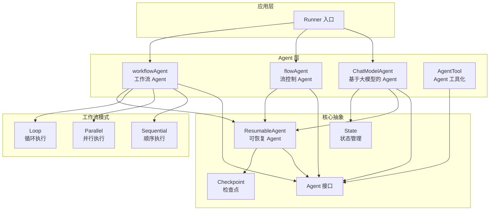

# adk_runtime：AI Agent 开发运行时

## 模块概览

`adk_runtime` 是一个用于构建 AI Agent 应用的核心运行时库，提供了一套完整的架构模式、组件抽象和实现，让开发者可以轻松构建和编排各种智能 Agent 系统。

想象一下你要构建一个多 Agent 系统，就像管理一个团队：你需要让不同的 "专家"（Agent）协同工作，处理任务、传递信息、做出决策。`adk_runtime` 就是为这个场景设计的 "团队管理框架"。

## 核心架构



### 核心设计理念

1. **Agent 是一等公民**：所有智能体都实现统一的 `Agent` 接口，可以自由组合和嵌套
2. **工作流即 Agent**：顺序、并行、循环等控制结构本身也是 Agent
3. **可中断与可恢复**：所有复杂 Agent 都支持暂停和恢复，通过检查点保存状态
4. **事件驱动**：Agent 之间通过事件流通信，支持流式输出
5. **工具调用集成**：Agent 可以使用工具，包括其他 Agent 作为工具

## 主要组件

### 1. Agent 接口体系

**Agent 接口**是整个系统的核心，定义了最基本的智能体行为：

```go
type Agent interface {
    Name(ctx context.Context) string
    Description(ctx context.Context) string
    Run(ctx context.Context, input *AgentInput, options ...AgentRunOption) *AsyncIterator[*AgentEvent]
}
```

**ResumableAgent** 扩展了 Agent，增加了从断点恢复的能力：

```go
type ResumableAgent interface {
    Agent
    Resume(ctx context.Context, info *ResumeInfo, opts ...AgentRunOption) *AsyncIterator[*AgentEvent]
}
```

这就像是给 Agent 配备了 "保存/加载" 功能——不管任务进行到哪一步，都可以暂停，之后再从暂停的地方继续。

### 2. Runner：运行时入口

**Runner** 是执行 Agent 的主要入口点，负责管理生命周期、流式输出和检查点持久化：

```go
type Runner struct {
    a Agent
    enableStreaming bool
    store CheckPointStore
}
```

Runner 提供了三种主要执行方式：
- `Run`：使用消息列表启动新执行
- `Query`：使用单个用户查询的便捷方法
- `Resume` / `ResumeWithParams`：从检查点恢复执行

### 3. ChatModelAgent：基于大模型的 Agent

**ChatModelAgent** 是最常用的 Agent 类型，它将大语言模型与工具调用能力结合起来：

```go
type ChatModelAgent struct {
    name string
    description string
    instruction string
    model model.ToolCallingChatModel
    toolsConfig ToolsConfig
    // ... 其他字段
}
```

这个 Agent 的工作流程类似于人类助手：
1. 接收用户输入
2. 结合系统指令和历史记录
3. 决定是直接回答还是调用工具
4. 如果需要，调用工具并处理结果
5. 循环直到任务完成

### 4. 工作流 Agent

**workflowAgent** 提供了三种基本的控制模式：

- **Sequential（顺序）**：按顺序依次执行多个子 Agent，就像流水线作业
- **Parallel（并行）**：同时执行多个子 Agent，适合可以并行处理的任务
- **Loop（循环）**：反复执行一组 Agent 直到满足条件，适合需要多次迭代的场景

这些工作流模式本身也是 Agent，因此可以嵌套组合，构建出复杂的执行流程。

### 5. flowAgent：流控制与历史管理

**flowAgent** 负责处理 Agent 之间的交互、历史记录管理和子 Agent 协调：

```go
type flowAgent struct {
    Agent
    subAgents []*flowAgent
    parentAgent *flowAgent
    historyRewriter HistoryRewriter
    // ...
}
```

它的主要职责包括：
- 管理子 Agent 的注册和查找
- 处理 Agent 之间的任务移交（transfer）
- 维护和转换对话历史
- 协调事件记录和会话值共享

### 6. AgentTool：Agent 工具化

**AgentTool** 允许将任何 Agent 包装成一个工具，这样其他 Agent 就可以像调用普通工具一样调用它：

```go
func NewAgentTool(_ context.Context, agent Agent, options ...AgentToolOption) tool.BaseTool
```

这是一种强大的组合模式——你可以将专门的 Agent 作为工具提供给更高级的协调 Agent，形成分层架构。

## 关键设计决策

### 1. 事件流 vs 直接返回

`adk_runtime` 选择了基于事件流的设计，而不是简单的函数调用返回：

**选择**：使用 `AsyncIterator[*AgentEvent]` 作为输出
**原因**：
- 支持流式输出，用户可以看到部分结果
- 可以在执行过程中传递多个事件（消息、动作、错误等）
- 更好地支持中断和恢复

这种方式类似于实时通信——Agent 可以一边思考一边输出，而不是等全部想好了才告诉你。

### 2. 检查点机制的实现

**选择**：将状态序列化存储在外部存储中
**原因**：
- 支持长时间运行的任务，可以随时暂停和恢复
- 状态与执行分离，更灵活
- 可以支持多种存储后端

这就像游戏中的存档系统——无论什么时候退出，下次都能从存档点继续。

### 3. Agent 嵌套与组合

**选择**：所有 Agent 实现同一接口，可以自由嵌套
**原因**：
- 统一的抽象，降低学习曲线
- 灵活的组合方式，可以构建复杂系统
- 递归的结构，便于理解和实现

这就像乐高积木——每个块都是一样的接口，但可以组合成各种不同的结构。

### 4. 工具调用与 Agent 转移

**选择**：区分 "工具调用" 和 "Agent 转移" 两种模式
**原因**：
- 工具调用：Agent 调用工具后继续执行，就像使用计算器
- Agent 转移：将控制权完全交给另一个 Agent，就像把工作转交给同事

这种区分让系统可以处理更复杂的协作场景。

## 使用指南

### 创建一个简单的 ChatModelAgent

```go
agent, err := NewChatModelAgent(ctx, &ChatModelAgentConfig{
    Name:        "我的助手",
    Description: "一个友好的 AI 助手",
    Instruction: "你是一个乐于助人的 AI 助手。",
    Model:       myChatModel,
    ToolsConfig: ToolsConfig{
        ToolsNodeConfig: compose.ToolsNodeConfig{
            Tools: []tool.BaseTool{myTool1, myTool2},
        },
    },
})
```

### 创建一个顺序工作流

```go
agent, err := NewSequentialAgent(ctx, &SequentialAgentConfig{
    Name:        "数据处理流程",
    Description: "先分析，再总结",
    SubAgents:   []Agent{analyzerAgent, summarizerAgent},
})
```

### 运行与恢复

```go
// 初始化 Runner
runner := NewRunner(ctx, RunnerConfig{
    Agent:           myAgent,
    EnableStreaming: true,
    CheckPointStore: myCheckpointStore,
})

// 首次运行
iter := runner.Query(ctx, "请帮我分析这些数据")

// 如果被中断，可以恢复
iter, err := runner.ResumeWithParams(ctx, checkpointID, &ResumeParams{
    Targets: map[string]any{interruptID: resumeData},
})
```

## 子模块

- [agent_contracts_and_context](adk_runtime-agent_contracts_and_context.md)：Agent 接口、契约与上下文管理
- [chatmodel_react_and_retry_runtime](adk_runtime-chatmodel_react_and_retry_runtime.md)：ChatModelAgent、ReAct 模式与重试机制
- [flow_runner_interrupt_and_transfer](adk_runtime-flow_runner_interrupt_and_transfer.md)：流控制、运行器、中断与转移
- [workflow_agents](adk_runtime-workflow_agents.md)：工作流 Agent（顺序、并行、循环）
- [agent_tool_adapter](adk_runtime-agent_tool_adapter.md)：Agent 工具化适配器

## 总结

`adk_runtime` 提供了一个灵活、强大的 Agent 运行时，让开发者可以：

1. 轻松构建各种类型的 Agent
2. 通过工作流模式组合 Agent
3. 支持中断和恢复，处理长时间运行的任务
4. 实现 Agent 之间的协作和任务移交

这个模块的设计哲学是：简单的事情应该简单做，复杂的事情应该可能做。通过提供一套一致的抽象和可组合的组件，`adk_runtime` 让你可以从简单的单 Agent 系统开始，逐步扩展到复杂的多 Agent 协作系统。
