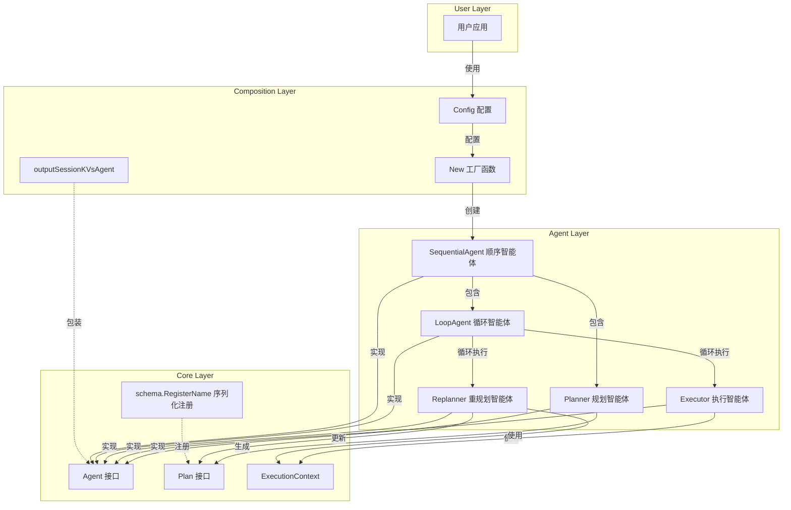

# Agent Composition 模块深度解析

## 1. 引言

`agent_composition` 模块（具体实现为 `planexecute` 包）是 Eino 框架中用于构建复杂多智能体系统的核心组件。它提供了一套强大的工具和模式，让开发者能够像搭积木一样组合不同的智能体组件，构建出具有规划、执行和反思能力的复杂系统。

这个模块解决了一个关键问题：如何将单个智能体的能力有机地组织起来，形成一个能够处理复杂任务的系统。通过提供预定义的智能体组合模式（如计划-执行-重规划），它让开发者能够专注于业务逻辑，而不必重新发明智能体协作的轮子。

在代码实现上，这个模块主要通过 `adk/prebuilt/planexecute/` 包提供功能，核心是 `Config` 结构体和 `New` 函数，以及配套的 `Planner`、`Executor` 和 `Replanner` 组件。

## 2. 问题空间与设计理念

### 2.1 问题背景

在构建 AI 应用时，我们经常会遇到这样的场景：单个智能体无法完成复杂任务，需要多个智能体协作。例如：
- 一个需要先理解任务、制定计划、然后执行计划、最后评估结果的系统
- 一个需要多个专业智能体（如代码专家、文档专家、测试专家）协作完成的软件开发任务
- 一个需要在执行过程中不断根据反馈调整策略的系统

传统的方法是手动编写这些协作逻辑，但这会导致代码耦合度高、难以维护和扩展。`agent_composition` 模块正是为了解决这个问题而设计的。

### 2.2 设计理念

这个模块的核心设计理念可以概括为：
1. **组合优于继承**：通过组合而非继承的方式构建复杂系统
2. **关注点分离**：将规划、执行、反思等不同职责分配给不同的智能体
3. **可配置性**：提供灵活的配置选项，让开发者能够定制智能体的行为
4. **可扩展性**：设计清晰的接口，让开发者能够轻松添加新的智能体类型

## 3. 核心抽象与架构

### 3.1 核心抽象

理解 `agent_composition` 模块的关键在于掌握以下几个核心抽象：

1. **Agent（智能体）**：系统的基本构建块，具有独立的能力和职责
2. **Plan（计划）**：结构化的任务分解，包含一系列可执行的步骤
3. **ExecutionContext（执行上下文）**：包含任务执行过程中的所有状态信息
4. **Workflow（工作流）**：定义智能体之间的协作模式和执行顺序

### 3.2 架构概述

下面是 `agent_composition` 模块的核心架构图：



### 3.3 序列化注册

模块在初始化时会注册一些类型用于序列化：

```go
func init() {
    schema.RegisterName[*defaultPlan]("_eino_adk_plan_execute_default_plan")
    schema.RegisterName[ExecutedStep]("_eino_adk_plan_execute_executed_step")
    schema.RegisterName[[]ExecutedStep]("_eino_adk_plan_execute_executed_steps")
}
```

这确保了在需要持久化或传输状态时，这些类型能够被正确地序列化和反序列化。

## 4. 核心组件详解

### 4.1 Plan 接口和默认实现

`Plan` 接口是整个模块的基础，它定义了计划的结构和行为：

```go
type Plan interface {
    FirstStep() string
    json.Marshaler
    json.Unmarshaler
}
```

**设计意图**：
- `FirstStep()` 方法提供了获取计划第一步的统一方式，这是执行器需要知道的关键信息
- 实现 `json.Marshaler` 和 `json.Unmarshaler` 接口让计划可以方便地在提示词模板和模型输出中使用
- 这种设计允许开发者自定义计划的结构，只要满足这个接口即可

**默认实现**：
模块提供了 `defaultPlan` 作为 `Plan` 接口的默认实现，它包含一个简单的步骤列表：

```go
type defaultPlan struct {
    Steps []string `json:"steps"`
}
```

### 4.2 预定义工具信息

模块提供了两个预定义的工具信息，用于与模型交互：

1. **PlanToolInfo**：用于让模型生成计划
```go
PlanToolInfo = schema.ToolInfo{
    Name: "plan",
    Desc: "Plan with a list of steps to execute in order...",
    ParamsOneOf: schema.NewParamsOneOfByParams(
        map[string]*schema.ParameterInfo{
            "steps": {
                Type:     schema.Array,
                ElemInfo: &schema.ParameterInfo{Type: schema.String},
                Desc:     "different steps to follow, should be in sorted order",
                Required: true,
            },
        },
    ),
}
```

2. **RespondToolInfo**：用于让模型生成最终响应
```go
RespondToolInfo = schema.ToolInfo{
    Name: "respond",
    Desc: "Generate a direct response to the user...",
    ParamsOneOf: schema.NewParamsOneOfByParams(
        map[string]*schema.ParameterInfo{
            "response": {
                Type:     schema.String,
                Desc:     "The complete response to provide to the user",
                Required: true,
            },
        },
    ),
}
```

### 4.3 ExecutedStep 结构

`ExecutedStep` 用于记录已执行步骤的信息：

```go
type ExecutedStep struct {
    Step   string
    Result string
}
```

这些步骤被收集在 `ExecutionContext` 中，用于在重规划时提供上下文信息。

### 4.4 预定义提示词模板

模块提供了三个预定义的提示词模板，用于指导模型完成不同的任务：

1. **PlannerPrompt**：指导规划器生成计划
```go
PlannerPrompt = prompt.FromMessages(schema.FString,
    schema.SystemMessage(`You are an expert planning agent...`),
    schema.MessagesPlaceholder("input", false),
)
```

2. **ExecutorPrompt**：指导执行器执行单个步骤
```go
ExecutorPrompt = prompt.FromMessages(schema.FString,
    schema.SystemMessage(`You are a diligent and meticulous executor agent...`),
    schema.UserMessage(`## OBJECTIVE
{input}
## Given the following plan:
{plan}
## COMPLETED STEPS & RESULTS
{executed_steps}
## Your task is to execute the first step, which is: 
{step}`))
```

3. **ReplannerPrompt**：指导重规划器评估进度并做出决策
```go
ReplannerPrompt = prompt.FromMessages(schema.FString,
    schema.SystemMessage(
        `You are going to review the progress toward an objective...`),
    schema.UserMessage(`## OBJECTIVE
{input}

## ORIGINAL PLAN
{plan}

## COMPLETED STEPS & RESULTS
{executed_steps}`),
)
```

这些提示词模板包含了详细的指令，指导模型如何完成各自的任务。

### 4.5 Planner（规划智能体）

规划智能体负责将用户的输入转化为一个结构化的计划。

**核心职责**：
1. 接收用户输入
2. 使用大语言模型生成结构化计划
3. 将计划存储在会话中供后续使用

**工作流程**：
```
用户输入 → 格式化提示词 → 调用模型 → 解析输出 → 生成Plan → 存储会话
```

**配置选项**：
- `ChatModelWithFormattedOutput`：预配置为输出计划格式的模型
- `ToolCallingChatModel` + `ToolInfo`：使用工具调用生成计划结构的模型
- `GenInputFn`：自定义生成规划器输入消息的函数
- `NewPlan`：自定义创建计划实例的函数

**设计亮点**：
规划智能体的设计非常灵活，支持两种不同的模型使用方式：
1. 直接使用结构化输出模型
2. 使用工具调用模型

这种灵活性让开发者可以根据自己的模型能力选择最合适的方式。

### 4.5 Executor（执行智能体）

执行智能体负责执行计划中的第一步。

**核心职责**：
1. 从会话中获取当前计划和已执行步骤
2. 格式化提示词，包含当前上下文
3. 使用大语言模型和工具执行第一步
4. 存储执行结果

**工作流程**：
```
获取上下文 → 格式化提示词 → 调用模型+工具 → 执行步骤 → 存储结果
```

**配置选项**：
- `Model`：执行器使用的聊天模型
- `ToolsConfig`：执行器可用的工具配置
- `MaxIterations`：最大迭代次数
- `GenInputFn`：自定义生成执行器输入消息的函数

**设计亮点**：
执行智能体巧妙地复用了 `adk.ChatModelAgent`，这是一个通用的聊天模型智能体。通过自定义 `GenModelInput` 函数，执行器能够将复杂的执行上下文转化为模型可以理解的提示词。

### 4.6 Replanner（重规划智能体）

重规划智能体负责评估执行结果，决定是完成任务还是调整计划继续执行。

**核心职责**：
1. 从会话中获取执行结果和当前状态
2. 评估进度，决定下一步行动
3. 要么生成最终响应，要么生成新的计划

**工作流程**：
```
获取执行结果 → 评估进度 → 决定：完成/继续 → 生成响应/新计划
```

**设计亮点**：
重规划智能体使用了两个工具来做决策：
1. `plan` 工具：用于生成新的计划
2. `respond` 工具：用于生成最终响应

这种工具调用的方式让决策过程变得透明和可控，模型必须明确选择其中一个工具，而不是自由生成文本。

### 4.7 Config 和 New 函数

`Config` 结构体和 `New` 函数是整个模块的入口点，它们将所有组件组合在一起。

```go
type Config struct {
    Planner     adk.Agent
    Executor    adk.Agent
    Replanner   adk.Agent
    MaxIterations int
}

func New(ctx context.Context, cfg *Config) (adk.ResumableAgent, error)
```

**工作流程**：
`New` 函数创建了一个两层的智能体结构：
1. 外层：顺序智能体，先执行规划器，再执行循环
2. 内层：循环智能体，循环执行执行器和重规划器

代码实现非常简洁：
```go
func New(ctx context.Context, cfg *Config) (adk.ResumableAgent, error) {
    maxIterations := cfg.MaxIterations
    if maxIterations <= 0 {
        maxIterations = 10
    }
    loop, err := adk.NewLoopAgent(ctx, &adk.LoopAgentConfig{
        Name:          "execute_replan",
        SubAgents:     []adk.Agent{cfg.Executor, cfg.Replanner},
        MaxIterations: maxIterations,
    })
    if err != nil {
        return nil, err
    }

    return adk.NewSequentialAgent(ctx, &adk.SequentialAgentConfig{
        Name:      "plan_execute_replan",
        SubAgents: []adk.Agent{cfg.Planner, loop},
    })
}
```

这种设计非常优雅，它利用了已有的智能体组合原语（顺序智能体和循环智能体）来构建复杂的行为，而不是从头开始编写协作逻辑。

### 4.8 outputSessionKVsAgent 工具

模块还提供了一个有用的工具 `outputSessionKVsAgent`，它是一个包装器，可以在原始智能体执行完毕后，将会话中的所有键值对作为输出发送出去：

```go
type outputSessionKVsAgent struct {
    adk.Agent
}

func (o *outputSessionKVsAgent) Run(ctx context.Context, input *adk.AgentInput,
    options ...adk.AgentRunOption) *adk.AsyncIterator[*adk.AgentEvent] {
    
    // ... 实现细节 ...
    
    // 在原始智能体执行完毕后，发送会话中的所有键值对
    kvs := adk.GetSessionValues(ctx)
    event := &adk.AgentEvent{
        Output: &adk.AgentOutput{CustomizedOutput: kvs},
    }
    generator.Send(event)
    
    // ...
}
```

虽然这个工具在 `New` 函数中没有直接使用，但它提供了一种方便的方式来获取整个执行过程中的所有状态信息。

## 5. 数据流分析

让我们通过一个具体的例子来追踪数据在整个系统中的流动：

1. **初始化阶段**：
   - 用户创建 `Config`，配置好规划器、执行器和重规划器
   - 调用 `New` 函数，创建组合智能体

2. **规划阶段**：
   - 用户输入传递给规划器
   - 规划器格式化提示词，调用模型
   - 模型生成计划，解析为 `Plan` 对象
   - 计划存储在会话的 `PlanSessionKey` 下

3. **执行阶段**：
   - 执行器从会话获取计划和已执行步骤
   - 执行器格式化提示词，包含当前上下文
   - 执行器调用模型和工具，执行计划的第一步
   - 执行结果存储在会话的 `ExecutedStepSessionKey` 下

4. **重规划阶段**：
   - 重规划器获取执行结果和当前状态
   - 重规划器更新已执行步骤列表
   - 重规划器调用模型，选择是继续还是完成
   - 如果完成，生成最终响应；如果继续，生成新计划

5. **循环**：
   - 如果重规划器生成了新计划，循环继续，回到执行阶段
   - 如果重规划器生成了最终响应，循环结束

## 6. 设计决策与权衡

### 6.1 接口设计 vs 具体实现

**决策**：模块定义了清晰的接口（如 `Plan`），同时提供了默认实现。

**权衡**：
- ✅ 优点：灵活性高，开发者可以自定义实现
- ✅ 优点：默认实现降低了使用门槛
- ⚠️ 缺点：增加了一定的抽象复杂性

**为什么这样设计**：
这种设计遵循了"开闭原则"——对扩展开放，对修改关闭。开发者可以在不修改模块核心代码的情况下，通过实现接口来扩展功能。

### 6.2 会话状态管理

**决策**：使用会话存储来在智能体之间传递状态。

**权衡**：
- ✅ 优点：解耦了智能体，它们不需要直接相互引用
- ✅ 优点：状态管理集中，易于理解和调试
- ⚠️ 缺点：依赖于全局的会话机制，增加了隐式依赖

**为什么这样设计**：
在智能体协作场景中，状态共享是不可避免的。使用会话存储是一种相对优雅的方式，它避免了智能体之间的直接耦合，同时提供了清晰的状态传递机制。

### 6.3 工具调用 vs 结构化输出

**决策**：同时支持工具调用和结构化输出两种方式来获取模型的结构化响应。

**权衡**：
- ✅ 优点：适应不同模型的能力
- ✅ 优点：给开发者更多选择
- ⚠️ 缺点：增加了代码复杂度

**为什么这样设计**：
不同的模型提供商支持不同的结构化输出方式。有些支持工具调用，有些支持直接的结构化输出。通过同时支持这两种方式，模块可以适应更广泛的模型生态系统。

## 7. 使用指南与最佳实践

### 7.1 基本使用流程

1. 创建规划器：
```go
planner, err := planexecute.NewPlanner(ctx, &planexecute.PlannerConfig{
    ToolCallingChatModel: myToolCallingModel,
})
```

2. 创建执行器：
```go
executor, err := planexecute.NewExecutor(ctx, &planexecute.ExecutorConfig{
    Model:       myToolCallingModel,
    ToolsConfig: myToolsConfig,
})
```

3. 创建重规划器：
```go
replanner, err := planexecute.NewReplanner(ctx, &planexecute.ReplannerConfig{
    ChatModel: myToolCallingModel,
})
```

4. 组合所有组件：
```go
agent, err := planexecute.New(ctx, &planexecute.Config{
    Planner:     planner,
    Executor:    executor,
    Replanner:   replanner,
    MaxIterations: 10,
})
```

### 7.2 自定义计划结构

如果默认的计划结构不满足需求，可以自定义 `Plan` 接口的实现：

```go
type MyDetailedPlan struct {
    Steps []struct {
        Name        string `json:"name"`
        Description string `json:"description"`
        Tools       []string `json:"tools"`
    } `json:"steps"`
}

func (p *MyDetailedPlan) FirstStep() string {
    if len(p.Steps) == 0 {
        return ""
    }
    // 将第一步序列化为字符串，供执行器使用
    stepJSON, _ := json.Marshal(p.Steps[0])
    return string(stepJSON)
}

// 实现 MarshalJSON 和 UnmarshalJSON...
```

然后在创建规划器和重规划器时使用它：

```go
planner, err := planexecute.NewPlanner(ctx, &planexecute.PlannerConfig{
    ToolCallingChatModel: myModel,
    NewPlan: func(ctx context.Context) planexecute.Plan {
        return &MyDetailedPlan{}
    },
})
```

### 7.3 自定义提示词

模块提供了默认的提示词，但你可以自定义它们：

```go
// 自定义规划器提示词
myPlannerPrompt := prompt.FromMessages(schema.FString,
    schema.SystemMessage(`你是一个专业的任务规划师...`),
    schema.MessagesPlaceholder("input", false),
)

// 自定义输入生成函数
customGenPlannerInput := func(ctx context.Context, userInput []adk.Message) ([]adk.Message, error) {
    msgs, err := myPlannerPrompt.Format(ctx, map[string]any{
        "input": userInput,
        "additional_context": getAdditionalContext(ctx),
    })
    return msgs, err
}

// 使用自定义函数
planner, err := planexecute.NewPlanner(ctx, &planexecute.PlannerConfig{
    ToolCallingChatModel: myModel,
    GenInputFn: customGenPlannerInput,
})
```

## 8. 边缘情况与注意事项

### 8.1 会话键冲突

模块使用预定义的会话键来存储状态，这些键在代码中定义为常量：

```go
const (
    UserInputSessionKey     = "UserInput"
    PlanSessionKey          = "Plan"
    ExecutedStepSessionKey  = "ExecutedStep"
    ExecutedStepsSessionKey = "ExecutedSteps"
)
```

**注意事项**：避免在自己的代码中使用这些键，否则可能会导致状态混乱。

同时，模块通过 `ExecutionContext` 结构体在各组件间传递上下文信息：

```go
type ExecutionContext struct {
    UserInput     []adk.Message
    Plan          Plan
    ExecutedSteps []ExecutedStep
}
```

这个结构体被用于生成提示词时提供必要的上下文信息。

### 8.2 模型输出格式错误

当模型输出的格式不符合预期时，系统会报错。

**缓解措施**：
- 在提示词中提供清晰的格式说明
- 考虑使用更强大的模型
- 实现重试逻辑，在格式错误时让模型重新生成

### 8.3 循环终止条件

循环智能体的终止条件很重要，否则可能会导致无限循环。

**注意事项**：
- 始终设置合理的 `MaxIterations`
- 确保重规划器的提示词清晰地说明何时应该完成任务
- 监控执行过程，及时发现异常循环

### 8.4 状态一致性

在多个智能体之间共享状态时，要注意状态的一致性。

**注意事项**：
- 避免在一个智能体中修改另一个智能体依赖的状态
- 尽可能让状态修改是原子的
- 在调试时，打印完整的会话状态，了解状态变化

## 9. 总结

`agent_composition` 模块通过提供计划-执行-重规划模式，为构建复杂的多智能体系统提供了一个强大而灵活的框架。它的设计体现了以下几个关键原则：

1. **组合性**：通过组合简单的组件构建复杂的系统
2. **灵活性**：提供多种配置选项和扩展点
3. **关注点分离**：将规划、执行、反思等职责分配给不同的组件
4. **可复用性**：组件设计为可在不同场景中复用

通过使用这个模块，开发者可以专注于业务逻辑和智能体的具体能力，而不必担心智能体协作的底层细节。同时，模块的灵活性也让它能够适应各种不同的应用场景。

## 10. 相关模块

- [ADK Agent Interface](adk_agent_interface.md)：智能体接口定义
- [Compose Graph Engine](compose_graph_engine.md)：底层图执行引擎
- [ADK ChatModel Agent](adk_chatmodel_agent.md)：聊天模型智能体
- [Compose Workflow](compose_workflow.md)：工作流组合原语
