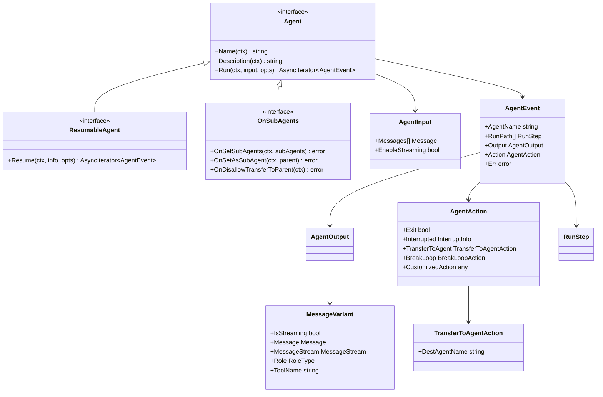

# Agent Contracts and Handoff 模块深度解析

## 模块概述

想象一个多智能体协作系统，就像一个组织严密的团队：有些成员是领导者，负责统筹全局；有些是专家，专注于特定领域；有些是助手，支持其他成员完成任务。`agent_contracts_and_handoff` 模块定义了这个"团队协作语言"的语法规则——它规定了智能体之间如何通信、如何传递控制权、如何被嵌套和编排，以及如何从断点恢复。

这个模块是整个 ADK 运行时的**契约层**。就像 HTTP 协议定义了 Web 客户端和服务器之间的交互方式一样，这里定义的接口和数据结构是所有智能体实现必须遵守的"法律"。它不关心智能体内部如何思考，只关心它如何与外部世界交互：接收什么输入、产生什么输出、如何表达"我要退出"或"把控制权交给其他智能体"。

这种抽象的价值在于解耦：上层编排器（如 flow、workflow）不需要知道每个智能体的具体实现，只要它们都遵守这些契约，就可以统一管理、组合和监控。这让整个系统具备了类似"乐高积木"的可组合性——任何符合 `Agent` 接口的智能体都可以被自由地嵌套、传递控制权、或者参与到复杂的工作流中。

## 架构设计

### 核心组件关系图



### 数据流与交互模式

智能体系统的核心数据流是**事件流**：当编排器调用 `Agent.Run()` 时，智能体不会一次性返回所有结果，而是产生一个 `AsyncIterator[*AgentEvent]`——这是一个异步事件流，就像一条传送带，源源不断地运送着智能体的输出和控制信号。

**典型的执行流程如下：**

1. **初始化阶段**：编排器（如 `flowAgent` 或 `workflowAgent`）创建 `AgentInput`，包含历史消息和流式开关，然后调用 `Agent.Run()`

2. **事件产生阶段**：智能体内部运行，通过 `AsyncIterator` 不断发送 `AgentEvent`：
   - **输出事件**：智能体产生了消息（思考结果、工具调用等），封装在 `AgentOutput` 中
   - **动作事件**：智能体表达了控制意图（退出、转移控制、中断等），封装在 `AgentAction` 中
   - **错误事件**：智能体遇到了错误，封装在 `AgentEvent.Err` 中

3. **事件路由阶段**：
   - 如果 `AgentEvent` 包含 `TransferToAgentAction`，编排器会将控制权转移到目标智能体
   - 如果包含 `Exit`，当前智能体执行结束
   - 如果包含 `Interrupted`，系统触发中断并保存状态以便恢复

4. **嵌套代理场景**：当一个智能体作为另一个智能体的子智能体运行时（通过 `agentTool` 包装），子智能体的事件会通过 `RunPath` 追踪传递——这就像给每个事件贴上了一个"地址标签"，标明它来自哪个分支的哪个节点

**RunPath 的作用机制**：`RunPath` 是一个不可变的执行路径记录，从根智能体到当前事件源。关键规则是：
- `flowAgent` 在第一次看到事件（`len(RunPath) == 0`）时设置 `RunPath`
- `agentTool` 在转发子智能体的事件时，会**追加**父级路径到事件前端

这种设计确保了事件的"溯源能力"——无论嵌套层级多深，每个事件都能准确报告它的来源路径。

## 组件深度解析

### Agent：智能体契约

`Agent` 是所有智能体必须实现的根接口。它定义了智能体的**身份**和**执行方式**。

```go
type Agent interface {
    Name(ctx context.Context) string
    Description(ctx context.Context) string
    Run(ctx context.Context, input *AgentInput, options ...AgentRunOption) *AsyncIterator[*AgentEvent]
}
```

**设计意图**：

`Name()` 和 `Description()` 看起来很简单，但它们是**智能体发现和编排**的基础。在多智能体系统中，编排器需要知道有哪些智能体可用、它们各自擅长什么。例如，`flowAgent` 在接收 `TransferToAgentAction` 时，会通过 `Name()` 来查找目标智能体。

`Run()` 方法的异步流式设计是整个架构的核心：

- **为什么返回 `AsyncIterator` 而不是直接返回事件？** 异步流式设计允许智能体**边执行边输出**，而不是等待全部完成再返回。这对于需要长时间运行的智能体（如需要多轮对话、工具调用的复杂推理）至关重要。同时，`AsyncIterator` 提供了比 channel 更强的组合能力（如过滤、映射、合并）。

- **为什么 `AgentEvent` 必须可修改？** 框架会在转发事件时修改 `RunPath` 字段，这要求智能体返回的事件对象必须允许被安全修改。

- **MessageStream 的所有权约定**：如果 `AgentEvent` 包含 `MessageStream`，该流必须是**独占且安全**的——这意味着流不能被其他接收者同时消费，且框架可以直接调用 `Recv()` 而无需额外的同步保护。

**关键约束**：
- 推荐使用 `SetAutomaticClose()` 设置流的自动关闭，这样即使事件未被消费，底层资源也能被释放
- `AgentRunOption` 是一种可扩展的选项机制，通过 `agentNames` 字段可以控制哪些智能体能看到该选项

### AgentEvent：事件载体

`AgentEvent` 是智能体系统中流动的"货币"。它封装了智能体的所有输出：消息、动作、错误，以及元数据（名称、路径）。

```go
type AgentEvent struct {
    AgentName string           // 事件源智能体名称
    RunPath   []RunStep        // 执行路径（框架管理，用户不可设置）
    Output    *AgentOutput     // 智能体输出
    Action    *AgentAction     // 控制动作
    Err       error            // 错误信息
}
```

**设计权衡**：

**为什么 `RunPath` 是框架独占管理的？** 如果允许用户设置 `RunPath`，可能导致路径不一致（例如用户忘记设置、设置了错误的路径）。通过将 `RunStep.agentName` 设为未导出字段，框架可以确保：
- `RunPath` 只在两个关键点被设置：`flowAgent` 初始化时、`agentTool` 转发时
- 任何用户尝试设置都会被编译器拒绝

这种"防御性编程"确保了调试时的可追溯性——每个事件的路径都是可信的。

**事件的多重语义**：一个 `AgentEvent` 可能同时包含 `Output`、`Action` 和 `Err`。虽然这增加了复杂性，但提供了灵活性：
- 智能体可以在产生输出的同时发出控制信号（例如：产生了一条消息，然后要求转移控制权）
- 错误可以与上下文输出一起返回，便于诊断

### AgentAction：控制信号

`AgentAction` 是智能体表达"意图"的语法。它不是输出数据，而是告诉编排器"我接下来想做什么"。

```go
type AgentAction struct {
    Exit            bool
    Interrupted     *InterruptInfo
    TransferToAgent *TransferToAgentAction
    BreakLoop       *BreakLoopAction
    CustomizedAction any
}
```

**动作的作用域**（关键概念）：

文档中明确指出，当智能体被包装为智能体工具（`agentTool`）时，内部智能体发出的动作**有作用域限制**：
- `Interrupted`：会被传播，因为中断需要跨边界处理
- `Exit`、`TransferToAgent`、`BreakLoop`：**会被忽略**，只影响内部智能体，不会传播到父智能体

这种设计避免了"失控"场景：如果子智能体突然发出 `Exit`，不应该意外终止整个父智能体的执行。就像员工辞职不应该导致整个公司解散。

**为什么需要这种作用域？** 在多智能体协作中，子智能体通常是一个"任务执行单元"，它的退出只是"任务完成"，而不是整个流程的结束。父智能体需要根据子智能体的输出决定下一步做什么，而不是被子智能体控制。

### TransferToAgentAction：控制权转移

```go
type TransferToAgentAction struct {
    DestAgentName string
}
```

这是实现**智能体握手（handoff）**的关键。当一个智能体发现任务超出了自己的能力范围时，可以发起转移：

```go
return &AgentAction{TransferToAgent: &TransferToAgentAction{DestAgentName: "expert_agent"}}
```

编排器收到这个动作后，会：
1. 查找名为 `"expert_agent"` 的子智能体
2. 将当前的执行上下文（消息历史）传递给目标智能体
3. 启动目标智能体的执行

这就像医院的分诊系统：普通医生发现病人需要专科治疗时，会将病人转交给专科医生，而不是自己硬着头皮治疗。

### MessageVariant：统一的输出抽象

```go
type MessageVariant struct {
    IsStreaming   bool
    Message       Message
    MessageStream MessageStream
    Role          schema.RoleType
    ToolName      string
}
```

**为什么要用变体而不是两个分开的类型？** 统一接口简化了下游处理。无论智能体输出是流式还是非流式，消费者都用同样的 `GetMessage()` 方法获取结果——内部会根据 `IsStreaming` 自动处理差异。

**序列化挑战**：`MessageStream` 无法直接序列化（流是运行时对象）。`GobEncode` 的解决方案是：
1. 接收整个流的所有消息帧
2. 使用 `schema.ConcatMessages` 合并为单个消息
3. 将合并后的消息序列化

这确保了序列化的语义是"流的最终状态"，而不是"流本身"。

### OnSubAgents：组合能力接口

```go
type OnSubAgents interface {
    OnSetSubAgents(ctx context.Context, subAgents []Agent) error
    OnSetAsSubAgent(ctx context.Context, parent Agent) error
    OnDisallowTransferToParent(ctx context.Context) error
}
```

这个接口定义了智能体的**组合意识**——一个智能体需要知道自己是处于独立状态还是被嵌套在其他智能体中。

**OnSetSubAgents**：父智能体调用，通知子智能体"这些是你可以转移控制权的兄弟智能体"。例如，`ChatModelAgent` 保存 `subAgents` 列表，当 LLM 产生转移请求时，从这里查找目标。

**OnSetAsSubAgent**：通知子智能体"你的父智能体是谁"。子智能体可能需要知道父智能体的信息（例如用于上下文传递）。

**OnDisallowTransferToParent**：这是一个"安全阀"。默认情况下，子智能体可以转移控制权给父智能体。但调用这个方法后，子智能体会被禁止这样做。这避免了循环转移：
```
Agent A -> 转移到 -> Agent B -> 转移到 -> Agent A (循环!)
```

### ResumableAgent：可恢复智能体

```go
type ResumableAgent interface {
    Agent
    Resume(ctx context.Context, info *ResumeInfo, opts ...AgentRunOption) *AsyncIterator[*AgentEvent]
}
```

这是实现**检查点-恢复（checkpoint-resume）**能力的基础。当系统被中断（例如手动暂停、错误发生、资源限制）时，`ResumableAgent` 可以保存当前状态，之后从断点恢复。

**恢复的语义**：
- `info.WasInterrupted`：指示上次执行是否因为中断而停止
- `info.InterruptState`：保存的中断状态（智能体内部状态）
- `info.ResumeData`：额外的恢复数据（由保存时的智能体提供）
- `info.EnableStreaming`：恢复时是否保持流式模式

这就像游戏的存档功能：玩家可以在任意时刻暂停，保存进度，之后从存档继续游戏。

### AgentInput 和 AgentOutput

```go
type AgentInput struct {
    Messages        []Message
    EnableStreaming bool
}

type AgentOutput struct {
    MessageOutput   *MessageVariant
    CustomizedOutput any
}
```

这两个结构体极其简单，但体现了设计哲学：

**AgentInput**：
- `Messages` 是对话历史，包含了所有上下文
- `EnableStreaming` 控制智能体是否应该产生流式输出

**AgentOutput**：
- `MessageOutput` 是标准化的消息输出
- `CustomizedOutput` 允许智能体返回任意自定义数据，提供了扩展性

`CustomizedOutput` 的存在意味着框架不限制智能体的输出形式——智能体可以返回结构化的 JSON、图像数据、或其他任何类型，只要消费者知道如何处理。

## 依赖分析

### 调用此模块的组件

**编排层**：
- `flowAgent`：作为智能体树的根节点，管理子智能体的生命周期和事件流。它依赖 `Agent.Run()` 来启动子智能体，监听 `AgentEvent` 中的 `TransferToAgentAction` 来实现转移逻辑
- `workflowAgent`（包括 `sequentialWorkflowAgent`、`parallelWorkflowAgent`、`loopWorkflowAgent`）：使用 `Agent` 接口将智能体组合成复杂的工作流。它们监听 `AgentAction` 的 `BreakLoop` 来控制循环终止

**适配层**：
- `agentTool`：将 `Agent` 适配为 `Tool`，使得智能体可以被其他智能体调用。这是实现智能体组合的关键——它监听子智能体的事件，进行作用域限制，然后包装成工具结果返回

**运行时**：
- `Runner`：负责智能体的执行和恢复。对于 `ResumableAgent`，它调用 `Resume()` 方法从中断点恢复

### 此模块调用的依赖

**消息和流基础设施**：
- `schema.Message`：对话消息的数据结构
- `schema.StreamReader`：流式输出的基础设施
- `schema.ConcatMessages`、`schema.ConcatMessageStream`：消息合并工具

**中断和恢复**：
- `InterruptInfo`：中断上下文信息
- `ResumeInfo`：恢复信息
- `core.InterruptSignal`：内部中断信号

**配置选项**：
- `AgentRunOption`：智能体运行选项，支持特定智能体的定制化配置

### 数据契约

**输入契约**（从编排器到智能体）：
- `AgentInput.Messages` 必须按时间顺序排列，最早的消息在前
- `AgentInput.EnableStreaming` 是提示而非强制——智能体可以选择忽略，但通常应该遵守

**输出契约**（从智能体到编排器）：
- `AsyncIterator[*AgentEvent]` 必须发送所有事件后关闭
- `AgentEvent.AgentName` 必须与 `Agent.Name()` 返回值一致
- `AgentEvent.RunPath` 由框架管理，智能体不应该修改
- `MessageStream` 必须在最后一个事件发送后关闭

**控制流契约**：
- `Exit` 动作表示智能体主动结束执行，不会产生更多事件
- `TransferToAgentAction` 中的 `DestAgentName` 必须在父智能体的子智能体列表中存在
- `Interrupted` 动作会中断执行，期望后续有恢复操作

## 设计决策与权衡

### 1. 异步流式 vs 批量返回

**选择**：返回 `AsyncIterator[*AgentEvent]` 而不是 `[]AgentEvent`

**理由**：
- **延迟优化**：允许智能体在产生第一个结果时就发送，而不是等待全部完成
- **资源效率**：对于长时间运行的智能体，不需要在内存中保存所有事件
- **可组合性**：`AsyncIterator` 可以轻松地进行过滤、映射、合并等操作

**代价**：
- 增加了错误处理的复杂性（流式处理中的错误需要在迭代器中传播）
- 需要管理流的关闭和资源释放（这就是为什么推荐 `SetAutomaticClose()`）

### 2. 单一事件类型 vs 分离类型

**选择**：用 `AgentEvent` 同时承载输出、动作和错误

**理由**：
- **灵活性**：智能体可以在一次事件中同时产生输出和动作（例如：输出消息并要求转移）
- **一致性**：消费者只需要处理一种类型的事件，不需要区分不同的事件流

**代价**：
- 事件的语义变得复杂——一个事件可能同时包含多种信息
- 消费者需要检查多个字段才能完全理解事件含义

### 3. 动作作用域限制 vs 完全传播

**选择**：在 `agentTool` 中限制子智能体的某些动作不传播到父智能体

**理由**：
- **安全性**：防止子智能体意外终止或转移父智能体的控制流
- **语义清晰**：子智能体的退出应该被解释为"任务完成"，而不是"流程终止"

**代价**：
- 如果子智能体真的想要影响父智能体，无法直接表达
- 增加了理解的复杂性——开发者需要知道哪些动作会被过滤

### 4. RunPath 框架独占 vs 用户可配置

**选择**：`RunPath` 完全由框架管理，`RunStep` 的字段未导出

**理由**：
- **可追溯性保证**：确保每个事件的路径都是准确和一致的
- **防止错误**：避免用户忘记设置或设置错误的路径

**代价**：
- 无法自定义路径生成逻辑
- 测试时需要使用框架的机制（如通过 `agentTool` 生成路径）

### 5. MessageVariant 统一类型 vs 分离类型

**选择**：用一个类型同时支持流式和非流式消息

**理由**：
- **API 简化**：消费者不需要处理两种不同的类型
- **透明性**：智能体可以自由选择流式或非流式，消费者无感知

**代价**：
- 每次使用消息都需要检查 `IsStreaming` 字段
- 序列化时需要特殊处理流的情况

## 使用指南与示例

### 基本智能体实现

```go
type SimpleAgent struct {
    name string
}

func (a *SimpleAgent) Name(ctx context.Context) string {
    return a.name
}

func (a *SimpleAgent) Description(ctx context.Context) string {
    return "一个简单的示例智能体"
}

func (a *SimpleAgent) Run(ctx context.Context, input *adk.AgentInput, opts ...adk.AgentRunOption) *adk.AsyncIterator[*adk.AgentEvent] {
    iter := adk.NewAsyncIterator[*adk.AgentEvent]()
    
    go func() {
        defer iter.Close()
        
        // 产生输出消息
        msg := &schema.Message{Role: schema.Assistant, Content: "你好！"}
        output := &adk.AgentOutput{
            MessageOutput: &adk.MessageVariant{
                IsStreaming: false,
                Message:     msg,
                Role:        schema.Assistant,
            },
        }
        
        event := &adk.AgentEvent{
            AgentName: a.name,
            Output:    output,
        }
        
        iter.Send(event)
    }()
    
    return iter
}
```

### 实现控制权转移

```go
type RouterAgent struct {
    name      string
    subAgents []adk.Agent
}

func (r *RouterAgent) Run(ctx context.Context, input *adk.AgentInput, opts ...adk.AgentRunOption) *adk.AsyncIterator[*adk.AgentEvent] {
    iter := adk.NewAsyncIterator[*adk.AgentEvent]()
    
    go func() {
        defer iter.Close()
        
        // 根据输入决定转移到哪个智能体
        destAgentName := r.route(input.Messages[len(input.Messages)-1].Content)
        
        // 发送转移动作
        event := &adk.AgentEvent{
            AgentName: r.name,
            Action: &adk.AgentAction{
                TransferToAgent: &adk.TransferToAgentAction{
                    DestAgentName: destAgentName,
                },
            },
        }
        
        iter.Send(event)
    }()
    
    return iter
}

func (r *RouterAgent) route(lastUserMessage string) string {
    // 路由逻辑
    return "expert_agent"
}
```

### 实现可恢复智能体

```go
type StatefulAgent struct {
    name string
}

func (a *StatefulAgent) Resume(ctx context.Context, info *adk.ResumeInfo, opts ...adk.AgentRunOption) *adk.AsyncIterator[*adk.AgentEvent] {
    iter := adk.NewAsyncIterator[*adk.AgentEvent]()
    
    go func() {
        defer iter.Close()
        
        if info.WasInterrupted {
            // 从中断状态恢复
            state := info.InterruptState.(*MyAgentState)
            // 继续处理...
        } else {
            // 正常执行
            // ...
        }
    }()
    
    return iter
}
```

### 实现子智能体感知的智能体

```go
type ParentAgent struct {
    name      string
    subAgents []adk.Agent
}

func (p *ParentAgent) OnSetSubAgents(ctx context.Context, subAgents []adk.Agent) error {
    p.subAgents = subAgents
    return nil
}

func (p *ParentAgent) OnSetAsSubAgent(ctx context.Context, parent adk.Agent) error {
    // 可以记录父智能体信息，用于上下文传递
    return nil
}

func (p *ParentAgent) OnDisallowTransferToParent(ctx context.Context) error {
    // 设置标志，禁止转移到父智能体
    return nil
}
```

## 边缘情况与注意事项

### 1. 流式输出的资源泄漏

**问题**：如果智能体产生了 `MessageStream` 但未正确关闭，会导致底层资源泄漏。

**解决方案**：
- 始终使用 `SetAutomaticClose()` 设置流的自动关闭
- 确保 `AsyncIterator` 在所有路径上都会关闭（使用 `defer iter.Close()`）
- 在 `Run()` 返回之前，所有产生的流都应该启动并发读取或关闭

### 2. 嵌套智能体的事件循环

**问题**：如果不小心，可能导致子智能体产生的 `TransferToAgentAction` 指向父智能体，形成循环。

**解决方案**：
- 使用 `OnDisallowTransferToParent()` 禁止子智能体转移到父智能体
- 在路由逻辑中验证目标智能体不是自己或父智能体
- 使用 `deterministicTransfer` 包装器限制可转移的目标列表

### 3. RunPath 的一致性

**问题**：如果智能体手动设置 `RunPath`，可能导致路径不一致，影响调试和追踪。

**注意事项**：
- **不要**尝试设置或修改 `AgentEvent.RunPath`，这是框架管理的
- 如果在测试中需要设置路径，使用 `agentTool` 或 `flowAgent` 的自然机制
- `RunPath` 是不可变的，一旦设置就不能修改

### 4. 消息流的并发访问

**问题**：`MessageStream` 必须是独占的，如果多个消费者尝试同时访问会导致数据竞争。

**注意事项**：
- 确保每个 `MessageStream` 只有一个接收者
- 如果需要多次消费，先缓冲或复制流的所有消息
- 使用 `schema.StreamReaderFromArray` 可以安全地创建多个流

### 5. 自定义动作的处理

**问题**：`CustomizedAction` 是 `any` 类型，编排器无法知道如何处理。

**注意事项**：
- 只有特定的编排器才能识别和处理自定义动作
- 在通用场景中，避免依赖 `CustomizedAction`，使用标准动作
- 如果必须使用自定义动作，确保编排器有相应的处理逻辑

### 6. 序列化的限制

**问题**：`MessageStream` 无法直接序列化，只有合并后的消息会被保存。

**注意事项**：
- 检查点保存的是"最终状态"，不是"执行过程"
- 恢复时无法重现原始的流式行为
- 如果需要在恢复时保持流式语义，需要在 `Resume()` 中重建流

### 7. 选项的可见性

**问题**：`AgentRunOption` 的 `agentNames` 字段限制了选项的可见性，可能导致配置无法传递到目标智能体。

**注意事项**：
- 如果选项应该对所有智能体可见，设置 `agentNames = nil` 或空数组
- 如果选项只针对特定智能体，确保 `agentNames` 包含正确的智能体名称
- 智能体名称需要与 `Agent.Name()` 返回值完全匹配

### 8. 中断与恢复的一致性

**问题**：如果智能体在中断后修改了内部状态，恢复时可能出现不一致。

**注意事项**：
- `InterruptState` 应该保存足够的信息来重建智能体状态
- 避免在中断后修改全局或共享状态
- 确保 `Resume()` 能正确处理部分执行后的状态

## 参考资料

- [Agent Run Options](agent_contracts_and_context-agent_run_options.md)：智能体运行选项的详细说明
- [Agent Events and Steps](agent_contracts_and_context-agent_events_steps_and_message_variants.md)：事件和步骤的深入解析
- [Run Context and Session State](agent_contracts_and_context-run_context_and_session_state.md)：运行上下文和会话状态管理
- [Async Iteration Utilities](agent_contracts_and_context-async_iteration_utilities.md)：异步迭代器的实现细节
- [ChatModel Agent Runtime](adk_runtime-chatmodel_react_and_retry_runtime-chatmodel_agent_core_runtime.md)：聊天模型智能体的具体实现
- [Flow Agent Orchestration](adk_runtime-flow_runner_interrupt_and_transfer-flow_agent_orchestration.md)：流智能体的编排机制
