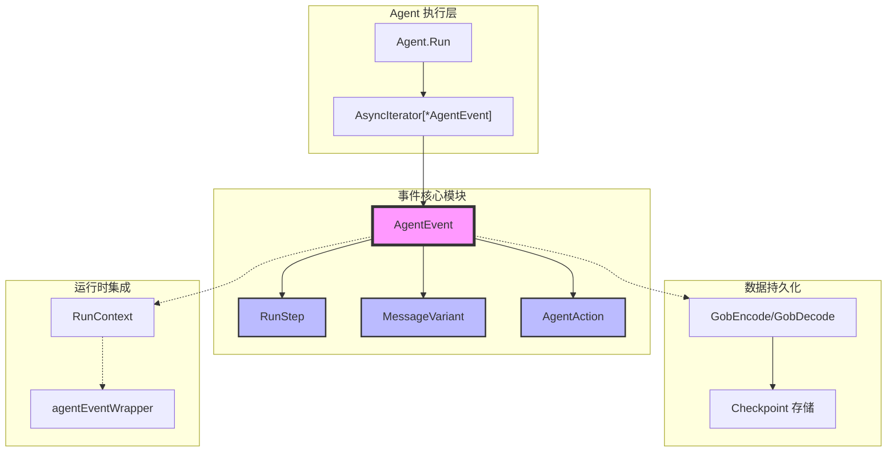

# Agent 事件、步骤与消息变体

想象你在调试一个多层次的 AI Agent 系统——一个 Agent 调用另一个 Agent，后者又调用工具，每个环节都可能产生流式响应或异常中断。当整个执行链路发生故障需要恢复时，你如何重建完整的执行上下文？当流式消息中途断开时，你如何确保消息的完整性？这就是 `agent_events_steps_and_message_variants` 模块要解决的核心问题。

这个模块定义了整个 ADK 框架中 Agent 执行的**事件载体**和**执行追踪机制**。它不仅仅是一组数据结构，更是一套精心设计的"执行黑匣子"——记录 Agent 运行过程中发生的每一个重要事件、每一条消息、每一个动作，并为这些信息提供持久化和恢复能力。当你需要调试 Agent 的行为、实现断点续传、或者构建复杂的 Agent 编排系统时，这个模块提供的抽象是你无法绕过的基石。

## 架构概览



这个模块处于整个 Agent 运行时的**信息交换中心**。当 Agent 执行时，它通过 `AsyncIterator[*AgentEvent]` 不断产出事件；这些事件被 `RunContext` 捕获并包装成 `agentEventWrapper`；当需要持久化时，事件中的核心组件（`RunStep`、`MessageVariant`）通过 `GobEncode/GobDecode` 进行序列化；恢复时则反向解码。整个数据流清晰而单向：Agent → AgentEvent → 序列化 → 持久化 → 反序列化 → 恢复执行。

## 核心组件深度解析

### MessageVariant：智能消息容器

`MessageVariant` 是对消息的统一抽象，它不关心消息是单条 `Message` 还是 `MessageStream`，也不关心消息来自 Assistant 还是 Tool——它只负责"安全地持有和传输消息"。

```go
type MessageVariant struct {
    IsStreaming bool          // 标识这是否是流式消息
    Message       Message      // 非流式消息
    MessageStream MessageStream // 流式消息
    Role          schema.RoleType // 消息角色：Assistant 或 Tool
    ToolName      string        // 仅当 Role 为 Tool 时使用
}
```

**设计洞察**：为什么需要 `MessageVariant` 而不是直接使用 `Message` 或 `MessageStream`？

在 Agent 执行过程中，消息的来源和形态是多样的：
- 一个普通的 ChatModel Agent 输出 Assistant 类型的消息
- 工具调用后返回 Tool 类型的消息
- 某些 Agent 可能输出流式消息（`MessageStream`），某些输出普通消息（`Message`）

如果你让 Agent 实现直接返回这两种类型，调用者必须处理类型分支，代码会变得冗长且容易出错。`MessageVariant` 通过 `IsStreaming` 标志统一了这两种形态，调用者可以通过 `GetMessage()` 方法获得统一的 `Message` 对象——无论原始数据是流式还是非流式。

**序列化的挑战**：流式消息的持久化比普通消息复杂得多。普通的 `Message` 可以直接序列化，但 `MessageStream` 是一个通道，你不能简单地将通道本身编码进文件。`MessageVariant.GobEncode()` 的解决方案是：

1. 检测到流式消息时，**消费整个流**（注意：这意味着序列化后流会被耗尽）
2. 将所有帧收集到切片中
3. 使用 `schema.ConcatMessages()` 将切片合并为单条 `Message`
4. 序列化合并后的消息

这是一个有意识的设计选择：**为了持久化而牺牲流的原始形态**。解码时，流会变成一个只包含单条元素的 `StreamReader`。这种权衡是合理的，因为在恢复执行时，你不需要"重播"流，只需要拿到最终的消息内容。

**使用建议**：当你需要持久化 AgentEvent 时，要意识到流式消息会被消费。如果你需要在序列化后继续使用流，应该先调用 `GetMessage()` 获取消息。

### AgentEvent：执行黑匣子

`AgentEvent` 是模块中最核心的类型，它承载了 Agent 执行过程中"某时刻发生的所有重要事情"。

```go
type AgentEvent struct {
    AgentName string           // 产生此事件的 Agent 名称
    RunPath   []RunStep        // 从根 Agent 到当前事件源的完整执行路径
    Output    *AgentOutput     // 事件携带的输出（如果有的话）
    Action    *AgentAction     // 事件携带的动作（如果有的话）
    Err       error           // 事件携带的错误（如果有的话）
}
```

**RunPath：执行追踪的基石**

`RunPath` 是整个 ADK 框架中 Agent 层次结构的追踪机制。它是一个 `[]RunStep`，每个 `RunStep` 只包含一个字段：

```go
type RunStep struct {
    agentName string  // 未导出，只能通过 String() 访问
}
```

这看起来极其简单，但它解决了一个复杂问题：**在嵌套的 Agent 调用链中，精确知道当前事件来自哪个 Agent**。

想象一个调用链：
```
RootAgent → WorkflowAgent → PlanExecutor → ResearchAgent
```

当 `ResearchAgent` 产生一个事件时，它的 `RunPath` 是 `[RootAgent, WorkflowAgent, PlanExecutor, ResearchAgent]`。这个路径由框架自动管理：

- `flowAgent` 在事件没有 `RunPath`（长度为 0）时设置它
- `agentTool` 在转发嵌套 Agent 的事件时，在 `RunPath` 前面追加父路径

**设计权衡**：为什么 `RunStep` 的 `agentName` 字段是未导出的？

如果 `agentName` 是导出的，用户代码就可以任意修改 `RunPath`，这会破坏框架的追踪逻辑。通过将其设为未导出，框架保证了：
1. `RunPath` 只能由框架的特定组件（`flowAgent`、`agentTool`）设置
2. `RunPath` 是不可变的（一旦设置，外部代码无法修改）
3. 调试和日志时可以通过 `String()` 方法安全地读取

这种"框架控制的不可变路径"设计确保了执行追踪的可靠性，但代价是用户无法基于 `RunPath` 做自定义逻辑——这是为了正确性而牺牲灵活性的权衡。

**事件的互斥性**：`Output`、`Action`、`Err` 三者中，通常只有一个有值。这是一个隐式约定：
- Agent 正常输出消息 → `Output` 有值
- Agent 执行了某个控制动作（退出、转移、中断）→ `Action` 有值
- Agent 发生错误 → `Err` 有值

这种设计让事件消费者的逻辑清晰：检查 `Err` → 检查 `Action` → 处理 `Output`。

### AgentAction：控制流的指令集

`AgentAction` 定义了 Agent 可以发出的"控制指令"，这些指令会影响 Agent 执行流程。

```go
type AgentAction struct {
    Exit            bool                    // 退出当前 Agent
    Interrupted     *InterruptInfo          // 中断执行（可恢复）
    TransferToAgent *TransferToAgentAction  // 转移控制到另一个 Agent
    BreakLoop       *BreakLoopAction        // 跳出循环
    CustomizedAction any                    // 自定义动作（扩展点）
    
    internalInterrupted *core.InterruptSignal // 内部使用
}
```

**动作作用域的精妙设计**

一个容易被忽视但至关重要的设计是：**当 Agent 被包装为工具时（通过 `NewAgentTool`），内部 Agent 发出的动作是有作用域限制的**。

文档中的注释解释得非常清楚：
- `Interrupted`：会通过 `CompositeInterrupt` 传播，允许跨边界的正确中断/恢复
- `Exit`、`TransferToAgent`、`BreakLoop`：在 agent tool 外部被忽略，它们只影响内部 Agent 的执行，不会传播到父 Agent

这个设计防止了嵌套 Agent "意外"终止或转移其父 Agent 的执行流程。想象一下，如果 `ResearchAgent` 被包装为工具被 `PlanExecutor` 调用，而 `ResearchAgent` 决定 `Exit`——如果没有作用域限制，`PlanExecutor` 也会被意外终止。通过限制作用域，框架保证了调用者的控制权。

**为什么需要 `internalInterrupted`？**

`internalInterrupted` 字段存储的是 `*core.InterruptSignal`，而 `Interrupted` 存储的是 `*InterruptInfo`。前者是内部信号，后者是用户可见的结构。这种双层设计允许框架在内部处理中断信号的同时，向用户提供更友好的中断上下文信息（`InterruptContexts`）。

### RunStep：轻量级路径标记

如前所述，`RunStep` 是路径追踪的基本单元。它的序列化实现非常直接：

```go
func (r *RunStep) GobEncode() ([]byte, error) {
    s := &runStepSerialization{AgentName: r.agentName}
    buf := &bytes.Buffer{}
    return gob.NewEncoder(buf).Encode(s), nil
}
```

**设计细节**：为什么需要单独的 `runStepSerialization` 结构体？

Go 的 gob 编码器要求被编码的字段必须是导出的。`RunStep.agentName` 是未导出的，因此需要一个中间结构体 `runStepSerialization` 来进行序列化。这是 Go 语言限制带来的实现细节，但也起到了"序列化视图"的作用——将内部状态转换为外部可序列化的格式。

**初始化注册**：`init()` 函数中的 `schema.RegisterName[[]RunStep]("eino_run_step_list")` 为 `[]RunStep` 注册了全局名称。这允许序列化系统识别和处理这个类型。这是 Go 的 gob 序列化机制要求的一个"注册表"模式。

### AgentOutput：输出的统一封装

`AgentOutput` 包含了 Agent 可能产生的两种输出：

```go
type AgentOutput struct {
    MessageOutput    *MessageVariant  // 标准消息输出
    CustomizedOutput any             // 自定义输出（扩展点）
}
```

**扩展点设计**：`CustomizedOutput` 允许 Agent 返回任意类型的数据，这对于需要返回结构化结果的场景很有用（例如查询 Agent 返回 JSON 对象）。但这也带来了类型安全性的牺牲——调用者需要做类型断言。这是为了灵活性而设计的权衡。

## 数据流分析

### 正常执行流程

1. **Agent 执行并产出事件**
   ```go
   agent.Run(ctx, input) → AsyncIterator[*AgentEvent]
   ```

2. **事件被包装和传递**
   - `RunContext` 捕获事件，包装成 `agentEventWrapper`
   - 包装器添加时间戳（用于多 Agent 流中的事件排序）
   - 包装器处理流式消息的消费和错误缓存

3. **事件被消费或持久化**
   - 流式消费：调用者迭代 `AsyncIterator`，处理每个 `AgentEvent`
   - 持久化：通过 `GobEncode` 序列化事件（通常由 `RunCtx` 持久化整个 `RunContext`）

### 序列化流程

当需要持久化时，`AgentEvent` 的序列化是**递归的**：

```
AgentEvent
  ├─ RunStep[] (每个 RunStep 独立序列化)
  ├─ MessageVariant (消费流并合并)
  │   ├─ Message (直接序列化)
  │   └─ MessageStream (先消费 → 合并 → 序列化)
  ├─ AgentAction (包含的各字段序列化)
  └─ error (Go 的 gob 支持标准 error 序列化)
```

**关键点**：`MessageVariant.GobEncode()` 会**消费流**。这意味着序列化后，流状态会丢失。这不是 bug，而是设计选择——恢复时你只需要最终消息，不需要重建流。

### 恢复执行流程

1. **反序列化 `RunContext`**（包含历史事件和 `RunPath`）
2. **创建 `ResumeInfo`**，包含 `InterruptInfo`
3. **调用 `ResumableAgent.Resume()`**
4. **Agent 从中断点继续执行**，产出新的事件

## 依赖分析

### 被谁依赖（调用者）

这个模块是 ADK 的**基础设施**，几乎所有的 Agent 实现和运行时组件都依赖它：

- **`adk.flow.flowAgent`**：使用 `AgentEvent` 和 `RunPath` 来追踪和管理多 Agent 流的执行状态
- **`adk.agent_tool.agentTool`**：将 Agent 包装为工具时，需要处理 `AgentEvent` 并管理 `RunPath`
- **`adk.runctx.runContext`**：作为运行时容器，持久化 `AgentEvent` 并管理 `agentEventWrapper`
- **所有 Agent 实现**（`ChatModelAgent`、`ReactAgent`、`WorkflowAgent` 等）：都必须实现 `Run()` 方法返回 `AsyncIterator[*AgentEvent]`

**调用者的期望**：
- `AgentEvent` 是线程安全的（`Run()` 返回的事件必须是可安全修改的）
- `MessageStream` 是独占的（不应被多个接收者同时消费）
- 序列化后的数据可以被完整恢复（关键信息不丢失）

### 依赖谁（被调用者）

这个模块依赖的上游组件：

- **`schema.Message`**：消息的通用结构
- **`schema.StreamReader[Message]`**：流式消息的通道抽象
- **`schema.ConcatMessages` / `schema.ConcatMessageStream`**：消息合并工具
- **`core.InterruptSignal`**：内部中断信号
- **`encoding/gob`**：序列化框架

**关键契约**：
- `schema.StreamReader` 必须支持 `Recv()` 方法，返回帧或 `io.EOF`
- `schema.ConcatMessages` 必须能正确处理消息合并
- `gob` 编码器必须能正确处理自定义类型的序列化

## 设计决策与权衡

### 1. 流式消息的序列化策略

**选择**：序列化时消费整个流并合并为单条消息。

**权衡**：
- ✅ **优点**：持久化简单，恢复时不需要重建流；消息完整性有保障
- ❌ **缺点**：流的原始形态丢失；序列化后流无法继续使用

**替代方案**：记录流的元数据（帧数、每帧大小），恢复时重建"虚拟流"。但这增加了复杂性，且实际价值有限——恢复执行时通常只需要最终消息。

**为什么当前选择合理**：在 Agent 执行的上下文中，流主要是一种传输优化（减少延迟），而不是持久化需求。当需要持久化时，我们关心的是"说了什么"，而不是"如何说"。

### 2. RunPath 的不可变性

**选择**：`RunStep.agentName` 未导出，`RunPath` 只能由框架设置。

**权衡**：
- ✅ **优点**：保证执行追踪的可靠性；防止用户代码意外破坏路径
- ❌ **缺点**：用户无法基于 `RunPath` 做自定义逻辑（如条件路由）

**替代方案**：将 `agentName` 导出，提供 `Clone()` 方法，让用户可以修改路径的副本。

**为什么当前选择合理**：`RunPath` 是框架的内部状态管理机制，不是用户 API。如果需要基于路径的逻辑，应该通过其他方式（如 `OnSubAgents` 接口或自定义 Agent）实现。

### 3. AgentEvent 的字段组合设计

**选择**：`Output`、`Action`、`Err` 可以为 nil，通常只有一个有值。

**权衡**：
- ✅ **优点**：事件类型统一；事件消费者无需类型断言
- ❌ **缺点**：无法通过编译器保证互斥性（需要文档约定）

**替代方案**：使用 union 类型（Go 不原生支持）或多个事件类型。

**为什么当前选择合理**：Go 的类型系统限制使得 union 类型不切实际，而多个事件类型会增加消费者的复杂性（需要类型分支）。当前的"可选字段 + 文档约定"是在实用性和类型安全之间的合理平衡。

### 4. 动作作用域的限制

**选择**：Agent 工具边界外，`Exit`、`TransferToAgent`、`BreakLoop` 被忽略。

**权衡**：
- ✅ **优点**：防止嵌套 Agent 干扰父 Agent 的控制流；调用者保持控制权
- ❌ **缺点**：某些场景下可能需要动作传播（例如子 Agent 的退出应该触发父 Agent 的退出）

**替代方案**：让所有动作都无条件传播。

**为什么当前选择合理**：嵌套调用中的控制权应该明确归属于调用者。如果需要动作传播，调用者应该显式处理（例如监听子 Agent 的 `Exit` 动作后自己也 `Exit`）。这符合"显式优于隐式"的设计原则。

### 5. Gob 序列化的选择

**选择**：使用标准库的 `encoding/gob` 进行序列化。

**权衡**：
- ✅ **优点**：无额外依赖；性能良好；支持自定义序列化逻辑
- ❌ **缺点**：不是标准格式（如 JSON）；跨语言支持差

**替代方案**：使用 JSON、Protocol Buffers 或其他序列化框架。

**为什么当前选择合理**：`gob` 是 Go 原生的二进制序列化，对于 Go-to-Go 的通信（这是 ADK 的主要场景）非常高效。持久化格式不需要跨语言兼容，因为 ADK 本身就是 Go 框架。

## 使用指南

### 创建 AgentEvent

最常见的方式是通过 `EventFromMessage` 辅助函数：

```go
event := EventFromMessage(
    msg,        // Message 或 nil
    msgStream,  // MessageStream 或 nil
    schema.RoleAssistant, // 角色
    "",         // 工具名（仅 Role=Tool 时需要）
)
```

**注意事项**：
- 如果提供了 `msgStream`，`IsStreaming` 会自动设为 true
- 不要在同一个事件中同时提供 `msg` 和 `msgStream`（虽然技术上允许，但语义不清）

### 序列化和反序列化

```go
// 序列化 MessageVariant
mv := &MessageVariant{...}
data, err := mv.GobEncode()

// 反序列化
restored := &MessageVariant{}
err = restored.GobDecode(data)
```

**流式消息的序列化警告**：
```go
mv := &MessageVariant{
    IsStreaming: true,
    MessageStream: someStream,
}

data, err := mv.GobEncode()
// 注意：此时 someStream 已被消费，无法继续使用！

// 如果你需要保留流用于序列化后的其他用途：
msg, _ := mv.GetMessage()
data, _ := mv.GobEncode() // 使用已获取的 msg
```

### 实现 Agent 接口

```go
type MyAgent struct {
    name string
}

func (a *MyAgent) Run(ctx context.Context, input *AgentInput, options ...AgentRunOption) *AsyncIterator[*AgentEvent] {
    iter := NewAsyncIterator[*AgentEvent](ctx)
    
    go func() {
        defer iter.Close()
        
        // 产生输出事件
        iter.Send(&AgentEvent{
            AgentName: a.name,
            Output: &AgentOutput{
                MessageOutput: &MessageVariant{
                    Message: responseMsg,
                    Role: schema.RoleAssistant,
                },
            },
        })
        
        // 或者产生动作事件
        iter.Send(&AgentEvent{
            AgentName: a.name,
            Action: &AgentAction{
                Exit: true,
            },
        })
    }()
    
    return iter
}
```

**重要约束**：
- `AsyncIterator` 中返回的 `AgentEvent` 必须是**线程安全**的（可以安全修改）
- `MessageStream` 必须是**独占**的（不应被多个接收者同时消费）
- 推荐在 `MessageStream` 上调用 `SetAutomaticClose()`，即使事件未被处理，流也能被正确关闭

### 处理流式事件

```go
iter := agent.Run(ctx, input)
for event := range iter.Recv() {
    if event.Err != nil {
        // 处理错误
        log.Printf("Agent error: %v", event.Err)
        break
    }
    
    if event.Action != nil {
        // 处理动作
        if event.Action.Exit {
            break
        }
        continue
    }
    
    if event.Output != nil {
        // 处理输出
        if event.Output.MessageOutput.IsStreaming {
            // 处理流式输出
            for msg := range event.Output.MessageOutput.MessageStream.Recv() {
                // 处理每条消息帧
            }
        } else {
            // 处理单条消息
            msg := event.Output.MessageOutput.Message
            // ...
        }
    }
}
```

## 边界情况与陷阱

### 1. 流式消息的重复消费

**问题**：如果在序列化 `MessageVariant` 前消费了流，序列化时会出错或得到空结果。

```go
mv := &MessageVariant{MessageStream: stream}

// 消费流（错误！）
for frame := range stream.Recv() {
    // ...
}

data, _ := mv.GobEncode() // 结果可能不符合预期
```

**解决方案**：始终使用 `GetMessage()` 获取消息，它会正确处理流式和非流式情况：

```go
msg, _ := mv.GetMessage()
// 现在 msg 可以安全地用于序列化
```

### 2. RunPath 的误用

**问题**：尝试直接修改 `RunPath` 或创建 `RunStep`。

```go
// 错误：RunStep.agentName 未导出
step := RunStep{agentName: "MyAgent"} // 编译错误！

// 错误：RunPath 可能被框架管理
event.RunPath = append(event.RunPath, RunStep{}) // 危险！
```

**正确做法**：让框架管理 `RunPath`。如果你需要知道当前路径，读取它但不修改：

```go
fmt.Printf("Current run path: %v", event.RunPath) // 安全
```

### 3. MessageStream 的生命周期管理

**问题**：流式消息未被正确关闭，导致资源泄漏。

```go
// 错误：流可能不会被关闭
if event.Output.MessageOutput.IsStreaming {
    // 如果中断发生，这行代码可能不会执行
    for msg := range event.Output.MessageStream.MessageStream.Recv() {
        // ...
    }
}
```

**解决方案**：使用 `defer` 或 `SetAutomaticClose()`：

```go
// 方案 1：使用 defer
if event.Output.MessageOutput.IsStreaming {
    defer event.Output.MessageStream.MessageStream.Close()
    for msg := range event.Output.MessageStream.MessageStream.Recv() {
        // ...
    }
}

// 方案 2：让框架自动管理（推荐）
stream := event.Output.MessageOutput.MessageStream
stream.SetAutomaticClose(true)
```

### 4. AgentEvent 的并发修改

**问题**：多个 goroutine 同时读取或修改 `AgentEvent`。

```go
// 危险：并发访问
go func() {
    event.Output = &AgentOutput{...} // 写
}()
fmt.Println(event.Output) // 读
```

**解决方案**：文档要求 `Run()` 返回的事件必须"可以安全修改"，这意味着每个事件应该是独立的实例，或者有适当的同步机制：

```go
// 正确：每个事件都是新实例
iter.Send(&AgentEvent{AgentName: a.name, Output: &AgentOutput{...}})
```

### 5. 序列化后的流状态丢失

**问题**：序列化 `AgentEvent` 后，`MessageStream` 丢失了流状态。

```go
mv := &MessageVariant{
    IsStreaming: true,
    MessageStream: schema.StreamReaderFromArray([]Message{msg1, msg2, msg3}),
}

data, _ := mv.GobEncode()

restored := &MessageVariant{}
restored.GobDecode(data)

// 此时 restored.MessageStream 是一个只包含一条消息的流
// 无法恢复原始的三条消息流
```

**理解**：这是设计选择，不是 bug。如果你需要保留流的帧信息，应该在序列化前收集它们：

```go
var frames []Message
for msg := range mv.MessageStream.Recv() {
    frames = append(frames, msg)
}
// 现在 frames 包含所有帧，可以单独序列化
```

### 6. 动作作用域的意外忽略

**问题**：在 Agent 工具内发出的 `Exit` 动作没有终止父 Agent。

```go
// 子 Agent
childAgent := &MyAgent{}
// 在 agentTool 中包装
tool := NewAgentTool(childAgent)

// 父 Agent 调用工具
result := tool.Call(ctx, toolInput)
// 即使 childAgent 发出了 Exit，父 Agent 不会受影响
```

**理解**：这是为了防止嵌套 Agent 干扰父 Agent 的控制流。如果需要子 Agent 的动作影响父 Agent，父 Agent 应该显式检查返回的动作：

```go
if result.MessageOutput.Action != nil && result.MessageOutput.Action.Exit {
    // 父 Agent 决定是否退出
    return &AgentAction{Exit: true}
}
```

## 设计演变与未来考虑

### 可能的改进方向

1. **更灵活的 RunPath 控制**
   - 当前：`RunPath` 完全由框架管理
   - 未来：提供只读接口，允许用户查询路径信息做决策

2. **流式消息的部分序列化**
   - 当前：序列化时消费整个流
   - 未来：支持"检查点"模式，序列化流的当前消费位置

3. **更丰富的动作类型**
   - 当前：硬编码的动作类型
   - 未来：插件化的动作注册机制

### 稳定性承诺

当前 API 应该被视为**稳定但可能演进**：
- 核心类型（`AgentEvent`、`MessageVariant`、`RunStep`）的公共接口不会破坏性变化
- 序列化格式（`GobEncode`/`GobDecode`）会保持向后兼容
- 未导出字段的行为可能会改变（因为它们是内部实现）

## 参考链接

- **Agent 契约与委托机制**：[agent_contracts_and_handoff](agent_contracts_and_context-agent_contracts_and_handoff.md) - Agent 的核心接口定义
- **运行时上下文与会话状态**：[run_context_and_session_state](agent_contracts_and_context-run_context_and_session_state.md) - `RunContext` 如何管理和持久化 `AgentEvent`
- **流式工具与可扩展工具接口**：[tool_contracts_and_options](components_core-tool_contracts_and_options.md) - 工具层的流式支持
- **流式核心与读写器组合子**：[streaming_core_and_reader_writer_combinators](schema_models_and_streams-streaming_core_and_reader_writer_combinators.md) - `StreamReader` 的实现细节
