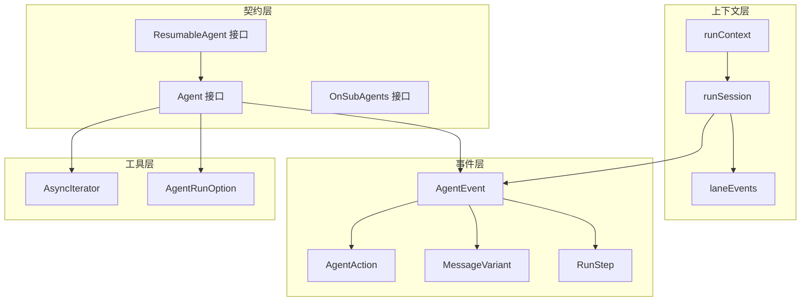

# Agent Contracts and Context 模块

## 概述

`agent_contracts_and_context` 模块是整个 ADK 框架的核心基础设施，它定义了智能体之间交互的契约、执行上下文管理以及事件流机制。这个模块就像是智能体系统的"操作系统内核"，负责协调不同智能体之间的通信、状态管理和执行流程。

想象一下一个多智能体系统，就像一个办公室里有多个专业人员一起工作。每个专业人员（智能体）有自己的专长，但他们需要共享信息、传递任务、记录工作进展。这个模块就提供了这样一套基础设施：
- 定义了智能体应该长什么样（接口契约）
- 提供了传递任务和状态的机制（运行上下文）
- 建立了事件流和消息传递的标准（事件和消息变体）

## 架构概览



这个架构分为四个主要层次：

1. **契约层**：定义了智能体必须实现的核心接口，包括基础智能体、可恢复智能体和子智能体管理接口。
2. **上下文层**：管理智能体执行过程中的状态和上下文，包括运行上下文、会话状态和并行执行通道。
3. **事件层**：定义了智能体执行过程中产生的事件、动作、消息和执行步骤。
4. **工具层**：提供了异步迭代器和运行选项等辅助工具。

### 数据流程

让我们追踪一个典型的智能体执行流程：

1. **初始化**：当调用智能体的 `Run` 方法时，系统首先通过 `initRunCtx` 初始化运行上下文
2. **执行**：智能体执行并通过 `AsyncIterator` 产生 `AgentEvent` 事件
3. **事件处理**：事件被包装在 `agentEventWrapper` 中并添加到 `runSession`
4. **状态管理**：会话值可以通过 `AddSessionValue` 等方法进行管理
5. **并行执行**：在并行场景下，通过 `forkRunCtx` 创建分支上下文，最后通过 `joinRunCtxs` 合并

## 核心设计决策

### 1. 基于事件的异步执行模型

**决策**：采用 `AsyncIterator` + `AgentEvent` 的事件流模型，而不是简单的同步返回。

**原因**：
- 智能体执行可能是长时间运行的，需要实时反馈
- 支持流式输出（如 LLM 的逐词生成）
- 允许在执行过程中插入中断、转移等控制动作

**权衡**：
- ✅ 灵活性高，支持复杂的执行场景
- ✅ 实时性好，可以立即反馈执行状态
- ❌ 编程模型相对复杂，需要正确处理异步流

### 2. 上下文隔离与共享的平衡

**决策**：使用 `runContext` 管理执行上下文，通过 `forkRunCtx` 和 `joinRunCtxs` 处理并行场景。

**原因**：
- 需要在智能体之间共享某些状态（如会话值）
- 并行执行时需要隔离不同分支的事件，避免竞态条件
- 最终需要合并所有分支的事件，保持执行历史的完整性

**权衡**：
- ✅ 既支持状态共享，又保证并行安全
- ✅ 通过 `laneEvents` 链表优雅地处理事件合并
- ❌ 实现相对复杂，需要正确处理上下文的复制和合并

### 3. 消息变体的统一抽象

**决策**：使用 `MessageVariant` 统一处理单条消息和消息流两种情况。

**原因**：
- 不同的智能体可能有不同的输出方式（同步/流式）
- 需要能够在运行时透明地处理这两种情况
- 序列化时需要能够将流转换为静态消息

**权衡**：
- ✅ 统一的接口简化了上层代码
- ✅ 支持序列化和反序列化
- ❌ 需要在内部处理两种情况的转换，增加了复杂度

### 4. 可扩展的选项模式

**决策**：使用 `AgentRunOption` + `WrapImplSpecificOptFn` 的模式来处理运行时选项。

**原因**：
- 不同的智能体实现可能需要不同的选项
- 需要保持核心接口的简洁性
- 支持选项的目标智能体指定

**权衡**：
- ✅ 灵活性高，可以支持任意实现特定的选项
- ✅ 核心接口保持简洁
- ❌ 类型安全性相对较低（使用 `any` 类型）

## 子模块

这个模块进一步细分为以下子模块：

- [agent_run_options](./agent_run_options.md)：智能体运行选项的定义和处理
- [agent_contracts_and_handoff](./agent_contracts_and_context-agent_contracts_and_handoff.md)：智能体契约和交接机制
- [agent_events_steps_and_message_variants](./agent_contracts_and_context-agent_events_steps_and_message_variants.md)：事件、步骤和消息变体的定义
- [run_context_and_session_state](./run-context-and-session-state.md)：运行上下文和会话状态管理
- [async_iteration_utilities](./run_context_and_session_state-async_iteration_utilities.md)：异步迭代工具

## 跨模块依赖

这个模块是整个 ADK 框架的基础，被以下模块依赖：

- [chatmodel_react_and_retry_runtime](adk_runtime-chatmodel_react_and_retry_runtime.md)：基于聊天模型的 ReAct 和重试运行时
- [flow_runner_interrupt_and_transfer](adk_runtime-flow_runner_interrupt_and_transfer.md)：流程运行器、中断和转移机制
- [workflow_agents](adk_runtime-workflow_agents.md)：工作流智能体

同时，它依赖以下模块：

- `schema`：提供消息和流的基础定义
- `internal/core`：提供内部核心组件

## 新开发者注意事项

### 1. 事件流的生命周期管理

**注意事项**：
- `AsyncIterator` 必须正确关闭，否则可能导致资源泄漏
- 流式 `MessageVariant` 必须被正确消费或设置自动关闭
- 事件的 `RunPath` 由框架管理，不要手动修改

**示例**：
```go
// 正确处理事件流
iter := agent.Run(ctx, input)
for {
    event, ok := iter.Next()
    if !ok {
        break
    }
    // 处理事件
}
```

### 2. 上下文的正确使用

**注意事项**：
- 不要在不同的 goroutine 之间共享同一个 `runContext`
- 在并行场景下使用 `forkRunCtx` 创建分支上下文
- 使用 `ClearRunCtx` 来隔离嵌套的多智能体系统

### 3. 序列化的限制

**注意事项**：
- `MessageVariant` 在序列化时会消费流，确保流可以被多次消费或已经被缓存
- 自定义的 `CustomizedOutput` 和 `CustomizedAction` 需要自己处理序列化
- 确保所有需要序列化的类型都已经注册到 gob

### 4. 选项的设计

**注意事项**：
- 使用 `WrapImplSpecificOptFn` 来创建实现特定的选项
- 使用 `DesignateAgent` 来指定选项的目标智能体
- 在实现智能体时，使用 `GetImplSpecificOptions` 来提取选项

通过理解这些设计决策和注意事项，新开发者可以更好地使用和扩展这个模块，构建出健壮的多智能体系统。
