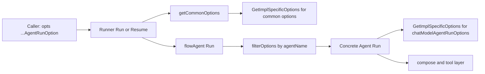

# agent_run_option_system 深度解析

`agent_run_option_system`（`adk/call_option.go`）看起来只有两个 struct 和几组小函数，但它在 ADK 里扮演的是“运行期控制总线”的角色：把一次 `Runner.Run/Resume` 调用中的控制意图（会话注入、消息裁剪、定向生效、实现专属参数）安全地沿着多层 agent/工具链路传下去。没有这层系统，调用方只能不断扩展 `Run(...)` 签名，或者让每个 agent 自己解析杂乱参数，最终会把 API 演化成难以维护的“参数泥球”。

---

## 先说问题：这个模块到底在解决什么

ADK 的执行链路不是单层函数调用，而是 `Runner -> flowAgent -> 具体Agent（如 ChatModelAgent/workflowAgent）-> tools/子Agent` 的嵌套图结构。调用方希望在“入口”一次性传入控制项，但这些控制项并不都应该被所有节点看到：

一类选项是通用语义，比如 `WithSessionValues`、`WithSkipTransferMessages`，它们应该在运行上下文层生效；另一类是实现细节语义，比如 `WithChatModelOptions`、`WithToolOptions`，只对 `ChatModelAgent` 有意义；还有一类是作用域语义——某些选项只该投递给指定 agent，而不是广播给整条链路。

如果采用朴素设计（例如给 `Run` 加一个统一大 struct，所有字段公开），会马上遇到三个问题：第一，类型耦合会爆炸，所有 agent 都被迫依赖彼此私有配置；第二，向后兼容会变差，每新增一种 agent 都可能修改公共 option struct；第三，多级代理场景下很难表达“同一次调用里，不同 agent 拿到不同子集选项”。

`agent_run_option_system` 的设计洞察是：**把 option 变成“可携带、可筛选、可类型匹配执行的函数载体”**，而不是固定字段容器。这样可以在保持统一入口类型 `AgentRunOption` 的同时，实现“按接收方类型解包”的解耦。

你可以把它想象成“机场行李分拣系统”：乘客（调用方）托运的是统一格式行李（`AgentRunOption`），真正拆箱时由不同传送带（`GetImplSpecificOptions[T]`）按目的地标签（目标类型 `T` + `DesignateAgent`）把行李送到正确柜台。

---

## 架构角色与数据流



这张图表达了两个并行机制。

第一条是“**通用选项提取链**”：`Runner.Run` 和 `Runner.resume` 都先调用 `getCommonOptions`，再由 `GetImplSpecificOptions[options]` 提取 `sharedParentSession/sessionValues/checkPointID/skipTransferMessages` 这类公共语义，控制 run context、session 注入、checkpoint 行为。

第二条是“**按 agent 作用域过滤 + 按实现类型再解包**”：`flowAgent.Run` 在把请求转给真实 agent 前，会执行 `filterOptions(agentName, opts)`；随后具体 agent（典型是 `ChatModelAgent`）再用 `GetImplSpecificOptions[chatModelAgentRunOptions]` 只提取自己关心的部分，转换为 `compose.Option` 和 `tool.Option`。

这里最关键的是：**过滤与解包分离**。`filterOptions` 只解决“谁能看到”，`GetImplSpecificOptions[T]` 只解决“看到后能不能识别并应用”。这让跨层传递既灵活又可控。

---

## 核心组件深潜

## `type options`

`options` 是 ADK 运行层的公共 option 聚合体，字段包括：`sharedParentSession`、`sessionValues`、`checkPointID`、`skipTransferMessages`。它不是对外 API，而是内部“公共语义落地对象”。

设计上它故意保持最小集合：只容纳 runner/flow 级别一定会消费的字段。像 chat model 专属参数不进这里，避免公共层知道太多实现细节。

## `type AgentRunOption`

`AgentRunOption` 有两个字段：`implSpecificOptFn any` 与 `agentNames []string`。前者承载“可对某种目标类型执行的函数”，后者承载“可见性范围”。

这个结构的关键不是存值，而是存行为。行为被延迟到消费端执行，因此同一个 option 可以穿越多层后，在真正有能力识别它的地方才生效。

## `func (AgentRunOption) DesignateAgent(name ...string) AgentRunOption`

这是作用域控制开关。调用后返回新 `AgentRunOption`（值接收者语义），把可见范围限制到指定 agent 名。

配合 `flowAgent.Run` 的 `filterOptions`，可以做“同一条调用链里，不同 agent 拿到不同配置”的定向投递。

## `func WrapImplSpecificOptFn[T any](optFn func(*T)) AgentRunOption`

这是整个系统最核心的构造器。它把 `func(*T)` 包装进统一外壳 `AgentRunOption`。

为什么不是接口而是泛型函数签名？因为这里追求的是零侵入：新增一种 option 目标类型时，不需要改公共接口，只需定义新的 `T` 并在消费端解包。

## `func GetImplSpecificOptions[T any](base *T, opts ...AgentRunOption) *T`

这是解包引擎。它遍历 `opts`，对每个 `implSpecificOptFn` 尝试做类型断言 `func(*T)`，断言成功就执行。

这个实现有两个很重要的语义：

- **弱匹配、静默忽略**：类型不匹配的 option 不报错，直接跳过。这让多实现共用同一 `[]AgentRunOption` 成为可能。
- **顺序覆盖**：按 `opts` 顺序执行，后传入的 option 可以覆盖前一个写入（例如同字段重复设置）。

代价是错误发现偏晚：如果调用方把 option 投错目标类型，不会得到显式错误，而是“看起来没生效”。

## `func getCommonOptions(base *options, opts ...AgentRunOption) *options`

对 `GetImplSpecificOptions[options]` 的薄封装，统一 runner/flow 对公共 option 的提取入口。`base==nil` 时会创建默认值。

## `func WithSessionValues(v map[string]any) AgentRunOption`

把会话初始 KV 注入到 `options.sessionValues`。在 `Runner.Run` 和 `Runner.resume` 中会调用 `AddSessionValues(ctx, o.sessionValues)` 落地到 `runSession.Values`。

注意这里是 map 引用语义，调用方后续若修改同一个 map，行为依赖调用时机；实践上应把它当作“调用前冻结数据”。

## `func WithSkipTransferMessages() AgentRunOption`

设置 `options.skipTransferMessages=true`。`flowAgent.genAgentInput` 在重建历史时据此跳过 transfer 相关消息（包括特定场景下回退前一条 tool 消息），用于抑制代理切换噪声对后续上下文的污染。

## `func withSharedParentSession() AgentRunOption`

非导出，主要由 `agent_tool` 内部使用（`agentTool.InvokableRun` 在调用内层 runner 时会附带它）。语义是让内层执行与父 session 共享同一 `Values` map 和锁，做到工具内 agent 与外层 agent 的 session 直通。

它不开放给通用调用方，反映了一个边界决策：这属于框架内部跨层协作能力，而不是稳定公共 API。

## `func filterOptions(agentName string, opts []AgentRunOption) []AgentRunOption`

实现作用域过滤：

- `agentNames` 为空 => 广播给所有 agent；
- 否则仅当 `agentName` 命中时保留。

`flowAgent.Run` 在调用底层 `a.Agent.Run` 时使用这个过滤结果，保证 agent 定向 option 不会越权泄露到其他子代理。

---

## 依赖关系与契约分析

从调用关系看，这个模块是“横切层”，上接执行入口，下接具体实现。

`Runner.Run` 与 `Runner.resume` 依赖 `getCommonOptions`。它们假设：公共字段可在运行开始前一次性抽取并写入 context/session；尤其 `resume` 分支还额外处理 `sharedParentSession`，将父 session 的 `Values` 与 `valuesMtx` 复用到恢复上下文。

`flowAgent.Run` 依赖两件事：`getCommonOptions`（拿 `skipTransferMessages` 影响历史重写）以及 `filterOptions`（把 option 可见性控制在当前 agent 作用域内）。这意味着如果未来 agent 命名策略变化，`DesignateAgent`/`filterOptions` 的匹配契约（当前是字符串精确匹配）就会成为敏感点。

`ChatModelAgent` 并不直接读取 `options`，而是通过 `GetImplSpecificOptions[chatModelAgentRunOptions]` 提取专属项，再映射成 `compose.WithChatModelOption`、`compose.WithToolsNodeOption` 等。也就是说，`AgentRunOption` 在这里扮演了“跨模块 option 运输层”，而非业务语义层。

`agent_tool` 使用了 `withSharedParentSession`，并通过 `withAgentToolOptions`/`getOptionsByAgentName` 实现“工具里再转发一层 AgentRunOption”。这条链路依赖的隐式契约是：内层 agent 名字要稳定可识别，否则 per-agent 配置可能失配。

---

## 关键设计取舍

这个模块最核心的取舍是**类型安全 vs 运行期灵活性**。它选择了后者：`implSpecificOptFn` 存成 `any`，在消费时做类型断言。好处是公共层不需要知道所有 option 类型，扩展新 agent 成本极低；坏处是错误不会在编译期暴露，调试成本上升。

第二个取舍是**静默忽略 vs 显式失败**。`GetImplSpecificOptions[T]` 对不匹配类型直接跳过，适合“同一 option 列表跨多层传递”的常态，但也会掩盖拼错目标、漏 `DesignateAgent`、或投递到错误 agent 的问题。这个决策明显偏向运行连续性和框架容错。

第三个取舍是**统一外壳 vs 细分 option 通道**。ADK 选择统一 `AgentRunOption`，再在内部分流；这减少了 API 表面积，但增加了理解门槛：贡献者必须知道“哪里过滤、哪里解包、哪里消费”。

第四个取舍是**内部能力封装**。`withSharedParentSession` 不导出，体现了边界意识：跨 session 共享属于强语义能力，若公开会增加误用概率；内部保留可让 `agent_tool` 实现更强协同，同时避免承诺长期兼容。

---

## 使用方式与实践示例

常见入口是在 `Runner` 层传入多个 `AgentRunOption`：

```go
iter := runner.Run(ctx, []Message{schema.UserMessage("hello")},
    WithSessionValues(map[string]any{
        "User": "alice",
        "Time": "2026-02-27",
    }),
    WithSkipTransferMessages(),
)
```

如果你只想让某个 option 被特定 agent 看见，可以定向：

```go
opt := WithSessionValues(map[string]any{"Tenant": "A"}).DesignateAgent("planner")
iter := runner.Run(ctx, msgs, opt)
```

在实现新 agent 时，推荐定义自己的 run option struct，然后在消费点调用 `GetImplSpecificOptions[YourRunOptions]`：

```go
type yourAgentRunOptions struct {
    debug bool
}

func WithYourDebug() AgentRunOption {
    return WrapImplSpecificOptFn(func(o *yourAgentRunOptions) {
        o.debug = true
    })
}

// in YourAgent.Run(...)
ro := GetImplSpecificOptions[yourAgentRunOptions](nil, opts...)
_ = ro.debug
```

这种模式与 `ChatModelAgent` 的 `chatModelAgentRunOptions` 一致，扩展时不需要修改公共 `options`。

---

## 新贡献者最该注意的坑

最常见坑是“**option 没生效但没有报错**”。根因通常有三类：一是目标类型不匹配（`GetImplSpecificOptions[T]` 断言失败被静默忽略）；二是 `DesignateAgent` 名字与运行时 `agent.Name(ctx)` 不一致；三是 option 被传到了链路里错误层级（例如以为 runner 消费，实际是具体 agent 消费）。

第二个坑是“**覆盖顺序**”。同字段多次设置时后者覆盖前者，尤其当中间层追加 option 时，容易出现“入口配置被下游重写”。排查时要看完整 `opts` 拼接顺序。

第三个坑是“**共享引用语义**”。`WithSessionValues` 直接保存 map 引用；如果外部 goroutine 在运行期间修改该 map，可能引入难定位行为。建议传入前自行 copy。

第四个坑是“**定向过滤只发生在 flow 层**”。`filterOptions` 在 `flowAgent.Run` 执行；若你绕过 flow 直接调某些底层 agent，`DesignateAgent` 语义可能不再成立。

---

## 与其他模块的关系（参考阅读）

建议配合以下文档一起看，能更完整理解 option 如何穿透执行系统：

- [runner_lifecycle_and_checkpointing](runner_lifecycle_and_checkpointing.md)：`Runner.Run/Resume` 如何消费公共 option 并处理 checkpoint。
- [ADK Agent Interface](ADK Agent Interface.md)：`Agent/ResumableAgent` 对 `options ...AgentRunOption` 的接口契约。
- [Compose Graph Engine](Compose Graph Engine.md)：`ChatModelAgent` 最终如何把自身选项映射为 `compose.Option`。
- [Compose Tool Node](Compose Tool Node.md)：工具调用链路中的 option 透传背景。

如果你要改 `agent_run_option_system`，最重要的评估维度不是“功能能不能跑”，而是“会不会破坏跨层 option 的静默兼容性与作用域隔离”。这两点是该模块存在的核心价值。