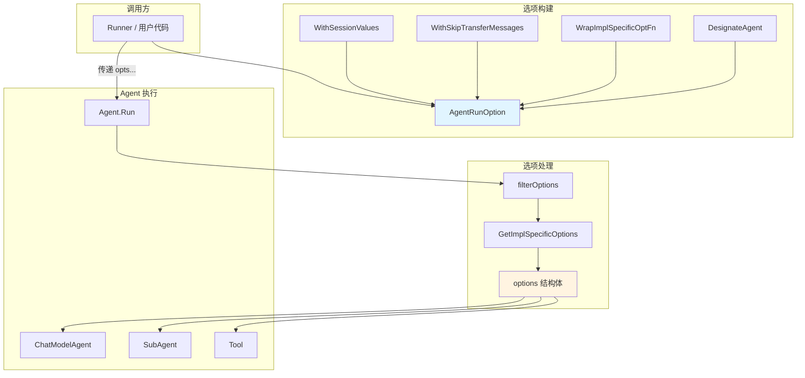

# Agent Run Options 模块

## 核心问题：为什么需要这个模块？

想象你在一家餐厅点餐：你可以对每道菜提出个性化要求——"少放盐"、"不要香菜"、"要辣的"——但厨师并不需要修改菜谱来满足你的需求。同样，在 Agent 系统中，当调用一个 Agent 执行任务时，我们经常需要在**不修改 Agent 代码**的情况下，控制其行为细节。

`agent_run_options` 模块解决了 Agent 运行时配置的三个核心挑战：

1. **灵活配置**：如何在不修改 Agent 定义的情况下，向 Agent 传递多样化的配置参数？
2. **作用域控制**：当一个选项被传递给 Agent 层次结构时，如何控制哪些 Agent 可以看到并使用这个选项？
3. **类型安全扩展**：如何在保持核心选项类型统一的同时，允许不同 Agent 类型定义自己的特定配置？

这个模块的核心价值在于提供了一种**声明式的、可组合的、类型安全的**选项传递机制。

## 架构概览



### 数据流：选项的生命周期

当一个 Agent 被调用时，选项的流动路径如下：

1. **选项创建**：调用方使用 `WithSessionValues`、`WithSkipTransferMessages` 等辅助函数或 `WrapImplSpecificOptFn` 创建选项
2. **作用域标记**：通过 `DesignateAgent` 为选项指定目标 Agent（可选）
3. **选项传递**：`...AgentRunOption` 被传递给 `Agent.Run()` 方法
4. **选项过滤**：Agent 内部调用 `filterOptions`，根据自身名称过滤出适用的选项
5. **选项提取**：使用 `GetImplSpecificOptions` 将通用选项提取到具体的选项结构体中
6. **应用配置**：Agent 根据提取的配置调整其行为

## 核心组件解析

### AgentRunOption：通用选项包装器

`AgentRunOption` 是整个模块的基石，它像一个**瑞士军刀的刀柄**——可以承载各种不同类型的选项功能：

```go
type AgentRunOption struct {
    implSpecificOptFn any  // 实现特定的选项函数（类型擦除）
    agentNames       []string // 可见性控制：指定哪些 Agent 能看到这个选项
}
```

#### 设计思想：类型擦除 + 函数包装

`implSpecificOptFn` 字段使用 `any` 类型存储函数，这是一种**类型擦除**技巧。想象你有一个万能的快递箱，它可以装任何形状的包裹：

- `WithSessionValues` 装载"会话值设置"函数
- `WithSkipTransferMessages` 装载"消息传输控制"函数
- 每个具体 Agent 类型可以装载自己的特定配置函数

这种设计的优势在于：
- **类型安全**：虽然存储时使用 `any`，但提取时通过泛型恢复类型安全
- **可扩展性**：任何 Agent 实现都可以定义自己的选项结构体，无需修改核心类型
- **统一接口**：所有选项都通过 `...AgentRunOption` 传递，保持 API 一致性

#### 作用域控制：DesignateAgent

`agentNames` 字段实现了选项的**作用域过滤**机制：

```go
func (o AgentRunOption) DesignateAgent(name ...string) AgentRunOption {
    o.agentNames = append(o.agentNames, name...)
    return o
}
```

这就像在邮件上标注"仅限收件人本人"一样，确保选项只到达指定的 Agent。如果 `agentNames` 为空，则所有 Agent 都能看到这个选项。

### options：通用选项实现

`options` 结构体提供了 Agent 运行时的通用配置选项：

```go
type options struct {
    sharedParentSession  bool         // 是否与父 Agent 共享会话状态
    sessionValues        map[string]any // 会话级别的键值对存储
    checkPointID         *string      // 检查点标识符（用于恢复）
    skipTransferMessages bool         // 是否跳过传输消息转发
}
```

#### 字段详解

| 字段 | 用途 | 使用场景 |
|------|------|----------|
| `sharedParentSession` | 会话共享 | 当子 Agent 需要访问父 Agent 的会话上下文时 |
| `sessionValues` | 会话值存储 | 在会话期间传递共享数据（如用户 ID、权限信息） |
| `checkPointID` | 检查点标识 | 用于标记中断后的恢复点，支持断点续传 |
| `skipTransferMessages` | 消息传输控制 | 当不希望在 Agent 转移时复制历史消息时 |

### 关键辅助函数

#### WrapImplSpecificOptFn：选项函数包装器

这是模块的**核心构造函数**，它将类型特定的配置函数包装成通用的 `AgentRunOption`：

```go
func WrapImplSpecificOptFn[T any](optFn func(*T)) AgentRunOption {
    return AgentRunOption{
        implSpecificOptFn: optFn,
    }
}
```

例如，`WithSessionValues` 的实现：

```go
func WithSessionValues(v map[string]any) AgentRunOption {
    return WrapImplSpecificOptFn(func(o *options) {
        o.sessionValues = v
    })
}
```

这种模式被称为**Function Options Pattern（函数选项模式）**，在 Go 语言中被广泛使用。

#### GetImplSpecificOptions：选项提取器

这是模块的**核心提取函数**，它从通用的 `AgentRunOption` 列表中提取类型特定的选项：

```go
func GetImplSpecificOptions[T any](base *T, opts ...AgentRunOption) *T {
    if base == nil {
        base = new(T)
    }

    for i := range opts {
        opt := opts[i]
        if opt.implSpecificOptFn != nil {
            optFn, ok := opt.implSpecificOptFn.(func(*T))
            if ok {
                optFn(base)
            }
        }
    }

    return base
}
```

这个函数的工作原理：
1. 接受一个基础选项 `base`（可以提供默认值）
2. 遍历所有 `AgentRunOption`
3. 尝试将每个 `implSpecificOptFn` 类型断言为 `func(*T)`
4. 如果断言成功，调用该函数来修改 `base`
5. 返回填充好的选项

**关键点**：类型断言确保只有匹配目标类型 `T` 的函数才会被应用，这提供了运行时的类型安全。

#### filterOptions：选项过滤器

```go
func filterOptions(agentName string, opts []AgentRunOption) []AgentRunOption {
    // ... 过滤逻辑
}
```

这个函数实现了**作用域过滤**：根据 Agent 名称筛选出适用的选项。它的规则是：
- 如果选项的 `agentNames` 为空，则所有 Agent 都适用
- 如果 `agentNames` 非空，只有名称在列表中的 Agent 才能使用该选项

## 设计权衡与决策

### 为什么使用类型擦除而不是接口？

**选择**：使用 `any` + 泛型提取

**替代方案**：定义一个 `Option` 接口，让所有选项实现它

**权衡分析**：
- **类型擦除的优势**：
  - 零侵入性：无需为每个选项类型创建新的接口实现
  - 简洁性：选项定义只需要一个简单的闭包函数
  - 灵活性：任何函数签名 `func(*T)` 都可以被包装
  
- **接口方案的劣势**：
  - 需要定义接口类型，增加抽象层级
  - 每个选项类型都需要实现接口方法
  - 不如闭包函数直观

### 为什么每个选项独立而不是统一配置结构？

**选择**：分散的选项函数（`WithSessionValues`、`WithSkipTransferMessages` 等）

**替代方案**：一个大的 `AgentConfig` 结构体，包含所有可能的配置字段

**权衡分析**：
- **分散选项的优势**：
  - **可组合性**：调用方可以自由选择需要的选项，不需要关心未使用的字段
  - **向后兼容**：添加新选项时不会破坏现有代码
  - **可读性**：代码中明确传递了哪些选项，意图清晰
  
- **统一配置的劣势**：
  - 零值问题：难以区分"未设置"和"设置为空值"
  - 脆弱性：修改配置结构可能影响所有使用者
  - 冗余性：调用方需要创建结构体，即使只设置一个字段

### 为什么需要 agentNames 作用域控制？

**选择**：通过 `agentNames` 实现选项的可见性控制

**替代方案**：在传递选项时由调用方手动过滤

**权衡分析**：
- **内置作用域的优势**：
  - **解耦**：调用方不需要了解 Agent 层次结构的细节
  - **集中控制**：选项定义时一次性指定目标，而不是在多个调用点分散处理
  - **可维护性**：修改 Agent 名称或层次结构时，只需要更新选项定义
  
- **手动过滤的劣势**：
  - 重复代码：每个调用点都需要实现过滤逻辑
  - 易错性：容易遗漏某个调用点，导致选项泄露

### 为什么使用闭包而不是结构体字段？

**选择**：通过闭包函数 `func(*T)` 修改选项

**替代方案**：在 `AgentRunOption` 中直接存储配置值

**权衡分析**：
- **闭包的优势**：
  - **延迟计算**：配置值可以在运行时计算，而不是在选项创建时固定
  - **逻辑封装**：复杂的设置逻辑可以封装在闭包中，调用方只需关心输入
  - **类型安全**：闭包直接操作目标类型，避免类型转换错误
  
- **直接存储的劣势**：
  - 需要额外的序列化/反序列化逻辑
  - 复杂配置难以表达
  - 类型安全问题需要运行时检查

## 模块间的依赖关系

### 上游依赖（使用本模块的组件）

| 组件 | 依赖关系 | 使用方式 |
|------|----------|----------|
| `adk.interface.Agent` | 接口定义 | `Run(ctx, input, ...AgentRunOption)` 方法定义 |
| `adk.chatmodel.ChatModelAgent` | 实现方 | 使用 `GetImplSpecificOptions` 提取 `chatModelAgentRunOptions` |
| `adk.runner.Runner` | 调用方 | 传递选项给 Agent 的 `Run` 方法 |
| `adk.workflow.workflowAgent` | 实现方 | 可能使用选项控制工作流行为 |

### 下游依赖（本模块依赖的组件）

| 组件 | 依赖关系 | 用途 |
|------|----------|------|
| `context` | 标准库 | 用于传递上下文信息 |
| （无） | 其他 ADK 模块 | 本模块相对独立，不依赖其他 ADK 模块 |

### 与其他模块的协作

1. **与 [Agent 接口](agent-contracts-and-handoff.md)**：
   - `AgentRunOption` 是 `Agent.Run()` 方法的核心参数
   - 所有 Agent 实现都必须支持接收和处理这些选项

2. **与 [中断和恢复](interrupt-resume-bridge.md)**：
   - `options.checkPointID` 用于标记恢复点
   - `ResumeInfo` 可能携带检查点相关信息

3. **与 [会话管理](run-context-and-session-state.md)**：
   - `options.sessionValues` 与会话键值对存储机制协作
   - `options.sharedParentSession` 控制会话状态的共享行为

## 使用指南

### 基本用法

#### 设置会话值

```go
opts := []adk.AgentRunOption{
    adk.WithSessionValues(map[string]any{
        "userID":    "user_123",
        "tenantID":  "tenant_abc",
        "role":      "admin",
    }),
}

result := agent.Run(ctx, input, opts...)
```

#### 跳过传输消息

```go
opts := []adk.AgentRunOption{
    adk.WithSkipTransferMessages(),
}

result := agent.Run(ctx, input, opts...)
```

#### 组合多个选项

```go
opts := []adk.AgentRunOption{
    adk.WithSessionValues(map[string]any{"key": "value"}),
    adk.WithSkipTransferMessages(),
}

result := agent.Run(ctx, input, opts...)
```

### 高级用法

#### 指定目标 Agent

```go
// 这个选项只会被名为 "assistant" 的 Agent 看到和使用
opts := []adk.AgentRunOption{
    adk.WithSessionValues(map[string]any{"mode": "debug"}).
        DesignateAgent("assistant"),
}

result := runner.Run(ctx, input, opts...)
```

#### 创建自定义选项类型

```go
// 定义自定义选项结构体
type MyAgentOptions struct {
    MaxRetries    int
    Timeout       time.Duration
    CustomSetting string
}

// 创建选项辅助函数
func WithMaxRetries(n int) adk.AgentRunOption {
    return adk.WrapImplSpecificOptFn(func(o *MyAgentOptions) {
        o.MaxRetries = n
    })
}

func WithTimeout(d time.Duration) adk.AgentRunOption {
    return adk.WrapImplSpecificOptFn(func(o *MyAgentOptions) {
        o.Timeout = d
    })
}

// 在 Agent 中提取选项
func (a *MyAgent) Run(ctx context.Context, input *adk.AgentInput, opts ...adk.AgentRunOption) *AsyncIterator[*adk.AgentEvent] {
    myOpts := adk.GetImplSpecificOptions(&MyAgentOptions{
        MaxRetries: 3,           // 默认值
        Timeout:    30 * time.Second,
    }, opts...)
    
    // 使用 myOpts...
}
```

### 在 Agent 实现中处理选项

```go
func (a *ChatModelAgent) Run(ctx context.Context, input *adk.AgentInput, opts ...adk.AgentRunOption) *AsyncIterator[*adk.AgentEvent] {
    // 1. 过滤选项
    myName := a.Name(ctx)
    filteredOpts := filterOptions(myName, opts)
    
    // 2. 提取通用选项
    commonOpts := getCommonOptions(&options{}, filteredOpts...)
    
    // 3. 提取特定选项
    runOpts := GetImplSpecificOptions(&chatModelAgentRunOptions{}, filteredOpts...)
    
    // 4. 应用配置
    if commonOpts.skipTransferMessages {
        // 调整消息传输行为
    }
    
    if runOpts.historyModifier != nil {
        // 应用历史消息修改器
    }
    
    // ... 执行逻辑
}
```

## 潜在陷阱与注意事项

### 1. 选项的累积性

**问题**：`GetImplSpecificOptions` 会累积所有匹配的选项函数，后面的选项可能覆盖前面的设置。

```go
opts := []adk.AgentRunOption{
    WithSessionValues(map[string]any{"a": "1"}),
    WithSessionValues(map[string]any{"b": "2"}), // 完全覆盖之前的 sessionValues
}
```

**解决**：如果需要合并而不是覆盖，自定义选项函数中实现合并逻辑。

### 2. 类型断言失败

**问题**：如果 `implSpecificOptFn` 的类型与目标类型 `T` 不匹配，它会被静默忽略。

```go
// 这个选项不会被应用到 *MyOptions 类型
opt := WrapImplSpecificOptFn(func(o *OtherOptions) { ... })
opts := GetImplSpecificOptions(&MyOptions{}, opt) // opt 被忽略
```

**建议**：确保选项函数的类型与目标选项类型一致，或在代码中使用类型检查辅助工具。

### 3. nil 值处理

**问题**：`GetImplSpecificOptions` 接受 `*T`，如果传入 `nil` 会创建新实例。

```go
// base 为 nil，会创建新的 options 实例
opts := GetImplSpecificOptions[options](nil, someOptions...)
```

**影响**：如果你期望继承基础配置，必须传入非 nil 的基础实例。

### 4. 选项作用域的精确性

**问题**：`DesignateAgent` 使用字符串匹配，Agent 名称的变更需要同步更新选项定义。

**建议**：使用常量或配置文件管理 Agent 名称，避免硬编码字符串。

### 5. 并发安全性

**问题**：如果选项中包含引用类型（如 map、slice），多个 Agent 同时修改可能导致竞态条件。

```go
// 多个 Agent 共享同一个 map 可能不安全
sharedMap := map[string]any{"key": "value"}
opts := WithSessionValues(sharedMap)
```

**建议**：在选项函数中复制引用类型数据，或确保修改操作的原子性。

### 6. 性能考虑

**问题**：`filterOptions` 和 `GetImplSpecificOptions` 在每次调用时都会遍历所有选项。

**影响**：对于高频调用的 Agent，选项处理可能成为性能瓶颈。

**建议**：
- 选项列表不要过大（通常不超过 10 个）
- 考虑在 Agent 内部缓存选项处理结果（如果选项在生命周期内不变）

### 7. 调试困难

**问题**：由于类型擦除和闭包封装，选项的实际内容在运行时难以检查。

**建议**：
- 在开发阶段添加日志记录，打印选项的关键字段
- 使用单元测试验证选项的正确应用
- 考虑实现选项的 `String()` 方法用于调试输出

## 总结

`agent_run_options` 模块是 ADK 框架中一个精巧但功能强大的组件，它通过**函数选项模式**、**类型擦除**和**作用域过滤**等技术，实现了灵活、类型安全、可扩展的 Agent 运行时配置机制。

**核心价值**：
- ✅ 解耦：选项定义与 Agent 实现解耦
- ✅ 灵活性：支持任意类型的配置扩展
- ✅ 可组合性：多个选项可以自由组合
- ✅ 向后兼容：新增选项不影响现有代码
- ✅ 类型安全：通过泛型提供编译时类型检查

**适用场景**：
- 需要在不修改 Agent 代码的情况下控制其行为
- 需要在 Agent 层次结构中精确传递配置
- 需要支持中断恢复、会话管理、消息控制等运行时特性

掌握这个模块的设计思想，将帮助你更好地理解和使用整个 ADK 框架的选项传递机制。
