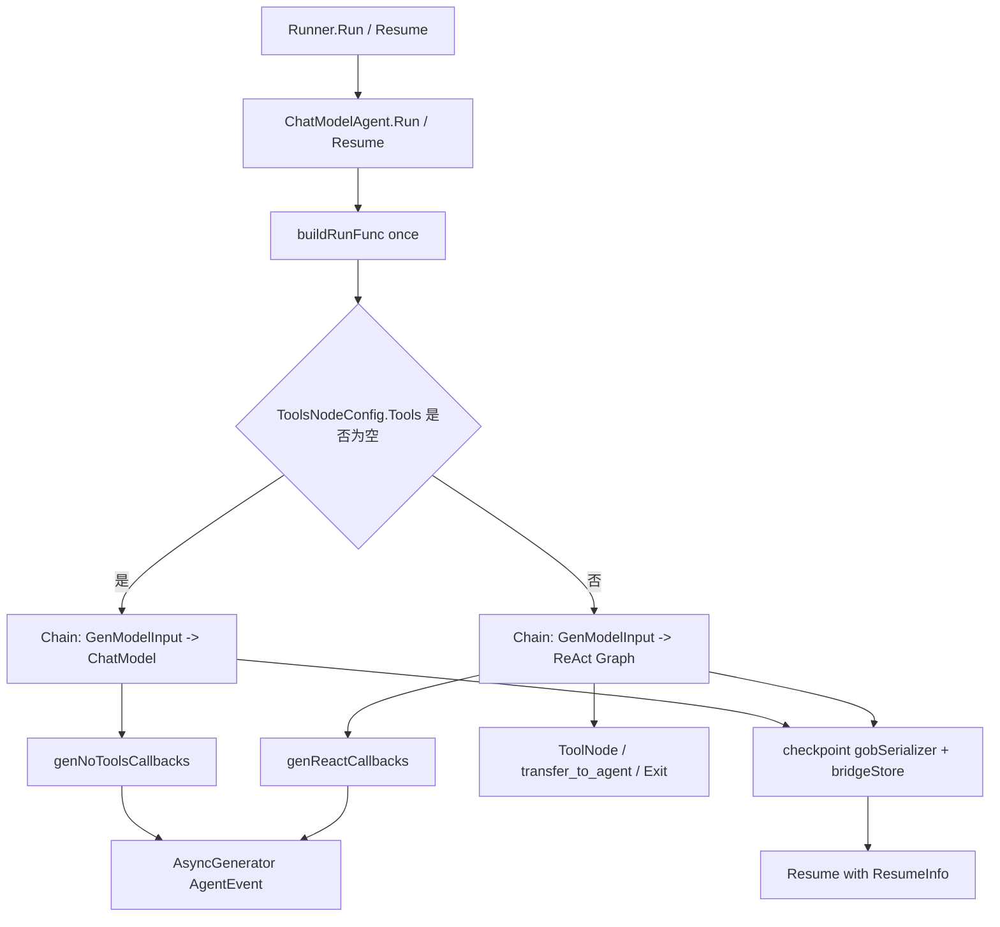

# agent_runtime_and_orchestration

`agent_runtime_and_orchestration`（对应 `adk/chatmodel.go`）是 ADK 里把“一个会调用工具、可中断、可恢复、可转交给其他 agent 的 ChatModel”真正跑起来的执行中枢。你可以把它想象成**航班塔台**：模型是飞机、工具是跑道服务车、`Runner` 是机场调度中心，而这个模块负责在每一轮起降中决定“先说话还是先调工具、遇到中断怎么落盘、恢复时从哪里继续、哪些事件要实时广播给外部观察者”。如果只写一个“调用一次模型然后返回”的朴素实现，在真实生产中会立刻撞墙：没有中断恢复、没有工具编排、没有事件流、没有多 agent handoff，也没有运行时约束（迭代上限、状态修改、回调过滤）。

## 这个模块解决的核心问题（Why）

这个模块要解决的不是“怎么调 LLM API”，而是“怎么把一个 chat model 提升为可运营的 agent runtime”。在简单场景里，`model.Generate(messages)` 足够；但一旦进入 agent 场景，会同时出现几个硬约束：第一，模型输出可能包含 `ToolCall`，你需要执行工具后再把结果回填给模型形成循环；第二，循环不能无限进行，必须有 `MaxIterations` 和可控退出（`ExitTool`、`ReturnDirectly`）；第三，执行过程必须可观测，外部调用方需要连续事件（`AgentEvent`）而不是最终字符串；第四，任何步骤都可能中断（人工确认、外部依赖失败、系统暂停），需要可 checkpoint + resume；第五，在多 agent 体系里，当前 agent 要能 transfer 给 sub-agent 或 parent-agent。

`ChatModelAgent` 的设计洞察是：**把“模型/工具循环”下沉到 compose 图执行层，把“对外行为契约”提升到 Agent 事件层**。因此它内部大量依赖 `compose.NewChain`、`AppendChatModel`、`AppendGraph`、callback handler、checkpoint serializer，但对外暴露的仍是统一 `Agent` / `ResumableAgent` 语义（`Run`/`Resume` 返回 `*AsyncIterator[*AgentEvent]`）。

## 心智模型（How it thinks）

理解这个模块，建议脑中放三层：

1. **配置装配层**：`ChatModelAgentConfig` + `AgentMiddleware` + `ToolsConfig` 在 `NewChatModelAgent` 中被折叠为不可变运行蓝图（指令拼接、工具合并、hook 收集）。
2. **执行计划层**：`buildRunFunc` 在首次运行时一次性决定走哪条路径：
   - 无工具：单轮 `ChatModel` 链（但仍支持 state hook、stream、checkpoint、retry）
   - 有工具：ReAct 图（`newReact`）+ tools node + return-directly 分支
3. **事件桥接层**：`cbHandler` / `noToolsCbHandler` 把 compose callback 转换成 `AgentEvent`，并处理中断包装（`ChatModelAgentInterruptInfo`）和工具事件顺序控制。

一个很实用的类比是：
- `ChatModelAgent` 是“导演”；
- compose graph 是“分镜脚本”；
- callback handler 是“现场导播台”，负责把内部镜头切成外部可消费直播流。

## 架构与数据流



从端到端看一次 `Run`：`Runner`（经 `Agent` 接口）触发 `ChatModelAgent.Run`，`Run` 会先调用 `buildRunFunc` 生成并缓存运行闭包，再把 `AgentRunOption` 通过 `getComposeOptions` 翻译为 `compose.Option`。执行在 goroutine 内进行，panic 会被 `safe.NewPanicErr` 包装后通过事件上报。真正执行时，先进入 `genModelInput`（默认 `defaultGenModelInput`），把 `Instruction + input.Messages` 组装为模型输入；随后根据“是否有工具”走简单链路或 ReAct 图。过程中 callback 把 model/tool/graph error 事件转换为 `AgentEvent` 推送给 `AsyncGenerator`。

`Resume` 的路径类似，但会先校验 `ResumeInfo.InterruptState` 类型必须是 `[]byte`，然后用 `newResumeBridgeStore(stateByte)` 恢复 checkpoint 数据，并可选应用 `ChatModelAgentResumeData.HistoryModifier` 到 ReAct `State.Messages`。

## 关键组件深潜

## `ChatModelAgentConfig`：声明式运行蓝图

`ChatModelAgentConfig` 不是简单参数容器，而是把运行策略拆成几类正交开关：
- 对话输入策略：`Instruction`、`GenModelInput`
- 模型与工具：`Model`、`ToolsConfig`
- 控制流：`Exit`、`MaxIterations`
- 可扩展钩子：`Middlewares`（前后处理、工具调用包装、补充工具与指令）
- 韧性策略：`ModelRetryConfig`
- 结果落盘：`OutputKey`

这里的取舍是“配置期尽可能声明，运行期尽可能稳定”。`NewChatModelAgent` 会把 middleware 的 `AdditionalInstruction` 拼接进最终 instruction，把 `AdditionalTools` / `WrapToolCall` 合并到 `ToolsConfig`，并提取 `beforeChatModels` / `afterChatModels` 列表，减少运行中动态分支。

## `ChatModelAgent`：一次冻结、重复执行

`ChatModelAgent` 里最关键的是 `once sync.Once + run runFunc + frozen uint32`。`buildRunFunc` 只构建一次执行函数，并在结束后 `atomic.StoreUint32(&a.frozen, 1)`，阻止后续再改 sub-agent 关系（`OnSetSubAgents`、`OnSetAsSubAgent`、`OnDisallowTransferToParent`）。

这个设计明显偏向**运行时一致性优先**：避免“已经运行过的 agent 被热修改拓扑”导致 resume 不一致。代价是灵活性下降——你不能在首次 Run 后再重配子 agent。

## `buildRunFunc`：分岔点（无工具链 vs ReAct 图）

它是全模块的主决策器，做了四件关键事：

第一，注入多 agent 转交流程。若存在 `subAgents`（以及允许时的 `parentAgent`），会追加 transfer 指令并自动加入 `transferToAgent` 工具，同时把该工具标记进 `returnDirectly`。

第二，注入退出工具。若配置了 `exit`，会追加到 tools 并将其名字标记为 return-directly，保证调用后立即终止回路。

第三，选择执行模式：
- `len(tools)==0`：构建 `GenModelInput -> ChatModel` 直链；`BeforeChatModel`/`AfterChatModel` 通过 state pre/post handler 执行。
- `len(tools)>0`：创建 `reactConfig` 调 `newReact`，再包成 `GenModelInput -> ReAct` 链。

第四，统一执行后处理：stream/non-stream 二选一调用；成功后按 `OutputKey` 写入 session（stream 情况会先 `ConcatMessageStream`）；最后关闭 generator。

## `ToolsConfig` 与 `ReturnDirectly`

`ToolsConfig` 在 `compose.ToolsNodeConfig` 基础上扩展两件事：
- `ReturnDirectly map[string]bool`
- `EmitInternalEvents bool`

`ReturnDirectly` 的语义是“某些工具一旦被调用，agent 立即返回对应工具结果”。注意实现细节：callback 不会立刻发该工具事件，而是暂存在 `cbHandler.returnDirectlyToolEvent`，等 `onToolsNodeEnd` 再统一发，避免工具并发或流式场景下的事件时序混乱。

`EmitInternalEvents` 是嵌套 agent 工具的透传开关。打开后，通过 `withAgentToolEventGenerator(generator)` 把内层事件转发到父 agent 的事件流，但这些事件**不会写入父 runSession/checkpoint**。这是一个明确的“可观测性 > 状态一致性”边界：你能看到内层实时过程，但恢复语义仍由父状态主导。

## `AgentMiddleware`：轻量 AOP 扩展

`AgentMiddleware` 提供四种扩展触点：补充指令、补充工具、模型前后 hook、工具调用包装。设计上更偏组合而非继承：中间件被扁平合并到 config，不引入复杂生命周期接口。适合常见扩展（审计、技能注入、参数重写），但不适合需要跨轮复杂状态机的深度编排（那应下沉到 compose graph 或上层 workflow）。

## 回调桥：`cbHandler` / `noToolsCbHandler`

这两个 handler 的职责是把 compose 层 callback 转成 ADK 事件层：
- `onChatModelEnd` / `onChatModelEndWithStreamOutput`：发 assistant 消息事件
- tools node end：补发 return-directly 事件
- graph error：普通错误直接上报；若是 interrupt（`compose.ExtractInterruptInfo`），则从 `bridgeStore` 取 checkpoint 数据，构建 `CompositeInterrupt` 事件，并填充 `ChatModelAgentInterruptInfo`（兼容旧 checkpoint）

`cbHandler` 还有一个非直观点：它用 address depth 过滤事件（`isAddressAtDepth` + `addrDepth*` 常量），避免 subgraph/嵌套节点的 callback 污染当前 agent 事件流。

## `defaultGenModelInput`

默认实现把 `Instruction` 转 system message，再拼接用户输入消息。若 session values 非空，会对 instruction 做 `schema.FString` 模板渲染。这里有一个重要契约：instruction 若包含字面量 `{}`（如 JSON），会触发格式化错误；错误信息也明确建议你改用自定义 `GenModelInput`。

## `Run` / `Resume`

两者都返回 `*AsyncIterator[*AgentEvent]`，并在独立 goroutine 执行。共同点是：
- 自动注入 `compose.WithCheckPointID(bridgeCheckpointID)`
- panic 统一捕获并事件化

`Resume` 额外做强校验并可能 panic：`InterruptState` 缺失、类型不是 `[]byte`、`ResumeData` 类型不是 `*ChatModelAgentResumeData`。这意味着调用方必须确保 resume 数据契约严格匹配。

## `getComposeOptions`

它把 `AgentRunOption` 中 chatmodel 专属选项翻译为 compose 选项：
- `WithChatModelOptions` -> `compose.WithChatModelOption`
- `WithToolOptions` + `WithAgentToolRunOptions` -> `compose.WithToolsNodeOption(compose.WithToolOption(...))`
- `WithHistoryModifier`（deprecated）-> `compose.WithStateModifier` 修改 ReAct `State.Messages`

这是典型“上层 API 语义到执行引擎语义”的适配器。

## `gobSerializer`

checkpoint 序列化器，`Marshal/Unmarshal` 基于 `encoding/gob`。选择 gob 的好处是 Go 原生、集成简单；代价是跨语言可移植性弱、结构演进需要更谨慎。

## 依赖关系分析（调用谁、被谁调用）

这个模块向下主要依赖三类能力。

首先是模型与工具抽象：`model.ToolCallingChatModel`、`tool.BaseTool`，并通过 `compose.ToolsNodeConfig` 组织工具执行。

其次是 compose 执行引擎：`compose.NewChain`、`AppendChatModel`、`AppendGraph`、`WithStatePreHandler/WithStatePostHandler`、checkpoint 相关选项、callback 机制。这使 `ChatModelAgent` 自己不实现调度器，只定义编排策略。

再次是 ADK 基础设施：`AgentEvent`、`ResumeInfo`、`bridgeStore`、`AsyncGenerator`、session APIs（`AddSessionValue` / `GetSessionValues`）。

向上看，`Runner` 通过 `Agent`/`ResumableAgent` 契约驱动本模块。`Runner.Run` 构造 `AgentInput` 并调用 agent 的 `Run`；当配置 checkpoint store 时会管理中断恢复流程。对于调用方而言，这个模块承诺的是：持续事件流、可中断、可恢复、并保持 `AgentAction` 语义（`Exit`、`TransferToAgent`、`Interrupted`）。

## 设计取舍与非显性决策

这个模块最核心的取舍是“**把复杂性集中在运行时边界，而不是 API 表面**”。对外 API 很薄（构造 + run/resume），但内部通过 callback/address/state modifier/checkpoint bridge 串起多条子系统。

另一个关键取舍是“**强一致的恢复语义优先于热更新灵活性**”。`frozen` 机制阻止运行后修改拓扑，避免恢复阶段出现“图结构已变但 checkpoint 仍是旧结构”的问题。

在性能和正确性上，代码更多偏正确性与可观测性：事件流全部通过 generator 输出；stream 场景下即便只为写 session，也会 `ConcatMessageStream`；return-directly 事件要延后发送以确保顺序正确。这些都不是最省成本方案，但更稳定。

## 使用方式与示例

```go
cfg := &adk.ChatModelAgentConfig{
    Name:        "assistant",
    Description: "General assistant with tools",
    Instruction: "You are a helpful assistant.",
    Model:       myToolCallingModel,
    ToolsConfig: adk.ToolsConfig{
        ToolsNodeConfig: compose.ToolsNodeConfig{
            Tools: []tool.BaseTool{myTool},
        },
        ReturnDirectly: map[string]bool{"exit": true},
    },
    Exit:          adk.ExitTool{},
    MaxIterations: 20,
}

agent, err := adk.NewChatModelAgent(ctx, cfg)
if err != nil { /* handle */ }

iter := agent.Run(ctx, &adk.AgentInput{
    Messages:        []schema.Message{schema.UserMessage("hello")},
    EnableStreaming: true,
})
```

如果你需要 resume 时注入新上下文，优先使用：

```go
resumeData := &adk.ChatModelAgentResumeData{
    HistoryModifier: func(ctx context.Context, history []schema.Message) []schema.Message {
        // append/trim/patch history
        return history
    },
}
```

而不是继续使用已标记 deprecated 的 `WithHistoryModifier`。

## 新贡献者最容易踩的坑

第一，`defaultGenModelInput` 会在有 session values 时自动对 instruction 做 FString 格式化。instruction 里如果有 JSON 花括号，可能直接报错。需要自定义 `GenModelInput`。

第二，`Resume` 的输入类型检查是 panic 级别而非 error 返回。上层编排必须保证 `ResumeInfo.InterruptState` 是 `[]byte`，`ResumeData` 是 `*ChatModelAgentResumeData`。

第三，`OnSetSubAgents` / `OnSetAsSubAgent` / `OnDisallowTransferToParent` 只能在首次运行前调用；运行后会因 frozen 返回错误。

第四，`ReturnDirectly` 在“同轮多个工具调用”场景只保证第一个触发立即返回（代码注释已说明），不要假设多工具都能触发短路。

第五，开启 `EmitInternalEvents` 后看到的内层事件不会进入父 checkpoint/session，不要把它当作可恢复状态来源。

## 参考阅读

- [runner_lifecycle_and_checkpointing](runner_lifecycle_and_checkpointing.md)
- [ADK Interrupt](ADK Interrupt.md)
- [Compose Graph Engine](Compose Graph Engine.md)
- [Compose Tool Node](Compose Tool Node.md)
- [Compose Interrupt](Compose Interrupt.md)
- [Compose Checkpoint](Compose Checkpoint.md)
- [runtime_execution_engine](runtime_execution_engine.md)
