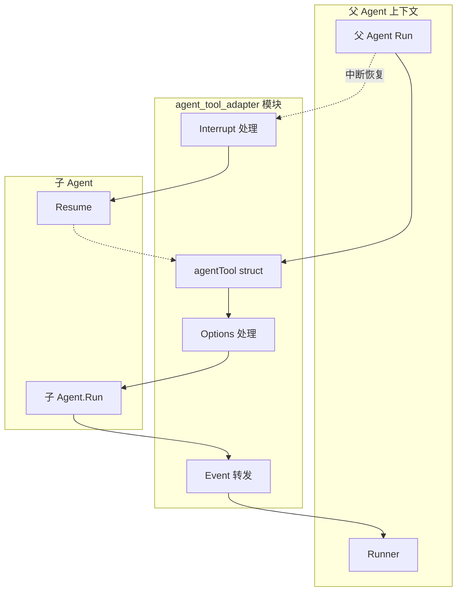

# agent_tool_adapter 模块深度解析

## 概述

**agent_tool_adapter** 模块是 Eino 框架中实现"代理（Agent）工具化"的核心组件。它的存在是为了回答一个关键问题：**如何让一个 Agent 能够调用另一个 Agent？**

在复杂的多智能体系统（Multi-Agent System）中，我们经常需要构建层级化的 Agent 结构——一个"父 Agent"可以将"子 Agent"作为工具来调用。例如，一个协调 Agent（Orchestrator）可能将搜索 Agent、代码执行 Agent、分析 Agent 等作为可用的工具来使用。

`agent_tool_adapter` 模块通过将 `Agent` 接口适配为 `tool.BaseTool` 接口，实现了这种嵌套调用能力。它就像一个"翻译官"：将 Agent 的异步事件流（`AsyncIterator[*AgentEvent]`）转换为工具的同步返回（`string`），同时还要处理事件转发、中断传播、会话共享、RunPath 追踪等复杂场景。

---

## 架构概览



### 核心组件

| 组件 | 职责 |
|------|------|
| `agentTool` | 核心适配器结构体，将 Agent 包装为可调用的 Tool |
| `AgentToolOptions` | 配置选项（是否使用完整历史、自定义输入 Schema） |
| `bridgeStore` | 跨边界传递 Checkpoint 数据的桥梁存储 |
| `newInvokableAgentToolRunner` | 创建用于运行内部 Agent 的 Runner 实例 |

---

## 设计意图与问题空间

### 解决的问题

1. **Agent 作为 Tool 的可用性**：在 Eino 框架中，Agent 是"自主执行单元"，Tool 是"被调用的函数"。如果没有适配器，这两个概念无法互通。

2. **嵌套 Agent 的执行上下文传递**：当 Agent A 调用 Agent B 作为工具时，需要处理：
   - 消息历史如何传递？
   - Session 状态如何共享？
   - RunPath（执行路径）如何维护？
   - 中断（Interrupt）如何跨边界传播？

3. **事件转发与隔离**：父 Agent 希望能实时看到子 Agent 的输出（用于流式响应），但又不想让子 Agent 的内部事件污染自己的会话历史。

### 非显而易见的设计决策

#### 1. 事件转发 vs 事件记录

**决策**：转发给父 Agent 的事件**不会**被记录到父 Agent 的 `runSession` 中。

```go
// 关键代码片段
if gen != nil {
    if event.Action == nil || event.Action.Interrupted == nil {
        // ... 处理 RunPath
        tmp := copyAgentEvent(event)
        gen.Send(event)  // 转发给父 Agent
        event = tmp    // 不记录到父 Session
    }
}
```

**为什么这样做**：
- 如果子 Agent 的事件被记录到父 Session，父 Agent 的历史会包含大量无关的内部事件
- 但用户需要实时看到子 Agent 的输出（流式响应场景）
- 这是一个"只读转发"模式——事件被"看到"但不被"记住"

#### 2. 动作作用域（Action Scoping）

**决策**：子 Agent 发出的 `Exit`、`TransferToAgent`、`BreakLoop` 动作**不会**传播到父 Agent，只有 `Interrupted` 被特殊处理。

```go
// 动作作用域示意
// - Interrupted: 传播 via CompositeInterrupt（允许跨边界中断/恢复）
// - Exit: 忽略（只影响内部 Agent）
// - TransferToAgent: 忽略（不允许内部 Agent 转移父 Agent）
// - BreakLoop: 忽略
```

**为什么这样做**：
- 防止嵌套 Agent 意外终止父 Agent 的执行流程
- `TransferToAgent` 如果传播，父 Agent 会被"劫持"，这通常是意外行为
- 只有 `Interrupted` 需要传播，因为用户可能需要恢复整个调用栈

#### 3. Session 共享的"引用"语义

**决策**：通过 `withSharedParentSession()` 共享 Session 时，子 Agent 获得的是**同一个 `valuesMtx` 锁的引用**，而非副本。

```go
// 测试代码验证
assert.Same(t, parentSession.valuesMtx, inner.capturedSession.valuesMtx)

// 这意味着：
// - 父 Agent 设置的值，子 Agent 可以读到
// - 子 Agent 修改的值，父 Agent 立即可见（跨对象）
```

**为什么这样做**：
- 实现高效的跨 Agent 状态共享
- 类似于"指针共享"而非"值拷贝"
- 风险：需要小心锁的顺序，否则可能死锁

---

## 数据流分析

### 正常执行流程

```
┌─────────────────────────────────────────────────────────────────┐
│ 1. InvokableRun(ctx, argumentsJSON) 被调用              │
└─────────────────────────────────────────────────────────────────┘
                          │
                          ▼
┌─────────────────────────────────────────────────────────────────┐
│ 2. 检查中断状态                                         │
│    - wasInterrupted = false → 新建 bridgeStore           │
│    - wasInterrupted = true  → 从 state 恢复 bridgeStore   │
└─────────────────────────────────────────────────────────────────┘
                          │
                          ▼
┌─────────────────────────────────────────────────────────────────┐
│ 3. 构建输入                                          │
│    - fullChatHistoryAsInput=true: 获取完整历史 + 转换消息       │
│    - fullChatHistoryAsInput=false: 解析 JSON 中的 request 字段    │
└─────────────────────────────────────────────────────────────────┘
                          │
                          ▼
┌─────────────────────────────────────────────────────────────────┐
│ 4. 运行子 Agent                                        │
│    newInvokableAgentToolRunner(agent, store, streaming)  │
│        .Run(ctx, input, options...)                        │
└─────────────────────────────────────────────────────────────────┘
                          │
                          ▼
┌─────────────────────────────────────────────────────────────────┐
│ 5. 事件迭代与转发                                        │
│    for event := range iter {                        │
│        - 转发非中断事件到父 Agent                    │
│        - 收集最后一个有效输出                         │
│    }                                               │
└─────────────────────────────────────────────────────────────────┘
                          │
                          ▼
┌─────────────────────────────────────────────────────────────────┐
│ 6. 处理中断（如果发生）                              │
│    - 提取 bridgeStore 中的数据                    │
│    - 调用 CompositeInterrupt 传播给父                  │
└─────────────────────────────────────────────────────────────────┘
                          │
                          ▼
┌─────────────────────────────────────────────────────────────────┐
│ 7. 返回结果                                          │
│    - 最后一条消息的 Content                      │
│    - 或错误信息                                  │
└─────────────────────────────────────────────────────────────────┘
```

### 输入构建的特殊处理

当使用 `WithFullChatHistoryAsInput()` 时，`getReactChatHistory` 函数会：

1. 从 Compose State 获取当前 Agent 的消息历史
2. 移除最后一条 Assistant 消息（因为它是触发工具调用的那条）
3. 添加**转换消息**（Transfer Messages）：
   - "For context: [AgentName] called tool: `tool_name` with arguments: ..."
   - "For context: [AgentName] `tool_name` tool returned result: ..."
4. 重写历史中的 Assistant/Tool 消息，标注来源 Agent 名称

这确保了子 Agent 能够理解"之前发生了什么"。

---

## 关键配置选项

### WithFullChatHistoryAsInput

```go
// 使用完整聊天历史作为子 Agent 的输入
agentTool := NewAgentTool(ctx, subAgent, WithFullChatHistoryAsInput())
```

适用于：子 Agent 需要理解完整的对话上下文才能正确工作。

### WithAgentInputSchema

```go
// 自定义工具的参数 Schema
customSchema := schema.NewParamsOneOfByParams(map[string]*schema.ParameterInfo{
    "query": {Desc: "search query", Required: true, Type: schema.String},
})
agentTool := NewAgentTool(ctx, subAgent, WithAgentInputSchema(customSchema))
```

适用于：
- 子 Agent 需要接收结构化输入
- 想要利用 LLM 的 Schema 理解能力
- 替换默认的 `{"request": "..."}` 格式

---

## 与其他模块的关系

### 依赖关系

| 模块 | 关系 |
|------|------|
| `adk/interface.go` | 提供 `Agent` 接口、`AgentEvent`、`AgentAction` 等核心类型 |
| `adk/runner.go` | 使用 `Runner` 来执行内部 Agent |
| `adk/runctx.go` | 管理 `runContext` 和 `runSession`，实现状态共享 |
| `adk/interrupt.go` | 使用 `CompositeInterrupt` 传播中断，处理 `bridgeStore` |
| `compose` (外部) | 使用 `compose.CheckPointStore` 接口，使用 `compose.ProcessState` 获取历史 |
| `tool` (外部) | 实现 `tool.BaseTool` 和 `tool.InvokableTool` 接口 |

### 被使用的场景

1. **多 Agent 编排**：在 `ChatModelAgent` 或 `SequentialAgent` 中，将子 Agent 配置为工具
2. **Agent 图节点**：在 `compose.Graph` 中，Agent 作为节点被调用
3. **工具选择**：LLM 决定调用哪个 Agent（作为工具）

---

## 注意事项与陷阱

### 1. 循环调用风险

```go
// 潜在问题：Agent A 调用 Agent B，Agent B 又调用 Agent A
outerAgent.Tools = []tool.BaseTool{NewAgentTool(ctx, innerAgent)}
innerAgent.Tools = []tool.BaseTool{NewAgentTool(ctx, outerAgent)}
```

框架**不阻止**循环调用，可能导致无限递归。建议在设计 Agent 层级时确保是有向无环图（DAG）。

### 2. Session 锁的顺序

由于 Session 是共享引用的：

```go
// 可能导致死锁的代码
parentSession.valuesMtx.Lock()
innerSession.Values["key"] = "value"  // 实际修改的是同一个 map！
parentSession.valuesMtx.Unlock()
```

正确做法：在同一个锁的上下文中操作，或者理解"它们是同一个 Session"。

### 3. Checkpoint 数据丢失

如果子 Agent 发生中断，但 `bridgeStore` 中没有正确保存数据：

```go
// 会返回错误
return "", fmt.Errorf("agent tool '%s' interrupt has happened, but cannot find interrupt state", at.agent.Name(ctx))
```

这通常发生在中断发生但没有走正常流程保存状态时。

### 4. RunPath 的构建

`RunPath` 字段追踪从根 Agent 到当前事件源的完整路径：

```go
// 测试用例验证
want := []string{"outer", "inner", "inner2"}
// 事件从 inner2 产生时，RunPath 包含完整的嵌套路径
```

这对于调试和理解复杂的多 Agent 流程非常有用。

---

## 测试要点

模块包含丰富的测试覆盖，关键测试场景：

| 测试 | 验证内容 |
|------|----------|
| `TestAgentTool_Info` | 工具元信息正确暴露 |
| `TestAgentTool_InvokableRun` | 基本调用流程 |
| `TestAgentTool_SharedParentSessionValues` | Session 共享语义 |
| `TestGetReactHistory` | 历史消息转换逻辑 |
| `TestAgentToolWithOptions` | 各种选项组合 |
| `TestNestedAgentTool_RunPath` | RunPath 正确构建 |
| `TestNestedAgentTool_NoInternalEventsWhenDisabled` | 事件转发开关 |
| `TestAgentTool_InterruptWithoutCheckpoint` | 中断但无 Checkpoint 错误处理 |
| `TestRunPathGating_IgnoresInnerExit` | Exit 动作不传播 |

---

## 小结

`agent_tool_adapter` 模块是 Eino 框架实现多 Agent 系统的关键基础设施。它不仅仅是一个简单的适配器，还处理了：

1. **接口转换**：Agent → Tool
2. **事件转发**：实时但隔离
3. **状态共享**：Session 的引用语义
4. **执行追踪**：RunPath 维护
5. **中断传播**：有限的 Interrupted 传播
6. **输入构建**：灵活的 History 处理

理解这个模块是理解 Eino 多 Agent 架构的前提。在设计复杂的 Agent 系统时，需要仔细考虑：
- Agent 层级的设计（避免循环）
- Session 共享的副作用
- 中断恢复的完整性