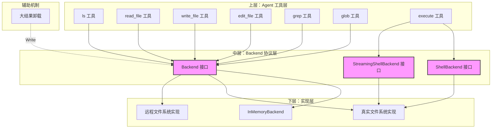

# backend_protocol 模块深度解析

## 概述：为什么需要这个模块？

想象一下，你正在构建一个 AI Agent 系统，这个 Agent 需要能够读写文件、搜索代码、执行命令——就像一个虚拟的软件工程师。最直观的做法是什么？直接在 Agent 的工具函数里调用 `os.ReadFile`、`os.WriteFile`、`exec.Command`。但这样做会带来几个问题：

1. **测试困难**：每次测试都要操作真实文件系统，测试变得脆弱且缓慢
2. **环境耦合**：代码 tightly coupled 到特定操作系统，跨平台兼容性成问题
3. **能力扩展受限**：如果想支持远程文件系统、内存文件系统、或者带权限控制的文件系统，需要重写大量逻辑
4. **上下文管理复杂**：文件操作需要统一的错误处理、日志记录、资源清理

`backend_protocol` 模块的核心设计洞察是：**将文件系统操作抽象为一个可插拔的协议层**。它定义了一组统一的接口（`Backend`、`ShellBackend`、`StreamingShellBackend`），让上层 Agent 工具与底层存储实现完全解耦。这种设计类似于数据库驱动模型——上层代码只依赖 `database/sql` 接口，底层可以切换 MySQL、PostgreSQL 或 SQLite。

这个模块位于 `adk/filesystem/backend.go`，是 ADK（Agent Development Kit）文件系统中间件的基石。它不实现任何具体逻辑，而是定义了一套"契约"，确保不同实现可以无缝替换。

---

## 架构设计：接口分层与数据流

### 架构图



### 组件角色与数据流

**三层架构**：

1. **协议层（本模块）**：定义 `Backend`、`ShellBackend`、`StreamingShellBackend` 三个接口。这是系统的"稳定核心"——一旦定义，很少变化。

2. **实现层**：提供具体的后端实现。当前代码库包含 `InMemoryBackend`（用于测试和简单场景），未来可扩展真实文件系统、S3、Git 仓库等。

3. **消费层**：文件系统中间件（`adk/middlewares/filesystem`）将 Backend 封装为一组 Agent 工具。Agent 调用工具时，工具通过 Backend 接口操作文件。

**关键数据流示例——读取文件**：

```
Agent → read_file 工具 → Backend.Read() → InMemoryBackend.Read() → 返回带行号的内容
```

**关键数据流示例——大结果卸载**：

```
工具执行 → 结果超过 token 限制 → 调用 Backend.Write() 保存到文件 → 返回简短提示给 Agent
```

这种设计的关键在于：**所有方法都使用 struct 作为参数**（如 `*ReadRequest` 而非多个独立参数）。这是 Go 中经典的"向前兼容"模式——未来需要添加新字段时，只需在 struct 中增加字段，不会破坏现有调用方的二进制兼容性。

---

## 核心组件深度解析

### 1. Backend 接口：文件操作的统一契约

```go
type Backend interface {
    LsInfo(ctx context.Context, req *LsInfoRequest) ([]FileInfo, error)
    Read(ctx context.Context, req *ReadRequest) (string, error)
    GrepRaw(ctx context.Context, req *GrepRequest) ([]GrepMatch, error)
    GlobInfo(ctx context.Context, req *GlobInfoRequest) ([]FileInfo, error)
    Write(ctx context.Context, req *WriteRequest) error
    Edit(ctx context.Context, req *EditRequest) error
}
```

**设计意图**：

这个接口覆盖了 Agent 操作文件系统的六大核心场景：

- **LsInfo**：目录浏览。Agent 需要知道某个路径下有哪些文件。
- **Read**：内容读取。支持分页（offset/limit），避免一次性读取超大文件导致 context window 爆炸。
- **GrepRaw**：内容搜索。Agent 经常需要查找代码中的特定模式。
- **GlobInfo**：模式匹配。用于批量操作，如"找到所有 `.go` 文件"。
- **Write**：文件创建。注意：只允许创建新文件，不允许覆盖（安全考虑）。
- **Edit**：精确替换。这是 Agent 修改代码的核心操作，支持"查找 - 替换"语义。

**为什么没有 Delete？**

这是一个有意的设计决策。Agent 删除文件是高风险操作，容易误删重要数据。当前设计遵循"最小权限原则"——先让 Agent 学会读写和修改，删除功能需要额外的安全机制（如回收站、确认流程）。

**参数设计哲学**：

每个方法都接收 `*Request` struct 而非多个独立参数。例如：

```go
// 好的设计：易于扩展
Read(ctx context.Context, req *ReadRequest) (string, error)

// 不好的设计：添加新参数会破坏兼容性
Read(ctx context.Context, filePath string, offset int, limit int) (string, error)
```

这种设计牺牲了一点调用时的简洁性（需要构造 struct），但换来了长期的 API 稳定性。

---

### 2. ShellBackend 与 StreamingShellBackend：命令执行的双模式

```go
type ShellBackend interface {
    Backend
    Execute(ctx context.Context, input *ExecuteRequest) (result *ExecuteResponse, err error)
}

type StreamingShellBackend interface {
    Backend
    ExecuteStreaming(ctx context.Context, input *ExecuteRequest) (result *schema.StreamReader[*ExecuteResponse], err error)
}
```

**为什么需要两个接口？**

命令执行有两种典型场景：

1. **短命令**：`pwd`、`date`、`echo hello` —— 瞬间完成，直接返回结果即可。
2. **长命令**：`make build`、`npm install`、`python train.py` —— 可能运行几分钟，需要实时输出进度。

`ShellBackend` 适用于场景 1，`StreamingShellBackend` 适用于场景 2。中间件在注册工具时会检测 Backend 实现的是哪个接口，自动选择合适的工具类型（普通工具 vs 流式工具）。

**设计权衡**：

这里使用了**接口继承**模式（`ShellBackend` 嵌入 `Backend`）。好处是：
- 类型系统自动保证 `ShellBackend` 实现所有 `Backend` 方法
- 中间件可以用类型断言检测能力：`if sb, ok := backend.(StreamingShellBackend); ok { ... }`

缺点是：如果想单独使用命令执行功能而不需要文件操作，必须实现完整的 `Backend` 接口。但在 Agent 场景中，文件操作和命令执行通常是配套的，这个权衡是合理的。

---

### 3. 请求/响应结构体：数据契约详解

#### ReadRequest：分页读取的设计考量

```go
type ReadRequest struct {
    FilePath string  // 绝对路径，必须以 '/' 开头
    Offset   int     // 从第几行开始读（0-based），负数视为 0
    Limit    int     // 最多读多少行，<=0 时使用默认值（通常 200）
}
```

**为什么需要分页？**

LLM 的 context window 是有限的。如果一个文件有 10000 行，一次性读取会：
1. 消耗大量 token，增加成本
2. 可能超出模型的最大输入长度
3. 让模型难以聚焦关键信息

分页机制让 Agent 可以"按需读取"：先读前 200 行，如果需要更多，再读下一批。这类似于操作系统的 `mmap` 或数据库的游标。

**默认值策略**：

`Limit <= 0` 时使用默认值 200。这是一个经验值：
- 足够覆盖大多数函数/类的完整定义
- 不会消耗过多 token
- Agent 可以通过多次调用来读取更多内容

---

#### EditRequest：精确替换的安全机制

```go
type EditRequest struct {
    FilePath   string  // 文件路径
    OldString  string  // 要被替换的原始字符串（必须非空，精确匹配）
    NewString  string  // 替换后的字符串（可为空，表示删除）
    ReplaceAll bool    // true=替换所有出现，false=只允许出现一次
}
```

**设计背后的安全考量**：

1. **OldString 必须非空**：防止误操作清空整个文件。
2. **精确匹配**：不支持正则，避免意外匹配。Agent 必须提供完整的、包含空白字符的原始内容。
3. **ReplaceAll 约束**：当 `ReplaceAll=false` 时，如果文件中 `OldString` 出现多次，操作会失败。这强制 Agent 在修改重复代码时必须显式声明意图。

**为什么不用 diff/patch？**

diff 格式更紧凑，但对 Agent 来说生成正确的 diff 比生成完整的 `OldString` 更困难。当前设计让 Agent 直接"引用"原始代码，降低了工具使用门槛。

---

#### GrepRequest：灵活的搜索能力

```go
type GrepRequest struct {
    Pattern string  // 字面量搜索（不是正则！）
    Path    string  // 可选：限制搜索目录
    Glob    string  // 可选：文件过滤模式，如 "*.go"
}
```

**为什么 Pattern 不是正则？**

这是一个**安全性与简单性的权衡**：

- **正则的代价**：需要转义特殊字符，Agent 容易出错；某些正则可能导致 ReDoS 攻击。
- **字面量的优势**：Agent 直接搜索 "TODO"、"FIXME"、函数名等，无需学习正则语法。

如果确实需要正则搜索，可以在上层封装：先用 `GrepRaw` 找到候选文件，再用其他工具处理。

**Glob 模式的强大之处**：

```go
// 搜索所有 Go 文件中的 "TODO"
GrepRequest{Pattern: "TODO", Glob: "*.go"}

// 搜索 src 目录下所有测试文件
GrepRequest{Pattern: "Test", Path: "/src", Glob: "*_test.go"}
```

Glob 支持 `**` 递归匹配，这是现代文件搜索工具（如 ripgrep、fd）的标准行为。

---

#### ExecuteRequest/ExecuteResponse：命令执行的标准化

```go
type ExecuteRequest struct {
    Command string
}

type ExecuteResponse struct {
    Output    string
    ExitCode  *int      // 指针：nil 表示命令未执行完成（流式场景）
    Truncated bool      // 输出是否被截断
}
```

**ExitCode 为什么是指针？**

在流式执行场景中，命令可能还在运行，此时没有退出码。使用指针可以区分"退出码 0"和"没有退出码"。

**Truncated 字段的作用**：

防止命令输出过大（如 `cat /dev/urandom | head -c 1GB`）耗尽内存或 token。实现层应该在输出超过阈值时截断，并设置 `Truncated=true`，让 Agent 知道结果不完整。

---

### 4. InMemoryBackend：参考实现与设计模式

虽然 `InMemoryBackend` 在 `backend_inmemory.go` 中定义，但它是理解 Backend 协议的关键参考。

**核心数据结构**：

```go
type InMemoryBackend struct {
    mu    sync.RWMutex
    files map[string]string // map[filePath]content
}
```

**并发安全设计**：

使用 `sync.RWMutex` 实现读写分离：
- `LsInfo`、`Read`、`GrepRaw`、`GlobInfo` 使用 `RLock()`（读锁，可并发）
- `Write`、`Edit` 使用 `Lock()`（写锁，互斥）

这是 Go 中经典的并发模式，适用于"读多写少"的场景。

**路径规范化**：

```go
func normalizePath(path string) string {
    if path == "" {
        return "/"
    }
    if !strings.HasPrefix(path, "/") {
        path = "/" + path
    }
    return filepath.Clean(path)
}
```

所有路径操作都经过 `normalizePath`，确保：
1. 空路径视为根目录
2. 相对路径转为绝对路径
3. 清理 `..` 和重复斜杠

这是防止路径遍历攻击（如 `../../../etc/passwd`）的第一道防线。

---

## 依赖关系：谁调用它？它调用谁？

### 上游调用方

```
┌─────────────────────────────────────────┐
│  adk/middlewares/filesystem             │
│  - 将 Backend 封装为 Agent 工具          │
│  - 实现大结果卸载机制                    │
└─────────────────────────────────────────┘
                    ↓ 调用
┌─────────────────────────────────────────┐
│  adk/filesystem/backend (本模块)        │
│  - Backend 接口定义                      │
│  - 请求/响应结构体                       │
└─────────────────────────────────────────┘
                    ↓ 实现
┌─────────────────────────────────────────┐
│  adk/filesystem/backend_inmemory        │
│  - InMemoryBackend 实现                  │
└─────────────────────────────────────────┘
```

**关键依赖链**：

1. **Agent 中间件**（`adk.AgentMiddleware`）← `filesystem.go` ← `Backend` 接口
   - 中间件调用 Backend 的每个方法来实现对应的工具
   - 中间件通过类型断言检测 `ShellBackend` / `StreamingShellBackend`

2. **大结果卸载**（`toolResultOffloading`）← `Backend.Write()`
   - 当工具结果超过 token 限制时，自动调用 `Backend.Write()` 保存到文件
   - 返回简短提示给 Agent，如"结果已保存到 /large_tool_result/xxx"

3. **测试代码** ← `InMemoryBackend`
   - 单元测试使用 InMemoryBackend 避免操作真实文件系统
   - 集成测试可替换为真实文件系统实现

### 下游依赖

本模块几乎**没有外部依赖**，除了：
- `context.Context`：标准库，用于取消和超时控制
- `github.com/cloudwego/eino/schema`：仅在 `StreamingShellBackend` 中引用 `StreamReader`

这种极简依赖是协议层的典型特征——它定义契约，不依赖具体实现。

---

## 设计决策与权衡分析

### 1. 接口 vs 抽象结构体

**选择**：使用纯接口（`Backend interface`）而非抽象基类。

**原因**：
- Go 没有继承，接口是唯一的抽象机制
- 接口允许"隐式实现"——任何类型只要方法签名匹配就自动实现接口
- 便于测试：可以轻松创建 mock 实现

**代价**：
- 无法提供默认实现（每个实现都要重写所有方法）
- 添加新方法会破坏所有现有实现（但 struct 参数设计缓解了这个问题）

### 2. 同步 vs 异步

**选择**：所有方法都是同步的（返回结果或错误），流式执行通过 `StreamReader` 实现。

**原因**：
- 同步 API 更符合 Go 的习惯用法
- `context.Context` 已经提供了取消和超时机制
- 流式场景用 `StreamReader` 抽象，调用方可以按需消费

**权衡**：
- 对于超长操作（如处理 10GB 文件），调用方需要自己管理超时
- 没有内置重试机制（应由上层中间件或调用方处理）

### 3. 错误处理策略

**选择**：所有方法返回 `(T, error)`，错误由调用方处理。

**原因**：
- Go 的标准错误处理模式
- 调用方（Agent 工具）可以根据错误类型决定如何响应
- 便于单元测试验证错误场景

**潜在问题**：
- 错误信息可能泄露内部路径（如 "file not found: /etc/passwd"）
- 建议实现层对错误信息进行脱敏处理

### 4. 路径安全：相对宽松的设计

**观察**：`normalizePath` 只确保路径以 `/` 开头并清理 `..`，没有沙箱机制。

**设计意图**：
- 协议层假设 Backend 实现会自己处理安全策略
- InMemoryBackend 是内存隔离的，天然安全
- 真实文件系统实现应该添加根目录限制（如所有操作限制在 `/workspace` 下）

**给实现者的建议**：

```go
type SafeFileBackend struct {
    rootDir string  // 所有操作限制在此目录下
    backend Backend
}

func (s *SafeFileBackend) Read(ctx context.Context, req *ReadRequest) (string, error) {
    // 检查 req.FilePath 是否在 rootDir 内
    if !strings.HasPrefix(req.FilePath, s.rootDir) {
        return "", errors.New("access denied: path outside root")
    }
    return s.backend.Read(ctx, req)
}
```

### 5. Write 的"仅创建"语义

**观察**：`Write` 方法在文件已存在时返回错误。

**原因**：
- 防止 Agent 意外覆盖重要文件
- 鼓励使用 `Edit` 进行精确修改
- 如果需要覆盖，可以先删除再创建（但当前没有 Delete）

**争议点**：
- 某些场景下覆盖是合理的（如生成报告）
- 未来可能需要 `WriteOptions{AllowOverwrite: true}`

---

## 使用指南与最佳实践

### 基本使用模式

```go
// 1. 创建后端实现
backend := filesystem.NewInMemoryBackend()

// 2. 配置中间件
config := &filesystem.Config{
    Backend: backend,
    // 可选：配置大结果卸载
    LargeToolResultOffloadingTokenLimit: 20000,
}

// 3. 创建中间件
middleware, err := filesystem.NewMiddleware(ctx, config)
if err != nil {
    // 处理错误
}

// 4. 将中间件应用到 Agent
agent := adk.NewAgent(..., adk.WithMiddleware(middleware))
```

### 实现自定义 Backend

```go
type S3Backend struct {
    client *s3.Client
    bucket string
}

func (s *S3Backend) Read(ctx context.Context, req *filesystem.ReadRequest) (string, error) {
    // 实现 S3 读取逻辑
    // 注意：需要处理 offset/limit 分页
}

// 实现其他方法...
```

**关键注意事项**：

1. **路径规范化**：所有实现都应该使用 `normalizePath` 或等效逻辑。
2. **并发安全**：如果 Backend 有状态，必须保证并发安全。
3. **错误类型**：返回有意义的错误，便于调用方区分"文件不存在"、"权限不足"等。
4. **资源清理**：如果打开文件/连接，确保在 context 取消时关闭。

### 配置选项详解

| 配置项 | 默认值 | 说明 |
|--------|--------|------|
| `Backend` | 必填 | 文件系统后端实现 |
| `WithoutLargeToolResultOffloading` | false | 禁用大结果卸载 |
| `LargeToolResultOffloadingTokenLimit` | 20000 | 触发卸载的 token 阈值 |
| `LargeToolResultOffloadingPathGen` | `/large_tool_result/{ToolCallID}` | 卸载文件路径生成器 |
| `CustomSystemPrompt` | 内置提示词 | 自定义 Agent 系统提示 |
| `Custom*ToolDesc` | 内置描述 | 自定义各工具的描述 |

---

## 边界情况与常见陷阱

### 1. 路径遍历攻击

**风险**：Agent 可能尝试访问 `/etc/passwd` 或其他敏感文件。

**缓解措施**：
- 实现层应该限制根目录（如所有操作限制在 `/workspace`）
- 中间件可以添加路径白名单/黑名单
- 审计日志记录所有文件访问

### 2. 大文件读取

**风险**：读取 1GB 文件会导致内存爆炸。

**当前行为**：
- `ReadRequest.Limit` 默认 200 行，但实现层可能忽略
- 没有强制的最大限制

**建议**：
- 实现层应该设置硬性上限（如最多 1000 行）
- 对于超大文件，返回错误提示 Agent 使用 `Grep` 或 `Edit`

### 3. Edit 的竞态条件

**场景**：
1. Agent A 读取文件，准备修改第 10 行
2. Agent B 修改了第 10 行
3. Agent A 执行 `Edit`，`OldString` 不匹配，操作失败

**当前行为**：操作失败，返回错误。

**建议**：
- 调用方应该捕获错误，重新读取文件后重试
- 未来可考虑乐观锁机制（带版本号）

### 4. 流式执行的资源泄漏

**风险**：`ExecuteStreaming` 返回 `StreamReader`，如果调用方不消费完，可能导致 goroutine 泄漏。

**正确用法**：

```go
sr, err := backend.ExecuteStreaming(ctx, req)
if err != nil {
    return err
}
defer sr.Close()  // 确保关闭

for {
    chunk, err := sr.Recv()
    if errors.Is(err, io.EOF) {
        break
    }
    // 处理 chunk
}
```

### 5. 大结果卸载的循环依赖

**风险**：工具结果过大 → 卸载到文件 → 卸载本身产生新结果 → 新结果又过大 → 无限循环。

**当前行为**：卸载机制只应用于工具结果，卸载操作的 `Write` 调用不经过中间件，不会触发递归。

**注意事项**：
- `pathGenerator` 不应该生成过长的路径
- 卸载文件应该定期清理（当前没有自动清理机制）

---

## 扩展点与未来方向

### 已设计的扩展点

1. **新 Backend 实现**：实现 `Backend` 接口即可替换存储后端。
2. **自定义工具描述**：通过 `Config.Custom*ToolDesc` 覆盖默认描述。
3. **自定义路径生成**：通过 `LargeToolResultOffloadingPathGen` 控制卸载文件路径。
4. **自定义系统提示**：通过 `CustomSystemPrompt` 调整 Agent 行为。

### 潜在扩展方向

1. **权限控制**：添加 `BackendWithAuth` 接口，支持用户级权限。
2. **版本控制**：添加 `VersionedBackend` 接口，支持文件版本历史。
3. **批量操作**：添加 `BatchWrite`、`BatchEdit` 方法，减少网络往返。
4. **事件通知**：添加回调机制，文件变更时通知订阅者。
5. **软删除**：添加 `Delete` 方法，配合回收站机制。

---

## 相关模块参考

- [adk Agent Middleware](adk_agent_middleware.md)：了解中间件如何集成 Backend
- [compose Tool Node](compose_tool_node.md)：了解工具调用机制
- [schema Stream](schema_stream.md)：了解 StreamReader 的使用
- [components Tool Interface](components_tool_interface.md)：了解工具接口定义

---

## 总结

`backend_protocol` 模块是 ADK 文件系统能力的"协议层"，它通过精心的接口设计实现了：

1. **解耦**：上层工具与底层存储完全分离
2. **可扩展**：新后端实现无需修改上层代码
3. **安全**：通过设计约束（如仅创建、精确匹配）降低风险
4. **灵活**：支持同步/流式、内存/真实文件系统等多种场景

理解这个模块的关键是把握其**协议思维**——它不关心"如何实现"，只关心"如何约定"。这种设计哲学贯穿整个 Eino 框架，是构建可维护、可测试、可扩展的 Agent 系统的基础。
